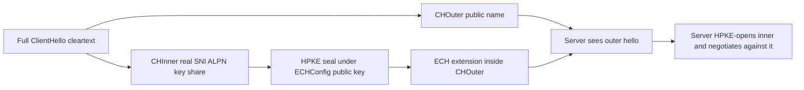
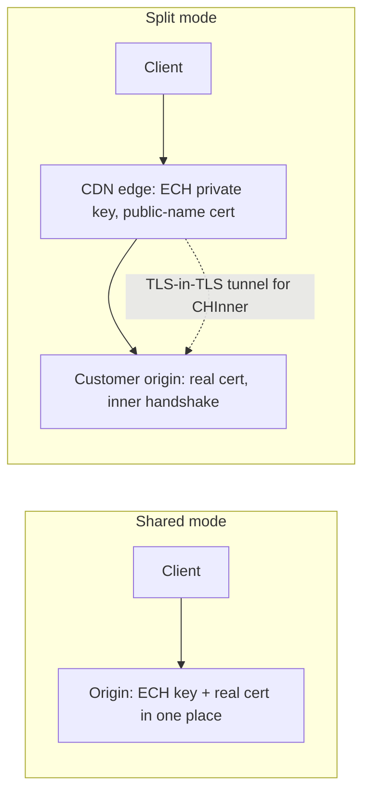
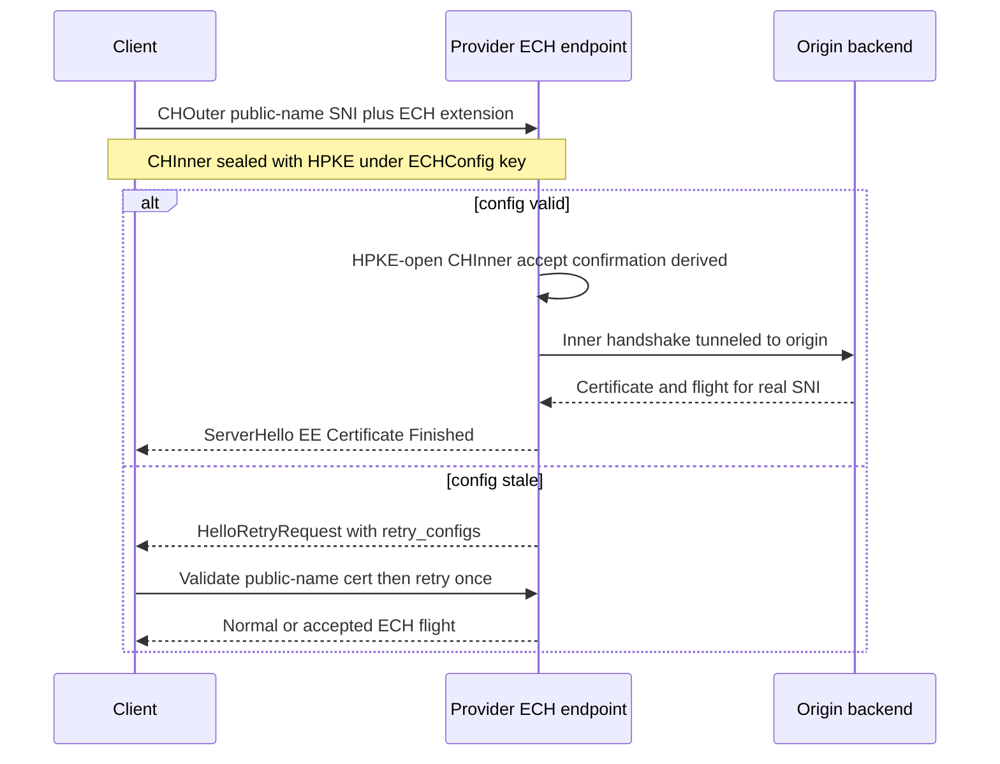

# TLS Encrypted Client Hello (ECH)

## Overview

Encrypted Client Hello (ECH) is the TLS 1.3 extension that hides almost everything a TLS
handshake leaks today — the SNI, the server certificate, the ALPN list, and any client
certificate — by splitting the ClientHello into a public outer hello and an encrypted inner
hello sealed with HPKE (RFC 9180). It replaces the earlier ESNI design, was developed as
`draft-ietf-tls-esni` and standardized on the TLS standards track as RFC 9849. This page is
the wire-format and deployment deep dive: what leaks and why, how the split hello and HPKE
encapsulation work, how ECH keys ride in DNS HTTPS/SVCB records, and what the retry,
GREASE, and middlebox story looks like in practice. For the general TLS 1.3 handshake
machinery (key schedule, transcript, certificate chain) read
[../security/tls-deep-dive.md](../security/tls-deep-dive.md) first.

## What leaks in a TLS handshake today

A plaintext-ClientHello TLS 1.3 connection exposes far more than the destination IP. The
reason is structural: everything before the `ServerHello` travels unencrypted, and the
handshake keys themselves are derived from a key share that sits in that same cleartext
ClientHello. A passive observer who can read the flow can therefore read the certificate
message too.

| Field on the wire              | Who sees it today            | Sensitive because                     |
|--------------------------------|------------------------------|---------------------------------------|
| SNI in ClientHello             | Any on-path observer, DPI    | Names the exact host you connect to   |
| Server certificate chain       | Any passive observer         | Full site identity, subdomains, SANs  |
| ALPN list (`h2`, `http/1.1`)   | Any on-path observer         | Protocol fingerprint of the client    |
| Client certificate (mTLS)      | Any on-path observer         | Long-term client identity in cleartext|
| Session resumption PSK/ticket  | Any on-path observer         | Linkable identifier across connections|
| QUIC Initial packets           | Any observer                 | Initial keys derive from the public DCID, so the ClientHello is readable in QUIC too |
| Destination IP + port          | Always                       | ECH does not and cannot hide this     |

The certificate leak is the one most people miss. In TLS 1.3 the server encrypts
`EncryptedExtensions`, `Certificate`, and `Finished` under handshake traffic keys derived
from the ECDHE `key_share` — which the client put in the *cleartext* ClientHello. So even
though the certificate is "encrypted", anyone on the path recreates the handshake secret and
decrypts it: the certificate for `internal.corp.example` is effectively broadcast. DNS
privacy alone is insufficient — with DoH/DoT the resolver query is hidden
([../dns/doh.md](../dns/doh.md)), but the next packet pair still announces `example.com` in
SNI. RFC 8744 catalogued exactly this gap and motivated the ECH work.

## Design: one hello split in two

ECH splits the ClientHello into two parts:

- **CHOuter** — a syntactically complete ClientHello that a middlebox can parse. Its SNI is
  a *public name* (typically a shared, generic hostname operated by the provider, e.g. the
  CDN's ECH public endpoint). It carries non-sensitive negotiation: cipher suites, supported
  versions, a valid-looking key share, and the ECH extension itself.
- **CHInner** — the real ClientHello with the true SNI, the real ALPN, the PSK identities,
  early data, and critically the **TLS key share**. It is sealed as a single AEAD-encrypted
  blob inside the outer hello's ECH extension.

Because the TLS key agreement share lives in CHInner, a passive observer cannot derive the
handshake secret. The entire server flight after `ServerHello` — EncryptedExtensions,
Certificate, CertificateVerify, Finished — becomes invisible without active participation.
That is what upgrades the certificate from "passively readable" to "protected".

The ECH extension carries: a config id (which ECHConfig the client used), an HPKE
encapsulation of the shared secret, and the encrypted CHInner payload. The server proves it
decrypted and accepted the inner hello by embedding an *accept confirmation* — a short MAC
derived from the ECH key schedule — into its ServerHello. If the client does not see a valid
accept confirmation, the handshake proceeded as a *GREASE or fallback* hello, not an ECH
one, and the client treats the connection accordingly.



## HPKE: the key encapsulation underneath

ECH does not invent a crypto stack; it rides on **HPKE (RFC 9180)**, the hybrid public-key
encryption scheme that also protects ODoH and Oblivious HTTP
([../advanced/encrypted-dns.md](../advanced/encrypted-dns.md)). The flow:

```text
client                                            server
  enc, ss = HPKE-KEM Seal(ECHConfig.public_key)   ss = HPKE-KEM Decap(private_key, enc)
  CHInner_ct = HPKE-AEAD(ss, CHInner)             CHInner = HPKE-AEAD Open(ss, CHInner_ct)
  ---------------- ECH extension in CHOuter -------->
```

The `enc` value (the KEM encapsulation) is short — 32 bytes for X25519 — and travels in the
ECH extension. The suite is fixed by the ECHConfig: KEM is `DHKEM(X25519)` or `DHKEM(P-256)`,
KDF is HKDF-SHA256, and the AEAD is one of AES-128-GCM, AES-256-GCM, or ChaCha20-Poly1305.
No static RSA key agreement, no RSA-PKCS1 fallback: ECH is TLS-1.3-only in spirit and
inherits forward secrecy for the inner hello.

Note what HPKE does *not* give: anonymity from the key distributor. Whoever holds the
ECHConfig private key (the provider) always sees the inner hello. That is exactly the CDN
business model — the provider is the TLS terminator — so ECH is a privacy improvement, not
an anonymity tool.

## ECHConfig publication via DNS HTTPS/SVCB records

Clients cannot guess the server's ECH public key, so it must be distributed. The vehicle is
the HTTPS/SVCB DNS record (RFC 9460): the `echconfig` SvcParam (key 5) carries one or more
Base64-encoded ECHConfig structures next to the target address hints and ALPN list.

```dns
example.com.  300  IN HTTPS 1 . alpn="h3,h2" \
                   ipv4hint=203.0.113.10 \
                   echconfig="AEX+DQBKt4...base64...=="
```

Each ECHConfig inside that parameter contains:

| Field          | Purpose                                              |
|----------------|------------------------------------------------------|
| `version`      | ECHConfig format version (draft/standard versioning) |
| `config_id`    | One byte; client echoes it in the ECH extension       |
| `kem_id`       | HPKE KEM (e.g. X25519)                               |
| `public_name`  | The outer SNI the client must use in CHOuter          |
| `public_key`   | HPKE KEM public key                                  |
| `cipher_suites`| Allowed KDF hash + AEAD pairs                        |
| `maximum_name_length` | Padding guidance for the inner SNI            |

Two operational consequences follow. First, **DNS freshness bounds key rotation**: records
have TTLs, so providers publish new configs well before retiring old ones and keep several
`config_id`s live simultaneously. Second, **unauthenticated DNS makes the channel
spoofable**: an on-path attacker can strip the `echconfig` parameter and force a fallback to
plaintext SNI (a downgrade). Mitigations are exactly the ones encrypted DNS already uses —
resolve over DoH/DoT ([../dns/doh.md](../dns/doh.md)), or DNSSEC-validate the HTTPS record.
A client fetching the HTTPS record over cleartext UDP gets confidentiality only against
observers who were not watching the DNS query, which is a much weaker promise.

## Split mode vs shared mode

ECH supports two deployment topologies, and the distinction matters for anyone operating a
CDN or an origin:

| Aspect            | Shared mode (splitless)                    | Split mode                                |
|-------------------|--------------------------------------------|-------------------------------------------|
| Who terminates outer TLS | The origin itself                    | The client-facing provider (CDN edge)     |
| Who holds the ECH private key | The origin                       | The provider; origin never sees outer keys|
| Who does the inner handshake | Same server                      | The backend origin, tunneled from the edge|
| Certificate for real SNI   | Held by the origin                  | Held by the origin, delivered inside the tunnel |
| Typical operator    | Self-hosted origin with direct TLS        | CDN + customer origin                     |
| Extra wire cost     | None                                       | TLS-over-TLS for the inner handshake      |

In **shared mode** one endpoint does everything: it decrypts CHInner with its own ECHConfig
key and immediately continues the TLS 1.3 handshake it just negotiated — the simple case,
and what a self-hosted origin with ECH support looks like.

In **split mode** the provider terminates the *outer* handshake at the edge but must relay
the *inner* handshake to the customer's origin, which holds the real certificate. The inner
handshake messages are carried over a second TLS connection between edge and backend — a
TLS-in-TLS tunnel. The client's TLS session ends, cryptographically, at the origin; the
edge is a pure relay for the inner flow. This design is what makes ECH compatible with the
CDN termination model, where the edge must present its own credentials and the customer
refuses to hand over its private keys. The delegated-credentials problem is the same one
that motivated KDC-style designs; ECH solves it by making the edge handshake-agnostic for
the inner flow.



## Retry configs and the failure path

ECH handshakes fail in one interesting way that has its own protocol machinery: **stale
configuration**. The client may hold an ECHConfig whose key the server has already rotated
out, or the DNS record may have been replaced mid-flight. The server cannot decrypt
CHInner, so it does the only thing a TLS 1.3 server can — it negotiates the *outer* hello
normally and signals the failure:

1. The server sends a **HelloRetryRequest** carrying an ECH extension with fresh
   `retry_configs` — new ECHConfig structures the client can retry against.
2. The client validates that the certificate presented for the *public name* matches
   `public_name` from the config. A wrong or untrusted public-name certificate is a hard
   abort — this is the downgrade firewall.
3. If validation passes, the client may retry **once** with the new config; a second
   failure aborts and surfaces the error. Silent fallback to plaintext SNI is forbidden —
   it would let an active attacker farm downgrades every time.

The accept-confirmation mechanism closes the loop: when the server *did* decrypt the inner
hello, the client verifies the confirmation MAC before considering ECH "accepted". GREASE
connections (below) always lack a valid confirmation by construction, so clients and
servers share one code path for "ECH attempted" regardless of success.



## GREASE and middlebox reality

ECH survives the modern internet the same way TLS 1.3 did: by looking boring. **ECH GREASE**
extends RFC 8701's idea — clients without a usable ECHConfig still send an ECH extension
filled with random bytes (random config id, random-looking ciphertext of plausible length).
The consequences:

- A middlebox that fingerprints "client supports ECH" sees the same extension whether or
  not the client can use it, so ECH-capability cannot be used as a blocking trigger.
- Servers are specified to *accept* garbage ECH extensions and proceed as if the hello were
  a normal one — never to fail the handshake because the extension did not decrypt.
- Length padding (guided by `maximum_name_length`) keeps inner SNI length from leaking.

The middlebox track record is the honest constraint on ECH. TLS 1.3 needed a
ChangeCipherSpec compatibility mode because deployed middleboxes choked on the new flow;
ECH inherits that scar tissue and adds a political one. In late 2023 major CDNs enabled ECH
fleet-wide, and within weeks it was rolled back after public complaints that it defeated
censorship filtering in some jurisdictions — then re-enabled later. The cryptography never
moved; the deployment decision did. Expect three classes of middlebox behavior in the wild:

1. **Transparent pass-through** — the common case: parses TLS but tolerates unknown extensions.
2. **Policy-based filtering** — enterprises and censors that key on SNI lose visibility and
   respond by blocking, rejecting unknown extensions, or requiring a TLS-terminating proxy.
3. **Fingerprinting** — DPI that classifies clients by hello structure; GREASE and padding
   exist precisely to deny them a stable ECH signal.

If SNI-based egress policy is a hard requirement in your network, the migration path is
explicit TLS inspection proxies — ECH is designed to be un-hidden by such endpoints only
when the client trusts them and shares the keys (or you disable ECH by policy).

## Rollout status and the comparison set

Deployment, as of this writing, is real but conditional:

- **Cloudflare** enabled ECH across its edge in late 2023 (with the pause-and-re-enable
  episode above), making it the largest single operator.
- **Firefox** ships ECH, gated on DoH being active — the browser needs the HTTPS record
  over a trustworthy channel to fetch `echconfig` safely.
- **Chrome/Chromium** supports ECH when Secure DNS resolves the HTTPS record; without
  secure DNS the feature is inert by policy.
- **Safari/WebKit** has carried ECH support in recent releases, and **nginx/openssl
  stacks** have been slower — most origin operators get ECH only via their CDN in split
  mode, which is exactly what split mode was designed for.

| Dimension          | ESNI (obsolete)             | ECH (current)                       | VPN                                |
|--------------------|-----------------------------|--------------------------------------|------------------------------------|
| Scope of hiding    | SNI only                    | SNI + cert + ALPN + client auth      | All traffic, all layers            |
| Mechanism          | Encrypt SNI field only      | Encrypted inner hello via HPKE       | Tunnel at IP/transport layer       |
| Key distribution   | TXT records (clumsy)        | HTTPS/SVCB `echconfig` parameter     | Pre-provisioned credentials        |
| Retry / downgrade protection | None              | HelloRetryRequest + public-name pin  | n/a                                |
| IP address hidden  | No                          | No                                   | Yes (tunnel endpoint instead)      |
| Deployment         | Removed by servers ~2018-19 | Browsers + major CDNs, conditional   | Ubiquitous                         |

The table's most instructive row is the last-but-one: ECH hides *names*, never addresses.
Censors and enterprise gateways that block by IP can still block you — ECH completes the
DNS-and-SNI privacy story begun by encrypted DNS
([../advanced/encrypted-dns.md](../advanced/encrypted-dns.md)) and leaves the IP layer to
tools like VPNs and Oblivious relays.

## Interview Questions

1. **What does ECH actually hide that TLS 1.3 alone does not?** TLS 1.3 already encrypts
   the certificate *message*, but passively: handshake keys derive from the ECDHE key share
   published in the cleartext ClientHello, so any observer re-derives the handshake secret
   and reads EncryptedExtensions and Certificate. ECH moves the key share (plus real SNI,
   ALPN, PSKs, client certificate) into an HPKE-encrypted inner hello, so a passive
   observer can no longer derive handshake keys — the certificate becomes truly invisible.
   The destination IP remains visible, which is the hard limit of the design.
2. **Walk through what happens when a server cannot decrypt the ECH extension.** The server
   negotiates the outer hello as a normal TLS 1.3 handshake, presents a certificate for the
   *public name*, and includes fresh `retry_configs` in a HelloRetryRequest ECH extension.
   The client must validate that public-name certificate; if it is invalid it aborts rather
   than downgrading silently. If valid, the client retries exactly once with the new
   configuration; a second failure aborts the connection. The accept-confirmation MAC in
   the ServerHello tells the client whether the server decrypted the inner hello.
3. **Why split mode? What problem does it solve for CDNs?** CDNs terminate TLS at the edge
   with their own certificates and never take custody of customer private keys. In split
   mode the edge holds the ECH private key and terminates the outer handshake, then tunnels
   the inner handshake over a TLS connection to the origin that holds the real certificate.
   The client's cryptographic session still ends at the origin, so key custody and
   certificate ownership stay with the customer while the edge remains a dumb-ish relay —
   the same trust separation as today's CDN model, preserved under ECH.
4. **What is ECH GREASE and why does it exist?** Modeled on RFC 8701, clients that have no
   usable ECHConfig still emit an ECH extension containing random bytes, and servers are
   specified to tolerate un-decryptable extensions by proceeding normally. This keeps
   "client that can do ECH" and "client that cannot" byte-for-byte ambiguous, denying
   middleboxes a blocking or fingerprinting trigger — the same anti-ossification logic
   that kept TLS 1.3 deployable through middleboxes.
5. **How does ECH key distribution work and where does it break?** The ECHConfig — public
   key, KEM id, public name, cipher suites — rides in the HTTPS/SVCB DNS record's
   `echconfig` SvcParam (RFC 9460). It breaks in two places: TTL-stale records force the
   retry-configs path (handled by the protocol), and unauthenticated DNS allows an on-path
   attacker to strip the parameter and force plaintext-SNI fallback — which is why
   browsers only enable ECH when the DNS answer arrives over DoH/DoT or is DNSSEC-validated.
6. **A security engineer says "ECH hides us from the firewall team." What is the correct
   response?** Agree on scope: ECH hides SNI, ALPN, and the certificate chain from
   *passive* on-path observers — not from endpoints, the resolver operator, the ECH
   provider in split mode, or the destination IP. For policy enforcement you either
   terminate TLS at a trusted corporate proxy (ECH disabled by policy) or lose SNI-based
   visibility; ECH is a privacy feature working as designed, not a policy bypass.

## Key Takeaways

- TLS 1.3 leaks SNI, ALPN, and effectively the certificate chain because handshake keys
  derive from a cleartext ClientHello key share; QUIC leaks the same via public Initial keys.
- ECH splits the hello: CHOuter carries a public name, CHInner carries the sensitive
  extensions including the TLS key share, sealed with HPKE (RFC 9180).
- Because the key share moves into the encrypted inner hello, the certificate flight stops
  being passively readable — the single biggest confidentiality win over plain TLS 1.3.
- ECHConfigs travel in HTTPS/SVCB records (`echconfig`, key 5); secure DNS transport is a
  de-facto requirement or downgrade attackers strip the parameter.
- Split mode (CDN edge terminates outer, tunnels inner to origin) is what makes ECH
  deployable without customers surrendering private keys.
- Retry configs + public-name certificate validation make downgrade attempts loud, and
  silent fallback is forbidden.
- GREASE keeps ECH-capability un-fingerprintable; middlebox behavior, not cryptography, is
  the deployment bottleneck — the 2023 pause-and-re-enable episode proved it.
- ECH hides names, not addresses: IP-level controls are untouched by design.

## References

- [RFC 8446 — TLS 1.3](https://www.rfc-editor.org/rfc/rfc8446.html) — handshake structure
  whose cleartext portion ECH compresses.
- [draft-ietf-tls-esni — TLS Encrypted Client Hello (datatracker)](https://datatracker.ietf.org/doc/draft-ietf-tls-esni/) —
  the development draft series; standardized as RFC 9849.
- [RFC 9180 — HPKE: Hybrid Public Key Encryption](https://www.rfc-editor.org/rfc/rfc9180.html) —
  KEM/KDF/AEAD composition used to seal CHInner.
- [RFC 9460 — SVCB and HTTPS resource records](https://www.rfc-editor.org/rfc/rfc9460.html) —
  the `echconfig` SvcParam delivery channel.
- [RFC 8701 — Generate Random Extensions And Sustain Extensibility (GREASE)](https://www.rfc-editor.org/rfc/rfc8701.html) —
  the pattern ECH GREASE extends.
- [RFC 8744 — Issues and Requirements for SNI Privacy](https://www.rfc-editor.org/rfc/rfc8744.html) —
  the problem statement that motivated ECH.
- RFC 9849 — TLS Encrypted Client Hello (standards-track publication of the esni draft
  series; see the sibling page [../advanced/encrypted-dns.md](../advanced/encrypted-dns.md)).
- [RFC 8484 — DNS over HTTPS](https://www.rfc-editor.org/rfc/rfc8484.html) — the secure-DNS
  channel ECH depends on for config fetches.

## Cross-References

- [TLS Deep Dive](../security/tls-deep-dive.md) — the TLS 1.3 handshake, key schedule, and
  certificate machinery that ECH wraps.
- [DNS over HTTPS](../dns/doh.md) — the resolver channel that carries HTTPS/SVCB records
  and makes `echconfig` fetches downgrade-resistant.
- [Encrypted DNS](../advanced/encrypted-dns.md) — DoH/DoT/ODoH landscape and how ECH
  completes transport-layer privacy.
- [HTTP/3](../http/http3.md) — QUIC's Initial-packet exposure and why ECH matters identically over QUIC.
- [CDN: How it works](../cdn/how-it-works.md) — edge termination economics that split mode preserves.
