# Wi-Fi 7 (802.11be): MLO, 320 MHz, and the Latency Push

## Overview

802.11be — certified by the Wi-Fi Alliance as Wi-Fi 7 — is the "Extremely High
Throughput" amendment that turns the 6 GHz era into a multi-radio, multi-link
discipline: channels double to 320 MHz, constellation density rises to
4096-QAM, and Multi-Link Operation (MLO) lets one client and one AP aggregate
two or more physical radios into a single logical connection with per-packet
link selection. The headline PHY rate is 46.1 Gbps, but the interview-worthy
content is the arithmetic that shrinks it to real 5 Gbps throughput, the link
types (STR vs. non-STR) that decide whether MLO actually aggregates, and the
scheduling features (punctured preamble, R-TWT) that trade peak rate for
bounded latency in AR/VR-class traffic. The generation-overview table lives on
the [Wi-Fi page](../wireless/wifi.md); this page goes deep on the 802.11be
mechanics themselves.

## From 11ax to 11be: What Actually Changed

Wi-Fi 6 (802.11ax) built the efficiency toolkit — OFDMA, uplink scheduling
via trigger frames, 1024-QAM, TWT power saving — and Wi-Fi 6E opened the
6 GHz band for it. Wi-Fi 7 keeps all of that and changes the physics and the
topology:

| Property | Wi-Fi 6 (802.11ax) | Wi-Fi 6E | Wi-Fi 7 (802.11be) |
|---|---|---|---|
| Max channel width | 160 MHz | 160 MHz | 320 MHz (6 GHz) |
| Max modulation | 1024-QAM (10 bits) | 1024-QAM | 4096-QAM (12 bits) |
| Max spatial streams | 8 (device-dependent) | 8 | 16 |
| Max PHY rate | 9.6 Gbps | 9.6 Gbps | 46.1 Gbps |
| Radio aggregation | None (one radio per association) | None | MLO: multiple links, one association |
| Preamble puncturing | Static/limited | Static/limited | Dynamic per-packet muting |
| Latency scheduling | TWT (power saving) | TWT | R-TWT (protected latency windows) |
| Max RU allocation | One RU per user | One RU per user | Multiple RUs per user |
| Block ack size | 256 (bitmap) | 256 | 512 (compressed) |
| Bands | 2.4 / 5 GHz | 2.4 / 5 / 6 GHz | 2.4 / 5 / 6 GHz |

Two changes are structural rather than incremental. Multiple RUs per user
means one OFDMA transmission can give a single client, say, a 106+26 tone
pair instead of forcing a choice between one big RU and nothing. And the
512-entry compressed block ack bitmap matters more than it looks: wide
channels and MLO raise the natural aggregation window, and a 256-bit bitmap
became the accounting bottleneck at 320 MHz with reordering across links.

## Spectrum: 2.4/5/6 GHz and 320 MHz Channels

The 320 MHz channel exists *because* of 6 GHz. The band adds roughly
1200 MHz of spectrum (59 new 20 MHz channels in the 6E allocation), and only
there can three non-overlapping 320 MHz channels fit contiguously; the 5 GHz
band tops out at 160 MHz, and 2.4 GHz at 40 MHz. That asymmetry drives real
deployments: a 320 MHz-capable AP dedicates 6 GHz radio capacity to a handful
of nearby, capable clients, and everyone else lives at 160 MHz or below.
Because 6 GHz is shared with incumbents, its use is mediated — by Automated
Frequency Coordination (AFC) for standard-power operation in the US, and by
Low Power Indoor restrictions in regions (the EU released the lower 500 MHz
subset) — which is why channel plans and regulatory domains are part of any
serious Wi-Fi 7 design conversation.

The corollary is MLO's second job. With only three clean 320 MHz channels,
contention and incumbents fragment the band in practice; MLO plus puncturing
lets an AP assemble usable capacity from imperfect spectrum instead of
cliff-dropping from 320 to 160 MHz whenever one 20 MHz slice is occupied.

## 4096-QAM and Throughput Math

### Deriving the 46.1 Gbps

The headline number is arithmetic, not marketing, and deriving it is the
interview exercise. Start from 802.11ax: at 160 MHz, 1024-QAM, 5/6 coding,
the highest data rate is 9.6 Gbps across 8 spatial streams — 1.2 Gbps per
stream. Wi-Fi 7 doubles the channel to 320 MHz (factor 2), raises the
constellation to 4096-QAM, i.e. 12 bits per symbol instead of 10
(factor 1.2), and doubles the stream count to 16:

\\[ R_{\\text{stream}} = 1.2 \\text{ Gbps} \\times 2 \\times 1.2 = 2.88
\\text{ Gbps} \\qquad R_{\\text{PHY}} = 2.88 \\times 16 = 46.1 \\text{ Gbps} \\]

A realistic flagship AP radio is 4x4 per band, so its 320 MHz ceiling is
\\( 2.88 \\times 4 \\approx 11.5 \\) Gbps of PHY — and a realistic client is
2x2, cutting that again. The 46.1 Gbps figure requires 16 aggregated streams
on one link, which essentially no shipping product does.

### From 11.5 Gbps PHY to ~5 Gbps real

The gap between PHY and TCP throughput is MAC efficiency, and the honest
budget for a good 4-stream 320 MHz deployment lands at 40–60% efficiency:

| Loss source | Mechanism | Typical cost |
|---|---|---|
| Contention / backoff | EDCA random deferral before every TXOP | 5–15% on busy channels |
| PHY overheads | Preambles, training fields per PPDU | ~2–3% at full aggregation, more for small frames |
| Inter-frame spacing and ACKs | SIFS gaps, block-ack frames between aggregate bursts | 5–10% |
| Imperfect aggregation | A-MPDU length limited by buffers, block-ack window, and app patterns | Up to 20% for bursty traffic |
| Retransmissions | RF errors; worse at MCS drops near cell edge | 2–20% depending on SNR |
| MCS degradation | 4096-QAM needs the highest SNR; distance forces lower rates | The dominant real-world factor |

Applying ~45% efficiency to an 11.5 Gbps 4-stream radio gives ~5 Gbps — which
is precisely the observed TCP throughput class of first-generation Wi-Fi 7
gear in good conditions, and matches the "12 Gbps PHY, 5 Gbps real" rule of
thumb. The same math explains why 4096-QAM is a near-AP feature: 12-bit
constellations need roughly 3 dB more SNR than 1024-QAM for the same error
rate, so the highest rates only exist within one room of the AP, and the
remaining benefit of the modulation is that clients sit longer at slightly
lower-but-still-dense rates on the MCS curve.

## Multi-Link Operation

### One association, many radios

MLO changes the topology of a connection rather than any single radio. A
client's multi-link device (STA-MLD) associates once — one authentication,
one keyspace, one IP address — with an AP-MLD that operates several
affiliated APs on different bands or channels. The MAC layer then routes each
aggregate or frame onto a link per packet, which yields three distinct wins:
throughput aggregation across links, latency reduction because a frame is
transmitted on whichever link is free instead of waiting for one contended
medium, and reliability because a failed transmission on one link is retried
elsewhere within the same connection. The aggregation datapath:

```mermaid
flowchart TD
    subgraph STA["Client STA-MLD: one MAC entity, two radios"]
        SCH["MAC link scheduler: per-packet link selection"]
        R1["Radio 1: 5 GHz, 160 MHz"]
        R2["Radio 2: 6 GHz, 160 MHz"]
    end
    subgraph AP["AP-MLD: one BSS, two affiliated APs"]
        L1["Link 1: 5 GHz, 160 MHz"]
        L2["Link 2: 6 GHz, 160 MHz"]
    end
    SCH --> R1
    SCH --> R2
    R1 -->|"frames of flow F"| L1
    R2 -->|"same flow F, in parallel"| L2
    L1 --> A1["Per-link block acks"]
    L2 --> A2["Per-link block acks"]
```

### Link types: STR, non-STR, and asynchronous

Whether MLO *aggregates* or merely *fails over* is decided by the hardware's
ability to transmit and receive simultaneously without self-interference:

| Link type | Hardware requirement | Behavior | Practical effect |
|---|---|---|---|
| STR (simultaneous TX and RX) | Two full radios with tight RF isolation and sync | Transmit on link 1 while receiving on link 2, concurrently | True aggregation; per-packet scheduling; the latency win is real |
| Non-STR (NSTR) | Shared or loosely synced radios | Cannot TX and RX at the same instant; sequences operations | Link-level alternation; aggregation benefit shrinks toward failover |
| Asynchronous links | Radios without coordinated timing across channels | Links may be active at different times; common with mismatched channel plans | Mostly redundancy and band steering within one association |

The distance between the client's two radios and the antenna design decide
which class a product falls into — self-interference from your own
transmission on the other band is the physics problem STR has to beat. This
is also why first-generation BE clients advertise MLO in specific
combinations (a 2x2 + 2x2 dual-band design) rather than across all three
bands. On the infrastructure side, the Linux mac80211 stack documents its
multi-link device model, and support maturity varies by driver — a real
constraint for anyone evaluating Wi-Fi 7 APs built on Linux: see the
[mac80211 documentation](https://www.kernel.org/doc/html/latest/driver-api/80211/mac80211.html)
and the [kernel wireless page](../../linux/kernel/networking/wireless.md).

## Punctured Preamble

Wi-Fi 6's answer to a partially occupied wide channel was to shrink to the
largest *contiguous* clean width — a 320 MHz channel with one busy 20 MHz
slice effectively became 160 MHz, halving capacity over 20 MHz of
interference. 802.11be's punctured preamble instead mutes the occupied 20 or
40 MHz subchannels and transmits the preamble over the full channel width
with the muted parts flagged, so the remaining 280 (or 240...) MHz keeps
carrying data. The receiver demodulates only the unpunctured resource units.
This is "dynamic bandwidth" made real: it coexists with AFC-detected
incumbents in 6 GHz, legacy 11ax neighbors, and radar-flagged segments
without the cliff-edge fallback, and it composes with OFDMA and MLO (each
link schedules around its own puncturing map). The cost is moderate —
muted subchannels carry no data and some tone-plan irregularity — but it is
far cheaper than the factor-of-two channel-width drop it replaces.

## R-TWT and Bounded Latency

Target Wake Time in 802.11ax is a power-saving agreement: a client and AP
agree on wake intervals, and the client sleeps between them. Restricted TWT
(R-TWT) repurposes the mechanism for latency: the AP schedules *restricted
service periods* in which latency-sensitive traffic gets protected access —
other stations are asked to defer (and OFDMA scheduling enforces it), the
member station transmits within the window, and the design goal is a bound on
worst-case airtime delay rather than an average. For AR/VR, where the
motion-to-photon budget is ~20 ms and the network's share of it needs to be
single-digit milliseconds *at the 99th percentile*, average-rate engineering
does not help; bounded airtime does. R-TWT plus MLO is the intended pairing:
if one link's window is disturbed, the scheduler shifts traffic to the
second link, and the puncturing mechanism keeps wide channels usable near
incumbents — three 11be features aimed at the same variance problem.

## Use Cases and the Client/AP Reality Check

The workload classes that justify Wi-Fi 7: untethered AR/VR headsets (high
bitrate video per eye plus latency bounds); mesh backhaul, where MLO lets a
node serve clients on one link while pushing backhaul on another
simultaneously — the first Wi-Fi topology where backhaul and access do not
time-share a radio; cloud gaming and 4K/8K streaming near the AP; and dense
enterprise deployments, where OFDMA + R-U + R-TWT scheduling, not peak rate,
is the actual product. In the mesh case the marketing claim "MLO backhaul"
usually means the AP-MLD dedicates one band-pair to inter-AP links while the
client-facing radios run separately — worth probing in interviews because it
is a deployment decision, not a standard requirement.

The reality check that belongs in any Wi-Fi 7 pitch:

- **320 MHz is a 6 GHz, close-range feature.** Two of the three channels
  exist in clean spectrum only in favorable regulatory domains, and phones
  rarely sustain it; most client traffic runs 80/160 MHz.
- **4096-QAM is a one-room modulation.** The +3 dB SNR requirement confines
  peak rates to line-of-sight proximity; distance drops you down the MCS
  ladder quickly.
- **MLO quality varies by product class.** STR dual-radio clients deliver
  the latency win; NSTR designs mostly deliver failover. Ask which one a
  device implements before quoting "2x throughput".
- **First-wave devices are 2x2+2x2.** The 46.1 Gbps figure needs 16 streams;
  real client PHY ceilings are ~2.9 Gbps per stream (320 MHz, 4096-QAM) and
  real TCP throughput a fraction of that.
- **Linux AP stacks matured unevenly.** MLO support in mac80211 and vendor
  drivers arrived progressively; verify driver status before specifying
  open-source Wi-Fi 7 infrastructure.

## Interview Questions

1. **Derive the 46.1 Gbps Wi-Fi 7 PHY rate and then explain why real throughput is ~5 Gbps.**
   Start from 11ax: 9.6 Gbps at 160 MHz, 1024-QAM, 5/6, 8 streams = 1.2 Gbps
   per stream. Wi-Fi 7 doubles the channel (x2), raises 1024-QAM to
   4096-QAM, i.e. 12 vs. 10 bits per symbol (x1.2), and doubles the streams
   to 16: 1.2 x 2 x 1.2 x 16 = 46.1 Gbps. A 4-stream radio tops at ~11.5 Gbps
   PHY, and MAC efficiency — contention, preambles, SIFS/ACK gaps, imperfect
   aggregation, retransmissions — keeps 40–60% of it, so ~5 Gbps TCP is the
   honest expectation, and a 2x2 client sees far less.

2. **What does MLO change beyond throughput, and which link type delivers each benefit?**
   MLO makes one association span multiple radios, so the scheduler can send
   on whichever link is free: that cuts latency (no waiting on one contended
   medium), improves reliability (per-packet failover within the same
   connection), and aggregates capacity. Only STR hardware — two radios with
   enough isolation to transmit and receive simultaneously — gets the
   aggregation and latency benefits in full; non-STR devices alternate
   between links and mostly realize the failover benefit, and asynchronous
   links degrade further toward simple redundancy.

3. **What problem does the punctured preamble solve that Wi-Fi 6 could not?**
   In 11ax, a busy or incumbent-occupied slice inside a wide channel forced a
   fallback to the largest contiguous clean width — one occupied 20 MHz
   block in a 320 MHz channel halved capacity to 160 MHz. 802.11be mutes the
   occupied 20/40 MHz subchannels, transmits the preamble over the full
   width with the punctured parts flagged, and uses the remainder — 280 MHz
   instead of 160. It matters most in 6 GHz, where AFC-detected incumbents
   and legacy neighbors make partially occupied wide channels the common
   case.

4. **How is R-TWT different from 11ax TWT, and why does AR/VR need it?**
   11ax TWT is a power-saving agreement: a station sleeps between negotiated
   wake times. R-TWT schedules restricted service periods where latency-
   sensitive traffic gets protected airtime — other stations defer, and the
   AP's OFDMA scheduling enforces the window — trading a little power and
   capacity for a bound on worst-case access delay. AR/VR has a ~20 ms
   motion-to-photon budget of which the network may take only single-digit
   milliseconds at the 99th percentile; average throughput optimizations do
   nothing for that tail, bounded airtime windows and MLO failover do.

5. **Why does 4096-QAM need more SNR, and where is it actually useful?**
   Each symbol carries 12 bits instead of 10, which moves decision points
   closer together in the constellation; holding the same error rate costs
   roughly 3 dB more SNR. That confines peak rates to short, line-of-sight
   links near the AP, so its practical value is shrinking the distance at
   which clients still run dense constellations — better real rates one and
   two rooms away — rather than a headline number that only exists in the
   same room as the AP.

6. **A vendor advertises "Wi-Fi 7 mesh with MLO backhaul". What should you verify?**
   Which bands the backhaul MLO pair uses and whether it is STR (true
   simultaneous aggregation) or failover-grade NSTR; whether client-facing
   radios are separate from backhaul radios or time-shared; what the
   backhaul MCS actually sustains at your mounting distance (the 4096-QAM
   caveat applies to mesh links too); and regulatory limits on the 6 GHz
   segment in your region, since backhaul capacity plans built on 320 MHz
   channels assume spectrum you may only partially have.

## Key Takeaways

- Wi-Fi 7 = 802.11be: 320 MHz channels (6 GHz only), 4096-QAM, 16 streams,
  MLO, punctured preamble, multiple RUs per user, 512-entry block ack,
  R-TWT — certified by the Wi-Fi Alliance as Wi-Fi 7.
- The 46.1 Gbps headline is 1.2 Gbps/stream x 2 (channel) x 1.2
  (modulation) x 16 streams; real deployments live at 4 streams and 40–60%
  MAC efficiency, i.e. ~5 Gbps on a good day.
- MLO's structural change is one association across multiple radios, with
  per-packet link selection buying latency and reliability — not just
  bandwidth.
- STR vs. non-STR is the hardware question that decides whether MLO
  aggregates or merely fails over; ask it before believing any MLO claim.
- Punctured preamble turns "one busy 20 MHz slice" from a halved channel
  into a muted subchannel — the enabler for 320 MHz in shared 6 GHz.
- R-TWT provides bounded, protected airtime for latency-critical traffic;
  it is the AR/VR story, paired with MLO failover.
- 6 GHz spectrum rules (AFC, LPI, regional splits) bound every deployment
  plan; 320 MHz channel counts are a regulatory question as much as an RF
  one.
- Client and driver maturity are the practical bottleneck: first-wave
  clients are 2x2+2x2 dual-band, and Linux mac80211 MLO support varies by
  driver.

## References

1. IEEE 802.11 TGbe (Extreme High Throughput) task group status page — <https://www.ieee802.org/11/Reports/tgbe_update.htm>
2. IEEE 802.11 Working Group home (amendment index and timelines) — <https://www.ieee802.org/11/>
3. Wi-Fi Alliance — Wi-Fi 7 certification program (see "Discover Wi-Fi") — <https://www.wi-fi.org/>
4. IEEE Std 802.11be, "Enhancements for Extreme High Throughput" (amendment text; access via IEEE Xplore)
5. Linux kernel mac80211 documentation (multi-link device model) — <https://www.kernel.org/doc/html/latest/driver-api/80211/mac80211.html>

## Cross-References

- [Wi-Fi](../wireless/wifi.md) — the generation overview table (11b through 11be), CSMA/CA, and OFDMA fundamentals this page builds on.
- [5G](../wireless/5g.md) — the other shared-spectrum, latency-driven wireless story; useful contrast for 6 GHz sharing policy.
- [Kernel Wireless Stack](../../linux/kernel/networking/wireless.md) — cfg80211/mac80211 internals and where MLO support actually lands in Linux.
- [Physical Layer](../osi/physical.md) — modulation, channel width, and SNR fundamentals behind the 4096-QAM and throughput arithmetic.
