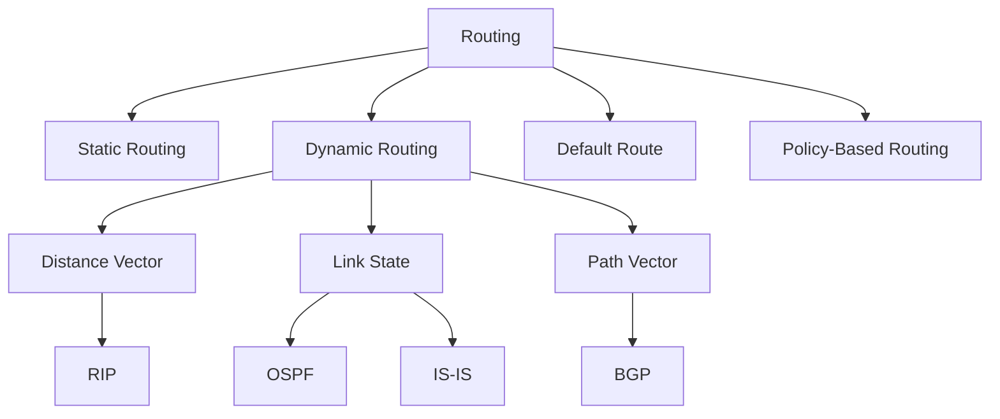

# Routing

Routing is the process of selecting paths in a network along which to send data packets. It operates at **Layer 3 (Network Layer)** of the OSI model and is one of the most critical functions in computer networking.

## Overview

Routing determines how data travels from source to destination across potentially multiple intermediate networks (hops). A router examines the destination IP address of each packet and consults its **routing table** to decide the best next hop.

## Why Routing Matters

- **Scalability**: The internet has billions of devices; routing hierarchies make this manageable
- **Fault tolerance**: Dynamic routing can reroute traffic around failed links
- **Performance**: Choosing optimal paths reduces latency and congestion
- **Policy enforcement**: Organizations can control traffic flow for cost, security, or compliance

## Key Concepts

| Concept | Description |
|---------|-------------|
| **Routing Table** | Database of known networks and how to reach them |
| **Next Hop** | The next router in the path to the destination |
| **Metric** | A value (hop count, bandwidth, delay) used to compare routes |
| **Administrative Distance** | Trustworthiness rating of a routing source |
| **Convergence** | Time for all routers to agree on the network topology |
| **Hop Count** | Number of routers a packet must traverse |

## Routing Types

## How a Router Makes Decisions

1. Receives a packet on an interface
2. Examines the destination IP address
3. Looks up the routing table for the longest prefix match
4. If a match is found, forwards to the next hop
5. If no match, sends to the default route (if configured) or drops the packet

## Administrative Distance (Trustworthiness)

| Source | AD Value |
|--------|----------|
| Directly connected | 0 |
| Static route | 1 |
| eBGP | 20 |
| EIGRP (internal) | 90 |
| OSPF | 110 |
| IS-IS | 115 |
| RIP | 200 |
| EIGRP (external) | 170 |
| iBGP | 200 |

## Interview Questions

1. **Q: What is the difference between routing and forwarding?**
   A: Routing is the control plane process of determining paths (building routing tables). Forwarding is the data plane process of moving packets from input to output interface based on the routing table.

2. **Q: What is longest prefix match?**
   A: When multiple routes match a destination, the router selects the one with the longest subnet mask (most specific). For example, `10.0.0.0/24` is preferred over `10.0.0.0/16` for destination `10.0.0.5`.

3. **Q: What happens when no route matches a packet?**
   A: If a default route (`0.0.0.0/0`) exists, the packet is sent there. Otherwise, the router drops the packet and may send an ICMP "Destination Unreachable" message.

## Common Mistakes

- Confusing routing (control plane) with forwarding (data plane)
- Assuming all routing protocols use the same metric
- Forgetting that BGP uses AS-path, not hop count, as its primary metric
- Not understanding that AD only matters when multiple sources provide routes to the same destination

## Summary

Routing is the backbone of internetworking. Static vs. dynamic routing, the various protocols (RIP, OSPF, IS-IS, BGP), and the concepts of convergence, metrics, and administrative distance are all essential interview topics.

## Cross-References

- [Static vs Dynamic Routing](static-vs-dynamic.md)
- [BGP](bgp.md)
- [OSPF](ospf.md)
- [RIP](rip.md)
- [IS-IS](isis.md)
- [Load Balancing](../load-balancing/README.md)
