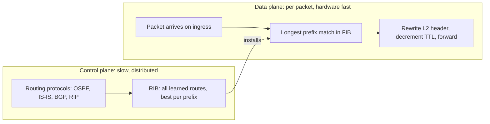
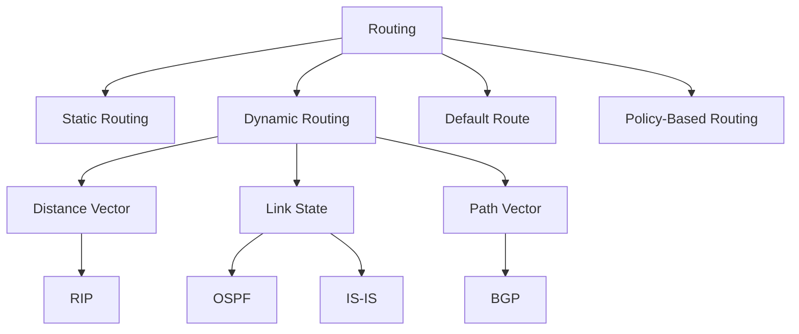
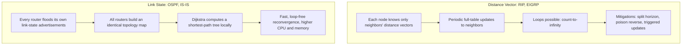
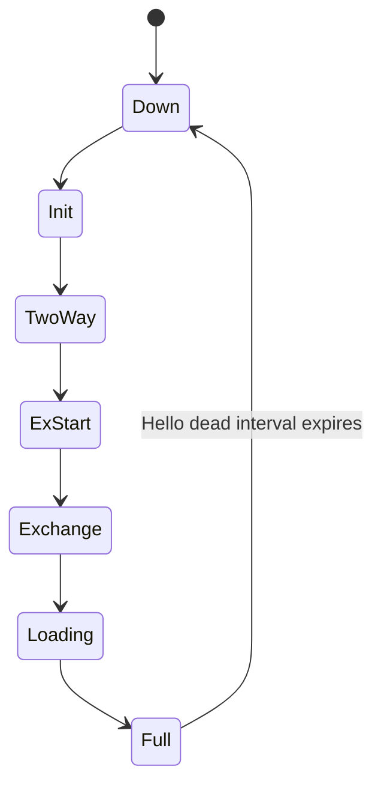

# Routing

Routing is the process of selecting paths in a network along which to send data packets. It operates at **Layer 3 (Network Layer)** of the OSI model and is one of the most critical functions in computer networking.

## Overview

Routing determines how data travels from source to destination across potentially multiple intermediate networks (hops). A router examines the destination IP address of each packet and consults its **routing table** to decide the best next hop.

## Why Routing Matters

- **Scalability**: The internet has billions of devices; routing hierarchies make this manageable
- **Fault tolerance**: Dynamic routing can reroute traffic around failed links
- **Performance**: Choosing optimal paths reduces latency and congestion
- **Policy enforcement**: Organizations can control traffic flow for cost, security, or compliance

## Key Concepts

| Concept | Description |
|---------|-------------|
| **Routing Table** | Database of known networks and how to reach them |
| **Next Hop** | The next router in the path to the destination |
| **Metric** | A value (hop count, bandwidth, delay) used to compare routes |
| **Administrative Distance** | Trustworthiness rating of a routing source |
| **Convergence** | Time for all routers to agree on the network topology |
| **Hop Count** | Number of routers a packet must traverse |

## Routing vs Forwarding: Control Plane vs Data Plane

The single most-tested distinction on this topic: **routing** is the control-plane computation of *what* the best paths are; **forwarding** is the data-plane act of moving a packet out the right interface. Routing runs as protocol daemons (OSPF, BGP) exchanging messages with other routers on second-to-minute timescales; forwarding runs per-packet in ASIC/TCAM hardware at nanosecond timescales. The control plane computes a RIB (Routing Information Base — all learned routes), picks winners, and installs them into the FIB (Forwarding Information Base) that the data plane actually searches. Software-defined networking (SDN) formalizes this split by moving the control plane out of the routers entirely — see [SDN & OpenFlow](../advanced/sdn-openflow.md).

```mermaid
flowchart LR
    subgraph CP["Control plane: slow, distributed"]
        R1["Routing protocols: OSPF, IS-IS, BGP, RIP"] --> R2["RIB: all learned routes, best per prefix"]
    end
    subgraph DP["Data plane: per packet, hardware fast"]
        F1["Packet arrives on ingress"] --> F2["Longest prefix match in FIB"]
        F2 --> F3["Rewrite L2 header, decrement TTL, forward"]
    end
    R2 -->|installs| F2
```

| Aspect | Routing (control plane) | Forwarding (data plane) |
|---|---|---|
| Question answered | Which path should reach this prefix? | Where does *this* packet go *right now*? |
| Runs on | CPU, protocol daemons | ASIC/TCAM, NPUs |
| Timescale | Seconds to minutes | Nanoseconds per packet |
| State | RIB, adjacency databases | FIB, adjacency rewrite tables |
| Failure cost | Stale topology until reconverged | Wrong egress or drop |

## Routing Types

```mermaid
graph TD
    A[Routing] --> B[Static Routing]
    A --> C[Dynamic Routing]
    C --> D[Distance Vector]
    C --> E[Link State]
    C --> F[Path Vector]
    D --> G[RIP]
    E --> H[OSPF]
    E --> I[IS-IS]
    F --> J[BGP]
    A --> K[Default Route]
    A --> L[Policy-Based Routing]
```

## Distance Vector vs Link State

These are the two classic intra-domain algorithm families, and the differences explain nearly every protocol trade-off in this chapter.

```mermaid
flowchart TD
    subgraph DV["Distance Vector: RIP, EIGRP"]
        D1["Each node knows only neighbors' distance vectors"] --> D2["Periodic full-table updates to neighbors"]
        D2 --> D3["Loops possible: count-to-infinity"]
        D3 --> D4["Mitigations: split horizon, poison reverse, triggered updates"]
    end
    subgraph LS["Link State: OSPF, IS-IS"]
        L1["Every router floods its own link-state advertisements"] --> L2["All routers build an identical topology map"]
        L2 --> L3["Dijkstra computes a shortest-path tree locally"]
        L3 --> L4["Fast, loop-free reconvergence, higher CPU and memory"]
    end
```

| Property | Distance Vector | Link State |
|---|---|---|
| Knowledge | Second-hand: neighbors' vectors | First-hand: full topology graph |
| Update style | Periodic, whole routing table | Event-driven flooding of LSAs |
| CPU / memory | Low | Dijkstra + full LSDB (higher) |
| Convergence | Slow; count-to-infinity risk | Fast; loop-free by construction |
| Scaling knob | Hop limit (RIP ≤ 15) | Areas / levels (OSPF areas, IS-IS levels) |
| Examples | RIP (RFC 2453), EIGRP (advanced DV) | OSPF (RFC 2328), IS-IS (RFC 1195) |

A link-state router must build adjacencies with its neighbors before exchanging database content, and OSPF's neighbor state machine is a favorite interview detail:

```mermaid
stateDiagram-v2
    [*] --> Down
    Down --> Init
    Init --> TwoWay
    TwoWay --> ExStart
    ExStart --> Exchange
    Exchange --> Loading
    Loading --> Full
    Full --> Down : Hello dead interval expires
```

In `ExStart`/`Exchange` the routers negotiate a master/slave relationship and swap database description packets; `Loading` pulls missing LSAs via link-state request; `Full` means the databases are synchronized. Only *Full* adjacencies (plus the `TwoWay` state between non-DR routers on broadcast segments) are usable for forwarding.

BGP is neither: it is a **path vector** protocol — it advertises the full AS-path so loops are prevented by inspection rather than by a distance metric, which is what makes policy routing between competing organizations possible.

## The Protocol Map: Where Each Protocol Is Used

| Protocol | Family | Metric | Scope | Where you meet it | Convergence | Scale notes |
|---|---|---|---|---|---|---|
| RIP v2 | Distance vector | Hop count (max 15) | IGP | Labs, tiny legacy networks | Slow (30 s updates) | Effectively obsolete |
| OSPF v2 | Link state | Cost = reference-BW / link-BW | IGP | Enterprise networks, cloud VPCs | Seconds with tuned timers | Areas limit LSA flooding; backbone is area 0 |
| IS-IS | Link state | Cost | IGP | ISP backbones, datacenter fabrics, segment routing | Fast, protocol is TLV-extensible | Runs directly over L2, no IP header needed |
| EIGRP | Advanced DV | Composite (BW, delay) | IGP | Cisco shops | Very fast with feasible successors | Proprietary, partially standardized |
| BGP-4 | Path vector | Policy over AS-path, MED, local-pref | EGP (also DC underlay, RFC 7938) | Between ASes on the Internet | Minutes; deliberately damped | Global IPv4 table ≈ 1M routes |

Two patterns worth internalizing: (1) IGPs optimize for *fast convergence and optimal paths*, BGP optimizes for *policy and infinite scalability* — that's why BGP tolerates slow convergence but never lacks a knob; (2) modern datacenters increasingly run **eBGP on every fabric link** instead of an IGP, because BGP's route filtering scales better than OSPF area plumbing — see [RFC 7938](https://datatracker.ietf.org/doc/rfc7938/) and [Datacenter Fabrics](../advanced/datacenter-fabrics.md).

## How a Router Makes Decisions

1. Receives a packet on an interface
2. Examines the destination IP address
3. Looks up the routing table for the longest prefix match
4. If a match is found, forwards to the next hop
5. If no match, sends to the default route (if configured) or drops the packet

Two refinements interviewers probe for: first, if ECMP (equal-cost multi-path) entries exist, the router load-splits per flow (hash of the 5-tuple), which can cause out-of-order delivery when a hash bucket drops. Second, after the FIB lookup the router rewrites the L2 header (new source MAC = self, new destination MAC = next hop) and decrements the TTL — a TTL that reaches 0 triggers an ICMP Time Exceeded message, which is exactly what `traceroute` exploits (see [ping & traceroute](../tools/ping-traceroute.md)).

## Administrative Distance (Trustworthiness)

| Source | AD Value |
|--------|----------|
| Directly connected | 0 |
| Static route | 1 |
| eBGP | 20 |
| EIGRP (internal) | 90 |
| OSPF | 110 |
| IS-IS | 115 |
| RIP | 120 |
| EIGRP (external) | 170 |
| iBGP | 200 |

AD is a Cisco IOS convention; other vendors (Juniper route preference, Linux route metrics/priorities) use similar but non-identical tables. AD only breaks ties when the *same prefix* is learned from multiple *protocol sources* — within one protocol, the metric decides; between protocols, AD decides.

## Convergence and Scaling

Convergence has three phases, and each is a tuning surface:

1. **Failure detection** — how fast does a router notice a dead neighbor? Default OSPF hellos (10 s hello / 40 s dead) are far too slow for production; BFD (Bidirectional Forwarding Detection) lowers detection to ~50–150 ms.
2. **Propagation** — LSAs flood through the domain (or BGP UPDATEs propagate AS-path by AS-path); SPF/BGP timers deliberately throttle recomputation to avoid CPU spikes during flaps.
3. **Recomputation and FIB update** — Dijkstra runs and new next-hops are programmed; the faster you react, the more you risk reacting to a flap.

Once converged, the *initial* reprogramming still leaves a forwarding gap (packets hitting stale FIB entries), which is why production networks precompute backup paths: **fast reroute** with Loop-Free Alternates or TI-LFA repairs traffic in <50 ms, locally, without waiting for global reconvergence — see [Fast Failover](../advanced/fast-failover.md).

Scaling knobs to name in an interview: OSPF *areas* (a stub area summarizes external routes; the backbone area 0 interconnects them) and LSA throttling; IS-IS *levels* (L1/L2); BGP *route reflectors*, which replace the iBGP full mesh that needs n·(n−1)/2 sessions per AS; and *route aggregation*, which shrinks the global table (the BGP IPv4 table sits around one million prefixes in the mid-2020s). Route leaks and hijacks are a security consequence of this scale — RPKI origin validation is the current mitigation, covered in [RPKI & BGP Security](../protocols/rpki-bgp-security.md).

## Interview Questions

1. **Q: What is the difference between routing and forwarding?**
   A: Routing is the control plane process of determining paths (building routing tables). Forwarding is the data plane process of moving packets from input to output interface based on the routing table. Concretely: OSPF/BGP daemons compute a RIB on the CPU at second timescales; the resulting FIB is searched per-packet by TCAM/ASIC hardware at nanosecond timescales. SDN makes this split explicit by relocating the control plane to centralized controllers.

2. **Q: What is longest prefix match?**
   A: When multiple routes match a destination, the router selects the one with the longest subnet mask (most specific). For example, `10.0.0.0/24` is preferred over `10.0.0.0/16` for destination `10.0.0.5`. This is why a `/32` host route (or a blackhole route) always wins over an aggregate, and why FIBs are implemented as tries or TCAM structures optimized for longest-match rather than exact-match.

3. **Q: What happens when no route matches a packet?**
   A: If a default route (`0.0.0.0/0`) exists, the packet is sent there. Otherwise, the router drops the packet and may send an ICMP "Destination Unreachable" message. Note that the default route is itself just the shortest possible prefix, so it always loses a longest-prefix-match contest — it is the fallback by construction.

4. **Q: Compare distance vector and link state. Why does link state scale better inside a domain?**
   A: Distance vector protocols (RIP, EIGRP) exchange second-hand distance tables with neighbors periodically, converge slowly, and risk count-to-infinity loops, mitigated by split horizon and poison reverse. Link state protocols (OSPF, IS-IS) flood first-hand topology descriptions, so every router computes its own loop-free shortest-path tree from the same map. LS scales better because updates are event-driven and topology-bounded, and because areas/levels partition the flooding domain — the cost is higher CPU/memory for the LSDB and Dijkstra.

5. **Q: Why does BGP use path vectors instead of distance vectors?**
   A: BGP's customers and peers are autonomous systems with commercial policies, not cooperative nodes optimizing a shared metric. Advertising the full AS-path lets each router reject routes containing its own AS (loop prevention) and apply policy (prefer shorter AS-paths, enforce customer-vs-peer ranking, prepend paths to make them less attractive). No single global metric could express "I prefer my customer's route even if it's longer," so BGP replaces the metric with policy evaluation order: local-pref, then AS-path length, then MED, then eBGP-over-iBGP.

6. **Q: What is convergence and how do you speed it up?**
   A: Convergence is the time until all routers agree on the post-failure topology. It splits into detection (BFD detects in ~50–150 ms vs multi-second hello/dead timers), propagation (flood/UPDATE), and recomputation (SPD-throttled SPF runs). The biggest production win is fast reroute with precomputed loop-free alternates: the backup path repairs traffic locally in <50 ms while the control plane converges in the background. Route reflectors and aggregation address *scaling* (session count and table size) rather than speed.

7. **Q: When do administrative distance and metric both matter?**
   A: AD breaks ties between routes to the same prefix learned from different sources (e.g., OSPF 110 vs RIP 120 → OSPF wins); metric breaks ties within one source (e.g., two OSPF paths, cost 30 vs cost 60). If the AD is equal but the prefix lengths differ, neither applies — longest prefix match wins. Mixing up these three tie-breakers is one of the most common interview slips.

## Common Mistakes

- Confusing routing (control plane) with forwarding (data plane)
- Assuming all routing protocols use the same metric
- Forgetting that BGP uses AS-path, not hop count, as its primary metric
- Not understanding that AD only matters when multiple sources provide routes to the same destination
- Saying "OSPF areas make OSPF faster" — areas primarily limit flooding scope and LSA processing, and can even lengthen paths via summarization

## Summary

Routing is the backbone of internetworking. Static vs. dynamic routing, the various protocols (RIP, OSPF, IS-IS, BGP), and the concepts of convergence, metrics, and administrative distance are all essential interview topics. Anchor your answers on the control-plane/data-plane split, the DV/LS/path-vector algorithm families, and the three phases of convergence — those three frames organize every follow-up question.

## Key Takeaways

- Routing = control plane (RIB, protocol daemons, seconds); forwarding = data plane (FIB, ASIC/TCAM, nanoseconds); longest prefix match is the universal lookup rule.
- Distance vector learns neighbors' tables and is loop-prone (split horizon, poison reverse); link state floods first-hand topology and computes Dijkstra locally; path vector (BGP) advertises AS-paths for loop prevention plus policy.
- Protocol map: RIP = legacy labs; OSPF = enterprise IGP with areas; IS-IS = ISP/datacenter IGP, TLV-extensible; BGP = inter-AS policy engine, ≈1M-route global table, also used as a datacenter underlay (RFC 7938).
- Convergence = detection (BFD ~50–150 ms) + propagation (LSA flooding) + recomputation (throttled SPF); fast reroute (LFA/TI-LFA) hides the gap with precomputed <50 ms local repairs.
- Scaling tools: OSPF areas, IS-IS levels, BGP route reflectors (replacing n(n−1)/2 iBGP sessions), and aggregation.
- AD is a cross-protocol tie-breaker (Cisco convention), metric is intra-protocol, prefix length overrides both.

## References

- RIP v2: [RFC 2453](https://datatracker.ietf.org/doc/rfc2453/)
- OSPF v2: [RFC 2328](https://datatracker.ietf.org/doc/rfc2328/)
- IS-IS over IPv4: [RFC 1195](https://datatracker.ietf.org/doc/rfc1195/)
- BGP-4: [RFC 4271](https://datatracker.ietf.org/doc/rfc4271/)
- BGP in large datacenters: [RFC 7938](https://datatracker.ietf.org/doc/rfc7938/)
- Linux policy routing & FIB documentation: <https://www.kernel.org/doc/html/latest/networking/>

## Cross-References

- [Static vs Dynamic Routing](static-vs-dynamic.md)
- [BGP](bgp.md)
- [OSPF](ospf.md)
- [RIP](rip.md)
- [IS-IS](isis.md)
- [Load Balancing](../load-balancing/README.md)
- [BGP Deep Dive](bgp-deep.md) — attributes, sessions, and the global routing table
- [OSPF Deep Dive](ospf-deep.md) — LSA types, areas, and adjacency details
- [Fast Failover](../advanced/fast-failover.md) — LFA/TI-LFA and sub-50 ms repair paths
- [Datacenter Fabrics](../advanced/datacenter-fabrics.md) — Clos topologies and BGP underlays
- [RPKI & BGP Security](../protocols/rpki-bgp-security.md) — stopping route leaks and hijacks
