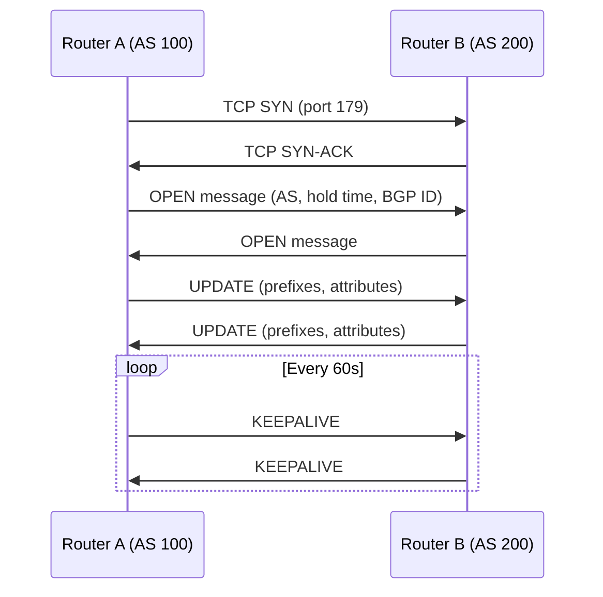
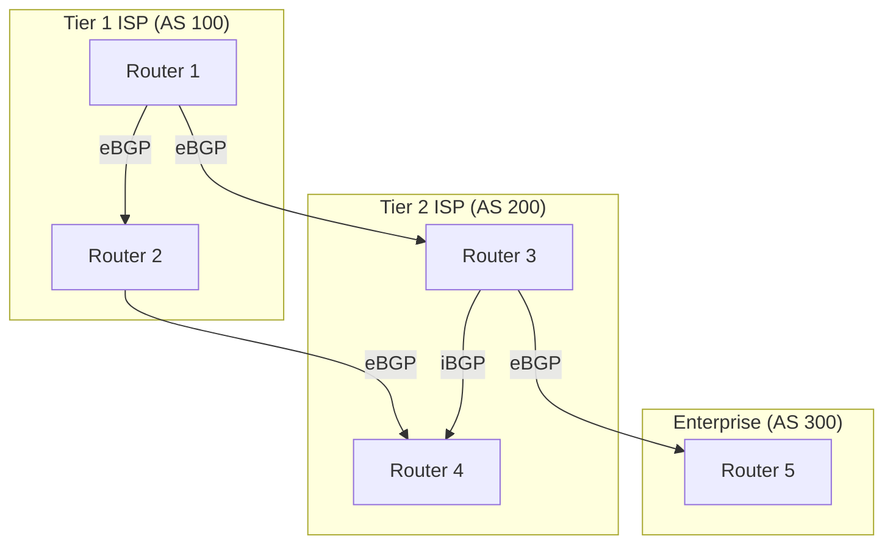

# BGP — Border Gateway Protocol

## Overview

BGP is the **routing protocol of the Internet**. It's a **path vector** protocol (AS-path based) that interconnects autonomous systems (AS). BGP is classified as an **Exterior Gateway Protocol (EGP)**, though iBGP is used within an AS.

- **Protocol number**: TCP port 179
- **RFC**: RFC 4271 (BGP-4)
- **Metric**: AS-path, local preference, MED, weight (Cisco), community
- **Algorithm**: Path vector (not distance vector or link state)

## Why BGP Matters

- Routes ~100,000+ prefixes on the global Internet
- ISPs, cloud providers, and enterprises use it for multi-homing
- Enables policy-based routing between organizations
- Prevents routing loops via AS-path

## How BGP Works



## BGP Message Types

| Message | Purpose |
|---------|---------|
| **OPEN** | Establishes BGP session, exchanges capabilities |
| **UPDATE** | Advertises new routes or withdraws old ones |
| **KEEPALIVE** | Maintains session (default every 60s) |
| **NOTIFICATION** | Error reporting, session teardown |

## eBGP vs iBGP

| Aspect | eBGP | iBGP |
|--------|------|------|
| **Between** | Different ASes | Same AS |
| **AD** | 20 | 200 |
| **TTL** | 1 (directly connected) | 255 |
| **Next-hop** | Changed to self | Not changed by default |
| **Full mesh** | N/A | Required (or use route reflectors) |
| **AS-path prepending** | Used | Not used (same AS) |

## BGP Path Selection Algorithm

When BGP receives multiple routes to the same prefix, it applies this decision process (Cisco order):

1. **Highest Weight** (Cisco proprietary, local to router)
2. **Highest Local Preference** (shared within AS)
3. **Locally originated** (network/aggregate command)
4. **Shortest AS-path**
5. **Lowest Origin type** (IGP < EGP < Incomplete)
6. **Lowest MED** (Multi-Exit Discriminator)
7. **eBGP over iBGP**
8. **Lowest IGP metric to next hop**
9. **Oldest route** (for eBGP stability)
10. **Lowest Router ID**

## BGP Attributes

### Well-Known Mandatory
- **AS-path**: List of ASes the route has traversed
- **Origin**: How the route was introduced (IGP/EGP/Incomplete)
- **Next-hop**: IP address of the next hop

### Well-Known Discretionary
- **Local Preference**: Influences outbound path selection (higher = preferred)
- **Atomic Aggregate**: Indicates route aggregation occurred

### Optional Transitive
- **Community**: Tags for policy application (e.g., `NO_EXPORT`)

### Optional Non-Transitive
- **MED**: Suggests to external neighbors which path to prefer (lower = preferred)

## BGP Configuration Example (Cisco)

```
router bgp 100
  neighbor 203.0.113.1 remote-as 200
  neighbor 203.0.113.1 description ISP-Link
  network 192.168.0.0 mask 255.255.0.0
  
  address-family ipv4 unicast
    neighbor 203.0.113.1 route-map SET-LOCAL-PREF in
    neighbor 203.0.113.1 prefix-list LIMIT-ROUTES in
```

## BGP and Internet Architecture



## BGP Security Concerns

- **Prefix hijacking**: Malicious AS advertises prefixes it doesn't own
- **Route leaks**: Accidental advertisement of transit routes
- **Mitigation**: RPKI (Resource Public Key Infrastructure), BGP communities, prefix filters

## Interview Questions

1. **Q: Why does BGP use TCP instead of its own transport?**
   A: TCP provides reliable delivery, ordered delivery, and connection management (3-way handshake). BGP doesn't need to reinvent these. TCP port 179 is used.

2. **Q: What is AS-path loop prevention?**
   A: When a BGP router receives an UPDATE containing its own AS number in the AS-path, it rejects the route. This prevents loops between autonomous systems.

3. **Q: What's the difference between Local Preference and MED?**
   A: Local Preference (LP) is set within your AS to control **outbound** traffic (higher LP = preferred). MED is set by a neighboring AS to **suggest** which inbound link to use (lower MED = preferred). LP is compared before MED.

4. **Q: Why does iBGP require full mesh?**
   A: iBGP does not re-advertise routes learned from one iBGP peer to another iBGP peer (to prevent loops). Therefore, all iBGP routers must be directly peered. Route reflectors or confederations solve the scalability issue.

5. **Q: What is BGP route reflector?**
   A: A router that acts as a focal point for iBGP sessions. Clients peer with the reflector instead of with each other, reducing the full-mesh requirement from `n(n-1)/2` to `n-1` sessions.

6. **Q: Explain BGP convergence.**
   A: BGP converges slowly (minutes) compared to OSPF (seconds) because it uses hold timers (default 180s), deliberate dampening, and the path-vector algorithm is more conservative. This is acceptable because inter-domain routing prioritizes stability over speed.

## Common Mistakes

- Confusing eBGP AD (20) with iBGP AD (200)
- Forgetting iBGP's full-mesh requirement
- Assuming BGP is a link-state protocol (it's path vector)
- Not understanding that BGP is policy-driven, not just shortest-path
- Thinking MED is compared across different ASes (it's only compared from the same neighbor AS by default)
- Confusing AS-path prepending (for influencing inbound) with local preference (for outbound)

## Summary

BGP is the protocol that glues the Internet together. It's policy-driven, uses AS-path for loop prevention, and selects paths based on a multi-step algorithm (weight → local pref → AS-path → origin → MED → etc.). Understanding eBGP vs iBGP, path selection, and security is essential for interviews.

## Cross-References

- [Routing Overview](README.md)
- [Static vs Dynamic Routing](static-vs-dynamic.md)
- [OSPF](ospf.md) — Interior protocol often used alongside BGP
- [IS-IS](isis.md) — Another interior protocol
- [Firewalls](../security/firewalls.md) — BGP security
