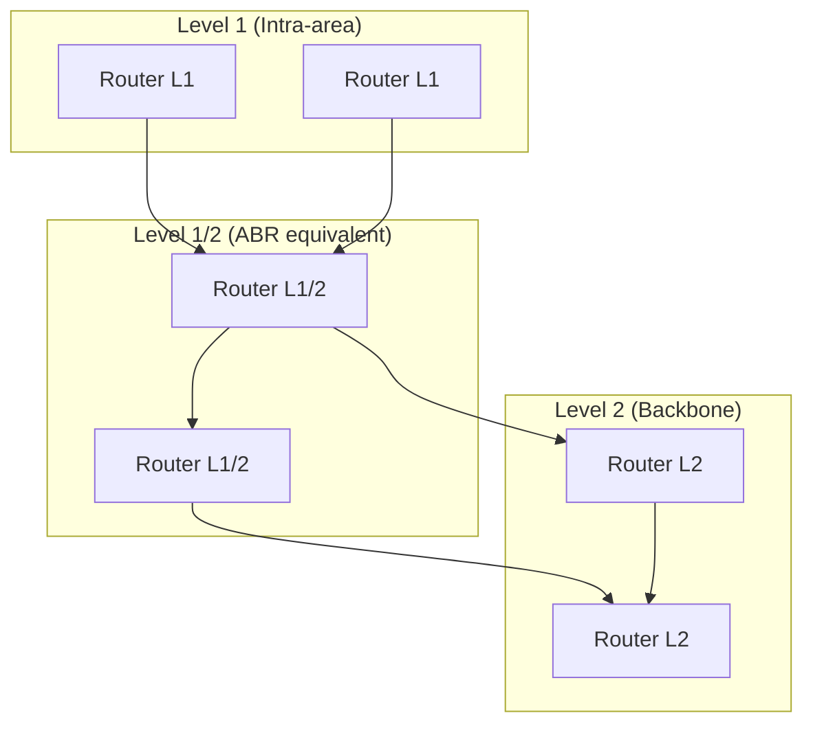
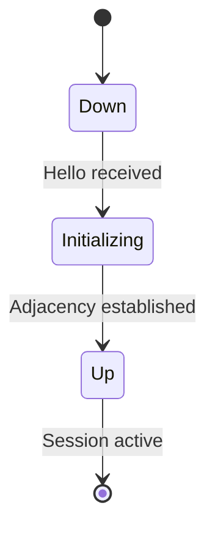

# IS-IS — Intermediate System to Intermediate System

## Overview

IS-IS is a **link-state** routing protocol originally designed for OSI networks (CLNP) and later adapted for IP (Integrated IS-IS, RFC 1195). It's widely used by ISPs and large-scale networks, often preferred over OSPF for its simplicity at scale.

- **OSI standard**: ISO 10589
- **IP extension**: RFC 1195 (Integrated IS-IS)
- **Metric**: Configurable cost (default 10 per interface)
- **AD**: 115
- **Algorithm**: Dijkstra's SPF
- **Transport**: Layer 2 (directly on data link, no IP dependency)

## Why IS-IS Matters

- Preferred by ISPs and cloud providers (Google, Facebook, large ISPs use IS-IS)
- Simpler area design than OSPF (backbone is Level 2, not Area 0)
- Runs directly on Layer 2 — no IP dependency (works even if IP is broken)
- Better scalability for very large flat networks
- TLV-based encoding makes it extensible (easy to add new features)

## IS-IS vs OSPF

| Feature | IS-IS | OSPF |
|---------|-------|------|
| **Transport** | Layer 2 (data link) | Layer 3 (IP protocol 89) |
| **Area design** | On links (Level 1/2) | On interfaces (Area 0 backbone) |
| **Addressing** | NET (Network Entity Title) | Router ID (IP-based) |
| **LSDB flooding** | More efficient in large areas | Can be chatty in large areas |
| **IPv6 support** | Native TLV extension | Separate OSPFv3 process |
| **Extensibility** | TLV-based (easy to extend) | LSA type-based (harder to extend) |
| **Vendor preference** | ISPs, large enterprises | Enterprise networks |

## IS-IS Levels



| Level | Description | OSPF Equivalent |
|-------|-------------|-----------------|
| **Level 1** | Intra-area routing only | Non-backbone area |
| **Level 2** | Inter-area routing (backbone) | Area 0 |
| **Level 1/2** | Both levels (default on Cisco) | ABR |

### Key Difference from OSPF

- In OSPF, all areas must physically connect to Area 0
- In IS-IS, Level 2 routers form a contiguous backbone (areas are on links, not interfaces)
- This makes IS-IS area design more flexible

## Network Entity Title (NET)

IS-IS uses NET addresses instead of IP router IDs. A NET is typically 8-20 bytes:

```
49.0001.0000.0000.0001.00
│   │      │              │
│   │      │              N-selector (always 00)
│   │      System ID (6 bytes, unique)
│   Area ID (variable length)
AFI (49 = private)
```

Example: `49.0001.0000.0000.0001.00`

## IS-IS Packet Types

| PDU | Purpose | OSPF Equivalent |
|-----|---------|-----------------|
| **Hello (ESH/ISH/IIH)** | Discover/maintain neighbors | Hello packet |
| **LSP (Link State PDU)** | Advertise link states | LSA |
| **CSNP (Complete Sequence Number)** | Full LSDB summary | DBD |
| **PSNP (Partial Sequence Number)** | Request/acknowledge LSPs | LSR/LSAck |

## IS-IS Neighbor States



Unlike OSPF (which has 7 states), IS-IS has a simpler 3-state model.

## IS-IS Configuration (Cisco)

```
router isis COMPANY
  net 49.0001.0000.0000.0001.00
  is-type level-2-only
  metric-style wide

interface GigabitEthernet0/0
  ip router isis COMPANY
  isis circuit-type level-2-only
  isis metric 10 level-2
```

## IS-IS Metric Types

| Type | Range | Default |
|------|-------|---------|
| **Narrow** | 0-63 | 10 |
| **Wide** | 0-16,777,215 | 10 |

Wide metrics (RFC 5305) are preferred for modern networks, supporting traffic engineering.

## IS-IS Authentication

| Level | Purpose |
|-------|---------|
| **Interface** | Authenticates Hello packets (link-level) |
| **Area** | Authenticates Level 1 LSPs |
| **Domain** | Authenticates Level 2 LSPs |

## Interview Questions

1. **Q: Why do ISPs prefer IS-IS over OSPF?**
   A: IS-IS runs on Layer 2 (no IP dependency), has simpler area design, is more extensible (TLV-based), handles large flat networks better, and supports IPv6 natively without a separate process.

2. **Q: What is the difference between Level 1, Level 2, and Level 1/2 routers?**
   A: Level 1 routers only know routes within their area. Level 2 routers only know inter-area routes (backbone). Level 1/2 routers know both and act as default gateways for Level 1 routers.

3. **Q: How does IS-IS differ from OSPF in area design?**
   A: OSPF assigns areas to interfaces — a router is an ABR if it has interfaces in multiple areas. IS-IS assigns levels to links — a router is Level 1/2 if it has links at both levels. This is more flexible.

4. **Q: What is a NET in IS-IS?**
   A: A Network Entity Title is IS-IS's identifier, analogous to OSPF's Router ID. It contains an Area ID, a 6-byte System ID (unique), and a N-selector (always 00).

5. **Q: Why doesn't IS-IS need IP to function?**
   A: IS-IS PDUs are encapsulated directly in Layer 2 frames (like Ethernet). They don't require IP addressing to establish adjacencies. This means IS-IS can run even if IP is misconfigured.

6. **Q: What are CSNP and PSNP?**
   A: CSNP (Complete Sequence Number PDU) contains a summary of all LSPs in the LSDB, sent periodically by the DIS. PSNP (Partial Sequence Number PDU) requests specific LSPs or acknowledges receipt.

## Common Mistakes

- Confusing IS-IS levels with OSPF areas (they work differently)
- Forgetting that IS-IS runs on Layer 2, not Layer 3
- Not understanding the NET format
- Assuming IS-IS and OSPF have the same area interconnection requirements
- Forgetting that IS-IS metric-style narrow has a max of 63

## Summary

IS-IS is a link-state protocol that runs directly on Layer 2, uses levels (1, 2, 1/2) instead of numbered areas, and is preferred by ISPs for its scalability and extensibility. Its TLV-based design makes it easy to extend for new features like traffic engineering and IPv6.

## Cross-References

- [Routing Overview](README.md)
- [OSPF](ospf.md) — Most comparable protocol
- [BGP](bgp.md) — Used alongside IS-IS in ISP networks
- [Static vs Dynamic](static-vs-dynamic.md)
- [SDN](../wireless/sdn.md) — Modern network control
