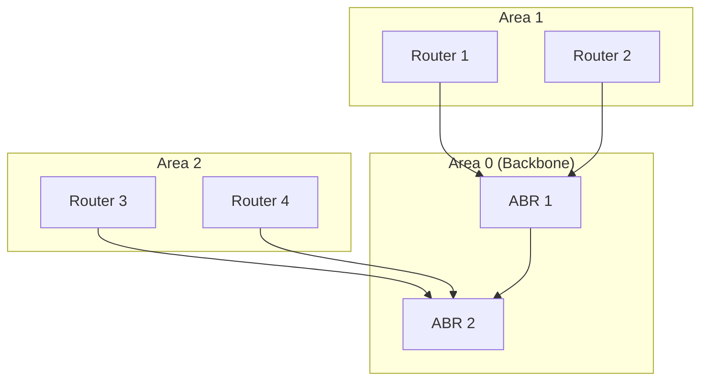
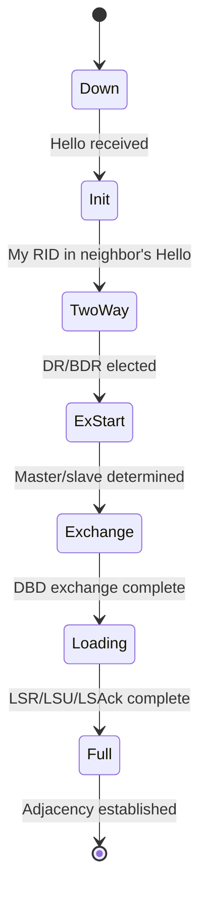
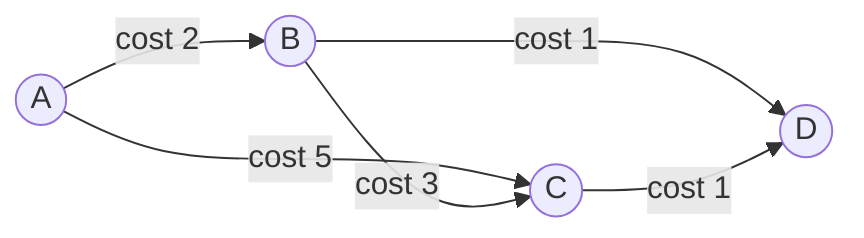

# OSPF — Open Shortest Path First

## Overview

OSPF is a **link-state** Interior Gateway Protocol (IGP) that uses Dijkstra's Shortest Path First (SPF) algorithm to compute routes. It's the most widely deployed IGP in enterprise networks.

- **Protocol number**: IP protocol 89
- **RFC**: RFC 2328 (OSPFv2), RFC 5340 (OSPFv3 for IPv6)
- **Metric**: Cost (inversely proportional to bandwidth)
- **Algorithm**: Dijkstra's SPF
- **AD**: 110
- **Multicast address**: 224.0.0.5 (all OSPF routers), 224.0.0.6 (DR/BDR)

## Why OSPF Matters

- Fast convergence (seconds, not minutes like RIP)
- Hierarchical design with areas for scalability
- Supports VLSM and CIDR
- No hop count limit (unlike RIP's 15)
- Open standard (not proprietary like EIGRP)

## OSPF Key Concepts

### Areas



- **Area 0 (Backbone)**: All areas must connect to Area 0
- **ABR (Area Border Router)**: Connects areas to the backbone
- **ASBR (Autonomous System Boundary Router)**: Connects OSPF to external networks
- **Stub area**: Doesn't receive external routes (replaced with default route)
- **NSSA (Not-So-Stubby Area)**: Stub area that can have an ASBR

### Router Types

| Type | Role |
|------|------|
| **Internal Router** | All interfaces in one area |
| **ABR** | Interfaces in multiple areas (at least one in Area 0) |
| **ASBR** | Injects external routes into OSPF |
| **Backbone Router** | Has at least one interface in Area 0 |

### OSPF Neighbor States



### OSPF Packet Types

| Packet | Purpose |
|--------|---------|
| **Hello** | Discover/maintain neighbors (every 10s on LAN, 30s on NBMA) |
| **DBD (Database Description)** | Summary of LSDB |
| **LSR (Link State Request)** | Request specific LSAs |
| **LSU (Link State Update)** | Send LSAs |
| **LSAck** | Acknowledge LSAs |

### LSA Types

| LSA Type | Name | Originator | Scope |
|----------|------|------------|-------|
| 1 | Router LSA | Every router | Area |
| 2 | Network LSA | DR | Area |
| 3 | Summary LSA | ABR | Area |
| 4 | ASBR Summary LSA | ABR | Area |
| 5 | External LSA | ASBR | AS-wide |
| 7 | NSSA External LSA | ASBR in NSSA | NSSA |

## OSPF Cost Calculation

```
Cost = Reference Bandwidth / Interface Bandwidth
Default Reference Bandwidth = 100 Mbps (10^8)
```

| Interface | Bandwidth | Cost |
|-----------|-----------|------|
| Serial (T1) | 1.544 Mbps | 64 |
| Ethernet | 10 Mbps | 10 |
| FastEthernet | 100 Mbps | 1 |
| GigabitEthernet | 1 Gbps | 1 |
| 10GigE | 10 Gbps | 1 |

**Problem**: With default reference bandwidth, GigE and 10GigE have the same cost. Solution: increase reference bandwidth.

## OSPF Network Types

| Type | DR/BDR | Hello/Dead | Example |
|------|--------|------------|---------|
| Broadcast | Yes | 10/40s | Ethernet |
| Point-to-Point | No | 10/40s | Serial link |
| NBMA | Yes | 30/120s | Frame Relay |
| Point-to-Multipoint | No | 30/120s | Hub-and-spoke |

## OSPF Configuration (Cisco)

```
router ospf 1
  router-id 1.1.1.1
  network 192.168.1.0 0.0.0.255 area 0
  network 10.0.0.0 0.0.0.255 area 1
  passive-interface GigabitEthernet0/1
  default-information originate
```

## SPF Algorithm Walkthrough



**Dijkstra from A:**
1. Start at A: {A: 0}
2. Neighbors of A: B(2), C(5)
3. Visit B (cost 2): relax B's neighbors — C via B = 2+3=5 (no improvement over A→C=5), D = 2+1=3
4. Visit D (cost 3): relax D's neighbors — C via D = 3+1=4 < 5, so update C to 4 via A→B→D→C
5. Visit C (cost 4): Done

**Result**: A→B(2), A→B→D(3), A→B→D→C(4)

## Interview Questions

1. **Q: Why does OSPF use areas?**
   A: Areas limit the scope of LSA flooding, reduce LSDB size on each router, and speed up SPF calculations. Without areas, every topology change triggers SPF on every router.

2. **Q: What is the difference between OSPF and RIP?**
   A: OSPF is link-state (Dijkstra, fast convergence, unlimited hops, areas, VLSM). RIP is distance-vector (Bellman-Ford, slow convergence, 15-hop limit, classful in v1).

3. **Q: What triggers OSPF SPF recalculation?**
   A: Changes in Type 1 or Type 2 LSAs (router or network LSAs). Changes in Type 3-5 LSAs trigger partial route calculations, not full SPF.

4. **Q: What is the DR/BDR election process?**
   A: On multi-access networks (like Ethernet), OSPF elects a Designated Router (DR) and Backup DR (BDR) to reduce adjacencies. Election is based on: 1) Highest OSPF priority (0 = not eligible), 2) Highest Router ID. DR/BDR are not preemptive.

5. **Q: What is OSPF virtual link?**
   A: A virtual link connects a non-backbone area to Area 0 through another area. It's a workaround for areas that can't directly connect to the backbone. Configured between two ABRs.

6. **Q: How does OSPF handle equal-cost multipath (ECMP)?**
   A: OSPF installs multiple equal-cost paths in the routing table. By default, up to 4 (Cisco) or 16 paths are supported. Traffic is load-balanced across them.

## Common Mistakes

- Forgetting that all areas must connect to Area 0
- Not matching Hello/Dead timers on neighbors
- Not matching area IDs on directly connected interfaces
- Confusing OSPF cost with hop count (it's bandwidth-based)
- Forgetting DR/BDR election is not preemptive
- Using default reference bandwidth on networks with links faster than 100 Mbps

## Summary

OSPF is the standard enterprise IGP. It uses Dijkstra's algorithm, organizes routers into areas for scalability, elects DR/BDR on multi-access networks, and converges quickly. Key interview topics: areas, LSA types, neighbor states, DR/BDR, and SPF algorithm.

## Cross-References

- [Routing Overview](README.md)
- [RIP](rip.md) — Distance-vector comparison
- [IS-IS](isis.md) — Another link-state IGP
- [BGP](bgp.md) — Exterior protocol
- [Static vs Dynamic](static-vs-dynamic.md)

## Cross References

- [BGP](bgp.md)
- [IS-IS](isis.md)
- [RIP](rip.md)
- [IP Protocol](../tcp-ip/ip.md)
