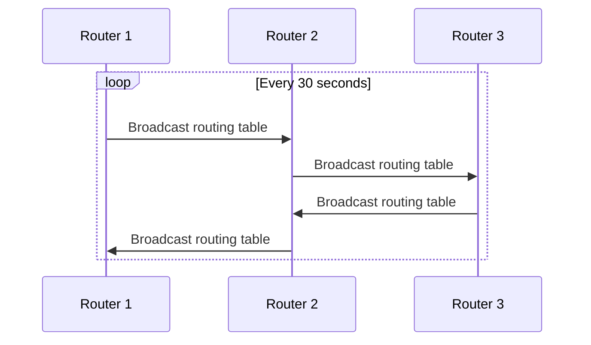
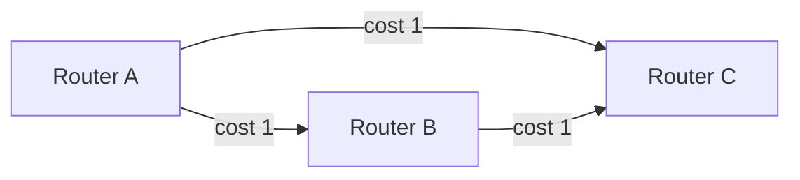

# RIP — Routing Information Protocol

## Overview

RIP is one of the oldest **distance-vector** routing protocols. It uses **hop count** as its metric and has a maximum diameter of **15 hops** (hop count 16 = infinity/unreachable).

- **Port**: UDP 520
- **Versions**: RIPv1 (classful, RFC 1058), RIPv2 (classless, RFC 2453), RIPng (IPv6, RFC 2080)
- **Metric**: Hop count (max 15)
- **AD**: 120
- **Update timer**: Every 30 seconds
- **Algorithm**: Bellman-Ford

## Why RIP Still Matters

- Simple to understand and configure
- Historical importance (used in early Internet)
- Still used in small networks and for educational purposes
- Good for interviews as a baseline to compare with OSPF/BGP

## How RIP Works



### Distance-Vector Algorithm

Each router maintains a table of {destination, next-hop, metric}. Periodically, it sends its entire table to neighbors. Each neighbor:

1. Receives the routing table
2. Adds 1 to each metric (hop count)
3. Compares with its own table
4. If the new route is better (lower metric) or new, update
5. If the existing route is better, keep it

## RIP Timers

| Timer | Default | Purpose |
|-------|---------|---------|
| **Update** | 30s | How often routing updates are sent |
| **Invalid** | 180s | Time without update before route is marked invalid |
| **Holddown** | 180s | Period to suppress route changes after a failure |
| **Flush** | 240s | Time before an invalid route is removed from table |

## RIPv1 vs RIPv2

| Feature | RIPv1 | RIPv2 |
|---------|-------|-------|
| **Addressing** | Classful | Classless (supports VLSM/CIDR) |
| **Subnet mask** | Not included in updates | Included in updates |
| **Authentication** | None | Supports MD5 authentication |
| **Updates** | Broadcast (255.255.255.255) | Multicast (224.0.0.9) |
| **Route tags** | No | Yes |
| **Next hop** | Not specified | Specified in update |

## Count-to-Infinity Problem

RIP's classic problem: when a link fails, routers can incrementally increase hop counts toward infinity (16), creating slow convergence and potential loops.



If link A-B fails:
1. B thinks C can reach A (via C's route with cost 2)
2. B updates its route to A with cost 3
3. C now thinks B can reach A with cost 3, updates to cost 4
4. This continues until hop count reaches 16

### Solutions

| Mechanism | How It Works |
|-----------|-------------|
| **Split Horizon** | Don't advertise a route back to the interface it was learned from |
| **Poison Reverse** | Advertise the route back with metric 16 (infinity) |
| **Triggered Updates** | Send updates immediately on topology change (don't wait 30s) |
| **Holddown Timer** | Ignore worse routes for a period after a failure |

## RIP Configuration (Cisco)

### RIPv2

```
router rip
  version 2
  network 192.168.1.0
  network 10.0.0.0
  no auto-summary
  passive-interface GigabitEthernet0/1
  neighbor 10.0.0.2
```

### RIPng (IPv6)

```
ipv6 router rip RIPNG
  redistribute connected
interface GigabitEthernet0/0
  ipv6 rip RIPNG enable
```

## Limitations of RIP

- **15-hop limit**: Cannot scale beyond 15 routers
- **Slow convergence**: 30-second update cycle + holddown timers
- **High overhead**: Sends entire routing table every 30 seconds
- **No load balancing awareness**: Treats all paths as equal (hop count only)
- **Metric is simplistic**: Hop count doesn't consider bandwidth, latency, or load

## Interview Questions

1. **Q: What is the maximum hop count in RIP and why?**
   A: 15 hops (16 = unreachable). This was a design choice to limit convergence time and prevent count-to-infinity. With 15 max, the protocol can't scale to large networks.

2. **Q: How does split horizon prevent routing loops?**
   A: A router will not advertise a route back out the same interface from which it learned the route. This prevents two-node loops where Router A tells Router B about a route that B originally told A.

3. **Q: What's the difference between RIPv1 and RIPv2?**
   A: RIPv2 adds: VLSM/CIDR support (includes subnet mask), multicast updates (224.0.0.9 vs broadcast), MD5 authentication, next-hop field, and route tags.

4. **Q: Why does RIP use UDP instead of TCP?**
   A: RIP broadcasts/multicasts routing tables periodically. UDP is simpler, and the protocol handles reliability itself (periodic retransmission). TCP's connection-oriented nature would add unnecessary overhead for periodic broadcasts.

5. **Q: Explain the count-to-infinity problem.**
   A: When a route fails, routers may incrementally increase the metric toward 16, each thinking a neighbor has a valid path. This slow convergence creates loops. Solutions: split horizon, poison reverse, triggered updates, holddown timers.

6. **Q: What is poison reverse?**
   A: An enhancement to split horizon. Instead of not advertising a route back, you advertise it back with metric 16 (infinity), explicitly telling the neighbor the route is unreachable. This converges faster than simple split horizon.

## Common Mistakes

- Confusing RIPv1 (classful) with RIPv2 (classless)
- Forgetting that RIP's AD is 120 (higher than OSPF's 110)
- Not disabling auto-summary in RIPv2 when using VLSM
- Thinking split horizon and poison reverse are the same thing
- Assuming RIP considers bandwidth in its metric (it only counts hops)

## Summary

RIP is a simple distance-vector protocol limited to 15 hops. It uses hop count as metric, updates every 30 seconds, and suffers from slow convergence. RIPv2 improved on v1 with VLSM support and authentication. While largely replaced by OSPF in production, RIP is an important interview topic for understanding routing fundamentals.

## Cross-References

- [Routing Overview](README.md)
- [OSPF](ospf.md) — Modern link-state replacement
- [BGP](bgp.md) — Exterior routing protocol
- [Static vs Dynamic](static-vs-dynamic.md)
- [IS-IS](isis.md) — Another link-state alternative

## Cross References

- [OSPF](ospf.md)
- [Static vs Dynamic](static-vs-dynamic.md)
