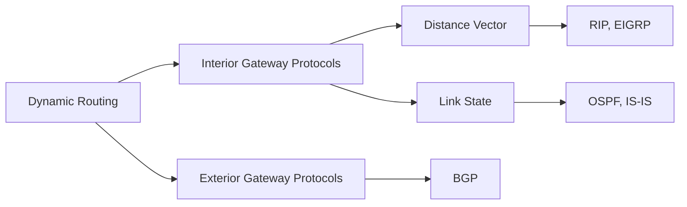
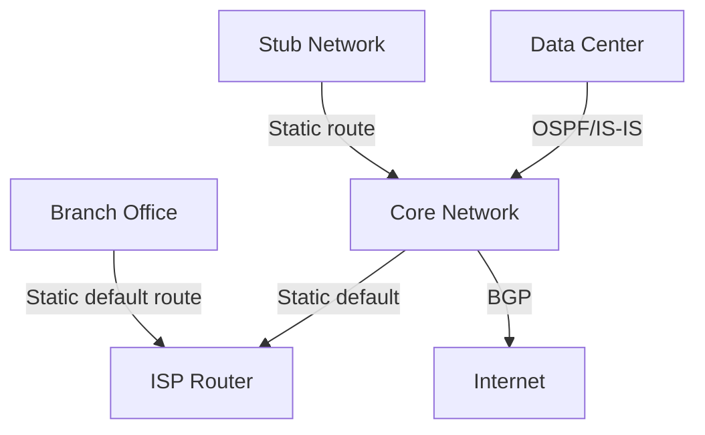

# Static vs Dynamic Routing

## Overview

Routing strategies fall into two fundamental categories: **static** (manually configured) and **dynamic** (automatically learned). Understanding when to use each is a core networking interview topic.

## Static Routing

Static routes are manually configured by a network administrator. The router has no autonomy — it forwards traffic exactly as told.

### Configuration Example (Cisco IOS)

```
ip route 192.168.2.0 255.255.255.0 10.0.0.1
! destination    subnet mask    next-hop
```

### Characteristics

- **No overhead**: No routing protocol traffic (no CPU/memory for protocol processing)
- **Predictable**: Traffic always follows the same path
- **Manual intervention required**: Admin must update routes when topology changes
- **No automatic failover**: If a link goes down, traffic is dropped until admin intervenes

### When to Use Static Routes

- Small networks with few paths
- Stub networks (single exit point)
- Default routes for Internet connectivity
- When you need explicit control over traffic paths
- Backup routes (floating static routes with higher AD)

### Floating Static Routes

A static route with a higher administrative distance than the dynamic protocol, so it's only used when the dynamic route disappears:

```
ip route 192.168.2.0 255.255.255.0 10.0.0.1 150
! AD of 150 > OSPF's 110, so this is a backup
```

## Dynamic Routing

Dynamic routing protocols automatically discover network topology, share routing information, and compute best paths.

### Characteristics

- **Automatic**: Routers learn routes from neighbors
- **Adaptive**: Routes update when topology changes
- **Overhead**: Requires CPU, memory, and bandwidth for protocol messages
- **Convergence time**: Period of inconsistency after a topology change

### Categories



## Detailed Comparison

| Aspect | Static | Dynamic |
|--------|--------|---------|
| **Configuration** | Manual per route | Automatic via protocols |
| **Scalability** | Poor for large networks | Excellent |
| **Resource usage** | Minimal | CPU, memory, bandwidth |
| **Convergence** | None (manual) | Automatic (seconds to minutes) |
| **Fault tolerance** | None (unless floating) | Automatic rerouting |
| **Security** | No protocol attacks possible | Vulnerable to protocol attacks |
| **Path selection** | Admin-controlled | Algorithm-determined |
| **Use case** | Small/stub networks | Enterprise/ISP networks |

## Hybrid Approach

Most production networks use both:



**Best practice**: Use dynamic routing within your autonomous system (IGP) and static/BGP at the edges.

## Interview Questions

1. **Q: A network has 50 routers. Why would you NOT use static routing?**
   A: With 50 routers, you'd need `O(n²)` static routes (each router needs a route to every other network). Any topology change requires manual updates on multiple routers. Dynamic routing automates this.

2. **Q: When would you prefer a static route over a dynamic one even in a large network?**
   A: For default routes to an ISP, for security-sensitive paths where you don't want protocol exposure, for stub networks, or as floating static backup routes.

3. **Q: What is convergence in dynamic routing?**
   A: Convergence is the time it takes for all routers in a network to agree on the topology after a change (link failure, new route). During convergence, routing loops and black holes can occur.

4. **Q: What's the AD of a static route vs OSPF?**
   A: Static route AD = 1, OSPF AD = 110. If both provide a route to the same destination, the static route wins because lower AD = more trusted.

## Common Mistakes

- Thinking static routes don't have an administrative distance (they do: 1)
- Assuming dynamic routing is always better (overhead may not be justified for small networks)
- Forgetting that floating static routes need a higher AD than the dynamic protocol
- Confusing the routing table (result) with the routing protocol (process)

## Summary

Static routing is simple, secure, and zero-overhead but doesn't scale or adapt. Dynamic routing scales and self-heals but adds complexity and overhead. Production networks use both strategically.

## Cross-References

- [Routing Overview](README.md)
- [BGP](bgp.md) — Exterior gateway protocol
- [OSPF](ospf.md) — Interior link-state protocol
- [RIP](rip.md) — Interior distance-vector protocol
- [IS-IS](isis.md) — Interior link-state protocol

## Cross References

- [BGP](bgp.md)
- [OSPF](ospf.md)
- [RIP](rip.md)
