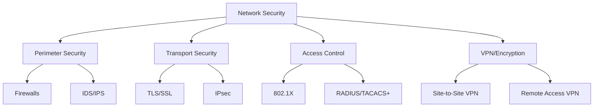

# Network Security

Network security encompasses policies, practices, and technologies designed to protect network infrastructure, data in transit, and connected systems from unauthorized access, misuse, and attacks.

## Overview

Security operates at every layer of the network stack — from physical security of cables to application-layer encryption. This section covers the critical protocols and technologies that protect network communications.

## Security Layers

## Threat Categories

| Category | Examples | Mitigation |
|----------|----------|------------|
| **Eavesdropping** | Packet sniffing, MITM | Encryption (TLS/IPsec) |
| **Spoofing** | IP/MAC spoofing | Authentication, ingress filtering |
| **Denial of Service** | SYN flood, DDoS | Rate limiting, firewalls, CDN |
| **Man-in-the-Middle** | ARP poisoning, DNS hijacking | TLS, certificate pinning |
| **Unauthorized Access** | Brute force, credential stuffing | Firewalls, MFA, VPN |
| **Replay Attacks** | Captured packets retransmitted | Nonces, timestamps, session tokens |

## Key Concepts

- **Confidentiality**: Only authorized parties can read the data (encryption)
- **Integrity**: Data hasn't been tampered with (hashing, MAC)
- **Authentication**: Verifying identity (certificates, passwords, tokens)
- **Non-repudiation**: Sender cannot deny sending (digital signatures)

## Interview Questions

1. **Q: What's the difference between confidentiality and integrity?**
   A: Confidentiality ensures data is secret (encrypted). Integrity ensures data hasn't been modified (hashes/checksums). You can have integrity without confidentiality (checksum on plaintext) or confidentiality without integrity (encrypted but possibly tampered).

2. **Q: What is defense in depth?**
   A: Multiple layers of security controls. If one fails, others provide protection. Example: firewall + TLS + VPN + authentication + monitoring.

## Summary

Network security is multi-layered. The pages in this section cover the specific protocols (TLS, SSL, IPsec) and technologies (firewalls, VPN) that implement security principles in practice.

## Cross-References

- [TLS](tls.md)
- [SSL](ssl.md)
- [Firewalls](firewalls.md)
- [VPN](vpn.md)
- [IPsec](ipsec.md)

## Cross References

- [TLS](tls.md)
- [SSL](ssl.md)
- [Firewalls](firewalls.md)
- [VPN](vpn.md)
- [IPsec](ipsec.md)
