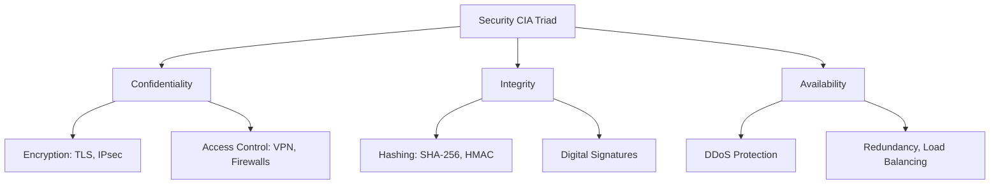
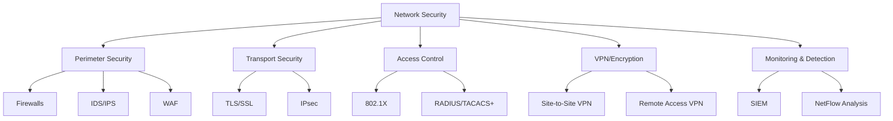
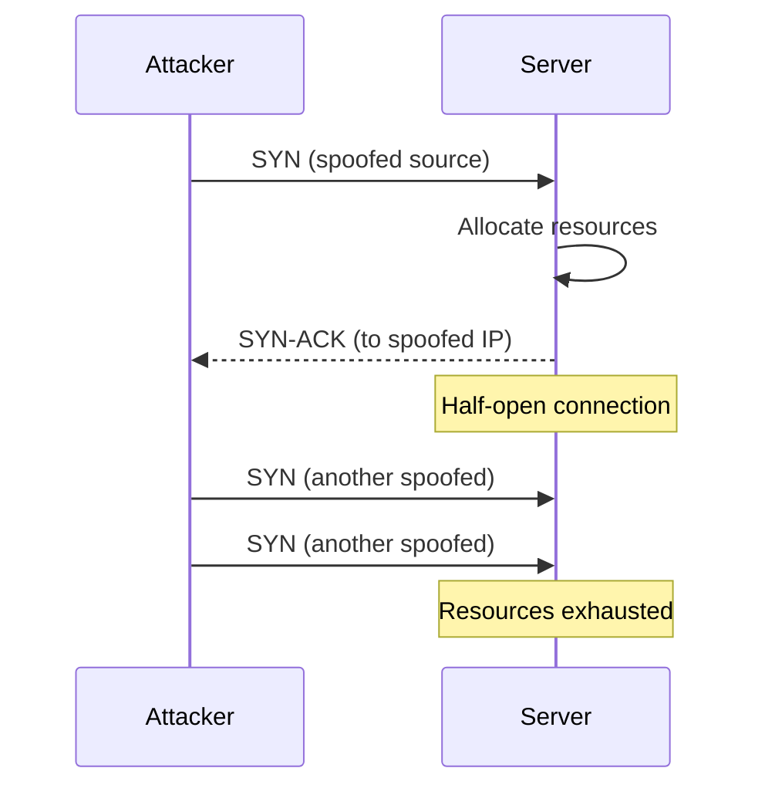
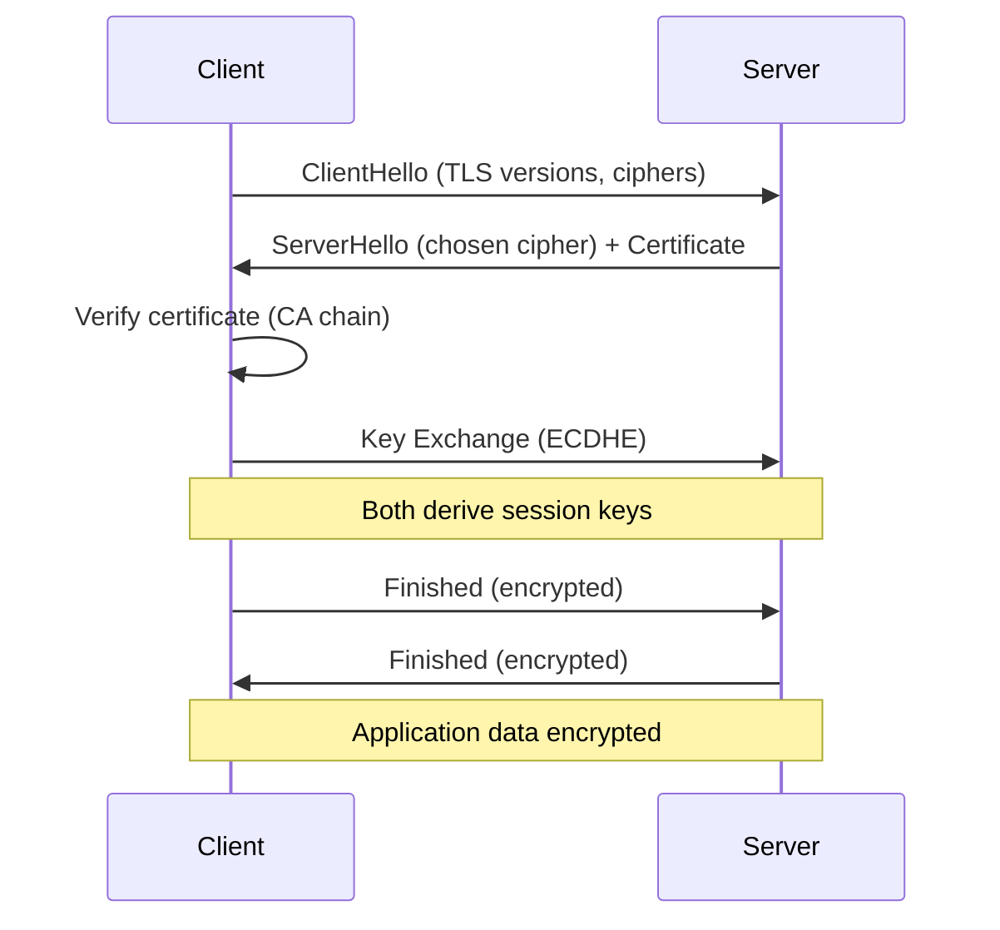
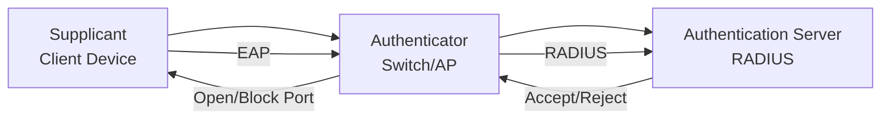

# Network Security

Network security encompasses policies, practices, and technologies designed to protect network infrastructure, data in transit, and connected systems from unauthorized access, misuse, and attacks. It operates at every layer of the network stack — from physical security of cables to application-layer encryption.

## Overview

Security is built on three core principles (the **CIA Triad**):



| Principle | Definition | Mechanism |
|-----------|------------|-----------|
| **Confidentiality** | Only authorized parties read data | Encryption, access control |
| **Integrity** | Data hasn't been tampered with | Hashing, MAC, digital signatures |
| **Availability** | Systems are accessible when needed | DDoS mitigation, redundancy |
| **Authentication** | Verifying identity | Passwords, certificates, MFA |
| **Authorization** | Verifying permissions | ACLs, RBAC |
| **Non-repudiation** | Sender can't deny sending | Digital signatures, audit logs |

## Security Layers



## Threat Categories

| Category | Examples | Impact | Mitigation |
|----------|----------|--------|------------|
| **Eavesdropping** | Packet sniffing, MITM | Data theft | Encryption (TLS/IPsec) |
| **Spoofing** | IP/MAC spoofing | Impersonation | Authentication, ingress filtering |
| **Denial of Service** | SYN flood, DDoS | Service outage | Rate limiting, firewalls, CDN |
| **Man-in-the-Middle** | ARP poisoning, DNS hijacking | Data interception | TLS, certificate pinning |
| **Unauthorized Access** | Brute force, credential stuffing | System compromise | Firewalls, MFA, VPN |
| **Replay Attacks** | Captured packets retransmitted | Session hijacking | Nonces, timestamps, session tokens |
| **Injection** | SQL injection, command injection | Code execution | Input validation, WAF |
| **Social Engineering** | Phishing, pretexting | Credential theft | Training, email filtering |

## Common Attacks — Deep Dive

### SYN Flood (DoS)

Attack sends many SYN packets without completing the TCP handshake, exhausting server resources.



**Mitigations**: SYN cookies, rate limiting, firewalls, SYN proxy.

### ARP Poisoning (MITM)

Attacker sends fake ARP replies to associate their MAC with another host's IP.

**Scenario**: Attacker tells the router "I am 192.168.1.5" and tells the victim "I am the gateway." All traffic flows through the attacker.

**Mitigations**: Dynamic ARP Inspection (DAI), static ARP entries, 802.1X.

### DNS Spoofing

Attacker corrupts DNS cache to redirect traffic to malicious servers.

**Mitigations**: DNSSEC, DNS over HTTPS (DoH), DNS over TLS (DoT).

### DDoS (Distributed Denial of Service)

Multiple compromised systems attack simultaneously.

| Type | Layer | Example | Volume |
|------|-------|---------|--------|
| **Volumetric** | L3/L4 | UDP flood, amplification | 100+ Gbps |
| **Protocol** | L3/L4 | SYN flood, Ping of Death | Moderate |
| **Application** | L7 | HTTP flood, Slowloris | Low volume, hard to detect |

**Mitigations**: CDN (Cloudflare, Akamai), BGP Flowspec, scrubbing centers, anycast.

### Man-in-the-Middle (MITM)

Attacker intercepts communication between two parties.

| Attack | Layer | Technique |
|--------|-------|-----------|
| ARP Poisoning | L2 | Fake ARP replies |
| DNS Spoofing | L7 | Corrupt DNS responses |
| SSL Stripping | L7 | Downgrade HTTPS to HTTP |
| Rogue AP | L2 | Fake WiFi access point |

**Mitigations**: TLS (verify certificates), certificate pinning, HSTS, VPN.

---

## Defense Mechanisms

### Firewalls

| Type | Layer | What It Inspects | Examples |
|------|-------|------------------|----------|
| **Packet Filter** | L3/L4 | IP, port, protocol | iptables, ACLs |
| **Stateful** | L3/L4 | Connection state | iptables with conntrack |
| **Application (L7)** | L7 | HTTP content, URLs | ModSecurity, WAF |
| **Next-Gen (NGFW)** | L3-L7 | Deep packet inspection | Palo Alto, Fortinet |

**Firewall Rules Example (iptables)**:

```bash
# Allow established connections
iptables -A INPUT -m state --state ESTABLISHED,RELATED -j ACCEPT

# Allow SSH from trusted network
iptables -A INPUT -p tcp --dport 22 -s 10.0.0.0/8 -j ACCEPT

# Drop everything else
iptables -A INPUT -j DROP
```

### Intrusion Detection/Prevention (IDS/IPS)

| Type | Placement | Action | Examples |
|------|-----------|--------|----------|
| **IDS** | Passive (mirror port) | Alert only | Snort, Suricata |
| **IPS** | Inline | Block + Alert | Snort (inline), Suricata |

**Detection Methods**:
- **Signature-based**: Match known attack patterns (fast, no false positives for known attacks)
- **Anomaly-based**: Detect deviations from normal behavior (catches unknown attacks, more false positives)

### VPN (Virtual Private Network)

| Type | Use Case | Protocol |
|------|----------|----------|
| **Site-to-Site** | Connect office networks | IPsec |
| **Remote Access** | Employee working from home | OpenVPN, WireGuard, IPsec |
| **Client-to-Site** | Individual device to network | SSL VPN, WireGuard |

**IPsec Modes**:
- **Transport**: Encrypts payload only (host-to-host)
- **Tunnel**: Encrypts entire original packet (site-to-site)

### TLS (Transport Layer Security)



**TLS 1.3 improvements over 1.2**:
- 1-RTT handshake (vs 2-RTT)
- Removed weak ciphers (RC4, 3DES, RSA key exchange)
- 0-RTT resumption
- Forward secrecy by default (ECDHE only)

### 802.1X (Network Access Control)

Port-based network access control. Devices must authenticate before gaining network access.



### Zero Trust Architecture

"Never trust, always verify." Every request is authenticated and authorized regardless of network location.

| Principle | Implementation |
|-----------|---------------|
| Verify explicitly | Authenticate every request (identity, device, location) |
| Least privilege | Minimal access, just-in-time (JIT) |
| Assume breach | Microsegmentation, encryption everywhere |

---

## Security Protocols Summary

| Protocol | Layer | Purpose | Key Feature |
|----------|-------|---------|-------------|
| **TLS 1.3** | L5-L7 | Transport encryption | 1-RTT, forward secrecy |
| **IPsec** | L3 | Network-layer VPN | AH (integrity) + ESP (encryption) |
| **HTTPS** | L7 | Secure HTTP | TLS + HTTP |
| **SSH** | L7 | Secure shell | Public key auth, tunneling |
| **DNSSEC** | L7 | DNS integrity | Digital signatures on DNS records |
| **WPA3** | L2 | WiFi security | SAE handshake, 192-bit encryption |
| **MACsec** | L2 | Ethernet encryption | 802.1AE, hop-by-hop |

---

## Interview Questions

1. **Q: What is defense in depth?**
   A: Multiple layers of security controls. If one fails, others provide protection. Example: firewall (perimeter) + TLS (transport) + VPN (remote access) + MFA (authentication) + IDS (monitoring) + WAF (application). No single point of failure.

2. **Q: What's the difference between IDS and IPS?**
   A: IDS (Intrusion Detection System) is passive — monitors traffic and generates alerts but doesn't block. IPS (Intrusion Prevention System) is inline — actively blocks malicious traffic. IDS has zero false-positive impact on traffic; IPS can block legitimate traffic if misconfigured.

3. **Q: Explain the TLS handshake.**
   A: (1) Client sends supported ciphers. (2) Server picks cipher and sends certificate. (3) Client verifies certificate against CA. (4) Key exchange (ECDHE in TLS 1.3). (5) Both derive session keys. (6) Encrypted communication begins. TLS 1.3 does this in 1 RTT.

4. **Q: What is forward secrecy and why does it matter?**
   A: If a server's private key is compromised, past sessions remain secure because each session uses ephemeral keys (ECDHE). Without forward secrecy (RSA key exchange), an attacker recording traffic could decrypt all past sessions after stealing the private key. TLS 1.3 requires forward secrecy.

5. **Q: How does a SYN flood attack work and how do you mitigate it?**
   A: Attacker sends many SYN packets (often with spoofed IPs) without completing the handshake. Server allocates resources for each half-open connection until exhausted. Mitigation: SYN cookies (don't allocate until handshake completes), rate limiting, SYN proxy (firewall completes handshake on server's behalf).

6. **Q: What is Zero Trust?**
   A: Security model that assumes no implicit trust based on network location. Every request must be authenticated, authorized, and encrypted. Key principles: verify explicitly, least privilege, assume breach. Replaces the traditional "trust internal network" perimeter model.

7. **Q: What is ARP poisoning and how do you prevent it?**
   A: Attacker sends fake ARP replies to associate their MAC address with another host's IP (e.g., the gateway). All traffic between victim and gateway flows through the attacker. Prevention: Dynamic ARP Inspection (DAI) on switches, static ARP entries for critical hosts, 802.1X authentication.

8. **Q: What's the difference between TLS and IPsec?**
   A: TLS operates at L5-L7 (application/transport), primarily for HTTPS, and secures application traffic. IPsec operates at L3 (network), encrypting all IP packets, and is used for VPNs. TLS is end-to-end (application to application); IPsec is typically gateway-to-gateway or host-to-network.

## Summary

Network security is multi-layered, applying controls at every level of the stack. The CIA triad (confidentiality, integrity, availability) guides security design. Common attacks include eavesdropping, spoofing, DoS, and MITM — each with specific mitigations. Key technologies include firewalls, IDS/IPS, TLS, IPsec, VPNs, and 802.1X. Modern approaches like Zero Trust assume breach and verify every request.

## Cross-References

- [TLS](tls.md)
- [SSL](ssl.md)
- [Firewalls](firewalls.md)
- [VPN](vpn.md)
- [IPsec](ipsec.md)
- [Wireless Security](../wireless/wifi.md)
- [Cryptography](./tls.md)

## References

- [RFC 8446 — TLS 1.3](https://datatracker.ietf.org/doc/html/rfc8446)
- [RFC 4301 — IPsec Architecture](https://datatracker.ietf.org/doc/html/rfc4301)
- [NIST SP 800-207 — Zero Trust Architecture](https://csrc.nist.gov/publications/detail/sp/800-207/final)
- [OWASP Top 10](https://owasp.org/www-project-top-ten/)
- Kurose & Ross, *Computer Networking: A Top-Down Approach*, Chapter 8: Security
- [Cloudflare Learning Center — DDoS](https://www.cloudflare.com/learning/ddos/what-is-a-ddos-attack/)
- [Cisco — What is Network Security](https://www.cisco.com/c/en/us/products/security/what-is-network-security.html)
