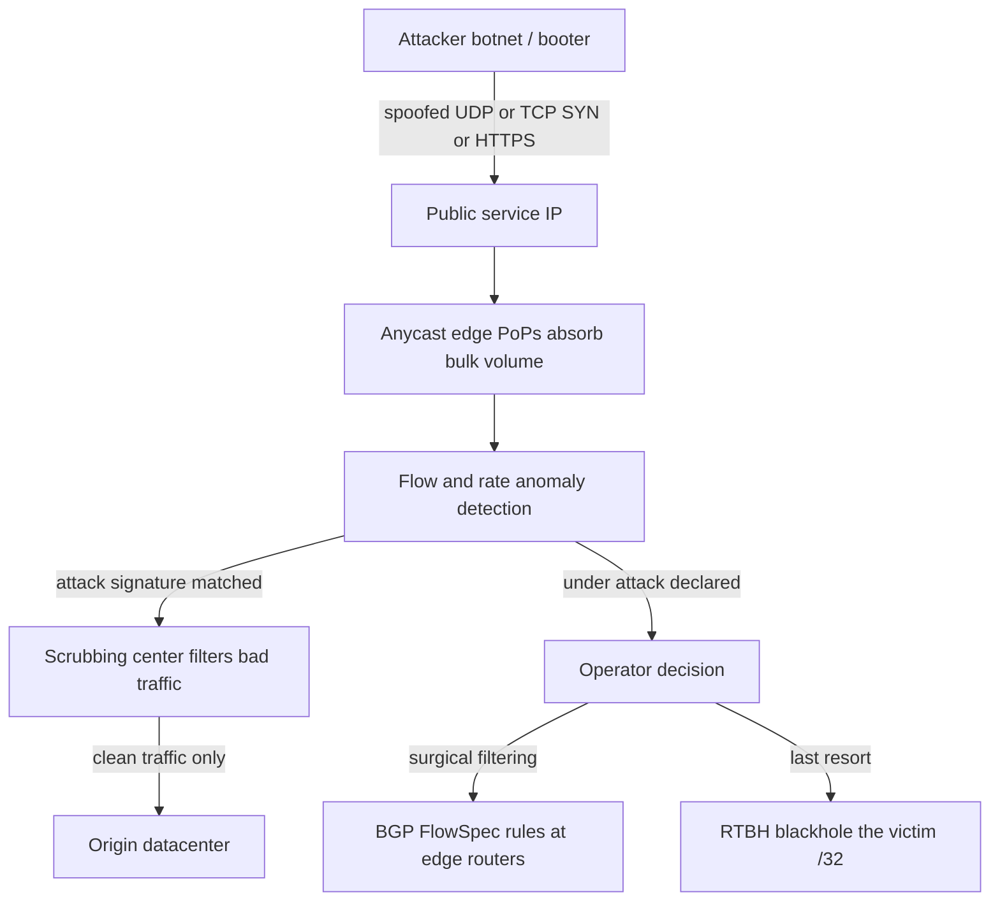
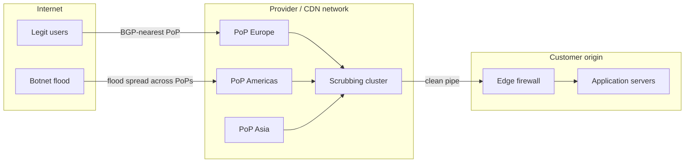

# DDoS Attacks and Mitigation

## Overview

A Distributed Denial-of-Service (DDoS) attack exhausts a target's finite resources — link bandwidth, connection state, or application CPU — by sending traffic whose cost to the defender vastly exceeds its cost to the attacker. The asymmetry is the whole game: a single memcached reflection packet costing the attacker ~60 bytes can force ~51,000x that volume on the victim. Interviews at CDN, hosting, and infrastructure companies probe whether you can classify an attack from symptoms (packets/sec vs requests/sec), pick the right mitigation layer, and reason about the cost trade-offs of always-on defense.

## Attack Taxonomy

Every DDoS fits one of three layers, and the layer determines which resource saturates first and therefore which mitigation applies.

| Class | Examples | Exhausted resource | Signature symptom |
|---|---|---|---|
| **Volumetric** | UDP amplification/reflection, memcached, DNS ANY, NTP monlist, ICMP floods | Link bandwidth (Gbps) | Huge packet rates, ingress at line rate, drops at the router |
| **Protocol** | SYN flood, ACK flood, Slowloris, RUDY, Ping of Death, fragment floods | Connection tables, per-socket memory, worker slots | TCP backlog full, high half-open count, threads held open |
| **Application** | HTTP GET/POST floods, cache-bypass floods, Slow Read, API abuse, Regex DoS | CPU per request, DB connections, origin egress | High origin load with low attacker bandwidth, cache-hit ratio collapse |

The classes stack: a real incident often pairs a volumetric filler (to saturate the link and blind monitoring) with a targeted application flood (to finish off the origin). Defenses are therefore layered, and a mitigation that only addresses one layer shifts the bottleneck rather than stopping the attack.

### Botnet Anatomy and Economics

The three classes also differ in *who* attacks. Volumetric floods historically came from IoT botnets (Mirai and its descendants infect cameras and routers with default credentials) and rented booter services; protocol attacks come from the same botnets using raw sockets; application floods increasingly come from compromised credentials, residential proxies, and headless browser farms — infrastructure that looks like real users because it largely is. This evolution explains the industry shift from IP-count-based defenses to per-session behavioral scoring: a million distinct residential IPs each sending 100 req/s cannot be blocked by IP reputation alone. The economic asymmetry cuts both ways — the attacker's marginal cost per request is tiny, but so is their tolerance for friction; a proof-of-work challenge that adds 50 ms of CPU per request multiplies their infrastructure cost by orders of magnitude without touching your origin at all.

### Amplification and Reflection

Volumetric attacks get leverage from **reflection** (the victim's address is spoofed as the source, so third-party servers respond to the victim) combined with **amplification** (the response is much larger than the request). Any UDP protocol that answers a small request with a large reply is a weapon once source-IP spoofing is possible.

| Protocol | Request size | Response size | Amplification factor |
|---|---|---|---|
| Memcached (UDP) | ~15 B `gets` | up to ~750 KB | **~10,000–51,000x** |
| NTP `monlist` | ~234 B | up to ~130 KB | ~556x |
| Chargen | 1 B | ~512 B | ~358x |
| CLDAP | small bind | large searchResult | ~56x |
| DNS (ANY query) | ~30–60 B | up to ~3,000 B | ~28–54x |
| SSDP | ~100 B | ~3,000 B | ~30x |
| Portmapper | small `DUMP` | large reply | ~28x |
| SNMPv2 bulk | ~30 B | ~200 B | ~6x |

The numbers come from measured surveys (US-CERT Alert TA14-017A, *UDP-Based Amplification Attacks*; Cloudflare's amplification measurement work, blog.cloudflare.com). Memcached is the extreme case because a single UDP `gets` can dump an entire multi-megabyte cache, and the protocol was never designed for public exposure. The structural fix is **BCP 38 / RFC 2827 ingress filtering** — ISPs dropping spoofed-source packets at the edge — plus disabling UDP listeners on infrastructure services facing the internet.

### The Spoofing Ecosystem

None of the reflection table works without source-IP spoofing, so the health of that defense matters more than any single protocol fix. BCP 38 is deployed unevenly: large consumer ISPs filter at the edge, but hosting providers, cloud tenants, and university networks are recurring sources of spoofed packets. The CAIDA Spoofer project (spoofer.caida.org) continuously measures which networks still forward spoofed traffic and publishes the results — a useful interview reference for "how big is the spoofing problem?" On top of spoofable networks sits a commercial abuse layer: **booters/stressers** rent the amplification infrastructure for a few dollars an hour, which collapses the barrier to entry — the 1.35 Tbps GitHub attack did not need a nation-state, just a free memcached scanner and a spoofing-friendly network. Defenders should therefore assume amplification capability exists and design edge capacity for the response size of every UDP service they operate, not for the request size.

### Protocol Attacks: SYN Flood and Slowloris

A **SYN flood** sends TCP SYNs (often with spoofed sources) and never completes the handshake; the server's listen backlog fills with half-open connections, and legitimate SYNs get dropped. Linux mitigations are covered in detail in [SYN Cookies](../tcp/syn-cookies.md): the kernel encodes a mini-connection state into the SYN-ACK's sequence number and only allocates a socket after seeing a valid final ACK. RFC 4987 catalogues the mitigations (backlog tuning, SYN-ACK retries reduction, SYN proxy at the load balancer).

**Slowloris** is the mirror image: the attacker completes handshakes but then dribbles incomplete HTTP headers one byte at a time, holding the server's worker slots open for minutes with negligible bandwidth. A handful of Slowloris clients can pin an Apache prefork server's entire process pool. Mitigations are structural: per-IP connection/request limits, aggressive header timeouts, event-driven servers (nginx/Envoy use one epoll loop per core instead of a thread per connection), and terminating HTTP at a reverse proxy or CDN so the origin never talks to raw clients.

### Application-Layer Attacks: HTTP Flood and Cache Bypass

Application floods use fully valid TCP + TLS connections and realistic requests, so L3/L4 defenses see nothing abnormal. Two variants matter:

- **Straight HTTP flood**: botnets of real browsers or headless clients issue expensive requests (search, report generation, uncached queries). The botnet's aggregate bandwidth may be trivial — the damage is origin CPU and database load.
- **Cache-bypass flood**: a CDN's protection is its cache; the attacker studies your URLs and requests only the ones that miss (randomized query strings, unique cache-busting parameters, deep pagination). Even a 99% cache-hit CDN forwards 1% of 100 M requests/sec — 1 M requests/sec of origin load.

A modern sub-case worth naming is **HTTP/2 Rapid Reset (CVE-2023-44487, October 2023)**: the client opens streams and cancels them (`RST_STREAM`) immediately, at rates where the server's stream state churn exceeds what its concurrency cap was designed for. Because each reset is individually valid HTTP/2, the attack converts tiny client effort into unbounded server work — Google reported a peak of ~398 million requests/second and Cloudflare ~201 million. The mitigations were protocol-level (server-side limits on stream creation and reset churn, queued SETTINGS enforcement, HTTP/2 library patches) plus the usual edge rate limiting — a reminder that application-layer DoS is often a *state-machine* bug, not a bandwidth problem.

Detection at this layer is statistical: per-URL and per-IP request rates, session-behavior scores, and TLS-level fingerprints (JA3/JA3S hashes of ClientHello parameters) that separate real browser stacks from bot frameworks.

## Detection

Detection runs on two data planes with different cost/precision trade-offs — and its output feeds directly into the mitigation selection, because detecting *what kind* of attack you have decides *where* it can be fought. Both planes need to answer one question per window: which resource is being pushed (bandwidth, state, or CPU), and by which keys?

- **Flow sampling** (NetFlow v9/IPFIX, sFlow): routers export per-flow records or 1-in-N packet samples. Cheap, ubiquitous, and good for volumetric attacks (which are obvious even in sampled data), but useless for sparse application attacks — a 1:1000 sample of a 50 req/s flood is silence.
- **Rate anomaly detection**: full packet metadata at the edge (sFlow counters, CDN logs) aggregated per key — IP, ASN, URL, cookie, TLS fingerprint.

The standard statistical tool is an **EWMA baseline**. Maintain a smoothed per-key rate and alert on deviation:

\\( s_t = \\alpha x_t + (1 - \\alpha) s_{t-1} \\)

with control limits \\( s_t \\pm k \\sigma_{\\mathrm{EWMA}} \\), where \\( \\sigma_{\\mathrm{EWMA}} = \\sigma_x \\sqrt{\\frac{\\alpha}{2 - \\alpha}} \\). A small \\( \\alpha \\) (0.05–0.2) makes the baseline slow-moving and sensitive to sustained shifts — exactly what a ramping attack looks like — while single spikes (flash crowds, product launches) stay within limits. Practical detection combines: SYN/SYN-ACK ratio (a value above ~3:1 indicates spoofing or a SYN flood), per-ASN request growth, new-connection churn, and cache-hit-ratio collapse. Alerting on the *ratio of derived signals* rather than raw volume is what separates detection from noise; false positives cost real money because every mitigation in the next section also drops or delays legitimate users.

Sampling choice matters as much as the statistics: 1:1 flow capture at 100 Gbps needs multiple terabytes of RAM per hour, so real deployments sample (NetFlow at 1:100 to 1:10,000) or aggregate at the switch (sFlow counters). The operational rule of thumb — volumetric attacks survive 1:1,000 sampling because they run orders of magnitude over baseline; application floods need full telemetry from CDN logs or edge proxies, where request metadata is already structured and cheap to aggregate per key.

One more practical note: detection signals decay. Flow records summarize, samplers drop, and alert thresholds configured for last year's traffic silently miss this year's attack — which is why mature teams replay real captured incidents against their detection stack periodically, the same way they rehearse the mitigation playbook below.

## The Mitigation Stack

No single mechanism covers all three classes; production defenses stack them, cheapest-first.

### Absorption: Anycast and CDN Offload

Anycast announces the **same IP prefix from many PoPs**; BGP delivers each packet to the network's nearest announcement. A volumetric attack is automatically split across every PoP — 10 Tbps arriving at one site becomes 10 Gbps at each of 1,000 sites, which each absorb without breaking a sweat. This is how anycast DNS providers and CDNs survive record attacks; the mechanics of announcement, health checking, and failover are covered in [Anycast and Geo-Aware Routing](../cdn/anycast-and-geo-routing.md). DNS itself is the canonical worked example: recursive resolvers are anycast by design, both because they must survive floods and because proximity wins latency — which is why DNS is simultaneously the most common reflection *vector* and the service most likely to be defended by anycast absorption. CDN offload additionally shrinks the attack surface: static assets are served from edge caches (never touching the origin), and HTTP/2/3 multiplexing means the origin maintains a small pool of long-lived connections instead of millions of client TCP sessions. The catch: anycast spreads but does not *filter* — a 10 Tbps attack still delivers 10 Tbps in aggregate, so absorption must be combined with per-PoP scrubbing. See also [L4 vs L7 Load Balancing](../load-balancing/l4-vs-l7.md) for why the load-balancer layer is the natural place to shed protocol attacks before they reach stateful tiers.

### Scrubbing Centers

A **scrubbing center** is a purpose-built cluster (NetScout/Arbor, Akamai Prolexic, Radware) with terabit-scale packet processing that receives a diverted copy of traffic via BGP, classifies it, and re-injects only clean traffic. Detection uses rate profiles, protocol validation (is this really a DNS response?), and per-flow reputation. Traffic is diverted on-demand by announcing a more-specific prefix toward the scrubbing path (BGP diversion) or always-on for critical services. On-demand costs less (per-Gbps-per-hour when engaged); always-on adds latency — every packet detours through the scrubber — which is why latency-sensitive workloads (exchanges, gaming) insist on always-on *within* the serving path rather than diversion. Capacity-wise, providers size scrubbing in terabits and publish their absorption records as marketing — but a customer's real guarantee is the *contract* (scrubbing capacity reserved, response-time SLA), not the vendor's peak number.

### BGP Blackholing (RTBH) and FlowSpec

When an attack overwhelms even the provider's edge, the blunt tool is **Remotely Triggered Black Hole (RTBH)** filtering: the customer announces the victim /32 tagged with the well-known BLACKHOLE community (RFC 7999 defines `0:666`); the provider re-announces it internally with next-hop pointing to a discard interface. Every router in the provider drops packets to that address — the attack *and* the service go dark, but the rest of the provider stays up. RTBH is destination-granular and all-or-nothing.

**BGP FlowSpec (RFC 8955)** is the surgical version: a flow-spec NLRI distributes match rules (prefix, protocol, port, packet length, fragment flags, TCP flags, DSCP) plus actions (rate-limit, drop, redirect) across the network. A FlowSpec rule can say "drop UDP from A to B on port 11211" while legitimate traffic continues flowing. ExaBGP ([github.com/Exa-Networks/exabgp](https://github.com/Exa-Networks/exabgp)) is the standard tool for scripting route/flow-spec injection from an orchestrator. Trade-off: FlowSpec requires every participating router to program a match/action TCAM entry — slower to propagate, limited rule count, and behavior varies by vendor — while RTBH is universally supported and instant.

| Mechanism | Layer | Granularity | Cost / trade-off |
|---|---|---|---|
| Anycast absorption | L3/L4 | Global | Provider capacity; routing flux during diversion |
| Scrubbing center | L3–L7 | Per-service | Per-Gbps cost; added latency if always-on |
| RTBH blackhole | L3 | /32 destination | Drops legitimate traffic too; last resort |
| FlowSpec | L3/L4 | Per-flow | Router TCAM limits; slower propagation |
| SYN cookies | L4 | Per-socket | Disables some TCP options; see [SYN Cookies](../tcp/syn-cookies.md) |
| Rate limiting / challenges | L7 | Per-IP/session | False positives; CAPTCHA friction |
| CDN cache + offload | L7 | Per-object | Cache-bypass floods defeat it |

### Rate Limiting, Challenges, and Bot Fingerprinting

Application-layer mitigation shifts from filtering packets to **separating humans from bots**:

- **Rate limiting** per key (IP, session, API token) with token-bucket or sliding-window algorithms — implementation patterns in the repo's rate-limiting page ([Rate Limiting Pattern](../../backend/patterns/rate-limiting-pattern.md)).
- **JS challenge / challenge-of-trust**: the edge serves a small JavaScript puzzle or proof-of-work; a real browser solves it silently and earns a signed cookie. Headless HTTP clients fail it. Proof-of-work (as in the Apple Private Access/attester model or Cloudflare's managed challenge) makes mass requests cost real CPU on the attacker's side.
- **CAPTCHA** is the human-in-the-loop version — effective but hostile to accessibility and API traffic.
- **Bot fingerprints**: JA3/JA3S hash the TLS ClientHello (version, cipher order, extensions, curves); HTTP/2 settings-frame fingerprints do the same at the protocol layer; ML classifiers combine hundreds of weak signals (header order, timing, mouse telemetry). A botnet built on one Go HTTP client library is one JA3 hash — fingerprinting collapses a million IPs into a single blockable signature.

These run *after* the connection is established, so they protect the origin but not the link — which is why L7 defenses only matter once volumetric and protocol layers are absorbed upstream.

### In-Kernel Offload

For self-hosted targets, the Linux dataplane can absorb floods without a CDN: XDP programs drop malicious packets at the driver with a single pass before skbuff allocation (measured in tens of millions of packets/sec per core) — see [XDP](../../linux/kernel/networking/xdp.md). This is the technique behind several open-source DDoS shields (Cloudflare's `unimog`/`gatebot` ecosystem and countless ISP firewalls). It complements, not replaces, upstream absorption: no edge host survives a multi-terabit link flood.

## Operational Playbook: The First 15 Minutes

Real mitigation is a rehearsed procedure, and interviewers at network-infrastructure companies probe for exactly this shape of answer:

1. **0–1 min — classify**: volume vs requests? TCP states? Which ports/URLs dominate? Check whether legitimate traffic is still flowing (cache hit ratio, p99 latency per endpoint).
2. **0–2 min — communicate**: page the on-call, open a war-room channel, notify the upstream provider/CDN with the victim prefix and attack profile — provider action is on *their* clock, and the clock started when the attack did.
3. **1–5 min — shed at the edge**: enable challenge/rate-limit modes, tighten per-IP limits, switch WAF to stricter rulesets; for volumetric fills, pre-approved FlowSpec rules or provider scrubbing diversion are engaged from runbooks, not improvised BGP.
4. **5–10 min — verify and adjust**: confirm traffic mix shifted (drops at edge, clean origin), watch for attacker adaptation (they move from port X to URL Y), and step down filters gradually after attack ends — the quiet after a flood is often the second wave or the false-positive peak.
5. **After — post-incident**: write up amplification vector, close protocol holes (disable UDP listeners), update the runbook, and price the incident against always-on defense — the argument that funds next quarter's capacity.

The playbook exists because every mitigation in this page has a lead time: BGP diversion convergence, FlowSpec propagation, scrubbing-center engagement. Hours spent building the runbook are the cheapest resilience you can buy.

## Case Walk-Through: GitHub, March 2018

The best-documented modern amplification case is GitHub's incident report ([github.blog, March 2018](https://github.blog/2018-03-01-ddos-incident-report/)):

1. **Payload**: ~1,000+ memcached servers found on the internet with UDP exposed were seeded with large payloads; spoofed `gets` requests were fired with GitHub's source IP. Peak: **1.35 Tbps, 126.9 million packets/sec** — at the time the largest recorded attack.
2. **Mechanics**: memcached's amplification factor of up to **51,000x** means roughly 30 MB/s of attacker outbound traffic produced the full 1.35 Tbps. No botnet bandwidth was needed — reflection does the work.
3. **Impact**: GitHub's edge saturated; monitoring and connectivity degraded for ~5–8 minutes.
4. **Mitigation timeline**: within ~1 minute GitHub alerted its network provider, which routed traffic through a **scrubbing service**; within ~10 minutes traffic was fully absorbed and the attack ended (the attacker stopped once amplification was demonstrated).
5. **Hardening afterwards**: GitHub blackholed inbound UDP to memcached ports at the edge; the industry-wide fix was disabling memcached UDP listeners (`-U 0`) — the US-CERT alert TA18-071A and vendor advisories turned a protocol footgun into a configuration check.

The lesson for interviews: the *cheapest* mitigation was upstream (provider scrubbing + edge ACL), because no on-premise box could ingest 1.35 Tbps; and the *durable* fix was unexposing the abused protocol. The same playbook — absorb upstream, filter at the edge, close the protocol hole — generalizes to every incident since (the 2016 OVH/Dyn Mirai botnet attacks at ~1.1–1.2 Tbps, and the October 2023 HTTP/2 Rapid Reset application flood, CVE-2023-44487, where Google reported a peak of ~398 million requests/sec). Notice also what the timeline says about detection economics: the attack was unmistakable within seconds, but *response* latency — alerting, provider engagement, diversion convergence — dominated the outage, which is why the operational playbook above matters as much as the filtering technology.

## Cost Trade-Offs

Every defense has a price on one of three axes — money, latency, or legitimate-user friction:

- **Capacity is rented, not owned.** A 10 Tbps always-on edge is only economical amortized across a CDN's customer base; a single enterprise buying dedicated scrubbing capacity pays orders of magnitude more per Gbps.
- **Always-on vs on-demand scrubbing.** Always-on adds 1–10 ms of detour latency and steady per-Gbps spend; on-demand is cheap but takes 2–10 minutes to engage (detection + BGP diversion convergence) — an eternity when the attack saturates your monitoring in the first minute.
- **Blackholing is admitting defeat.** RTBH "mitigates" by dropping the victim's revenue with the attack; it protects everyone *else* on the provider. Expect to answer "when would you blackhole your own customer?" with "when the alternative is losing the whole uplink."
- **Challenge friction.** JS/proof-of-work challenges convert attack cost into human cost — and occasionally block real users (corporate proxies, rare browsers, API clients that cannot run JS).
- **False positives.** Aggressive rate limits and fingerprint blocks are silent revenue loss; the mitigation budget must include the cost of reviewing blocked legitimate traffic.
- **Insurance is a runbook, not a box.** The highest-ROI line item in most DDoS budgets is a rehearsed incident procedure with pre-approved provider actions — capacity contracts, FlowSpec templates, and escalation contacts — because the first minutes of an attack are pure response latency.

## Interview Questions

1. **Classify an attack given: ingress at 400 Gbps, mostly UDP, sources spread over 50,000 IPs, most traffic dropped at the router.** It is volumetric reflection/amplification — UDP, massive packet rate, spoofed spread of sources, and router-level drops indicate the link is saturated before stateful devices. Mitigation is upstream absorption (anycast or provider scrubbing), not on-box filtering, because no appliance you own sees clean bandwidth. The follow-up: ask which UDP ports dominate (11211 → memcached, 123 → NTP monlist, 53 → DNS) and close the exposed listener plus enforce BCP 38 upstream.

2. **Why is memcached amplification so much worse than DNS, and what made the GitHub attack possible?** Memcached returns an entire cache slab (up to megabytes) for a ~15-byte UDP request — a ~51,000x factor vs DNS's ~28–54x — and thousands of instances were exposed with UDP enabled on public IPs. Source-IP spoofing let the attacker redirect all replies at GitHub. Three fixes: disable memcached UDP (`-U 0`), network-operator egress anti-spoofing (BCP 38), and edge ACLs on infrastructure ports; GitHub's own report documents 1.35 Tbps peak and ~10-minute scrubbing response.

3. **Compare RTBH and BGP FlowSpec — when do you use each?** RTBH announces the victim /32 with the RFC 7999 BLACKHOLE community so the provider discards everything to that destination: instant, universally supported, but kills legitimate traffic too — a last resort. FlowSpec (RFC 8955) distributes match/action rules (protocol, ports, packet length, TCP flags) so you can drop only the attack flow while the service stays up — but it consumes router TCAM, propagates more slowly, and needs vendor support. Practice: FlowSpec first for surgical filtering, RTBH when rules overflow or the provider cannot honor FlowSpec.

4. **A CDN absorbs 99% of your traffic, yet your origin falls over in an HTTP flood. What happened?** Cache-bypass flood: the attacker requests only uncached URLs (unique query strings, deep pagination, dynamic endpoints), so the CDN forwards everything. Fixes: strict cache-key normalization (strip/whitelist query parameters), stale-while-revalidate so the edge serves slightly old content during floods, per-URL and per-IP rate limits at the edge, and backpressure — the CDN shedding requests against origin health rather than queueing them.

5. **How does an EWMA baseline detect a ramping attack without alerting on a flash crowd?** The EWMA \\( s_t = \\alpha x_t + (1-\\alpha) s_{t-1} \\) tracks a slow-moving average; control limits at \\( \\pm k \\sigma_{\\mathrm{EWMA}} \\) with \\( \\sigma_{\\mathrm{EWMA}} = \\sigma_x \\sqrt{\\alpha/(2-\\alpha)} \\) scale sensitivity with \\( \\alpha \\). A flash crowd is a single-window spike that the smoothed baseline partially absorbs (small \\( \\alpha \\), e.g. 0.1), while a ramping flood crosses the upper limit persistently because each window starts from an elevated mean. Combine with signal ratios (SYN/SYN-ACK, cache-hit ratio) so volume alone does not page anyone.

6. **You run a latency-critical trading platform that cannot detour through a scrubbing center. Design the DDoS posture.** Always-on defense in the serving path: dedicated anycast-capable upstreams with contracted DDoS capacity, provider-side ACLs on known-bad protocols and ports, FlowSpec-based surgical filtering pre-agreed with the provider (runbooks, not improvisation), strict per-IP rate limits and SYN proxies at your own edge, and TLS-layer bot fingerprinting for the L7 tier. Accept that ultra-low latency forbids the cheapest tools; the budget goes to over-provisioned, always-on capacity instead of on-demand scrubbing.

## Key Takeaways

- DDoS classes map to resources: volumetric exhausts bandwidth, protocol exhausts connection state, application exhausts CPU per request — identify the layer first, then the mitigation.
- Amplification turns small attacker traffic into victim-scale floods: memcached ~51,000x, NTP ~556x, DNS ~28–54x; spoofed sources are the enabler, BCP 38 ingress filtering the structural fix.
- Anycast spreads a flood across PoPs, scrubbing centers filter it, RTBH (RFC 7999 community `0:666`) sacrifices the victim to save the network, and FlowSpec (RFC 8955) filters surgically at router TCAM cost.
- SYN floods are answered with SYN cookies and proxies (Linux details in the dedicated page); Slowloris is answered architecturally with event-driven proxies and per-IP limits, not with more bandwidth.
- Application floods are statistical problems: EWMA baselines with \\( \\pm k \\sigma_{\\mathrm{EWMA}} \\) limits, per-key rate limits, JA3/HTTP/2 fingerprints, and challenge-of-trust (JS/proof-of-work) separate bots from browsers.
- Cache-bypass floods defeat CDN offload by targeting only misses; cache-key normalization and stale-while-revalidate are the edge-side answer.
- GitHub 2018 (1.35 Tbps, 126.9 Mpps) shows the canonical playbook: upstream scrubbing within minutes, edge ACLs, then permanently closing the exposed protocol.
- Every mitigation trades money (capacity), latency (always-on scrubbing), or user friction (challenges, false positives) — articulate the trade-off, not just the tool.

## References

- RFC 4732, *Internet Denial-of-Service Considerations* — <https://datatracker.ietf.org/doc/rfc4732/>
- RFC 4987, *TCP SYN Flooding Attacks and Common Mitigations* — <https://datatracker.ietf.org/doc/rfc4987/>
- RFC 2827 (BCP 38), *Network Ingress Filtering: Defeating Denial of Service Attacks which employ IP Source Address Spoofing* — <https://datatracker.ietf.org/doc/rfc2827/>
- RFC 5635, *Remote Triggered Black Hole Filtering with uRPF* — <https://datatracker.ietf.org/doc/rfc5635/>
- RFC 8955, *Dissemination of Flow Specification Rules* (obsoletes RFC 5575) — <https://datatracker.ietf.org/doc/rfc8955/>
- RFC 7999, *BLACKHOLE Community* — <https://datatracker.ietf.org/doc/rfc7999/>
- D. J. Bernstein, *SYN Cookies* — <https://cr.yp.to/syncookies.html>
- GitHub Engineering, *DDoS Incident Report* (March 2018) — <https://github.blog/2018-03-01-ddos-incident-report/>
- Cloudflare Learning Center, *What is a DDoS attack?* and amplification-factor tables — <https://www.cloudflare.com/learning/ddos/what-is-a-ddos-attack/>
- Cloudflare Developer Docs (DDoS protections, challenges, rate limiting) — <https://developers.cloudflare.com/>
- Akamai TechDocs (Prolexic and edge security) — <https://techdocs.akamai.com/>
- US-CERT Alert TA14-017A, *UDP-Based Amplification Attacks* (title + alert ID; CISA site reorganized since publication)
- US-CERT Alert TA18-071A, *UDP-Based Amplification Attacks: Memcached* (title + alert ID; cited without URL)
- Cloudflare Blog, *Memcached amplification attacks* (2018, blog.cloudflare.com; cited by title)
- ExaBGP — BGP as a text/JSON API for route and FlowSpec injection — <https://github.com/Exa-Networks/exabgp>
- Salesforce Engineering, *JA3: TLS client fingerprinting* — <https://github.com/salesforce/ja3>
- CAIDA Spoofer Project — measuring source-address spoofing deployment — <https://spoofer.caida.org/>
- NetScout (Arbor) support and threat-intelligence documentation — <https://www.netscout.com/support-services>
- Radware support documentation — <https://support.radware.com/>

## Cross-References

- [TLS Deep Dive](./tls-deep-dive.md) — TLS fingerprints (JA3) and handshake behavior used for bot separation at the edge
- [SYN Cookies](../tcp/syn-cookies.md) — the Linux mechanism that defeats SYN-flood state exhaustion
- [Anycast and Geo-Aware Routing](../cdn/anycast-and-geo-routing.md) — BGP anycast mechanics behind attack absorption
- [L4 vs L7 Load Balancing](../load-balancing/l4-vs-l7.md) — where protocol attacks get shed before stateful tiers
- [Firewalls](./firewalls.md) — static filtering, the L3/L4 baseline under the dynamic DDoS stack
- [Rate Limiting Pattern](../../backend/patterns/rate-limiting-pattern.md) — token-bucket/sliding-window algorithms behind per-key limits
- [Streaming Algorithms](../../dsa/chapters/ch147-streaming-algorithms.md) — Count-Min Sketch heavy hitters: the data structure behind top-talker detection
- [XDP](../../linux/kernel/networking/xdp.md) — in-kernel packet drop at driver level for self-hosted edge defense
- [Disaster Recovery](../../cloud/disaster-recovery.md) — where DDoS response fits in the broader availability/runbook discipline
