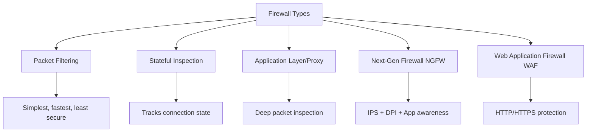
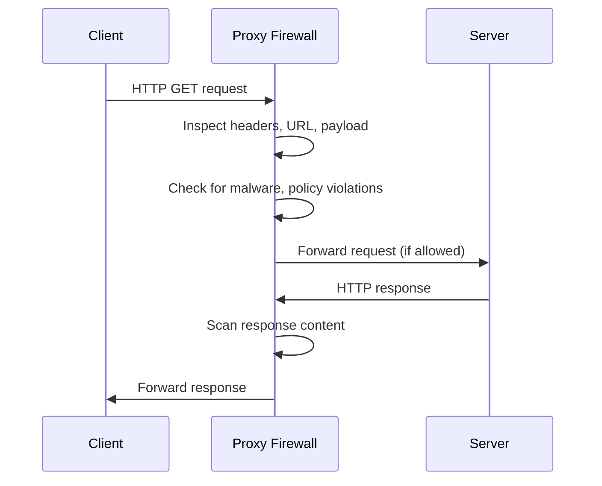
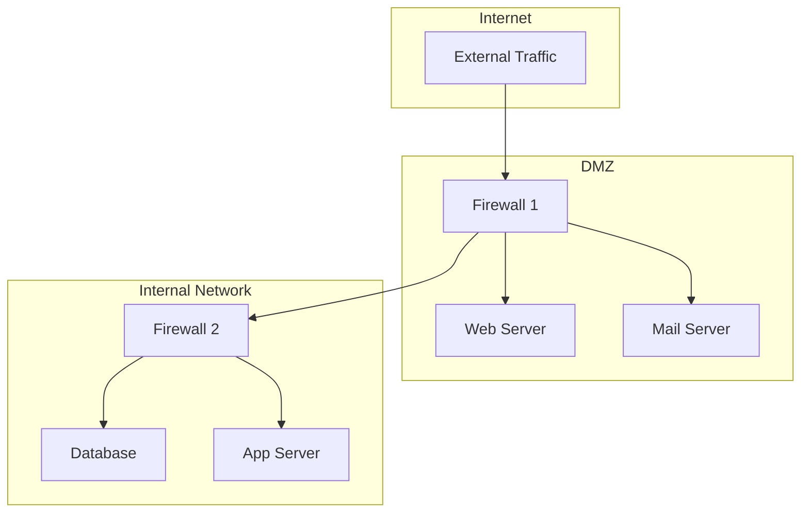

# Firewalls

## Overview

A firewall is a network security device or software that monitors and filters incoming and outgoing network traffic based on predefined security rules. It acts as a barrier between trusted internal networks and untrusted external networks (like the Internet).

## Firewall Types



## Packet Filtering Firewall

The simplest type. Examines individual packets against rules (ACLs) without context.

### Rule Structure

| Field | Example |
|-------|---------|
| Source IP | 192.168.1.0/24 |
| Destination IP | 10.0.0.0/8 |
| Source Port | Any |
| Destination Port | 80, 443 |
| Protocol | TCP |
| Action | Allow/Deny |

### Example ACL (Cisco)

```
access-list 101 permit tcp 192.168.1.0 0.0.0.255 any eq 80
access-list 101 permit tcp 192.168.1.0 0.0.0.255 any eq 443
access-list 101 deny ip any any
```

**Limitations**: No state tracking — can't distinguish legitimate response from attack. Stateless = can be tricked by crafted packets.

## Stateful Inspection Firewall

Tracks the state of active connections and makes decisions based on context.

### State Table Example

```
Connection 1: 192.168.1.5:52341 → 93.184.216.34:80 (ESTABLISHED)
Connection 2: 192.168.1.5:52342 → 8.8.8.8:53 (UDP, DNS query)
Connection 3: 10.0.0.1:12345 → 192.168.1.5:22 (NEW — allow/deny?)
```

**How it works**:
1. Outbound SYN packet → state table entry created
2. Inbound SYN-ACK → checked against state table → allowed
3. Unsolicited inbound SYN → no state entry → blocked

**Advantage**: Much more secure than packet filtering. Can track TCP state (SYN, ESTABLISHED, FIN).

## Application Layer / Proxy Firewall

Acts as an intermediary, inspecting the full application-layer content.



**Pros**: Deep inspection, content filtering, logging
**Cons**: Performance overhead, may break some protocols, requires application awareness

## Next-Generation Firewall (NGFW)

Combines traditional firewall with advanced features:

| Feature | Description |
|---------|-------------|
| **Stateful inspection** | Connection tracking |
| **Deep packet inspection (DPI)** | Examines packet payload |
| **Intrusion prevention (IPS)** | Blocks known attack patterns |
| **Application awareness** | Identifies apps regardless of port |
| **SSL/TLS inspection** | Decrypts and inspects HTTPS traffic |
| **User identity integration** | Rules based on user, not just IP |
| **Threat intelligence** | Updated feeds of known threats |

## Web Application Firewall (WAF)

Protects web applications from HTTP-specific attacks:

| Attack | WAF Protection |
|--------|---------------|
| **SQL Injection** | Detects SQL patterns in input |
| **XSS (Cross-Site Scripting)** | Filters malicious scripts |
| **CSRF** | Validates request origin |
| **DDoS** | Rate limiting, CAPTCHA |
| **Path Traversal** | Blocks directory traversal attempts |

## Firewall Deployment Models



### DMZ (Demilitarized Zone)
- Network segment between external and internal firewalls
- Hosts public-facing services (web, email, DNS)
- If compromised, attacker still can't reach internal network

## Stateless vs Stateful Firewall Rules

### Stateless (Packet Filter)
```
# Allow HTTP from anywhere to web server
ALLOW TCP * → 203.0.113.10:80

# Problem: Any packet matching this rule is allowed,
# even if it's not part of a legitimate connection
```

### Stateful
```
# Allow HTTP responses only for established connections
ALLOW TCP * → 203.0.113.10:80 IF state=NEW or ESTABLISHED
DENY TCP * → 203.0.113.10:80 IF state=INVALID
```

## Interview Questions

1. **Q: What's the difference between stateful and stateless firewalls?**
   A: Stateless firewalls (packet filters) examine each packet independently against rules. Stateful firewalls track connection state (TCP handshake, established connections) and allow return traffic automatically. Stateful is more secure but uses more resources.

2. **Q: What is a DMZ?**
   A: A Demilitarized Zone is a network segment between the external firewall and internal firewall. It hosts public-facing services. If a server in the DMZ is compromised, the internal firewall prevents lateral movement to internal networks.

3. **Q: What is deep packet inspection (DPI)?**
   A: DPI examines the payload (content) of packets, not just headers. It can identify applications, detect malware, and enforce content policies. Used by NGFWs and ISPs for traffic management.

4. **Q: How does a WAF differ from a traditional firewall?**
   A: A WAF operates at Layer 7 (HTTP/HTTPS) and protects web applications from attacks like SQL injection, XSS, and CSRF. A traditional firewall operates at Layers 3-4 and filters based on IP/port. They complement each other.

5. **Q: What is the implicit deny rule?**
   A: Most firewalls have an implicit "deny all" at the end of the rule set. If no explicit rule matches a packet, it's dropped. This is a security best practice — whitelist what you need, deny everything else.

6. **Q: How do firewalls handle TLS-encrypted traffic?**
   A: NGFWs can perform TLS interception (SSL inspection): they act as a man-in-the-middle, decrypting traffic with their own certificate, inspecting it, then re-encrypting it. This requires installing the firewall's CA certificate on client machines.

## Common Mistakes

- Confusing stateful and stateless firewalls
- Not understanding the implicit deny rule
- Forgetting that firewalls can't protect against all threats (social engineering, insider attacks)
- Not knowing what a DMZ is or why it's used
- Assuming firewalls and WAFs are the same thing

## Summary

Firewalls are the first line of network defense. Types range from simple packet filters to NGFWs with DPI, IPS, and application awareness. Stateful inspection is the modern baseline. DMZs isolate public services. WAFs protect web applications specifically.

## Cross-References

- [Security Overview](README.md)
- [TLS](tls.md) — Encrypted traffic inspection
- [VPN](vpn.md) — Often terminates at firewalls
- [IPsec](ipsec.md) — Firewall VPN support
- [Load Balancing](../load-balancing/README.md) — Often paired with firewalls

## Cross References

- [NAT](../tcp-ip/nat.md)
- [VPN](vpn.md)
- [IPsec](ipsec.md)
- [OS Security - SELinux](../../os/security/selinux.md)
