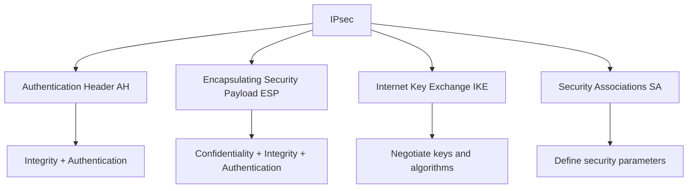
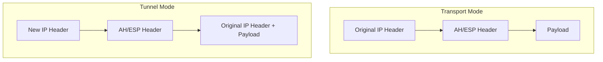
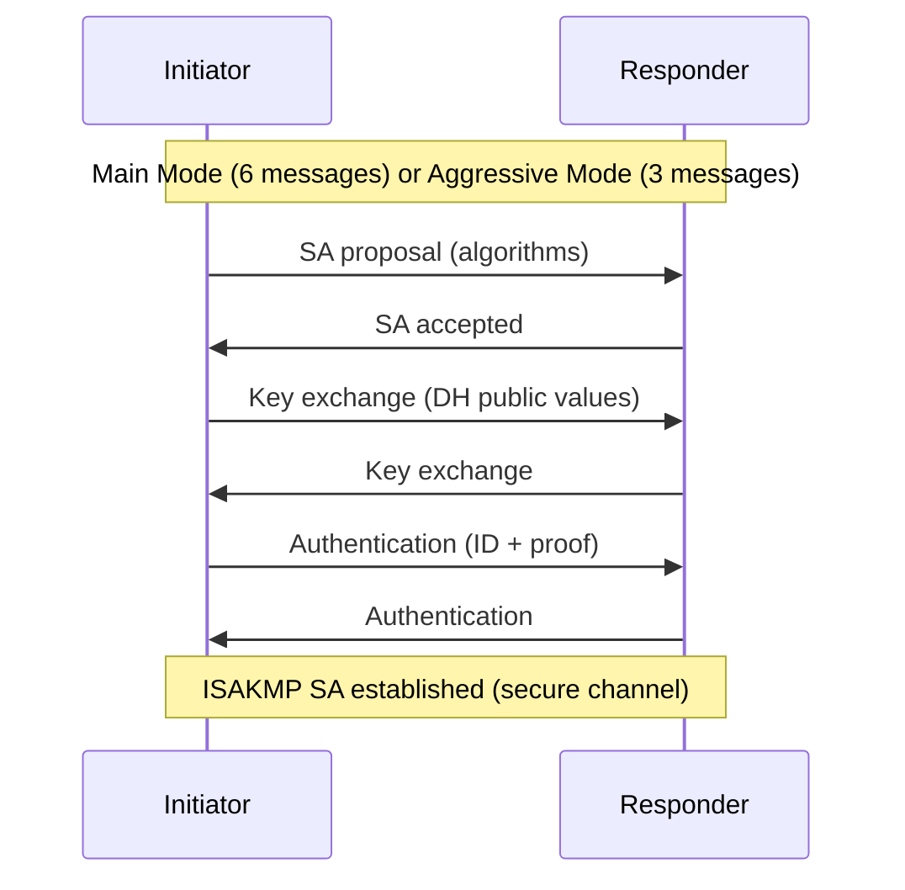
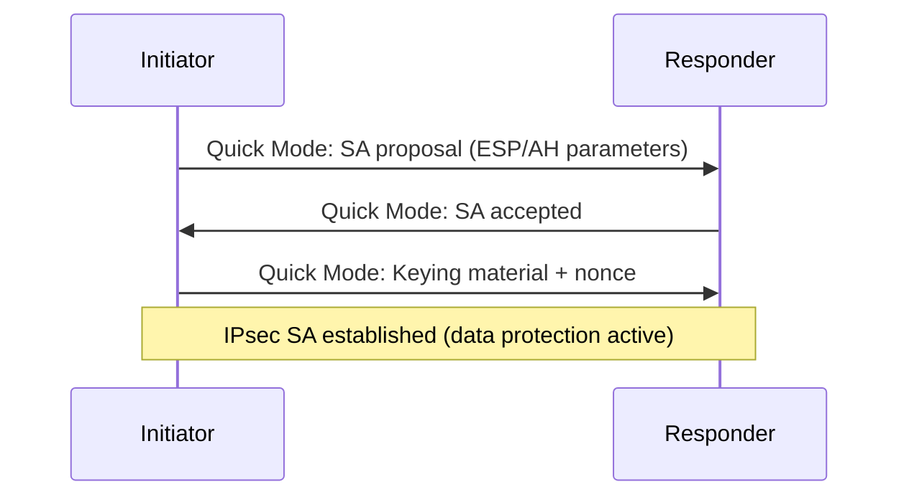
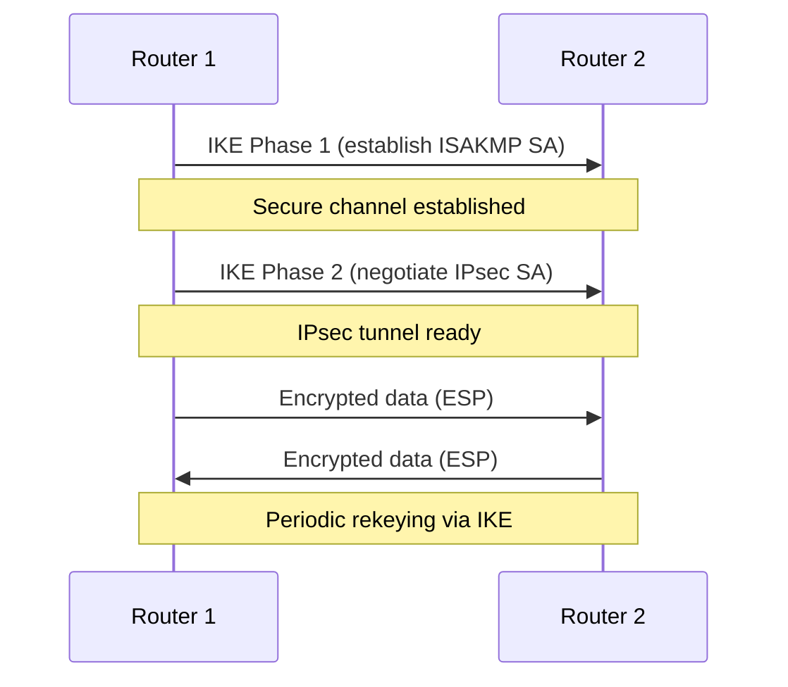

# IPsec — Internet Protocol Security

## Overview

IPsec is a protocol suite that encrypts and authenticates IP packets at the **network layer (Layer 3)**. It's the standard for site-to-site VPNs and provides security for all IP traffic without application modification.

- **Layer**: Network Layer (Layer 3)
- **RFC**: RFC 4301 (Architecture), RFC 4303 (ESP), RFC 4302 (AH)
- **Protocols**: AH (Authentication Header), ESP (Encapsulating Security Payload)
- **Modes**: Transport mode, Tunnel mode
- **Key exchange**: IKEv1 (RFC 2409), IKEv2 (RFC 7296)

## IPsec Protocol Suite



## AH vs ESP

| Feature | AH | ESP |
|---------|-----|-----|
| **Confidentiality** | No | Yes (encryption) |
| **Integrity** | Yes | Yes |
| **Authentication** | Yes | Yes |
| **NAT traversal** | Breaks (authenticates IP header) | Works (UDP encapsulation) |
| **Protocol number** | 51 | 50 |
| **Use** | Rarely used alone | Most common choice |

**Why ESP is preferred**: AH can't traverse NAT because it authenticates the IP header (which NAT modifies). ESP only authenticates the ESP header and payload.

## Transport Mode vs Tunnel Mode



| Mode | Description | Use Case |
|------|-------------|----------|
| **Transport** | Encrypts only payload; original IP header preserved | Host-to-host communication |
| **Tunnel** | Encrypts entire original packet; new IP header added | VPN (site-to-site, remote access) |

## Security Association (SA)

An SA is a one-way security agreement between two peers. It defines:

| Parameter | Description |
|-----------|-------------|
| **SPI** | Security Parameters Index (identifier) |
| **IP destination** | Peer address |
| **Protocol** | AH or ESP |
| **Encryption algorithm** | AES-256, 3DES, etc. |
| **Authentication algorithm** | HMAC-SHA256, HMAC-MD5, etc. |
| **Keying material** | Encryption/auth keys |
| **Lifetime** | Time or byte limit before rekeying |

**Note**: Each direction requires a separate SA. A bidirectional IPsec connection needs two SAs.

## IKE (Internet Key Exchange)

IKE negotiates SAs and establishes keys. It operates in two phases:

### IKEv1 Phase 1 (ISAKMP SA)

Establishes a secure, authenticated channel between peers.



### IKEv1 Phase 2 (IPsec SA)

Negotiates the actual IPsec SA for data protection.



### IKEv2 Improvements

| IKEv1 | IKEv2 |
|-------|-------|
| Main mode (6 msgs) / Aggressive (3 msgs) | 4-message exchange |
| No built-in NAT traversal | NAT-T built-in |
| No EAP authentication | Supports EAP (for remote access) |
| Complex, many vendor extensions | Simplified, standardized |
| Dead peer detection (DPD) optional | Keepalives built-in |

## IPsec Tunnel Establishment



## IPsec Configuration (Cisco)

```
! Step 1: Define IKE policy
crypto isakmp policy 10
  encryption aes 256
  hash sha256
  authentication pre-share
  group 14
  lifetime 86400

! Step 2: Define pre-shared key
crypto isakmp key MySecretKey address 203.0.113.1

! Step 3: Define IPsec transform set
crypto ipsec transform-set MYSET esp-aes 256 esp-sha256-hmac
  mode tunnel

! Step 4: Define crypto map
crypto map VPN-MAP 10 ipsec-isakmp
  set peer 203.0.113.1
  set transform-set MYSET
  match address 101

! Step 5: Apply to interface
interface GigabitEthernet0/0
  crypto map VPN-MAP
```

## IPsec and NAT Traversal (NAT-T)

**Problem**: NAT modifies IP headers. AH authenticates IP headers → breaks. ESP doesn't authenticate IP headers but NAT may change the outer IP → ESP packet becomes invalid.

**Solution**: NAT-T encapsulates ESP packets in UDP (port 4500):

```
[New IP Header][UDP:4500][ESP Header][Encrypted Payload][ESP Trailer][ESP Auth]
```

NAT-T is automatically detected during IKE negotiation.

## IPsec vs TLS

| Feature | IPsec | TLS |
|---------|-------|-----|
| **Layer** | Layer 3 | Layer 4-7 |
| **Protects** | All IP traffic | Application traffic only |
| **NAT traversal** | NAT-T (UDP 4500) | Native (port 443) |
| **Client needed** | Yes (or gateway) | Browser or client |
| **Use case** | Site-to-site VPN, network security | Web, email, application security |
| **Configuration** | Complex | Simpler |

## Interview Questions

1. **Q: What is the difference between AH and ESP?**
   A: AH provides integrity and authentication but NOT confidentiality. ESP provides all three. AH authenticates the IP header (breaks with NAT). ESP is the standard choice for IPsec VPNs.

2. **Q: What are the two IPsec modes?**
   A: Transport mode encrypts only the payload (original IP header preserved, used for host-to-host). Tunnel mode encrypts the entire original packet and adds a new IP header (used for VPNs).

3. **Q: What is a Security Association (SA)?**
   A: A one-way agreement defining how to protect traffic: encryption algorithm, authentication algorithm, keys, and lifetime. Each direction needs its own SA. SAs are identified by SPI.

4. **Q: What is IKE and what does it do?**
   A: Internet Key Exchange negotiates Security Associations and establishes cryptographic keys. Phase 1 creates a secure channel (ISAKMP SA). Phase 2 negotiates the IPsec SA for data protection.

5. **Q: Why does IPsec break with NAT?**
   A: NAT modifies IP headers. AH authenticates IP headers → integrity check fails. ESP doesn't authenticate the outer IP header, but NAT can still cause issues with checksums. NAT-T solves this by wrapping ESP in UDP.

6. **Q: What's the difference between IKEv1 and IKEv2?**
   A: IKEv2 is simpler (4-message exchange vs 6 in Main Mode), has built-in NAT-T, supports EAP authentication, has built-in keepalives, and is more standardized (fewer vendor extensions).

## Common Mistakes

- Using AH when NAT is present (use ESP instead)
- Confusing transport mode (payload only) with tunnel mode (full packet)
- Forgetting that SAs are unidirectional (need two for bidirectional traffic)
- Not understanding that IKE has two phases
- Confusing IPsec (Layer 3) with TLS (Layer 4+)

## Summary

IPsec secures IP traffic at Layer 3 using AH (integrity only) and ESP (encryption + integrity). It operates in transport mode (host-to-host) or tunnel mode (VPN). IKE negotiates keys and SAs. IKEv2 is the modern standard. NAT-T enables traversal through NAT devices.

## Cross-References

- [VPN](vpn.md) — IPsec is a primary VPN protocol
- [TLS](tls.md) — Application-layer alternative
- [Firewalls](firewalls.md) — IPsec VPN termination
- [Security Overview](README.md)
