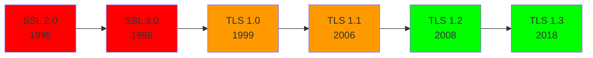

# SSL — Secure Sockets Layer

## Overview

SSL (Secure Sockets Layer) was the predecessor to TLS, developed by Netscape in the 1990s. While the term "SSL" is still commonly used colloquially, all versions of SSL are deprecated and have known vulnerabilities. Modern systems use TLS.

- **SSL 2.0**: 1995 — Broken, never use
- **SSL 3.0**: 1996 — Vulnerable to POODLE attack, deprecated (RFC 7568)
- **TLS 1.0**: 1999 — Deprecated (RFC 8996)
- **TLS 1.1**: 2006 — Deprecated (RFC 8996)
- **TLS 1.2**: 2008 — Still widely used
- **TLS 1.3**: 2018 — Current standard

## SSL Evolution



## Known SSL Vulnerabilities

| Attack | Affected Version | Description |
|--------|-----------------|-------------|
| **POODLE** | SSL 3.0 | Padding Oracle On Downgraded Legacy Encryption. Exploits CBC mode padding. |
| **BEAST** | TLS 1.0 | Browser Exploit Against SSL/TLS. Exploits CBC in TLS 1.0. |
| **DROWN** | SSL 2.0 | Decrypting RSA with Obsolete and Weakened eNcryption. |
| **FREAK** | SSL 3.0/TLS 1.0 | Forces use of export-grade RSA keys (512-bit). |
| **CRIME** | TLS compression | Exploits TLS compression to leak session cookies. |

## SSL/TLS Record Protocol

The record protocol handles fragmentation, compression (removed in TLS 1.3), encryption, and MAC:

```
┌─────────────────────────────────────┐
│  Content Type (1 byte)              │
│  Major Version (1 byte)             │
│  Minor Version (1 byte)             │
│  Length (2 bytes)                   │
├─────────────────────────────────────┤
│  Fragment (up to 16384 bytes)       │
│  (may be compressed in old TLS)     │
├─────────────────────────────────────┤
│  MAC (HMAC)                         │
│  Padding (for block ciphers)        │
└─────────────────────────────────────┘
```

In TLS 1.3, the record layer uses AEAD (Authenticated Encryption with Associated Data), combining encryption and authentication.

## Why "SSL" Persists

Despite SSL being dead, the term lives on:

- **"SSL certificates"** — Actually X.509 certificates used with TLS
- **"SSL/TLS"** — Common marketing/industry term
- **"SSL offloading"** — TLS termination at load balancers
- **OpenSSL** — Library name (supports TLS 1.3)

## Interview Questions

1. **Q: Is SSL still secure?**
   A: No. All SSL versions (2.0 and 3.0) have known vulnerabilities. SSL 3.0 is vulnerable to POODLE. Always use TLS 1.2 or 1.3.

2. **Q: What is the POODLE attack?**
   A: Padding Oracle On Downgraded Legacy Encryption. An attacker forces a downgrade to SSL 3.0, then exploits the CBC padding to decrypt bytes of the encrypted connection. Mitigation: disable SSL 3.0 entirely.

3. **Q: What's the difference between SSL certificates and TLS certificates?**
   A: There's no difference — they're the same X.509 certificates. The term "SSL certificate" is a misnomer that persists from when SSL was the standard.

4. **Q: Why was SSL 3.0 deprecated?**
   A: The POODLE attack (2014) demonstrated that SSL 3.0's CBC padding could be exploited to decrypt secure connections. Since SSL 3.0 couldn't be fixed without breaking compatibility, it was deprecated (RFC 7568).

5. **Q: What is the difference between SSL/TLS and HTTPS?**
   A: HTTPS = HTTP over TLS (or historically, over SSL). TLS provides the encryption layer; HTTP is the application protocol. You can have any application protocol over TLS (SMTPS, FTPS, LDAPS).

## Common Mistakes

- Using SSL 3.0 or TLS 1.0/1.1 in production
- Saying "SSL" when you mean "TLS" (shows outdated knowledge)
- Not knowing that "SSL certificates" are just X.509 certificates
- Confusing the SSL/TLS record protocol with the handshake protocol

## Summary

SSL is dead; TLS is the standard. All SSL versions have known vulnerabilities. The industry still uses "SSL" colloquially, but understanding that TLS 1.2+ is what's actually deployed shows current knowledge.

## Cross-References

- [TLS](tls.md) — The modern successor (this is what you should know)
- [IPsec](ipsec.md) — Network-layer encryption alternative
- [Firewalls](firewalls.md) — SSL/TLS inspection
- [VPN](vpn.md) — Often uses TLS
