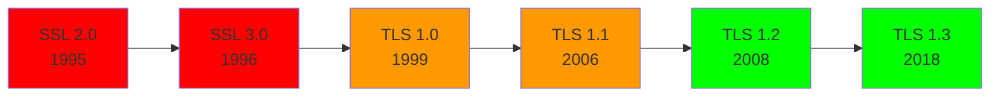
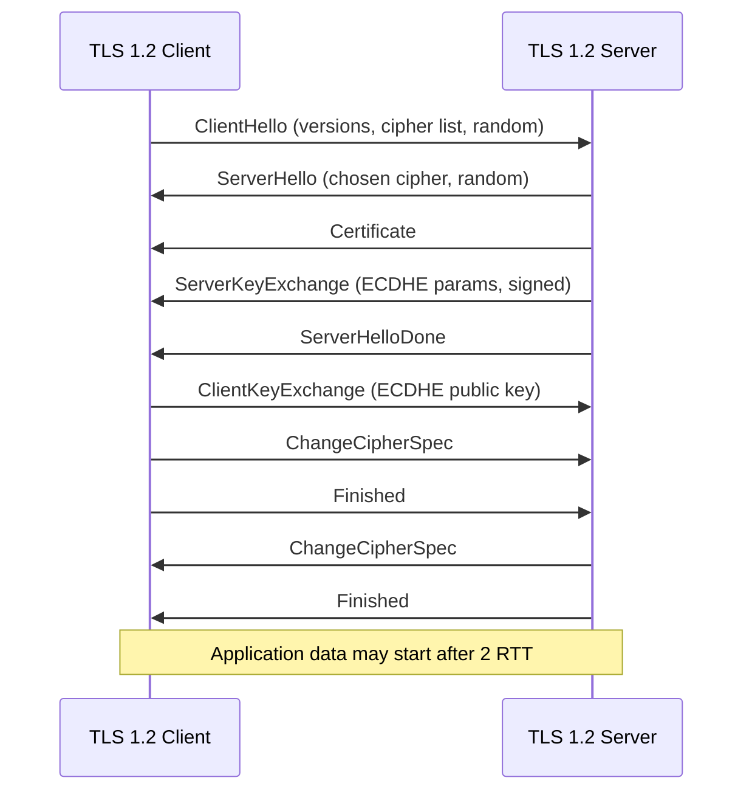
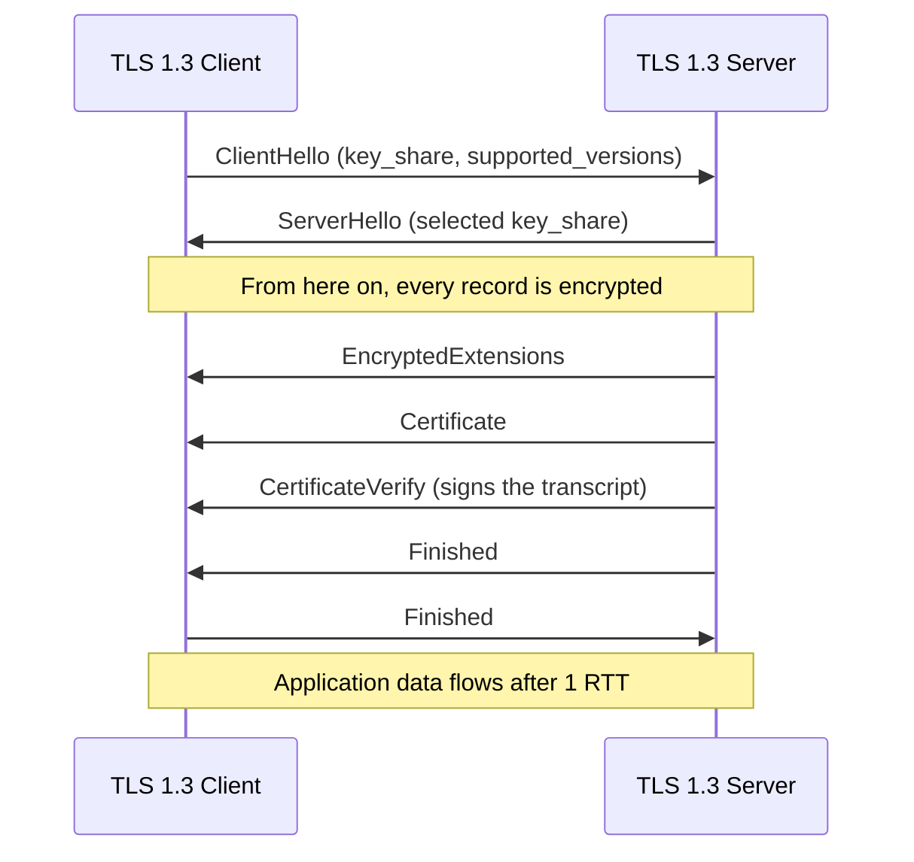
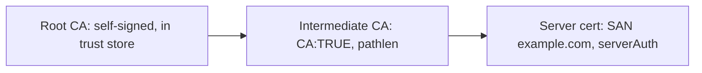

# SSL — Secure Sockets Layer

## Overview

SSL (Secure Sockets Layer) was the predecessor to TLS, developed by Netscape in the 1990s. While the term "SSL" is still commonly used colloquially, all versions of SSL are deprecated and have known vulnerabilities. Modern systems use TLS.

- **SSL 2.0**: 1995 — Broken, never use
- **SSL 3.0**: 1996 — Vulnerable to POODLE attack, deprecated (RFC 7568)
- **TLS 1.0**: 1999 — Deprecated (RFC 8996)
- **TLS 1.1**: 2006 — Deprecated (RFC 8996)
- **TLS 1.2**: 2008 — Still widely used
- **TLS 1.3**: 2018 — Current standard

## SSL Evolution


```mermaid
graph LR
    A[SSL 2.0<br>1995] --> B[SSL 3.0<br>1996]
    B --> C[TLS 1.0<br>1999]
    C --> D[TLS 1.1<br>2006]
    D --> E[TLS 1.2<br>2008]
    E --> F[TLS 1.3<br>2018]
    style A fill:#f00
    style B fill:#f00
    style C fill:#f90
    style D fill:#f90
    style E fill:#0f0
    style F fill:#0f0
```

## Known SSL Vulnerabilities

| Attack | Affected Version | Description |
|--------|-----------------|-------------|
| **POODLE** | SSL 3.0 | Padding Oracle On Downgraded Legacy Encryption. Exploits CBC mode padding. |
| **BEAST** | TLS 1.0 | Browser Exploit Against SSL/TLS. Exploits CBC in TLS 1.0. |
| **DROWN** | SSL 2.0 | Decrypting RSA with Obsolete and Weakened eNcryption. |
| **FREAK** | SSL 3.0/TLS 1.0 | Forces use of export-grade RSA keys (512-bit). |
| **CRIME** | TLS compression | Exploits TLS compression to leak session cookies. |

## SSL/TLS Record Protocol

The record protocol handles fragmentation, compression (removed in TLS 1.3), encryption, and MAC:

```
┌─────────────────────────────────────┐
│  Content Type (1 byte)              │
│  Major Version (1 byte)             │
│  Minor Version (1 byte)             │
│  Length (2 bytes)                   │
├─────────────────────────────────────┤
│  Fragment (up to 16384 bytes)       │
│  (may be compressed in old TLS)     │
├─────────────────────────────────────┤
│  MAC (HMAC)                         │
│  Padding (for block ciphers)        │
└─────────────────────────────────────┘
```

In TLS 1.3, the record layer uses AEAD (Authenticated Encryption with Associated Data), combining encryption and authentication.

## TLS 1.2 vs TLS 1.3: The Handshakes, Side by Side

The handshakes are the sharpest interview separator between the two versions. TLS 1.2's full handshake takes **two round trips** before application data, negotiates the key exchange inside the cipher suite, and only protects the keys — the certificate flies in cleartext. TLS 1.3 cuts this to **one round trip** (plus an optional 0-RTT mode), encrypts almost everything after the ServerHello, and removed all non-forward-secret key exchange entirely.

**TLS 1.2 — full handshake, 2-RTT:**


```mermaid
sequenceDiagram
    participant C as TLS 1.2 Client
    participant S as TLS 1.2 Server
    C->>S: ClientHello (versions, cipher list, random)
    S->>C: ServerHello (chosen cipher, random)
    S->>C: Certificate
    S->>C: ServerKeyExchange (ECDHE params, signed)
    S->>C: ServerHelloDone
    C->>S: ClientKeyExchange (ECDHE public key)
    C->>S: ChangeCipherSpec
    C->>S: Finished
    S->>C: ChangeCipherSpec
    S->>C: Finished
    Note over C,S: Application data may start after 2 RTT
```

**TLS 1.3 — 1-RTT handshake:**


```mermaid
sequenceDiagram
    participant C as TLS 1.3 Client
    participant S as TLS 1.3 Server
    C->>S: ClientHello (key_share, supported_versions)
    S->>C: ServerHello (selected key_share)
    Note over C,S: From here on, every record is encrypted
    S->>C: EncryptedExtensions
    S->>C: Certificate
    S->>C: CertificateVerify (signs the transcript)
    S->>C: Finished
    C->>S: Finished
    Note over C,S: Application data flows after 1 RTT
```

| Property | TLS 1.2 (RFC 5246) | TLS 1.3 (RFC 8446) |
|---|---|---|
| Full-handshake RTTs | 2 | 1 (0-RTT resumption optional) |
| Key exchange | Negotiated in cipher suite; RSA key exchange legal | ECDHE/DHE only; RSA key exchange removed |
| Forward secrecy | Only if ECDHE/DHE selected | Always |
| Cipher suites | ~200 registered, mixes algorithms | 5 suites: AEAD + hash only |
| Negotiation metadata | Cleartext until Finished | Encrypted after ServerHello |
| Weak crypto | CBC, RC4, SHA-1, compression | All removed; AEAD (AES-GCM, ChaCha20-Poly1305) |
| 0-RTT data | No | Yes — replayable, so send only idempotent requests |
| Downgrade protection | Weak (client must react) | `supported_versions` extension + special server random sentinel |

The round-trip arithmetic matters at intercontinental RTTs: a US–Asia link at ~150 ms saves ~150 ms per connection under TLS 1.3 — comparable to the entire TCP handshake budget. 0-RTT (early data) removes even that first RTT for resumed sessions, at the cost of replay protection: servers must treat 0-RTT records as potentially duplicated, which is why 0-RTT is forbidden for non-idempotent requests.

## Cipher Suite Anatomy

A TLS 1.2 suite name packs four decisions into one string. Parse `TLS_ECDHE_RSA_WITH_AES_128_GCM_SHA256`:

| Component | Value here | Meaning |
|---|---|---|
| Protocol | `TLS` | Protocol family |
| Key exchange | `ECDHE` | Ephemeral ECDH → forward secrecy |
| Authentication | `RSA` | Server signs with its RSA cert key |
| Bulk cipher + mode | `AES_128_GCM` | AEAD, 128-bit key |
| Hash / PRF | `SHA256` | Key derivation and handshake transcript hash |

TLS 1.3 moved key exchange and signature negotiation into extensions (`key_share`, `signature_algorithms`), so a 1.3 suite names only the record-layer algorithm and hash. [RFC 8446](https://datatracker.ietf.org/doc/rfc8446/) defines exactly five:

```
TLS_AES_128_GCM_SHA256            (mandatory to implement)
TLS_AES_256_GCM_SHA384
TLS_CHACHA20_POLY1305_SHA256
TLS_AES_128_CCM_SHA256
TLS_AES_128_CCM_8_SHA256
```

ChaCha20-Poly1305 earns its place because AES-GCM relies on AES-NI hardware acceleration that mobile and embedded CPUs may lack; ChaCha20 is fast in pure software. A quick reality check from a shell: `openssl s_client -connect example.com:443 -tls1_3 2>/dev/null | grep Cipher` shows the negotiated suite in the live connection.

## Certificate Chain Validation

TLS certificates are X.509 documents signed into a chain: a root CA (self-signed, pre-installed in OS/browser trust stores) signs intermediates, intermediates sign leaf certificates. A server presents leaf + intermediates; the client already holds the root. Validation is not one check — it is a list:

1. **Build the path** — order the presented chain from leaf to a trusted root; the browser may use cached intermediates or AIA fetching if the server omits one.
2. **Verify signatures** — each certificate's signature must verify against the issuer's public key (RSA, ECDSA, or EdDSA).
3. **Check validity dates** — `notBefore` ≤ now ≤ `notAfter`; current CA/Browser Forum rules cap TLS certificates at 398 days.
4. **Match the hostname** — the server name must appear in the Subject Alternative Name (SAN) extension; the old Common Name field is ignored by modern validators.
5. **Check key usage / extended key usage** — the leaf must assert `digitalSignature` and `serverAuth` (or `clientAuth` for mutual TLS).
6. **Check revocation** — CRL or OCSP (RFC 6960); production servers staple an OCSP response in the handshake so the client does not need a side query.
7. **Enforce constraints** — basicConstraints `CA:TRUE` on issuers, path length limits, name constraints; then record the chain as trusted.


```mermaid
flowchart LR
    ROOT["Root CA: self-signed, in trust store"] --> INT["Intermediate CA: CA:TRUE, pathlen"]
    INT --> LEAF["Server cert: SAN example.com, serverAuth"]
```

The most common production failure is a **missing intermediate**: desktop browsers (which cache intermediates) work while curl, Java, and mobile clients fail — a classic "works on my machine" TLS bug. Self-signed or expired certificates produce the browser's warning screens you should recognize on sight.

## Common Misconfigurations

| Misconfiguration | Consequence | Fix |
|---|---|---|
| SSL 3.0 / TLS 1.0 / 1.1 still enabled | POODLE/BEAST-class exposure; fails compliance scans (PCI DSS requires ≥1.2) | Serve TLS 1.2 + 1.3 only ([RFC 8996](https://datatracker.ietf.org/doc/rfc8996/)) |
| RSA key exchange suites enabled | No forward secrecy: stolen server key decrypts recorded traffic | ECDHE/1.3 suites only |
| Missing intermediate certificate | Works in desktop browsers, fails for curl/Java/mobile | Serve full chain (leaf + intermediates) |
| Expired or wrong-SAN certificate | Browser warnings; hard failures in APIs | Automate renewal (ACME) and monitor expiry |
| TLS compression enabled | CRIME cookie-recovery attack | Disable (also removed in TLS 1.3) |
| CBC suites preferred | BEAST/Lucky13 padding-oracle exposure | AEAD suites (AES-GCM, ChaCha20-Poly1305) |
| No HSTS header | First request can be downgraded by an attacker | `Strict-Transport-Security: max-age=31536000; includeSubDomains` |
| No OCSP stapling | Clients do slow/privacy-leaking revocation checks | Enable stapling; serve `status_request` |
| Certificates for internal hostnames in public CT logs | Internal topology disclosure | Private CA for internal endpoints |

## Why "SSL" Persists

Despite SSL being dead, the term lives on:

- **"SSL certificates"** — Actually X.509 certificates used with TLS
- **"SSL/TLS"** — Common marketing/industry term
- **"SSL offloading"** — TLS termination at load balancers
- **OpenSSL** — Library name (supports TLS 1.3)

## Interview Questions

1. **Q: Is SSL still secure?**
   A: No. All SSL versions (2.0 and 3.0) have known vulnerabilities. SSL 3.0 is vulnerable to POODLE. Always use TLS 1.2 or 1.3.

2. **Q: What is the POODLE attack?**
   A: Padding Oracle On Downgraded Legacy Encryption. An attacker forces a downgrade to SSL 3.0, then exploits the CBC padding to decrypt bytes of the encrypted connection. Mitigation: disable SSL 3.0 entirely.

3. **Q: What's the difference between SSL certificates and TLS certificates?**
   A: There's no difference — they're the same X.509 certificates. The term "SSL certificate" is a misnomer that persists from when SSL was the standard.

4. **Q: Why was SSL 3.0 deprecated?**
   A: The POODLE attack (2014) demonstrated that SSL 3.0's CBC padding could be exploited to decrypt secure connections. Since SSL 3.0 couldn't be fixed without breaking compatibility, it was deprecated (RFC 7568).

5. **Q: What is the difference between SSL/TLS and HTTPS?**
   A: HTTPS = HTTP over TLS (or historically, over SSL). TLS provides the encryption layer; HTTP is the application protocol. You can have any application protocol over TLS (SMTPS, FTPS, LDAPS).

6. **Q: What did TLS 1.3 change compared to TLS 1.2, and why is it faster?**
   A: The full handshake dropped from 2 RTT to 1 RTT because the client sends its ECDHE key share immediately in the ClientHello, letting the server derive keys one round trip earlier. TLS 1.3 also removed static RSA key exchange and CBC ciphers (mandating forward secrecy and AEAD), encrypts most of the handshake, compresses the cipher-suite list to five AEAD suites, and adds optional 0-RTT early data for resumption. The security and performance changes have the same root cause: fewer round trips with fewer degrees of freedom for attackers.

7. **Q: What is forward secrecy and which key exchange provides it?**
   A: Forward secrecy means a future compromise of the server's long-term private key cannot decrypt past recorded sessions. It requires ephemeral Diffie-Hellman (ECDHE/DHE): each session mixes in an ephemeral key share that is erased after use, so session keys are never derived from the long-term key alone. Static RSA key exchange — decrypting the premaster secret directly with the private key — lacks this property and was removed entirely in TLS 1.3, making FS unconditional.

8. **Q: Walk me through how a client validates a TLS certificate chain.**
   A: It builds a path from the presented leaf through intermediates to a root in its trust store, verifies each issuer signature, checks validity dates, matches the hostname against the SAN extension, enforces key usage and basic constraints, and consults revocation (CRL/OCSP — ideally stapled). The classic failure is a server that omits its intermediate: browsers with cached intermediates succeed while curl, Java, and mobile clients fail, which is why "works in Chrome, fails in curl" almost always means a broken chain, not a broken certificate.

## Common Mistakes

- Using SSL 3.0 or TLS 1.0/1.1 in production
- Saying "SSL" when you mean "TLS" (shows outdated knowledge)
- Not knowing that "SSL certificates" are just X.509 certificates
- Confusing the SSL/TLS record protocol with the handshake protocol
- Claiming TLS 1.3 is faster "because it compresses" — it is faster because it needs one RTT, not two, and it removed compression (CRIME) rather than adding it
- Believing 0-RTT is free: early data is replayable, so only idempotent requests may use it

## Summary

SSL is dead; TLS is the standard. All SSL versions have known vulnerabilities. The industry still uses "SSL" colloquially, but understanding that TLS 1.2+ is what's actually deployed shows current knowledge. The strongest signal of up-to-date knowledge in an interview is fluency in the TLS 1.3 handshake: 1-RTT, unconditional forward secrecy, encrypted handshake data, five AEAD cipher suites, and a clear-eyed view of 0-RTT replay risk.

## Key Takeaways

- Every SSL version is deprecated (POODLE killed 3.0 via RFC 7568; TLS 1.0/1.1 via RFC 8996); "SSL certificates" are X.509 certificates used with TLS.
- TLS 1.2 full handshake = 2 RTT, key exchange inside the cipher suite, cleartext certificate; TLS 1.3 = 1 RTT (+ optional 0-RTT), ECDHE-only, encrypted handshake records.
- TLS 1.3 has exactly five cipher suites (AEAD + hash); key exchange and signatures moved into `key_share` / `signature_algorithms` extensions.
- Forward secrecy comes from ephemeral Diffie-Hellman; static RSA key exchange is the anti-pattern that lets a stolen private key decrypt captured traffic.
- Chain validation = path building, signature checks, dates, SAN match, EKU, revocation, constraints; a missing intermediate is the most common deployment bug.
- AEAD (AES-GCM, ChaCha20-Poly1305) replaced MAC-then-encrypt CBC modes; TLS compression was removed after CRIME.
- 0-RTT trades replay resistance for latency — servers must reject or carefully handle early data on non-idempotent requests.

## References

- TLS 1.3: [RFC 8446](https://datatracker.ietf.org/doc/rfc8446/)
- TLS 1.2: [RFC 5246](https://datatracker.ietf.org/doc/rfc5246/)
- Deprecating SSLv3 (POODLE): [RFC 7568](https://datatracker.ietf.org/doc/rfc7568/)
- Deprecating TLS 1.0/1.1: [RFC 8996](https://datatracker.ietf.org/doc/rfc8996/)
- X.509 PKI Certificate and CRL Profile: [RFC 5280](https://datatracker.ietf.org/doc/rfc5280/)
- OCSP: [RFC 6960](https://datatracker.ietf.org/doc/rfc6960/)
- HSTS: [RFC 6797](https://datatracker.ietf.org/doc/rfc6797/)

## Cross-References

- [TLS](tls.md) — The modern successor (this is what you should know)
- [IPsec](ipsec.md) — Network-layer encryption alternative
- [Firewalls](firewalls.md) — SSL/TLS inspection
- [VPN](vpn.md) — Often uses TLS
- [TLS Deep Dive](tls-deep-dive.md) — record layer, key schedule, and handshake internals
- [TLS Encrypted ClientHello (ECH)](../protocols/tls-ech.md) — encrypting the SNI that TLS still exposes
- [HTTPS](../http/https.md) — HTTP over TLS in practice: HSTS, redirects, cert pinning
- [Network Security Hub](README.md) — the full security chapter
