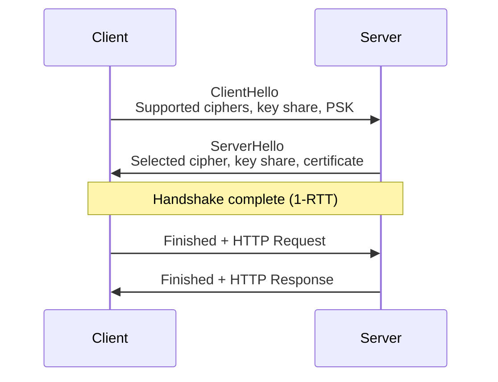
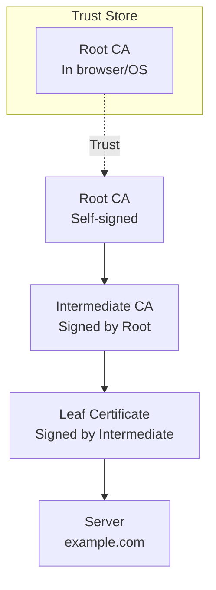
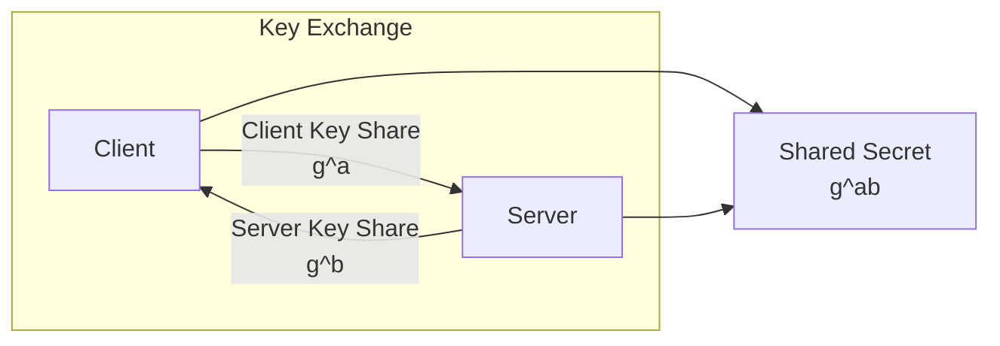
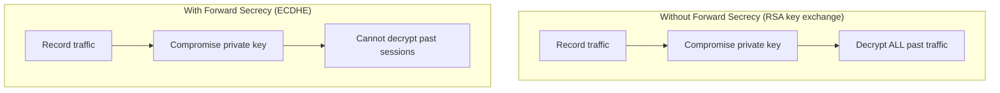
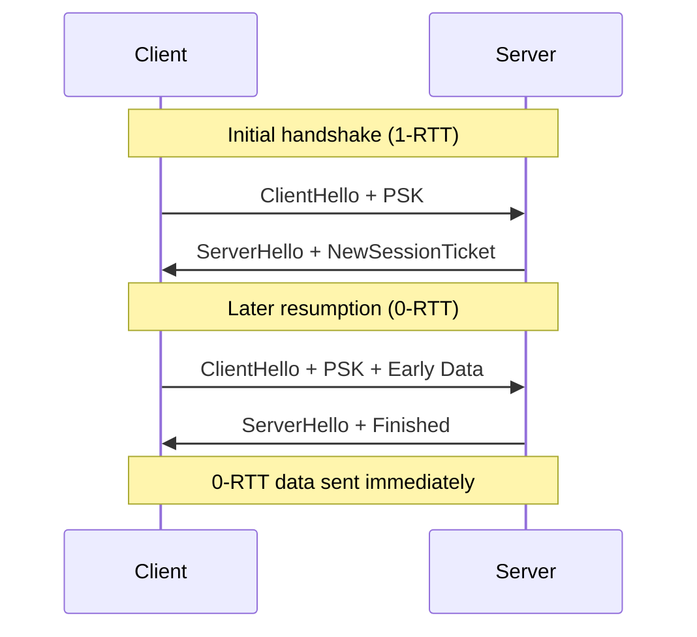
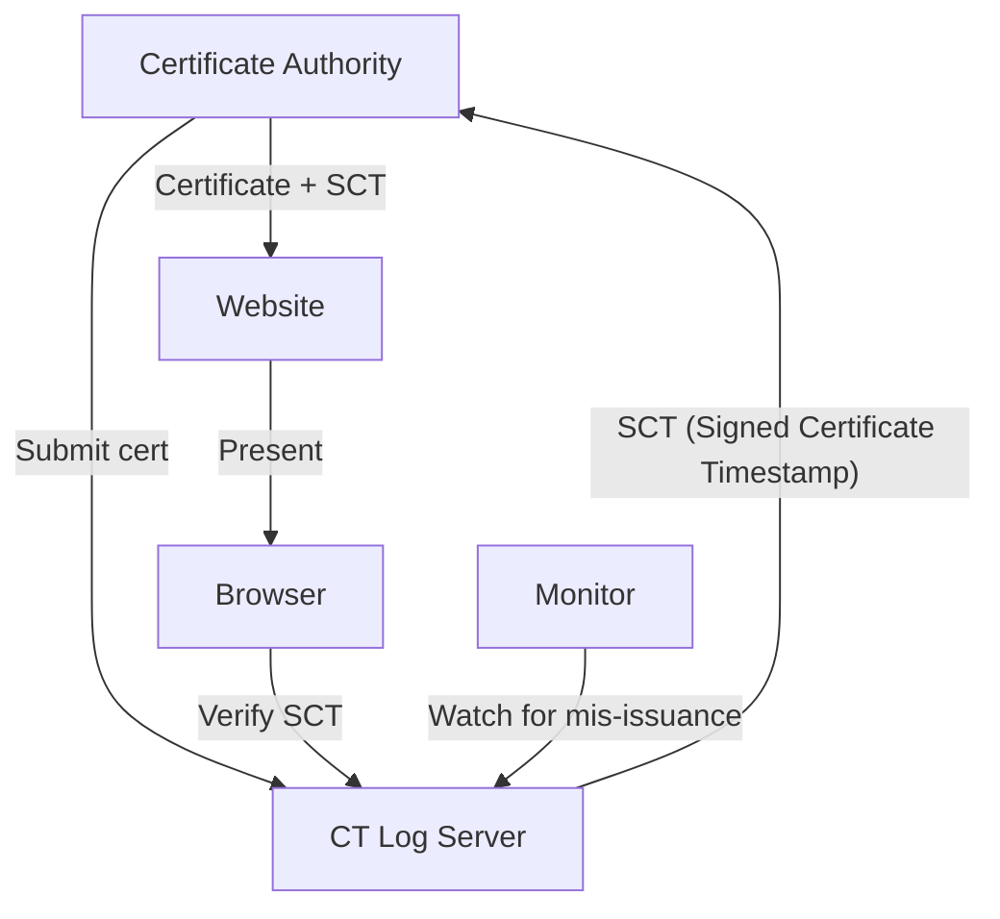
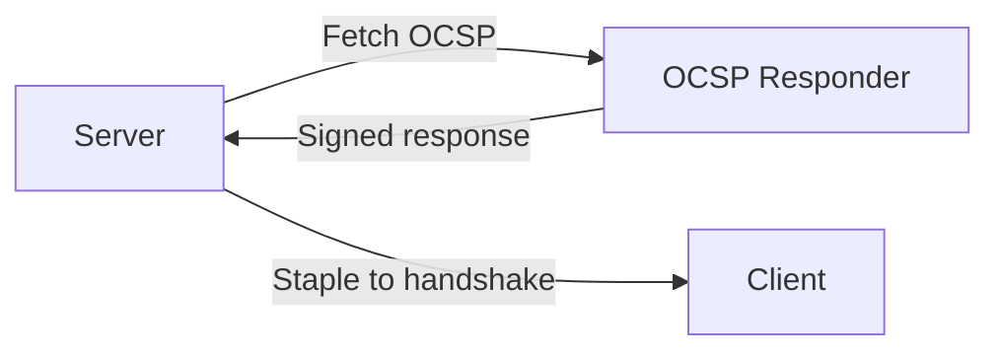
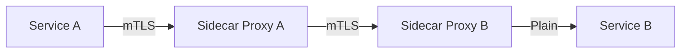

# TLS Deep Dive

## Overview

Transport Layer Security (TLS) is the cryptographic protocol that secures communication over the internet. Understanding TLS internals is crucial for backend engineering interviews, especially for companies dealing with security-sensitive applications.

## TLS 1.3 Handshake

TLS 1.3 simplified the handshake from 2 round trips to 1 (or even 0 for resumption).



### TLS 1.2 vs 1.3

| Feature | TLS 1.2 | TLS 1.3 |
|---------|---------|---------|
| **Handshake RTTs** | 2 | 1 |
| **Key exchange** | RSA, DHE, ECDHE | ECDHE only (forward secrecy) |
| **Cipher suites** | Many (configurable) | 5 fixed suites |
| **0-RTT** | No | Yes (with PSK) |
| **Static RSA** | Yes | Removed |
| **Compression** | Optional | Removed |
| **Renegotiation** | Supported | Removed |

## Certificate Chain



### Certificate Validation Steps

1. **Signature verification**: Each cert signed by issuer
2. **Validity period**: Not expired (notBefore, notAfter)
3. **Revocation check**: CRL or OCSP
4. **Name matching**: SAN (Subject Alternative Name) matches hostname
5. **Trust chain**: Chain leads to trusted root

### X.509 Certificate Fields

```
Certificate:
    Data:
        Version: 3 (0x2)
        Serial Number: 1234567890
        Signature Algorithm: sha256WithRSAEncryption
        Issuer: CN=Let's Encrypt Authority X3
        Validity:
            Not Before: Jan  1 00:00:00 2024 GMT
            Not After : Apr  1 00:00:00 2024 GMT
        Subject: CN=example.com
        Subject Public Key Info:
            Public Key Algorithm: id-ecPublicKey
            Public-Key: (256 bit)
        X509v3 Subject Alternative Name:
            DNS:example.com, DNS:www.example.com
```

## Key Exchange

### ECDHE (Elliptic Curve Diffie-Hellman Ephemeral)



**Why ECDHE:**
- **Ephemeral**: New keys per session (forward secrecy)
- **Elliptic curve**: Smaller keys, faster computation
- **Forward secrecy**: Compromising long-term key doesn't reveal past sessions

### Common Curves

| Curve | Key Size | Security Level | Performance |
|-------|----------|---------------|-------------|
| P-256 (secp256r1) | 256 bit | 128-bit | Good |
| P-384 (secp384r1) | 384 bit | 192-bit | Moderate |
| X25519 | 256 bit | 128-bit | Best |

## Cipher Suites

### TLS 1.3 Cipher Suites

```
TLS_AES_128_GCM_SHA256
TLS_AES_256_GCM_SHA384
TLS_CHACHA20_POLY1305_SHA256
TLS_AES_128_CCM_SHA256
TLS_AES_128_CCM_8_SHA256
```

### Components

| Component | Algorithm | Purpose |
|-----------|-----------|---------|
| **Key exchange** | ECDHE | Establish shared secret |
| **Authentication** | ECDSA/RSA | Verify server identity |
| **Bulk encryption** | AES-GCM/ChaCha20 | Encrypt data |
| **Hash** | SHA-256/384 | Integrity, key derivation |

## Forward Secrecy

### Why Forward Secrecy Matters

Without forward secrecy, if an attacker records encrypted traffic and later compromises the server's private key, they can decrypt all past traffic.



### How ECDHE Provides Forward Secrecy

1. Client generates ephemeral key pair (a, g^a)
2. Server generates ephemeral key pair (b, g^b)
3. Shared secret = g^ab
4. Ephemeral keys are discarded after session
5. Long-term key only used for authentication, not encryption

## TLS Session Resumption

### Session Tickets (TLS 1.2/1.3)



### 0-RTT Risks

- **Replay attack**: Attacker can replay 0-RTT data
- **Not idempotent**: Only safe for idempotent requests (GET)
- **Mitigation**: Single-use tickets, rate limiting

## Certificate Transparency

### What is CT?

A public, append-only log of all issued certificates. Browsers require CT proofs to detect mis-issued certificates.



### SCT (Signed Certificate Timestamp)

Proof that a certificate was logged. Browsers require at least 2-3 SCTs from different logs.

## OCSP Stapling

### Problem: OCSP Privacy Leak

Traditional OCSP: Browser contacts CA to check if cert is revoked → CA learns which sites you visit.

### Solution: OCSP Stapling

Server periodically fetches OCSP response from CA and "staples" it to the TLS handshake.



## mTLS (Mutual TLS)

### Standard TLS vs mTLS

| Standard TLS | mTLS |
|-------------|------|
| Server authenticates to client | Both authenticate to each other |
| Client verifies server cert | Server also verifies client cert |
| Used for HTTPS | Used for service-to-service |

### mTLS in Service Mesh



Istio/Envoy handle mTLS automatically via sidecar proxies.

## Common Attacks and Mitigations

| Attack | Description | Mitigation |
|--------|-------------|------------|
| **BEAST** | CBC IV prediction | TLS 1.1+ (explicit IV) |
| **POODLE** | Padding oracle | Disable SSLv3 |
| **Heartbleed** | Memory leak in OpenSSL | Patch OpenSSL |
| **CRIME/BREACH** | Compression side-channel | Disable compression |
| **ROBOT** | RSA padding oracle | Disable RSA key exchange |
| **Downgrade** | Force weaker version | TLS_FALLBACK_SCSV |

## Interview Questions

### Q1: Why is TLS 1.3 faster than 1.2?

TLS 1.3 reduces the handshake from 2 round trips to 1 by combining the key exchange and authentication into a single exchange. It also supports 0-RTT resumption for returning clients.

### Q2: What is forward secrecy?

Forward secrecy ensures that compromising the server's long-term private key doesn't allow decryption of past sessions. ECDHE provides this by using ephemeral keys that are discarded after each session.

### Q3: How does certificate validation work?

1. Build certificate chain from leaf to root
2. Verify each signature in the chain
3. Check validity dates
4. Check revocation (OCSP/CRL)
5. Verify hostname matches SAN
6. Ensure root is in trust store

### Q4: What is certificate pinning?

Hardcoding the expected certificate or public key in the client application. Prevents MITM attacks even if a CA is compromised. Being replaced by Certificate Transparency.

### Q5: mTLS vs API keys for service auth?

| mTLS | API Keys |
|------|----------|
| Strong cryptographic auth | Shared secret |
| Mutual authentication | One-way (usually) |
| Infrastructure-level | Application-level |
| Auto-rotated (service mesh) | Manual rotation |
| Can't be stolen from logs | Can leak in logs |

## Related Topics

- [HTTPS](./ssl.md) — TLS for HTTP
- [HTTP/2](../http/http2.md) — Protocol with TLS
- [HTTP/3](../http/http3.md) — QUIC-based TLS
- [Backend Auth](../../backend/auth/) — Authentication patterns
