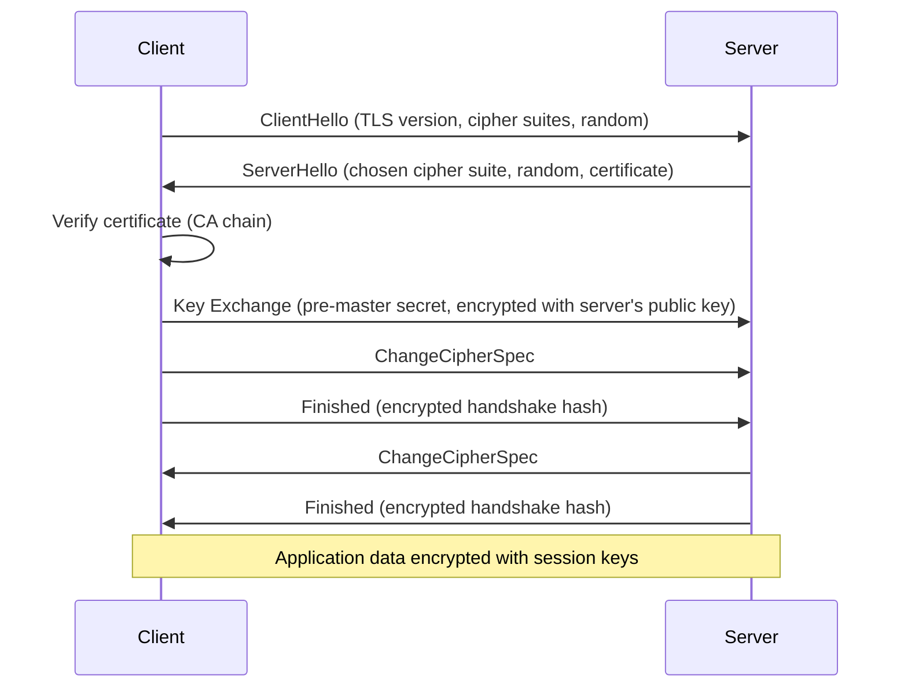
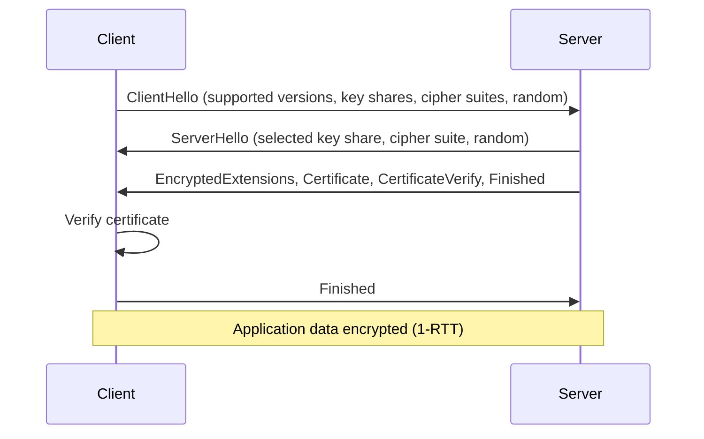
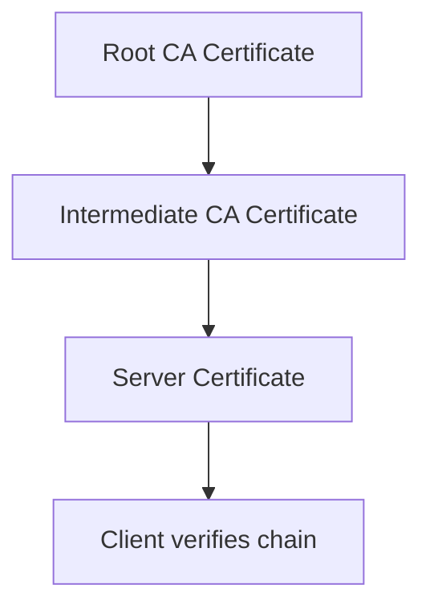
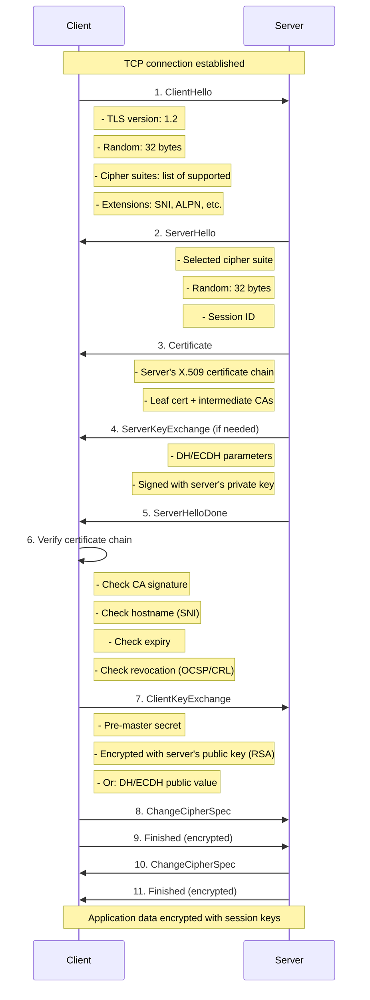
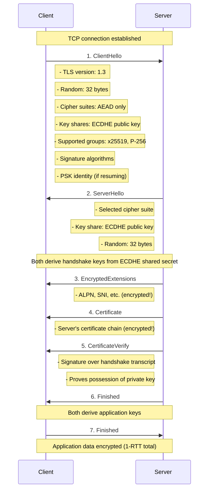
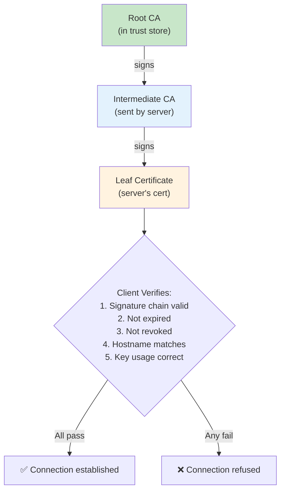
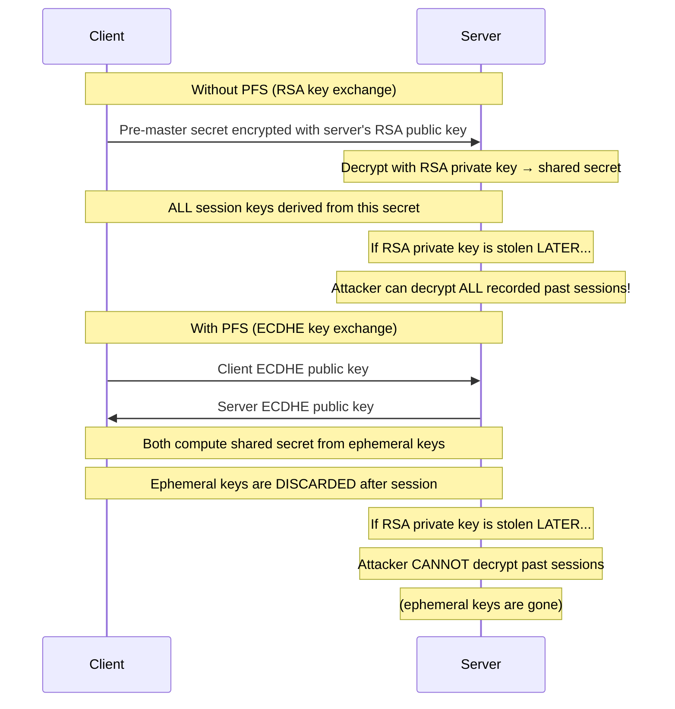

# TLS — Transport Layer Security

## Overview

TLS (Transport Layer Security) is the cryptographic protocol that secures communications over a network. It provides **confidentiality**, **integrity**, and **authentication** for data in transit. TLS is the successor to SSL and is the "S" in HTTPS.

- **Current version**: TLS 1.3 (RFC 8446, 2018)
- **Previous versions**: TLS 1.2 (RFC 5246), TLS 1.1, TLS 1.0 (all deprecated)
- **Layer**: Between Transport (TCP) and Application (HTTP, SMTP, etc.)
- **Port**: Uses the application's port (e.g., 443 for HTTPS)

## TLS vs SSL

| Aspect | SSL | TLS |
|--------|-----|-----|
| **Latest version** | SSL 3.0 (1996) | TLS 1.3 (2018) |
| **Status** | Deprecated, insecure | Current standard |
| **Cipher suites** | Weak (RC4, DES) | Strong (AES-GCM, ChaCha20) |
| **Handshake** | Vulnerable to POODLE/BEAST | Secure (0-RTT in 1.3) |
| **Key exchange** | RSA, DH | ECDHE (forward secrecy mandatory in 1.3) |

## TLS 1.2 Handshake



## TLS 1.3 Handshake (Simplified)



**Key improvements in TLS 1.3:**
- **1-RTT handshake** (vs 2-RTT in 1.2)
- **0-RTT resumption** possible (with replay attack trade-off)
- **Forward secrecy mandatory** (ephemeral key exchange only)
- **Removed**: RSA key exchange, static DH, CBC mode, RC4, SHA-1 in signatures
- **Simplified**: Only 5 cipher suites vs 37+ in TLS 1.2

## TLS Cipher Suites

### TLS 1.3 Cipher Suites (5 total)
```
TLS_AES_128_GCM_SHA256
TLS_AES_256_GCM_SHA384
TLS_CHACHA20_POLY1305_SHA256
TLS_AES_128_CCM_SHA256
TLS_AES_128_CCM_8_SHA256
```

### TLS 1.2 Cipher Suite Format
```
TLS_<KeyExchange>_WITH_<Cipher>_<MAC>
Example: TLS_ECDHE_RSA_WITH_AES_128_GCM_SHA256
```

## TLS Components

| Component | Purpose | Algorithm Examples |
|-----------|---------|-------------------|
| **Key Exchange** | Securely establish shared secret | ECDHE, DHE (RSA removed in 1.3) |
| **Authentication** | Verify server identity | RSA, ECDSA certificates |
| **Bulk Encryption** | Encrypt application data | AES-128-GCM, ChaCha20-Poly1305 |
| **Message Authentication** | Ensure integrity | HMAC-SHA256 (built into AEAD) |

## Certificate Chain



1. Server sends its certificate + intermediate CA certificate
2. Client checks if intermediate CA is signed by a trusted root CA
3. Root CA is in the client's trust store (OS/browser)
4. Client verifies the server's certificate matches the hostname (SNI)

## Forward Secrecy

**Forward secrecy** (FS) ensures that compromising the server's long-term private key doesn't allow decryption of past sessions.

- **Without FS (RSA key exchange)**: Client encrypts pre-master secret with server's public key. If the private key is later stolen, all past traffic can be decrypted.
- **With FS (ECDHE)**: Each session uses ephemeral keys. Even if the private key is stolen, past sessions remain secure.

**TLS 1.3 mandates forward secrecy** by removing RSA key exchange.

## TLS 1.3 vs TLS 1.2 Comparison

| Feature | TLS 1.2 | TLS 1.3 |
|---------|---------|---------|
| **Handshake RTTs** | 2 | 1 |
| **0-RTT** | No | Yes (with replay risk) |
| **Forward secrecy** | Optional | Mandatory |
| **Cipher suites** | 37+ | 5 |
| **RSA key exchange** | Supported | Removed |
| **CBC mode** | Supported | Removed |
| **Compression** | Supported | Removed |
| **Renegotiation** | Supported | Removed (use KeyUpdate) |

## HTTPS and TLS

```
https://example.com
│                    │
│                    └── Domain name
└── Uses TLS (port 443)
```

When you visit https://example.com:
1. TCP connection to port 443
2. TLS handshake (verify certificate, establish keys)
3. HTTP request/response over encrypted channel

## Interview Questions

1. **Q: What is the TLS handshake?**
   A: The process of establishing a secure connection: agreeing on protocol version and cipher suite, authenticating the server (certificate), and deriving session keys. TLS 1.3 does this in 1 round trip.

2. **Q: What is forward secrecy and why does it matter?**
   A: Forward secrecy ensures that a compromised long-term key doesn't expose past session keys. Each session uses ephemeral Diffie-Hellman keys. TLS 1.3 mandates it. Without FS, an attacker who records encrypted traffic and later steals the private key can decrypt everything.

3. **Q: What's the difference between TLS and SSL?**
   A: SSL (Secure Sockets Layer) was developed by Netscape. TLS is the IETF standardization of SSL 3.0. TLS 1.0 = SSL 3.1. All SSL versions are deprecated. Always use TLS 1.2+.

4. **Q: What is a certificate authority (CA)?**
   A: A trusted entity that signs digital certificates. The CA verifies the identity of the certificate holder (domain ownership for DV, organization for OV, extended validation for EV). Browsers/OS maintain a trust store of root CAs.

5. **Q: How does TLS prevent man-in-the-middle attacks?**
   A: The server presents a certificate signed by a trusted CA. The client verifies: 1) The certificate chain is valid, 2) The certificate hasn't been revoked, 3) The hostname matches. An attacker can't forge a valid certificate without the CA's private key.

6. **Q: What is certificate pinning?**
   A: Hardcoding the expected certificate (or its public key) in the client application. This prevents MITM even if a CA is compromised, because the client only trusts the pinned certificate. Used by mobile apps and high-security applications.

## Deep Dive: TLS 1.2 Handshake



## Deep Dive: TLS 1.3 Handshake



### Key Differences: TLS 1.2 vs 1.3

```
Feature              │ TLS 1.2            │ TLS 1.3
─────────────────────┼────────────────────┼──────────────────────
Handshake RTTs       │ 2 (full)           │ 1 (full) + 0-RTT resumption
Key exchange         │ RSA, DHE, ECDHE    │ ECDHE only (mandatory)
Forward secrecy      │ Optional           │ Mandatory
Cipher suites        │ 37+ combinations   │ 5 AEAD-only
Signature algorithms │ Many (incl. SHA-1) │ SHA-256/384 only
Certificate          │ Plaintext          │ Encrypted
Extensions           │ Plaintext          │ Encrypted
RSA key exchange     │ Supported          │ REMOVED
CBC mode             │ Supported          │ REMOVED
RC4                  │ Supported          │ REMOVED
Compression          │ Supported          │ REMOVED
Renegotiation        │ Supported          │ REMOVED (use KeyUpdate)
0-RTT                │ Not available      │ Available (with replay risk)
```

## Deep Dive: Certificate Chain Verification



### Certificate Types

```
DV (Domain Validation):
  - Only verifies domain ownership
  - Let's Encrypt issues DV certs (free, automated)
  - Process: HTTP challenge or DNS challenge

OV (Organization Validation):
  - Verifies domain + organization identity
  - CA checks business registration
  - Organization name visible in cert

EV (Extended Validation):
  - Most rigorous verification
  - Legal identity + physical address + operational existence
  - Green bar in old browsers (now deprecated UI)
  - Used by banks, e-commerce
```

### Certificate Pinning

```
Standard validation: Trust any cert signed by trusted CA
Pinning: Trust only a specific cert or public key

Types:
  - HPKP (HTTP Public Key Pinning): Deprecated, removed from browsers
  - Static pinning: Hardcode expected cert in app
  - Dynamic pinning: First connection stores cert, subsequent connections verify

Mobile apps commonly use pinning:
  // Android (Network Security Config)
  <pin-set>
    <pin digest="SHA-256">base64hash=</pin>
  </pin-set>

Why pinning matters:
  - Protects against compromised CAs
  - Prevents MITM with forged certificates
  - But: must handle cert rotation carefully
```

## Deep Dive: Cipher Suites

### TLS 1.3 Cipher Suites (AEAD Only)

```
TLS_AES_128_GCM_SHA256        → AES-128-GCM + HKDF-SHA256
TLS_AES_256_GCM_SHA384        → AES-256-GCM + HKDF-SHA384
TLS_CHACHA20_POLY1305_SHA256  → ChaCha20-Poly1305 + HKDF-SHA256
TLS_AES_128_CCM_SHA256        → AES-128-CCM + HKDF-SHA256
TLS_AES_128_CCM_8_SHA256      → AES-128-CCM-8 + HKDF-SHA256

All are AEAD (Authenticated Encryption with Associated Data)
No separate MAC algorithm needed
```

### TLS 1.2 Cipher Suite Format

```
TLS_<KeyExchange>_WITH_<Cipher>_<MAC>[_<PRF>]

Components:
  KeyExchange: RSA, DHE_RSA, ECDHE_RSA, ECDHE_ECDSA
  Cipher: AES_128_GCM, AES_256_CBC, CHACHA20_POLY1305
  MAC: SHA256, SHA384 (implicit in AEAD)
  PRF: SHA256, SHA384 (optional)

Example:
  TLS_ECDHE_ECDSA_WITH_AES_256_GCM_SHA384
  ↑         ↑              ↑         ↑
  ECDHE    Server uses    AES-256   HKDF
  key       ECDSA cert    GCM       SHA-384
  exchange  for auth      (AEAD)
```

### Recommended Cipher Suite Order

```
Modern (2024):
  1. TLS_AES_256_GCM_SHA384
  2. TLS_CHACHA20_POLY1305_SHA256
  3. TLS_AES_128_GCM_SHA256

  TLS 1.3: Handled automatically (only 5 suites)
  TLS 1.2: Configure ECDHE + AEAD suites
    TLS_ECDHE_ECDSA_WITH_AES_256_GCM_SHA384
    TLS_ECDHE_RSA_WITH_AES_256_GCM_SHA384
    TLS_ECDHE_ECDSA_WITH_CHACHA20_POLY1305_SHA256
    TLS_ECDHE_RSA_WITH_CHACHA20_POLY1305_SHA256

Avoid:
  ✗ Anything with RSA key exchange (no forward secrecy)
  ✗ Anything with CBC mode (vulnerable to padding oracles)
  ✗ Anything with RC4, DES, 3DES
  ✗ Anything with MD5 or SHA-1
  ✗ Anything with NULL or EXPORT
```

## Deep Dive: Perfect Forward Secrecy (PFS)



## Common Mistakes

- Using "SSL" when you mean "TLS" (SSL is deprecated)
- Not understanding that TLS 1.3 removed RSA key exchange
- Confusing the certificate (identity) with the encryption (session keys)
- Forgetting that TLS encrypts application data but the TLS handshake itself reveals the server certificate in plaintext
- Not knowing that 0-RTT in TLS 1.3 is vulnerable to replay attacks
- Not configuring proper cipher suite order (weak suites enabled)
- Ignoring certificate expiry and revocation checking
- Assuming HTTPS means "secure" — it only encrypts the transport, not the endpoints

## Summary

TLS is the backbone of internet security. TLS 1.3 is the current standard with 1-RTT handshake, mandatory forward secrecy, and simplified cipher suites. Understanding the handshake, certificate chain, forward secrecy, and the differences between TLS versions is essential for interviews.

## Cross-References

- [SSL](ssl.md) — Predecessor to TLS
- [IPsec](ipsec.md) — Network-layer encryption
- [VPN](vpn.md) — Uses TLS/IPsec
- [Firewalls](firewalls.md) — Can inspect TLS traffic
- [Certificates](../../arch/number-systems/floating-point.md) — Related math concepts

## Cross References

- [SSL](ssl.md)
- [HTTPS](../http/https.md)
- [Firewalls](firewalls.md)
- [OS Security](../../os/security/README.md)
