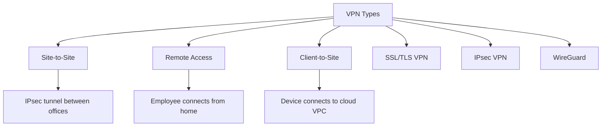
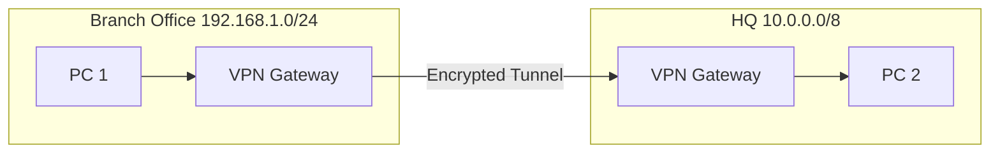
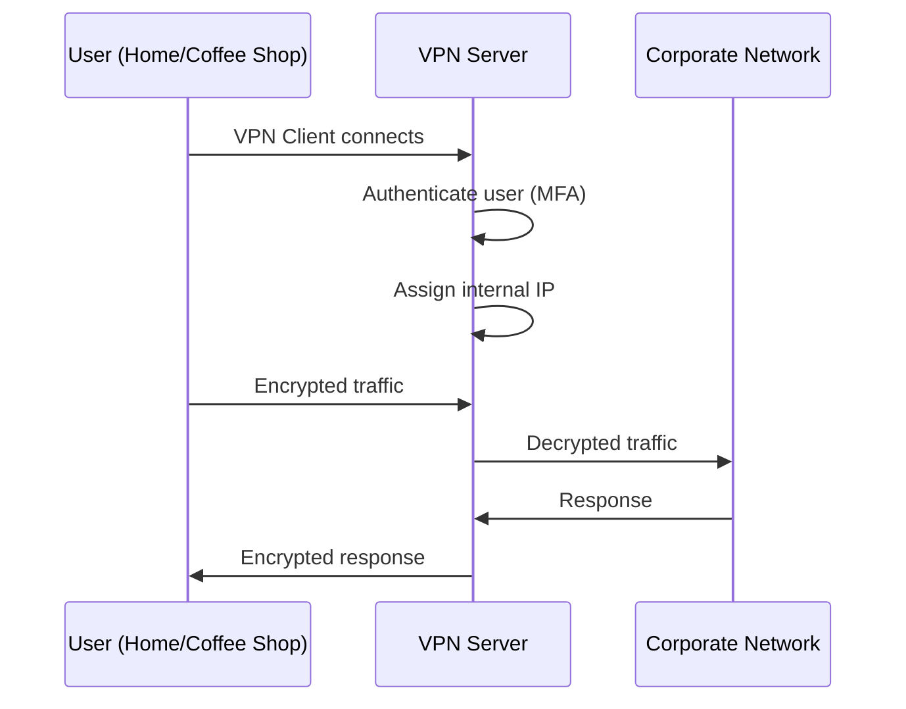
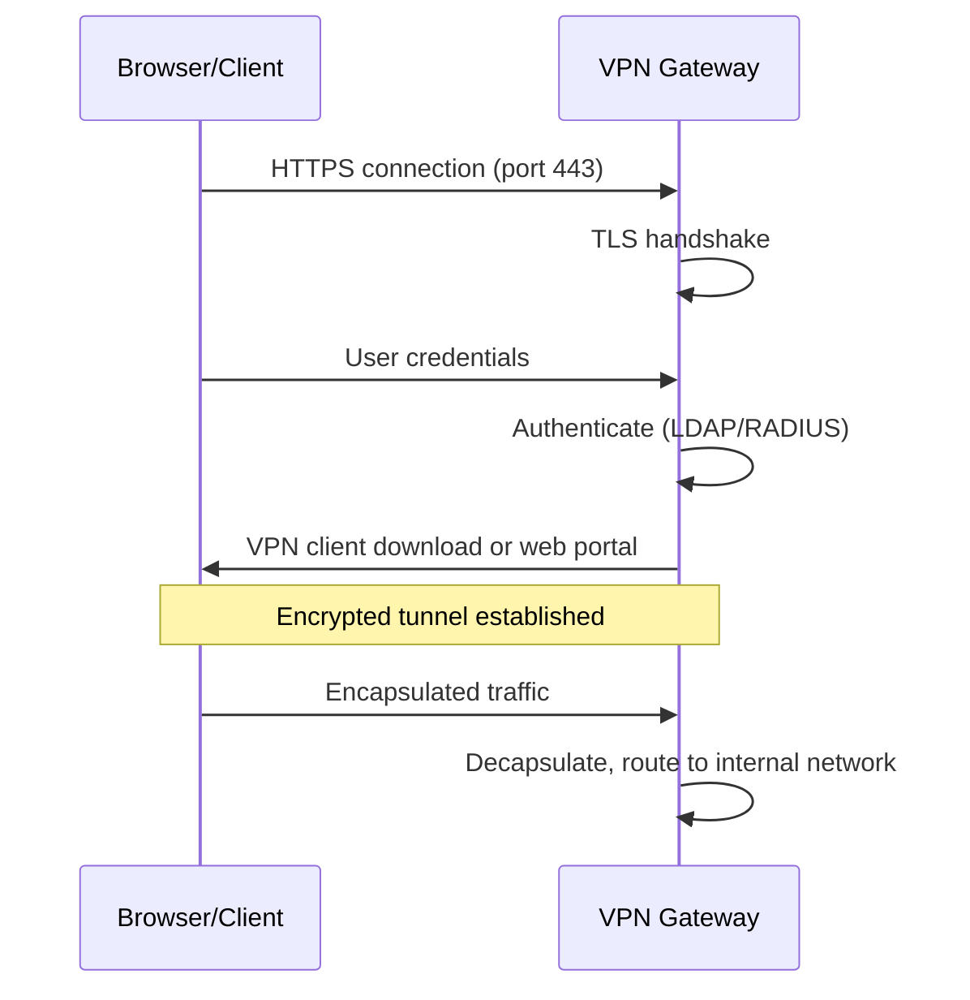
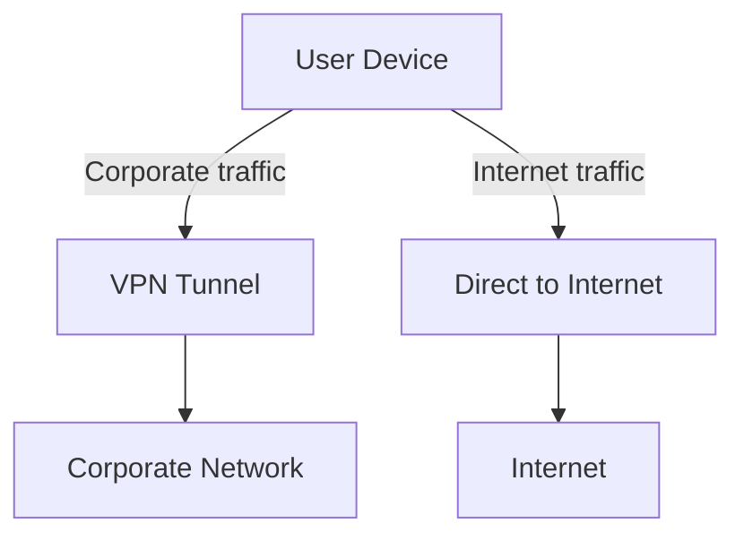
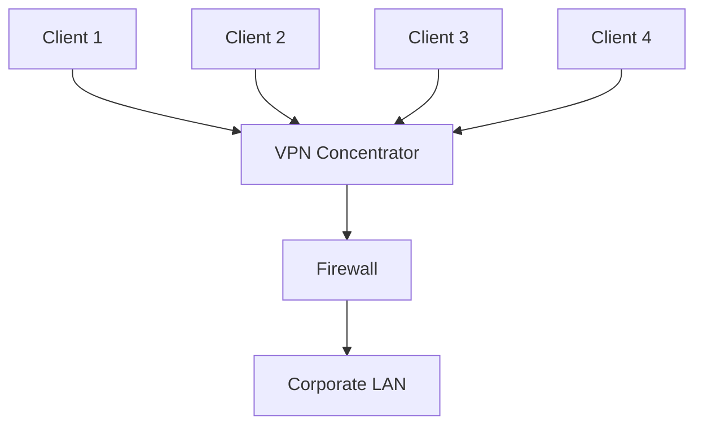

# VPN — Virtual Private Network

## Overview

A VPN creates an encrypted tunnel over a public network (like the Internet), enabling secure communication between remote sites or users as if they were on the same private network. VPNs provide **confidentiality**, **integrity**, and **authentication** for network traffic.

## VPN Types

## Site-to-Site VPN

Connects two networks (e.g., branch office to headquarters) through an encrypted tunnel.

**Characteristics**:
- Gateway-to-gateway (usually hardware appliances)
- Transparent to end users
- Always-on connectivity
- Uses IPsec or GRE over IPsec

## Remote Access VPN

Allows individual users to connect to the corporate network from anywhere.

**Characteristics**:
- Client software on user device
- Uses SSL/TLS (OpenSSL, AnyConnect) or IPsec
- Can use split tunneling (only corporate traffic goes through VPN) or full tunneling

## VPN Protocols

| Protocol | Layer | Encryption | Use Case |
|----------|-------|------------|----------|
| **IPsec** | Layer 3 | Strong (AES) | Site-to-site, remote access |
| **OpenVPN** | Layer 2/3 | Strong (OpenSSL) | Remote access, flexible |
| **WireGuard** | Layer 3 | Strong (ChaCha20) | Modern, fast, simple |
| **L2TP/IPsec** | Layer 2 | Strong (with IPsec) | Legacy remote access |
| **PPTP** | Layer 2 | Weak (MPPE) | Deprecated, insecure |
| **SSL VPN** | Layer 7 | TLS | Browser-based access |

## SSL/TLS VPN

Uses TLS to create a secure tunnel, often accessible through a web browser.

### How It Works

**Advantages**:
- Works through firewalls (uses port 443, same as HTTPS)
- No special client needed (browser-based)
- Easy to deploy

**Disadvantages**:
- Only protects application-layer traffic (not all network traffic by default)
- Less transparent than IPsec VPNs

## Split Tunneling vs Full Tunneling

| Mode | Description | Pros | Cons |
|------|-------------|------|------|
| **Split Tunnel** | Only corporate traffic goes through VPN | Less bandwidth usage, faster internet | Corporate traffic exposed if misconfigured |
| **Full Tunnel** | All traffic goes through VPN | Maximum security | All traffic routed through corporate, slower |

## Split Tunneling Diagram

## WireGuard

A modern VPN protocol designed for simplicity, speed, and security.

| Feature | WireGuard | IPsec | OpenVPN |
|---------|-----------|-------|---------|
| **Codebase** | ~4,000 lines | ~400,000 lines | ~100,000 lines |
| **Speed** | Very fast | Fast | Moderate |
| **Setup** | Simple | Complex | Moderate |
| **Encryption** | ChaCha20, Curve25519 | AES, RSA/ECDSA | OpenSSL library |
| **Kernel space** | Yes | Yes | No (userspace) |
| **Roaming** | Built-in | Needs MOBIKE | Manual |

## VPN Concentrator

A dedicated device that handles VPN connections from multiple clients:

**Functions**: Authentication, encryption/decapsulation, IP address assignment, tunnel management, load balancing across multiple VPN servers.

## Interview Questions

1. **Q: What's the difference between site-to-site and remote access VPN?**
   A: Site-to-site connects two networks transparently (gateway-to-gateway). Remote access connects individual users to a network (client-to-gateway). Site-to-site is always-on; remote access is on-demand.

2. **Q: What is split tunneling?**
   A: Only traffic destined for the corporate network goes through the VPN tunnel. All other traffic goes directly to the Internet. Pros: less bandwidth, faster browsing. Cons: non-corporate traffic isn't protected by the VPN.

3. **Q: Why would you choose SSL VPN over IPsec VPN?**
   A: SSL VPN works through firewalls (port 443), can be browser-based (no client install), and is easier to deploy. IPsec provides stronger network-layer protection and is better for site-to-site.

4. **Q: What is a VPN concentrator?**
   A: A device that terminates VPN connections from multiple clients. It handles authentication, encryption, tunnel management, and load balancing. Used when many remote users need to connect simultaneously.

5. **Q: Why is PPTP deprecated?**
   A: PPTP uses weak encryption (MPPE with RC4). It's been cracked and can be broken in minutes. It should never be used for secure communications. Use IPsec, WireGuard, or OpenVPN instead.

6. **Q: What is WireGuard and why is it gaining popularity?**
   A: WireGuard is a modern VPN protocol with ~4,000 lines of code (vs IPsec's ~400,000). It's faster, simpler to configure, has a smaller attack surface, and uses modern cryptography (ChaCha20, Curve25519). Built into the Linux kernel since 5.6.

## Common Mistakes

- Using PPTP (insecure) or L2TP without IPsec
- Confusing split tunneling with full tunneling
- Not understanding that VPN doesn't make you anonymous (it encrypts, not hides)
- Forgetting that VPN adds overhead (encryption latency, encapsulation overhead)
- Assuming VPN protects against all threats (doesn't protect against phishing, malware)

## Summary

VPNs create encrypted tunnels over public networks. Site-to-site connects networks; remote access connects users. SSL/TLS VPNs are easy to deploy; IPsec provides strong network-layer security; WireGuard is the modern, fast alternative. Split vs full tunneling affects both security and performance.

## Cross-References

- [IPsec](ipsec.md) — The most common VPN protocol
- [TLS](tls.md) — Underlying encryption for SSL VPNs
- [Firewalls](firewalls.md) — Where VPNs often terminate
- [Security Overview](README.md)
