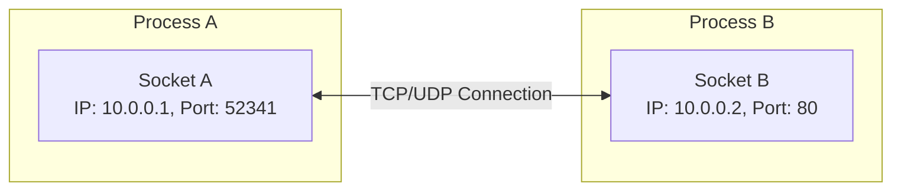
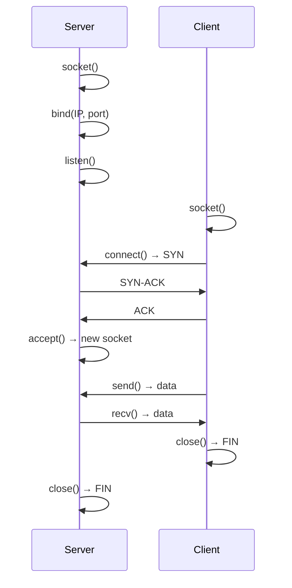
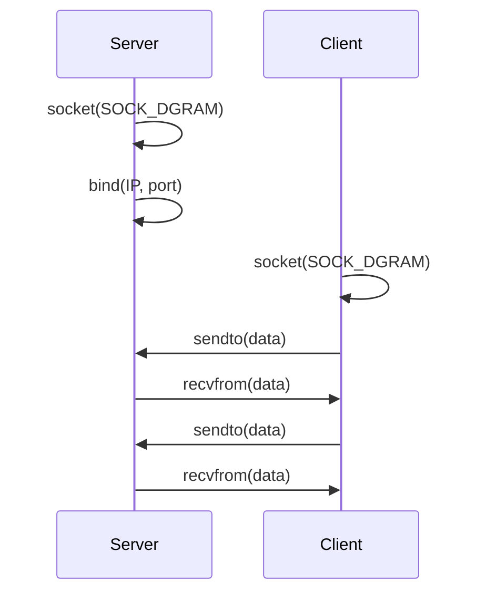
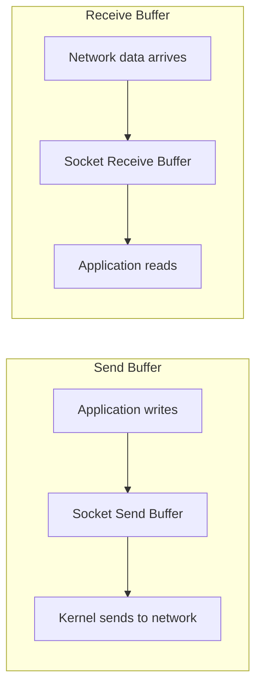

# Sockets

## Overview

A socket is an endpoint for sending or receiving data across a computer network. It's the fundamental programming interface for network communication, providing a file descriptor abstraction for network I/O.

## What is a Socket?



A socket is defined by a 5-tuple:
```
(source IP, source port, destination IP, destination port, protocol)
```

## Socket Types

| Type | Protocol | Characteristics | Use Case |
|------|----------|-----------------|----------|
| **SOCK_STREAM** | TCP | Reliable, ordered, connection-oriented | Web, email, file transfer |
| **SOCK_DGRAM** | UDP | Unreliable, unordered, connectionless | DNS, gaming, video streaming |
| **SOCK_RAW** | IP/ICMP | Direct access to IP headers | ping, traceroute, custom protocols |
| **SOCK_SEQPACKET** | SCTP | Reliable, ordered, message boundaries | Telecom, SS7 |

## Socket API (Berkeley Sockets)

### TCP Socket Lifecycle



### UDP Socket Lifecycle



## Socket States

| State | Description | When |
|-------|-------------|------|
| **CLOSED** | No socket | Before creation or after close |
| **LISTEN** | Waiting for connections | Server after listen() |
| **SYN_SENT** | Connection initiated | Client after connect() |
| **SYN_RECEIVED** | SYN received, SYN-ACK sent | Server receiving SYN |
| **ESTABLISHED** | Connection active | After 3-way handshake |
| **FIN_WAIT_1** | Close initiated | After close() |
| **FIN_WAIT_2** | FIN acknowledged | After ACK of FIN |
| **CLOSE_WAIT** | Remote closed, local hasn't | Receiving FIN |
| **TIME_WAIT** | Waiting for remaining packets | After final ACK |
| **LAST_ACK** | Waiting for final ACK | After sending FIN |
| **CLOSING** | Both sides closing simultaneously | Simultaneous close |

## Socket Options

| Option | Level | Description |
|--------|-------|-------------|
| **SO_REUSEADDR** | SOL_SOCKET | Allow reuse of local addresses |
| **SO_REUSEPORT** | SOL_SOCKET | Allow multiple sockets on same port |
| **SO_KEEPALIVE** | SOL_SOCKET | Enable TCP keepalive |
| **SO_LINGER** | SOL_SOCKET | Control close() behavior |
| **TCP_NODELAY** | IPPROTO_TCP | Disable Nagle's algorithm |
| **SO_SNDBUF** | SOL_SOCKET | Send buffer size |
| **SO_RCVBUF** | SOL_SOCKET | Receive buffer size |
| **SO_RCVTIMEO** | SOL_SOCKET | Receive timeout |
| **SO_SNDTIMEO** | SOL_SOCKET | Send timeout |

## Socket Buffer



When the send buffer is full, `send()` blocks (or returns EAGAIN for non-blocking). When the receive buffer is full, TCP advertises a smaller window (flow control).

## Interview Questions

1. **Q: What is a socket?**
   A: A socket is an endpoint for network communication, identified by (IP, port, protocol). It provides a file descriptor abstraction for sending/receiving data over the network. The Berkeley Sockets API (socket, bind, listen, accept, connect, send, recv) is the standard interface.

2. **Q: What's the difference between socket, bind, listen, and accept?**
   A: `socket()` creates a socket. `bind()` assigns an address (IP+port) to it. `listen()` marks it as passive (server socket). `accept()` waits for and returns a new socket for each incoming connection.

3. **Q: Why does a server need both listen() and accept()?**
   A: `listen()` creates a listening socket that queues incoming connections. `accept()` dequeues a connection and returns a new socket for communicating with that specific client. The listening socket remains open for new connections.

4. **Q: What is SO_REUSEADDR?**
   A: Allows binding to an address that's in TIME_WAIT state. Without it, restarting a server may fail with "Address already in use" because the old socket is still in TIME_WAIT. Essential for server applications.

5. **Q: What is TCP_NODELAY?**
   A: Disables Nagle's algorithm, which buffers small writes into larger TCP segments. With TCP_NODELAY, data is sent immediately. Important for latency-sensitive applications (gaming, SSH, real-time systems).

## Common Mistakes

- Forgetting to call bind() before listen() (OS assigns random port)
- Not setting SO_REUSEADDR (can't restart server quickly)
- Not handling partial reads/writes (send/recv may return less than requested)
- Using blocking sockets in single-threaded servers (blocks on one client)
- Closing the listening socket instead of the accepted socket

## Summary

Sockets are the foundation of network programming. Understanding the socket lifecycle (socket → bind → listen → accept for servers, socket → connect for clients), socket options (SO_REUSEADDR, TCP_NODELAY), and buffer management is essential.

## Cross-References

- [TCP Sockets](tcp.md)
- [UDP Sockets](udp.md)
- [Unix Domain Sockets](unix.md)
- [Non-blocking I/O](nonblocking.md)
- [I/O Multiplexing](io-multiplexing.md)

## Cross References

- [TCP Sockets](tcp.md)
- [UDP Sockets](udp.md)
- [Unix Sockets](unix.md)
- [I/O Multiplexing](io-multiplexing.md)
- [OS IPC Sockets](../../os/processes/ipc-sockets.md)
