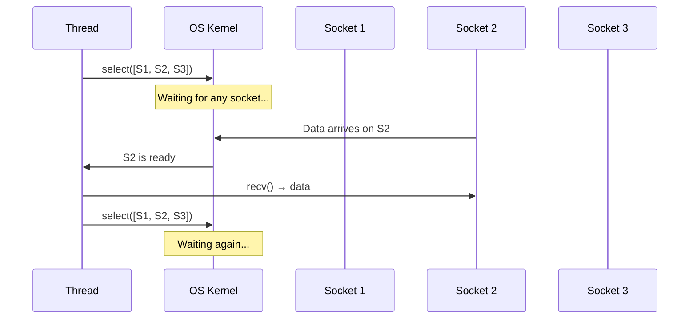
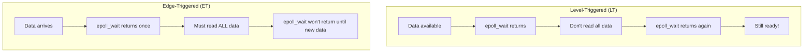
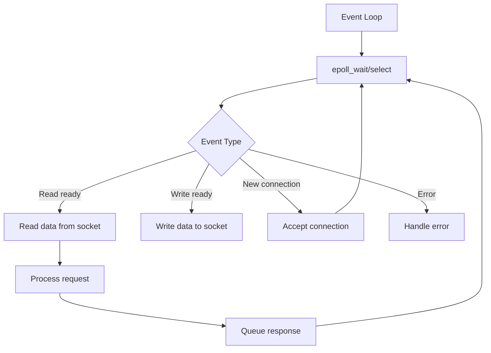

# I/O Multiplexing

## Overview

I/O multiplexing allows a single thread to monitor multiple file descriptors for readiness. Instead of blocking on one socket, the thread asks the OS "which sockets are ready?" and processes only those. This is the key to scalable network servers.

## Why I/O Multiplexing?

Without multiplexing, a thread must choose:
- **Blocking I/O**: Wait for one socket (can't handle others)
- **Non-blocking polling**: Check all sockets in a loop (wastes CPU)

With multiplexing: Wait for **any** socket to be ready, then process it.



## Mechanisms

```mermaid
graph TD
    A[I/O Multiplexing] --> B[select]
    A --> C[poll]
    A --> D[epoll]
    A --> E[kqueue]
    A --> F[IOCP]
    B --> G[POSIX, portable, O(n)]
    C --> H[POSIX, no fd limit, O(n)]
    D --> I[Linux, O(1), scalable]
    E --> J[macOS/BSD, O(1), scalable]
    F --> K[Windows, async I/O]
```

## select()

The original POSIX I/O multiplexing function.

```c
int select(int nfds, fd_set *readfds, fd_set *writefds,
           fd_set *exceptfds, struct timeval *timeout);
```

### Python Example

```python
import select
import socket

server = socket.socket(socket.AF_INET, socket.SOCK_STREAM)
server.setsockopt(socket.SOL_SOCKET, socket.SO_REUSEADDR, 1)
server.bind(('0.0.0.0', 8080))
server.listen(5)

sockets = [server]

while True:
    readable, _, _ = select.select(sockets, [], [])
    
    for sock in readable:
        if sock is server:
            client, addr = server.accept()
            sockets.append(client)
        else:
            data = sock.recv(4096)
            if data:
                sock.send(data)
            else:
                sockets.remove(sock)
                sock.close()
```

### Limitations of select()

| Limitation | Impact |
|-----------|--------|
| **FD_SETSIZE** (typically 1024) | Can't monitor more than 1024 fds |
| **O(n) scanning** | Must check all fds each call |
| **Copies fd_set** | Kernel ↔ user space copy every call |
| **No edge-triggered** | Must re-check readiness |

## poll()

Improved version of select() with no fixed limit.

```c
int poll(struct pollfd *fds, nfds_t nfds, int timeout);
```

### Python Example

```python
import select

# poll returns list of (fd, event) tuples
poller = select.poll()
poller.register(server.fileno(), select.POLLIN)

fd_to_socket = {server.fileno(): server}

while True:
    events = poller.poll()
    for fd, event in events:
        sock = fd_to_socket[fd]
        if sock is server:
            client, addr = server.accept()
            poller.register(client.fileno(), select.POLLIN)
            fd_to_socket[client.fileno()] = client
        elif event & select.POLLIN:
            data = sock.recv(4096)
            if data:
                sock.send(data)
            else:
                poller.unregister(fd)
                del fd_to_socket[fd]
                sock.close()
```

### poll() vs select()

| Feature | select() | poll() |
|---------|----------|--------|
| **Max FDs** | FD_SETSIZE (1024) | No limit |
| **Data structure** | Bitmask (fd_set) | Array of structs |
| **Scanning** | O(n) | O(n) |
| **Resets** | Must reset after each call | No reset needed |
| **Portability** | More portable | POSIX |

## epoll (Linux)

The most scalable I/O multiplexing mechanism on Linux. Used by Nginx, Node.js, Redis, and most high-performance servers.

### Key Advantages

| Feature | epoll | select/poll |
|---------|-------|-------------|
| **Scalability** | O(1) for ready FDs | O(n) for all FDs |
| **FD limit** | Millions | 1024 (select) / unlimited (poll) |
| **Copying** | No per-call copy | Copies every call |
| **Trigger modes** | Level + Edge | Level only |

### epoll API

```c
// Create epoll instance
int epfd = epoll_create1(0);

// Add fd to epoll
struct epoll_event ev = {.events = EPOLLIN, .data.fd = sockfd};
epoll_ctl(epfd, EPOLL_CTL_ADD, sockfd, &ev);

// Wait for events
struct epoll_event events[MAX_EVENTS];
int n = epoll_wait(epfd, events, MAX_EVENTS, timeout_ms);
```

### Python Example

```python
import selectors

# Python selectors automatically uses the best mechanism
sel = selectors.DefaultSelector()  # Uses epoll on Linux

def accept(sock, mask):
    conn, addr = sock.accept()
    conn.setblocking(False)
    sel.register(conn, selectors.EVENT_READ, read)

def read(conn, mask):
    data = conn.recv(4096)
    if data:
        conn.send(data)
    else:
        sel.unregister(conn)
        conn.close()

server = socket.socket(socket.AF_INET, socket.SOCK_STREAM)
server.setsockopt(socket.SOL_SOCKET, socket.SO_REUSEADDR, 1)
server.bind(('0.0.0.0', 8080))
server.listen(100)
server.setblocking(False)

sel.register(server, selectors.EVENT_READ, accept)

while True:
    events = sel.select()
    for key, mask in events:
        callback = key.data
        callback(key.fileobj, mask)
```

### Level-Triggered vs Edge-Triggered



| Mode | Behavior | Use Case |
|------|----------|----------|
| **Level-triggered (LT)** | Reports readiness as long as fd is ready | Simpler, default |
| **Edge-triggered (ET)** | Reports only on state change (new data) | Higher performance, must drain buffer |

**Edge-triggered (EPOLLET)** requires:
- Non-blocking sockets
- Read until EAGAIN
- Write until EAGAIN
- More complex but more efficient

## kqueue (macOS/BSD)

Similar to epoll, but for BSD-based systems:

```c
int kq = kqueue();
struct kevent change;
EV_SET(&change, sockfd, EVFILT_READ, EV_ADD, 0, 0, NULL);
kevent(kq, &change, 1, NULL, 0, NULL);

struct kevent event;
int n = kevent(kq, NULL, 0, &event, 1, NULL);
```

## IOCP (Windows)

Windows' asynchronous I/O model (I/O Completion Ports):

```c
HANDLE iocp = CreateIoCompletionPort(INVALID_HANDLE_VALUE, NULL, 0, 0);
// Associate socket with IOCP
CreateIoCompletionPort((HANDLE)sock, iocp, completion_key, 0);
// Post I/O operations, get completions from GetQueuedCompletionStatus()
```

## Mechanism Comparison

| Feature | select | poll | epoll | kqueue | IOCP |
|---------|--------|------|-------|--------|------|
| **OS** | All POSIX | All POSIX | Linux | macOS/BSD | Windows |
| **Max FDs** | 1024 | Unlimited | Millions | Millions | N/A |
| **Complexity** | O(n) | O(n) | O(1) | O(1) | O(1) |
| **Trigger** | Level | Level | Level+Edge | Level+Edge | Async |
| **API** | Simple | Simple | Moderate | Moderate | Complex |

## Event Loop Architecture



## Interview Questions

1. **Q: What is I/O multiplexing and why is it needed?**
   A: I/O multiplexing lets one thread monitor multiple file descriptors for readiness. Without it, a thread must either block on one socket or busy-poll all sockets. Multiplexing efficiently waits for any socket to be ready.

2. **Q: What's the difference between select, poll, and epoll?**
   A: select: 1024 FD limit, O(n), copies bitmask every call. poll: no FD limit, O(n), no copy. epoll: no FD limit, O(1) for ready FDs, registered once, edge-triggered support. epoll is the most scalable for high-connection servers.

3. **Q: What is level-triggered vs edge-triggered?**
   A: Level-triggered reports readiness whenever the fd is ready (multiple notifications if not drained). Edge-triggered reports only on state change (one notification per new data). Edge-triggered requires reading all data until EAGAIN.

4. **Q: Why does Nginx use epoll?**
   A: Nginx handles thousands of concurrent connections. epoll provides O(1) notification for ready FDs, no per-call copying, and edge-triggered mode. This allows Nginx to handle 100K+ connections with minimal CPU overhead.

5. **Q: What is the C10K problem and how does epoll solve it?**
   A: C10K = handling 10,000 concurrent connections. Thread-per-connection fails at this scale. epoll solves it: one thread monitors all connections, O(1) notifications, no per-call overhead. Modern servers handle 1M+ connections this way.

6. **Q: What is the Python selectors module?**
   A: A high-level interface that automatically selects the best I/O multiplexing mechanism (epoll on Linux, kqueue on macOS, select on Windows). Use `selectors.DefaultSelector()` for portable, efficient I/O multiplexing.

## Common Mistakes

- Using select() with >1024 FDs (FD_SETSIZE limit)
- Not reading all data in edge-triggered mode (stuck in EAGAIN)
- Busy-polling after select/epoll returns (defeats the purpose)
- Not using non-blocking sockets with epoll
- Forgetting to remove closed FDs from the monitored set

## Summary

I/O multiplexing enables scalable network servers by letting one thread monitor many sockets. select() is portable but limited. poll() removes the FD limit. epoll (Linux) and kqueue (macOS) provide O(1) scalability. The Python selectors module provides a portable abstraction.

## Cross-References

- [Sockets Overview](README.md)
- [Non-blocking I/O](nonblocking.md) — Required companion
- [TCP Sockets](tcp.md) — Socket basics
- [Load Balancing](../load-balancing/README.md) — Server architecture
