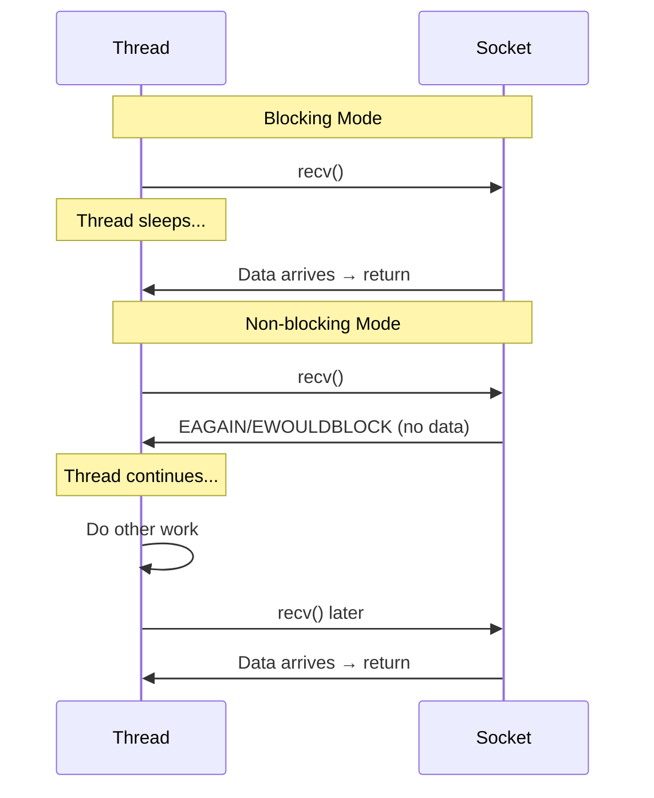
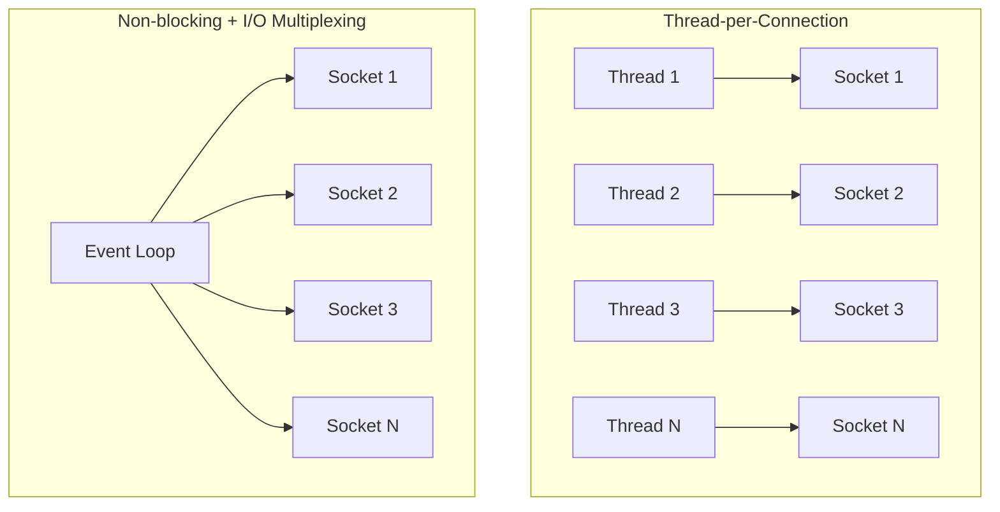

# Non-blocking I/O

## Overview

Non-blocking I/O allows a socket to return immediately when an operation would block, instead of waiting. This enables a single thread to handle multiple connections efficiently, which is fundamental to high-performance network servers.

## Blocking vs Non-blocking



## Setting Non-blocking Mode

### fcntl (POSIX)

```python
import socket, fcntl, os

sock = socket.socket(socket.AF_INET, socket.SOCK_STREAM)
flags = fcntl.fcntl(sock.fileno(), fcntl.F_GETFL)
fcntl.fcntl(sock.fileno(), fcntl.F_SETFL, flags | os.O_NONBLOCK)
```

### ioctl

```c
int mode = 1;
ioctl(sockfd, FIONBIO, &mode);
```

### Python 3.7+

```python
sock.setblocking(False)
# or
sock.settimeout(0)
```

## Non-blocking Socket Behavior

| Operation | Blocking Mode | Non-blocking Mode |
|-----------|--------------|-------------------|
| **accept()** | Waits for connection | Returns EAGAIN if no connections |
| **connect()** | Waits for handshake | Returns EINPROGRESS |
| **recv()** | Waits for data | Returns EAGAIN if no data |
| **send()** | Waits for buffer space | Returns EAGAIN if buffer full |

## Non-blocking TCP Server

```python
import socket
import selectors

sel = selectors.DefaultSelector()

def accept(sock, mask):
    conn, addr = sock.accept()
    conn.setblocking(False)
    sel.register(conn, selectors.EVENT_READ, read)

def read(conn, mask):
    data = conn.recv(4096)
    if data:
        conn.send(data)  # Echo
    else:
        sel.unregister(conn)
        conn.close()

# Setup
server = socket.socket(socket.AF_INET, socket.SOCK_STREAM)
server.setsockopt(socket.SOL_SOCKET, socket.SO_REUSEADDR, 1)
server.bind(('0.0.0.0', 8080))
server.listen(100)
server.setblocking(False)

sel.register(server, selectors.EVENT_READ, accept)

# Event loop
while True:
    events = sel.select()  # Blocks until events ready
    for key, mask in events:
        callback = key.data
        callback(key.fileobj, mask)
```

## The Problem: Busy Waiting

```python
# BAD: Busy waiting (wastes CPU)
while True:
    try:
        data = sock.recv(4096)
    except BlockingIOError:
        continue  # Spin loop!
```

**Solution**: I/O multiplexing (select, poll, epoll) — see [I/O Multiplexing](io-multiplexing.md).

## Non-blocking connect()

```python
import socket, selectors

sock = socket.socket(socket.AF_INET, socket.SOCK_STREAM)
sock.setblocking(False)

try:
    sock.connect(('example.com', 80))
except BlockingIOError:
    pass  # Connection in progress

sel = selectors.DefaultSelector()
sel.register(sock, selectors.EVENT_WRITE)

events = sel.select()  # Wait for connection to complete
for key, mask in events:
    err = sock.getsockopt(socket.SOL_SOCKET, socket.SO_ERROR)
    if err == 0:
        print("Connected!")
    else:
        print(f"Connection failed: {err}")
```

## Non-blocking with asyncio (Python)

```python
import asyncio

async def handle_client(reader, writer):
    data = await reader.read(4096)
    writer.write(data)
    await writer.drain()
    writer.close()

async def main():
    server = await asyncio.start_server(handle_client, '0.0.0.0', 8080)
    async with server:
        await server.serve_forever()

asyncio.run(main())
```

## Performance Comparison



| Model | Threads | Memory | Context Switches | Max Connections |
|-------|---------|--------|-----------------|-----------------|
| Thread-per-connection | N | High | High | ~10K (thread limits) |
| Non-blocking + epoll | 1 | Low | None | ~1M+ |

## Interview Questions

1. **Q: What is non-blocking I/O?**
   A: A socket mode where operations return immediately instead of waiting. If no data is available, recv() returns EAGAIN/EWOULDBLOCK instead of blocking the thread. This allows one thread to handle many connections.

2. **Q: What's the difference between blocking and non-blocking sockets?**
   A: Blocking sockets make the thread wait until the operation completes. Non-blocking sockets return immediately with either the result or an error (EAGAIN). Non-blocking requires I/O multiplexing to know when operations can proceed.

3. **Q: Why not just use threads for each connection?**
   A: Thread-per-connection doesn't scale: each thread uses ~1MB stack, context switches are expensive, and OS thread limits are low (~10K). Non-blocking I/O with one thread can handle millions of connections (C10K/C1M problem).

4. **Q: What is the C10K problem?**
   A: The challenge of handling 10,000+ concurrent connections. Traditional thread-per-connection fails at this scale. Solutions: non-blocking I/O with epoll/kqueue, event-driven architectures, async I/O.

5. **Q: What is EAGAIN/EWOULDBLOCK?**
   A: Error codes returned by non-blocking sockets when an operation would block. EAGAIN = "try again later" (no data available). EWOULDBLOCK = "operation would block". On most systems, they're the same value.

## Common Mistakes

- Busy waiting on non-blocking sockets (wastes CPU)
- Not using I/O multiplexing with non-blocking sockets
- Forgetting that connect() returns EINPROGRESS (not error)
- Not checking SO_ERROR after non-blocking connect completes
- Using blocking sockets in event loops (defeats the purpose)

## Summary

Non-blocking I/O allows a single thread to handle multiple sockets by returning immediately instead of waiting. Combined with I/O multiplexing (epoll, kqueue), it's the foundation of high-performance servers (Nginx, Node.js, Redis).

## Cross-References

- [Sockets Overview](README.md)
- [I/O Multiplexing](io-multiplexing.md) — The missing piece
- [TCP Sockets](tcp.md) — Blocking TCP
- [UDP Sockets](udp.md) — Non-blocking UDP

## Cross References

- [I/O Multiplexing](io-multiplexing.md)
- [OS I/O Buffering](../../os/io/buffering.md)
- [Concurrency](../../concurrency/overview.md)
