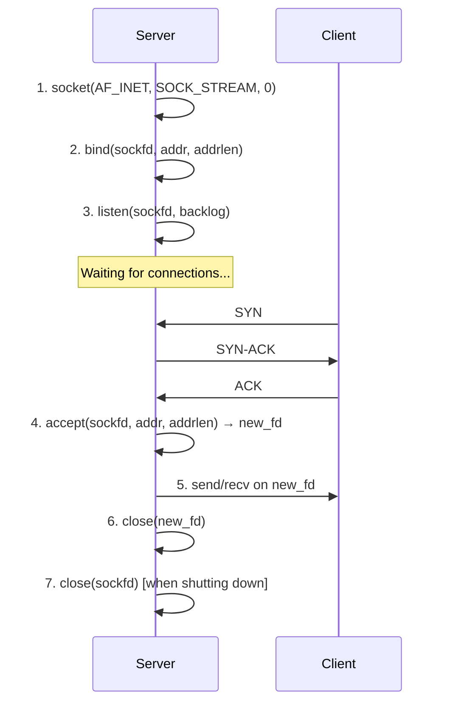
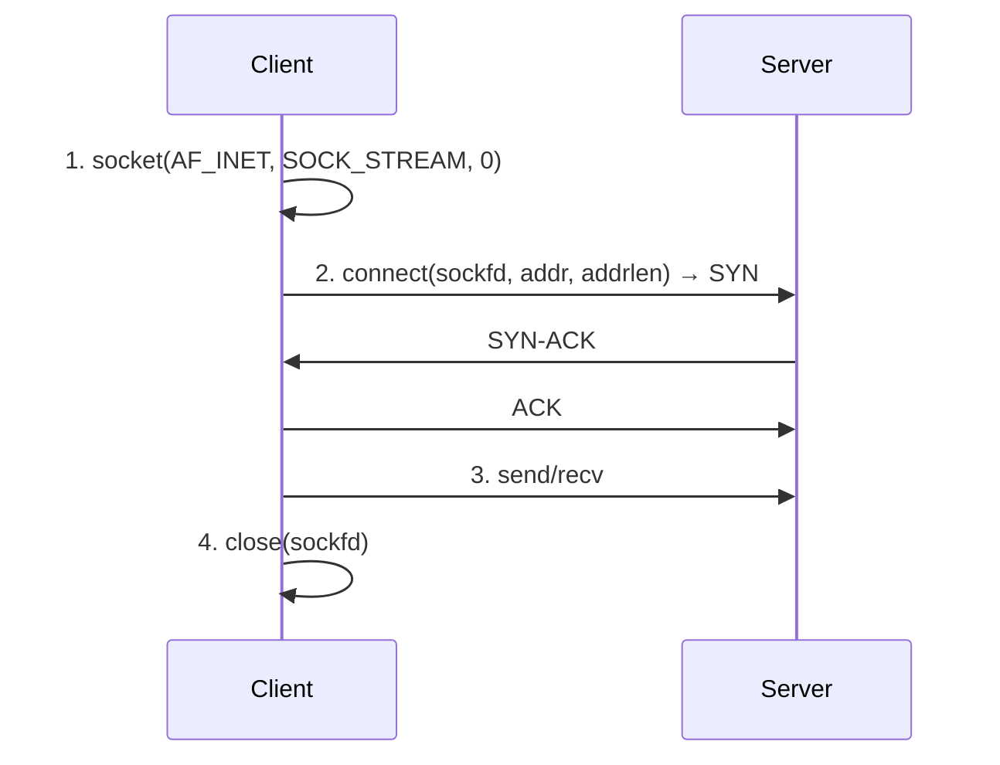
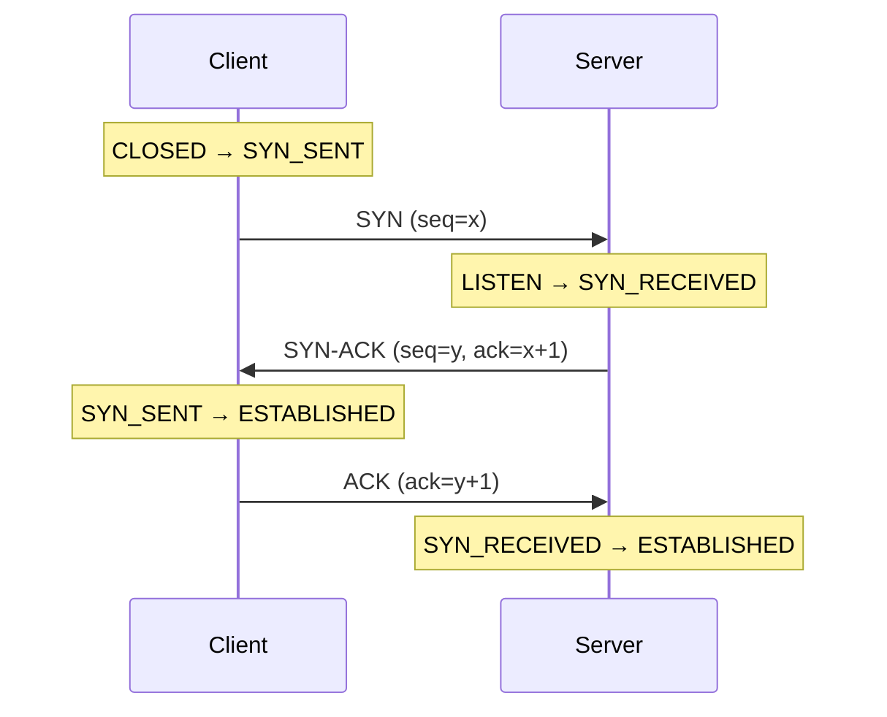
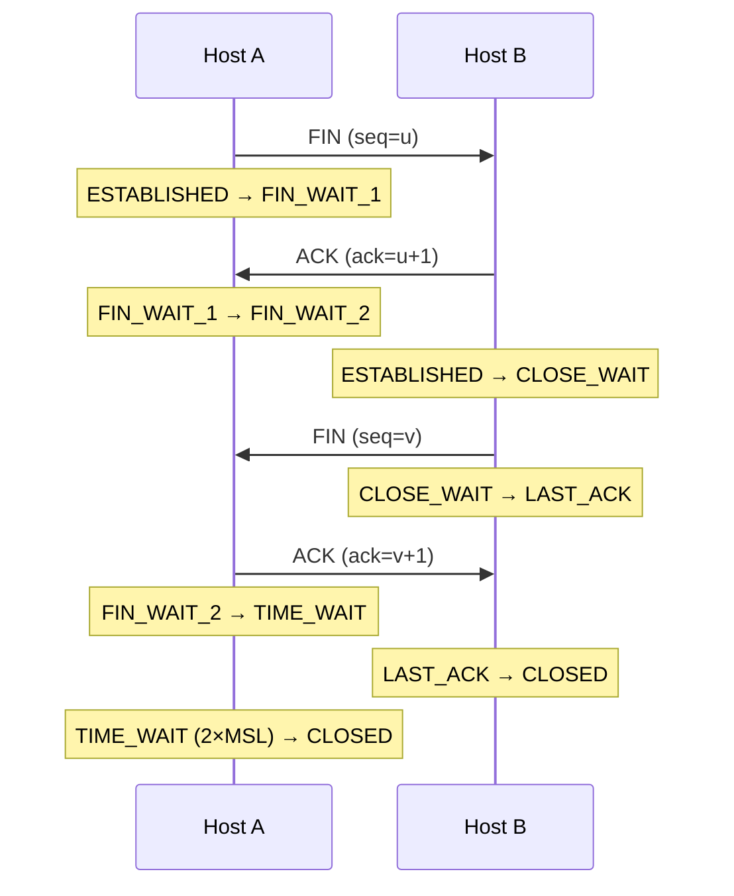
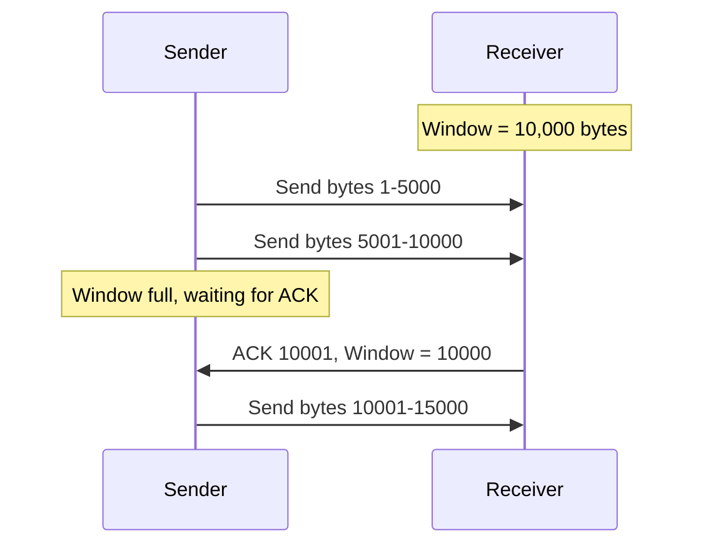
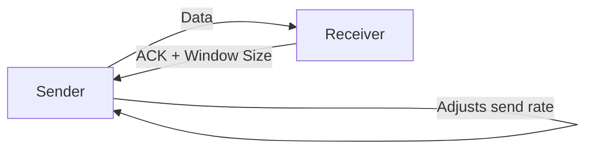
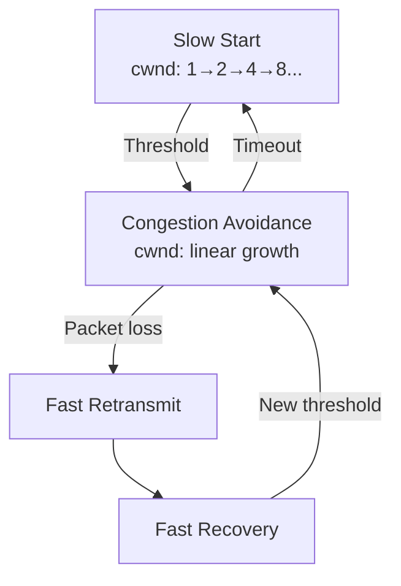

# TCP Sockets

## Overview

TCP (Transmission Control Protocol) sockets provide **reliable, ordered, connection-oriented** byte-stream communication. They're the most common socket type, used by HTTP, SSH, email, and virtually all applications requiring guaranteed delivery.

## TCP Socket Lifecycle

### Server Side



### Client Side



## TCP 3-Way Handshake



## TCP Connection Teardown



## TCP Server Code Example (Python)

```python
import socket

# Create TCP socket
server = socket.socket(socket.AF_INET, socket.SOCK_STREAM)

# Allow address reuse
server.setsockopt(socket.SOL_SOCKET, socket.SO_REUSEADDR, 1)

# Bind to address
server.bind(('0.0.0.0', 8080))

# Listen for connections (backlog = 128)
server.listen(128)

print("Server listening on port 8080...")

while True:
    # Accept new connection
    client_fd, client_addr = server.accept()
    print(f"Connection from {client_addr}")
    
    # Receive data
    data = client_fd.recv(4096)
    if data:
        # Echo back
        client_fd.send(data)
    
    # Close connection
    client_fd.close()
```

## TCP Client Code Example (Python)

```python
import socket

# Create TCP socket
client = socket.socket(socket.AF_INET, socket.SOCK_STREAM)

# Connect to server
client.connect(('127.0.0.1', 8080))

# Send data
client.send(b"Hello, Server!")

# Receive response
data = client.recv(4096)
print(f"Received: {data.decode()}")

# Close
client.close()
```

## TCP Key Concepts

### Nagle's Algorithm

Buffers small writes into larger TCP segments to reduce overhead.

```
Without Nagle: Send 1 byte, send 1 byte, send 1 byte → 3 packets
With Nagle:    Buffer 1 byte, buffer 1 byte, send 3 bytes → 1 packet
```

**Disable with**: `TCP_NODELAY` for latency-sensitive applications.

### TCP Window Size

Controls how much data can be sent before requiring an acknowledgment.



### TCP Flow Control

Receiver advertises its window size (buffer space). Sender cannot send more than the window allows.



### TCP Congestion Control

Algorithms that prevent network congestion:

| Algorithm | Description |
|-----------|-------------|
| **Slow Start** | Exponential growth until threshold |
| **Congestion Avoidance** | Linear growth after threshold |
| **Fast Retransmit** | Retransmit after 3 duplicate ACKs |
| **Fast Recovery** | Don't reset to slow start after fast retransmit |
| **CUBIC** | Linux default, cubic function growth |
| **BBR** | Google's algorithm, model-based |



## TCP Socket Options

| Option | Purpose | Example |
|--------|---------|---------|
| **TCP_NODELAY** | Disable Nagle's algorithm | Low-latency apps |
| **TCP_KEEPALIVE** | Enable keepalive probes | Long-lived connections |
| **TCP_CORK** | Batch small writes | Linux-specific |
| **TCP_QUICKACK** | Disable delayed ACKs | Linux-specific |
| **TCP_MAXSEG** | Set maximum segment size | Path MTU optimization |

## Interview Questions

1. **Q: Walk me through the TCP 3-way handshake.**
   A: 1) Client sends SYN (seq=x). 2) Server responds with SYN-ACK (seq=y, ack=x+1). 3) Client sends ACK (ack=y+1). Both sides are now ESTABLISHED. Purpose: synchronize sequence numbers and agree on connection parameters.

2. **Q: Why does TCP need a 3-way handshake (not 2-way)?**
   A: With 2-way, the server can't confirm the client received its SYN-ACK. The 3rd ACK confirms to the server that the client is ready. Also prevents old duplicate SYN packets from creating phantom connections.

3. **Q: What is TIME_WAIT?**
   A: After closing, the endpoint that sent the final ACK waits 2×MSL (typically 60s). Purpose: 1) Ensure the remote receives the ACK (if lost, remote retransmits FIN), 2) Allow remaining packets to expire. Can cause "Address already in use" errors — use SO_REUSEADDR.

4. **Q: What is Nagle's algorithm and when should you disable it?**
   A: Nagle's buffers small writes into larger segments (saves bandwidth, adds latency). Disable with TCP_NODELAY for: interactive applications (SSH, telnet), real-time systems (gaming), or when you're already batching data at the application layer.

5. **Q: Explain TCP flow control.**
   A: The receiver advertises a "window size" indicating how much data it can buffer. The sender limits unacknowledged data to this window. If the window reaches 0, the sender stops and periodically probes to check if window has opened.

6. **Q: What's the difference between flow control and congestion control?**
   A: Flow control prevents overwhelming the **receiver** (uses window size). Congestion control prevents overwhelming the **network** (uses algorithms like slow start, congestion avoidance). Both limit send rate but for different reasons.

## Common Mistakes

- Not handling partial reads/writes (recv may return less than requested)
- Forgetting SO_REUSEADDR (server can't restart during TIME_WAIT)
- Not understanding that send() may not send all data at once
- Confusing flow control (receiver-driven) with congestion control (network-driven)
- Forgetting that close() initiates the 4-way teardown (not immediate)

## Summary

TCP sockets provide reliable, ordered, connection-oriented communication. The 3-way handshake establishes connections, flow/congestion control manages data transfer, and the 4-way teardown (with TIME_WAIT) closes them. Understanding Nagle's algorithm, window sizing, and socket options is essential.

## Cross-References

- [Sockets Overview](README.md)
- [UDP Sockets](udp.md) — Connectionless alternative
- [Non-blocking I/O](nonblocking.md) — Async socket usage
- [I/O Multiplexing](io-multiplexing.md) — Handling multiple connections
