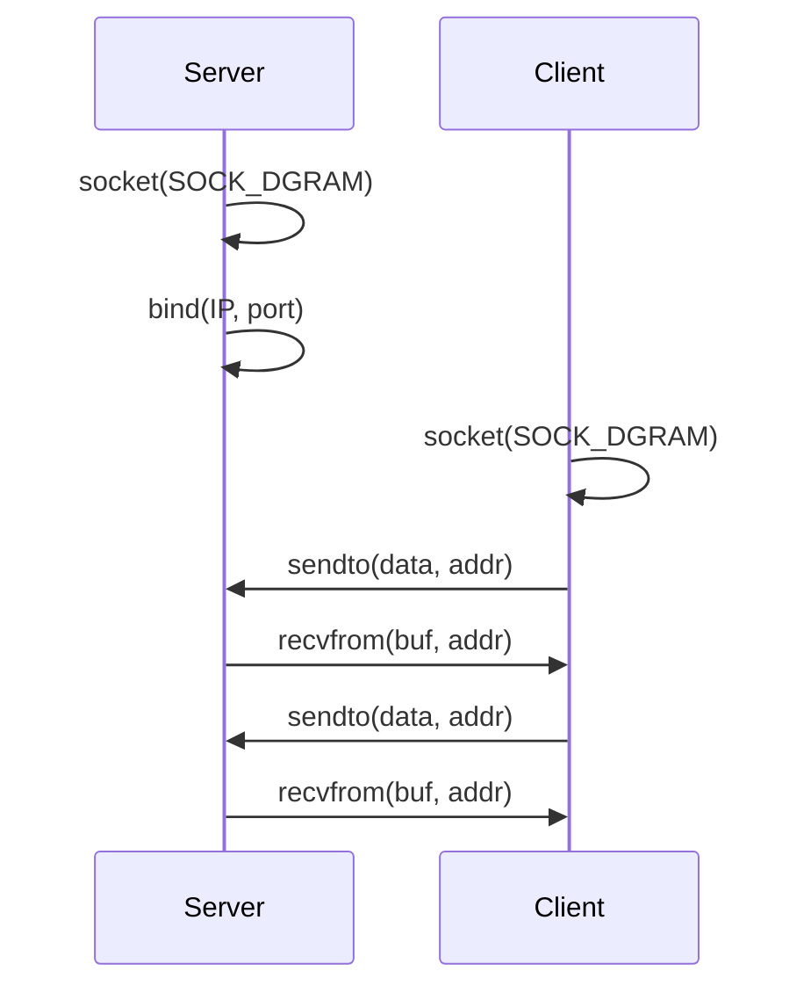
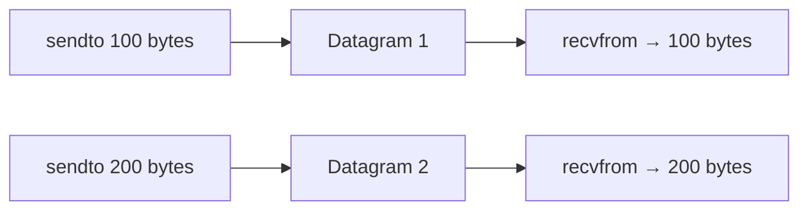
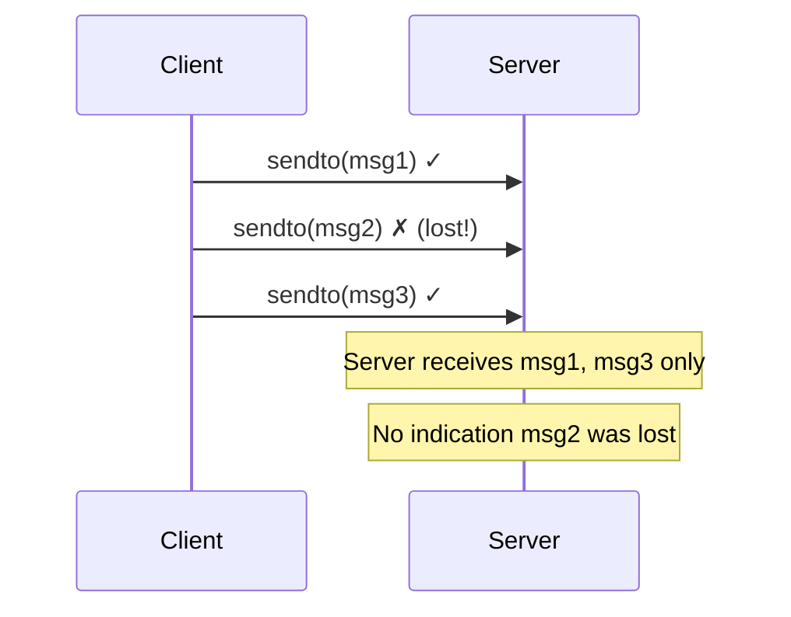
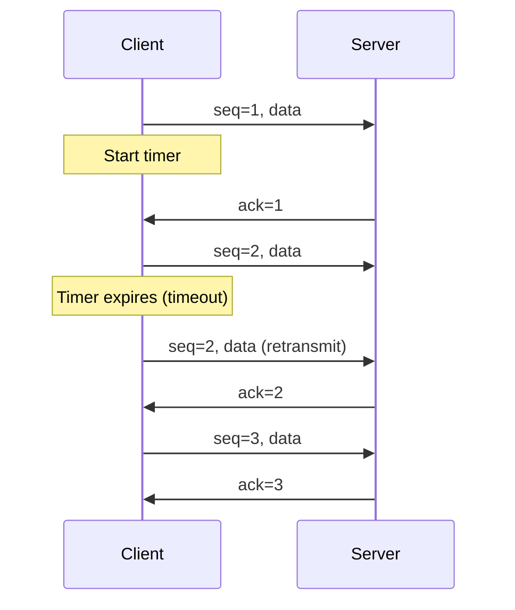

# UDP Sockets

## Overview

UDP (User Datagram Protocol) sockets provide **unreliable, unordered, connectionless** message-based communication. They're simpler and faster than TCP but don't guarantee delivery, ordering, or duplicate protection.

## UDP vs TCP

| Feature | TCP | UDP |
|---------|-----|-----|
| **Connection** | Connection-oriented (3-way handshake) | Connectionless |
| **Reliability** | Guaranteed delivery | Best-effort (may lose packets) |
| **Ordering** | Ordered (sequence numbers) | Unordered |
| **Duplication** | No duplicates | Possible duplicates |
| **Message boundaries** | Byte stream (no boundaries) | Message/datagram (preserved) |
| **Flow control** | Yes (window size) | No |
| **Congestion control** | Yes | No |
| **Overhead** | Higher (headers, ACKs) | Lower (8-byte header) |
| **Speed** | Slower | Faster |
| **Use case** | Web, email, file transfer | DNS, gaming, video, VoIP |

## UDP Header

```
 0                   1                   2                   3
 0 1 2 3 4 5 6 7 8 9 0 1 2 3 4 5 6 7 8 9 0 1 2 3 4 5 6 7 8 9 0 1
+-+-+-+-+-+-+-+-+-+-+-+-+-+-+-+-+-+-+-+-+-+-+-+-+-+-+-+-+-+-+-+-+
|          Source Port          |       Destination Port        |
+-+-+-+-+-+-+-+-+-+-+-+-+-+-+-+-+-+-+-+-+-+-+-+-+-+-+-+-+-+-+-+-+
|            Length             |           Checksum            |
+-+-+-+-+-+-+-+-+-+-+-+-+-+-+-+-+-+-+-+-+-+-+-+-+-+-+-+-+-+-+-+-+
```

**Only 8 bytes** vs TCP's 20+ bytes.

## UDP Socket Lifecycle



**No handshake, no connection setup** — each sendto/recvfrom is independent.

## UDP Server Code Example (Python)

```python
import socket

# Create UDP socket
server = socket.socket(socket.AF_INET, socket.SOCK_DGRAM)

# Bind to address
server.bind(('0.0.0.0', 5353))

print("UDP server listening on port 5353...")

while True:
    # Receive data and sender address
    data, client_addr = server.recvfrom(4096)
    print(f"Received from {client_addr}: {data.decode()}")
    
    # Send response
    server.sendto(b"ACK: " + data, client_addr)
```

## UDP Client Code Example (Python)

```python
import socket

# Create UDP socket
client = socket.socket(socket.AF_INET, socket.SOCK_DGRAM)

# Send data (no connect needed)
client.sendto(b"Hello, UDP!", ('127.0.0.1', 5353))

# Receive response
data, server_addr = client.recvfrom(4096)
print(f"Received: {data.decode()}")

client.close()
```

## Key UDP Characteristics

### Message Boundaries

UDP preserves message boundaries. Each `sendto()` creates a separate datagram that must be received with a single `recvfrom()`.



With TCP, the receiver might get 50+50 bytes, or 300 bytes — no boundaries.

### No Reliability



### No Ordering

Packets may arrive out of order:

```
Sent:     msg1, msg2, msg3
Received: msg3, msg1, msg2  (or any order)
```

## When to Use UDP

| Use Case | Why UDP |
|----------|---------|
| **DNS** | Small request/response, no connection overhead |
| **DHCP** | Client doesn't have IP yet (can't establish TCP) |
| **VoIP/Video** | Latency matters more than loss (human perception tolerates gaps) |
| **Gaming** | Real-time updates; old data is useless |
| **IoT/Sensors** | Simple telemetry, low overhead |
| **Multicast/Broadcast** | TCP doesn't support multicast |
| **TFTP** | Simple file transfer (implements reliability at app layer) |

## Adding Reliability to UDP

Since UDP doesn't provide reliability, applications must implement it themselves:



**Application-level reliability includes**:
- Sequence numbers (detect ordering/duplicates)
- Acknowledgments (confirm receipt)
- Retransmission (resend lost packets)
- Checksums (detect corruption — UDP has a basic one)

## UDP and Broadcast/Multicast

```python
# Broadcast
sock = socket.socket(socket.AF_INET, socket.SOCK_DGRAM)
sock.setsockopt(socket.SOL_SOCKET, socket.SO_BROADCAST, 1)
sock.sendto(b"Hello everyone!", ('<broadcast>', 9999))

# Multicast
sock = socket.socket(socket.AF_INET, socket.SOCK_DGRAM)
sock.setsockopt(socket.IPPROTO_IP, socket.IP_ADD_MEMBERSHIP,
    socket.inet_aton('224.0.0.1') + socket.inet_aton('0.0.0.0'))
sock.bind(('0.0.0.0', 9999))
```

## UDP Socket Options

| Option | Purpose |
|--------|---------|
| **SO_BROADCAST** | Enable broadcast sending |
| **IP_ADD_MEMBERSHIP** | Join multicast group |
| **SO_RCVBUF** | Receive buffer size |
| **SO_SNDBUF** | Send buffer size |
| **IP_MULTICAST_TTL** | Multicast hop limit |

## Interview Questions

1. **Q: When would you choose UDP over TCP?**
   A: When latency matters more than reliability (VoIP, gaming), for simple request/response protocols (DNS, DHCP), for multicast/broadcast, or when you want to implement custom reliability at the application layer.

2. **Q: Does UDP have any reliability?**
   A: UDP itself provides no reliability. However, it has a checksum for error detection (not correction). Some applications (like QUIC/HTTP3) build reliability on top of UDP at the application layer.

3. **Q: What are message boundaries in UDP?**
   A: Each sendto() creates a distinct datagram. The receiver gets exactly what was sent in each sendto(). TCP, by contrast, is a byte stream — data from multiple send() calls may be received in a single recv().

4. **Q: Why does DNS use UDP?**
   A: DNS queries are small (typically <512 bytes), request/response based, and benefit from minimal overhead. The application handles retries if no response is received. TCP is used for large responses (>512 bytes) or zone transfers.

5. **Q: What is QUIC and how does it relate to UDP?**
   A: QUIC (RFC 9000) is a transport protocol built on UDP that provides TCP-like reliability with lower latency. It's the basis of HTTP/3. It implements: 0-RTT connection establishment, multiplexed streams, and built-in TLS 1.3.

6. **Q: Can UDP guarantee ordering?**
   A: No, not by itself. Packets may arrive out of order. If ordering is needed, the application must implement sequence numbers and reordering logic.

## Common Mistakes

- Assuming UDP is always faster (for bulk transfers, TCP may be better due to congestion control)
- Not handling lost packets (application must implement retry logic if needed)
- Forgetting that UDP has message boundaries (don't treat it like a byte stream)
- Not knowing that UDP supports broadcast and multicast (TCP doesn't)
- Confusing UDP's checksum (basic error detection) with reliability

## Summary

UDP is a simple, fast, connectionless protocol. It preserves message boundaries but doesn't guarantee delivery or ordering. Use it for real-time applications, DNS, and when you need custom transport logic. QUIC builds reliability on top of UDP for modern web traffic.

## Cross-References

- [Sockets Overview](README.md)
- [TCP Sockets](tcp.md) — Reliable alternative
- [Unix Domain Sockets](unix.md) — Local IPC
- [Non-blocking I/O](nonblocking.md) — Async UDP

## Cross References

- [UDP Protocol](../udp/README.md)
- [TCP Sockets](tcp.md)
