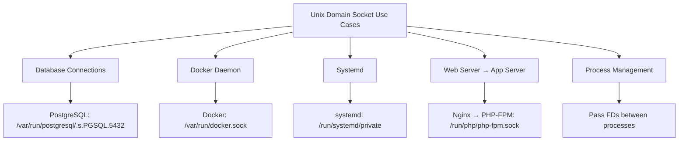

# Unix Domain Sockets

## Overview

Unix domain sockets (UDS) provide inter-process communication (IPC) on the **same machine**. They use the filesystem as an address namespace instead of IP addresses and ports. They're faster than TCP/UDP sockets because they bypass the network stack entirely.

## Why Unix Domain Sockets?

- **Speed**: No network stack overhead — data stays in kernel memory
- **Security**: Filesystem permissions control access (no network exposure)
- **Simplicity**: No need for IP addresses, ports, or DNS
- **Reliability**: No network failures — just local IPC
- **File descriptor passing**: Can pass file descriptors between processes

## UDS vs Network Sockets

| Feature | Unix Domain Socket | TCP/UDP Socket |
|---------|-------------------|----------------|
| **Addressing** | Filesystem path | IP:Port |
| **Scope** | Same machine only | Network-wide |
| **Speed** | Faster (no network stack) | Slower (network overhead) |
| **Security** | File permissions | Network security (firewall, TLS) |
| **Protocol** | Stream or Datagram | TCP or UDP |
| **Overhead** | Minimal | TCP/UDP/IP headers |
| **FD passing** | Yes (SCM_RIGHTS) | No |

## Socket Types in UDS

| Type | Constant | Similar to |
|------|----------|------------|
| Stream | `SOCK_STREAM` | TCP (reliable, ordered) |
| Datagram | `SOCK_DGRAM` | UDP (message boundaries) |
| Sequential Packet | `SOCK_SEQPACKET` | SCTP (reliable, message boundaries) |

## UDS Address (sockaddr_un)

```c
struct sockaddr_un {
    sa_family_t sun_family;     // AF_UNIX
    char        sun_path[108];  // filesystem path
};
```

Example address: `/var/run/myapp.sock`

## UDS Server Example (Python)

```python
import socket
import os

SOCKET_PATH = "/tmp/myapp.sock"

# Remove old socket file if exists
if os.path.exists(SOCKET_PATH):
    os.unlink(SOCKET_PATH)

# Create Unix domain socket (stream type)
server = socket.socket(socket.AF_UNIX, socket.SOCK_STREAM)

# Bind to filesystem path
server.bind(SOCKET_PATH)

# Set permissions (only owner can connect)
os.chmod(SOCKET_PATH, 0o600)

# Listen for connections
server.listen(5)

print(f"Listening on {SOCKET_PATH}...")

while True:
    conn, _ = server.accept()
    data = conn.recv(4096)
    if data:
        print(f"Received: {data.decode()}")
        conn.send(b"ACK: " + data)
    conn.close()
```

## UDS Client Example (Python)

```python
import socket

SOCKET_PATH = "/tmp/myapp.sock"

# Create Unix domain socket
client = socket.socket(socket.AF_UNIX, socket.SOCK_STREAM)

# Connect (no IP/port needed)
client.connect(SOCKET_PATH)

client.send(b"Hello via UDS!")
data = client.recv(4096)
print(f"Received: {data.decode()}")

client.close()
```

## File Descriptor Passing

A unique feature of UDS — pass open file descriptors between processes:

```python
# Sender: pass a file descriptor
import socket, os

sock = socket.socket(socket.AF_UNIX, socket.SOCK_STREAM)
sock.connect("/tmp/helper.sock")

# Open a file
fd = os.open("/data/file.txt", os.O_RDONLY)

# Send the file descriptor to another process
sock.sendmsg(
    [b"data"],                          # message data
    [(socket.SOL_SOCKET, socket.SCM_RIGHTS, fd)]  # ancillary data
)
os.close(fd)
```

```python
# Receiver: receive the file descriptor
import socket, os

sock = socket.socket(socket.AF_UNIX, socket.SOCK_STREAM)
sock.bind("/tmp/helper.sock")
sock.listen(1)
conn, _ = sock.accept()

# Receive file descriptor
msg, ancdata, flags, addr = conn.recvmsg(4096, socket.CMSG_LEN(4))
for level, type, data in ancdata:
    if level == socket.SOL_SOCKET and type == socket.SCM_RIGHTS:
        fd = int.from_bytes(data, 'little')
        content = os.read(fd, 1024)
        print(f"Received FD {fd}: {content.decode()}")
        os.close(fd)
```

## Use Cases



## Common Applications Using UDS

| Application | Socket Path | Use |
|-------------|-------------|-----|
| **PostgreSQL** | `/var/run/postgresql/.s.PGSQL.5432` | Database connections |
| **Docker** | `/var/run/docker.sock` | Docker API |
| **MySQL** | `/var/run/mysqld/mysqld.sock` | Database connections |
| **Nginx + PHP-FPM** | `/run/php/php-fpm.sock` | FastCGI |
| **Redis** | `/var/run/redis/redis.sock` | Cache connections |
| **systemd** | `/run/systemd/private` | System management |

## Security

```bash
# Check socket permissions
ls -la /var/run/docker.sock
# srw-rw---- 1 root docker 0 Jan  1 00:00 /var/run/docker.sock

# Only root and docker group can access
# This is why adding a user to 'docker' group gives root-equivalent access
```

**Security considerations**:
- File permissions control who can connect
- No encryption needed (data never leaves the machine)
- No network attack surface
- Socket file in `/tmp` may be vulnerable to symlink attacks

## Interview Questions

1. **Q: What is a Unix domain socket?**
   A: An IPC mechanism that uses the filesystem for addressing instead of IP:port. Data stays in kernel memory (no network stack), making it faster than TCP. Used for local communication between processes (databases, Docker, web servers).

2. **Q: When would you use a Unix domain socket instead of TCP?**
   A: When processes are on the same machine and you want: faster communication (no network overhead), filesystem-based security (no network exposure), or file descriptor passing. Don't use it for cross-machine communication.

3. **Q: How do Unix domain sockets compare to shared memory?**
   A: UDS use the kernel as an intermediary (send/recv), providing natural synchronization. Shared memory is faster (no copy) but requires explicit synchronization (semaphores, mutexes). UDS are simpler; shared memory is faster for high-throughput.

4. **Q: What is file descriptor passing?**
   A: A UDS feature (SCM_RIGHTS) that lets one process send an open file descriptor to another process. The receiving process gets a new FD number pointing to the same file description. Used by web servers (Nginx) to pass client connections to workers.

5. **Q: Why does Docker use a Unix domain socket?**
   A: Docker daemon listens on `/var/run/docker.sock` for local API access. This provides: filesystem-based security (only root/docker group can access), no network exposure by default, and faster local communication.

## Common Mistakes

- Not removing old socket file before binding (EADDRINUSE)
- Not setting proper permissions (security risk)
- Using UDS for cross-machine communication (won't work)
- Forgetting that UDS paths are limited to ~108 characters
- Confusing AF_UNIX with AF_INET (different address families)

## Summary

Unix domain sockets provide fast, secure IPC on the same machine. They use filesystem paths instead of IP:port, bypass the network stack, and support file descriptor passing. Essential for database connections, Docker, and web server architectures.

## Cross-References

- [Sockets Overview](README.md)
- [TCP Sockets](tcp.md) — Network alternative
- [UDP Sockets](udp.md) — Message-based alternative
- [Non-blocking I/O](nonblocking.md) — Async UDS
