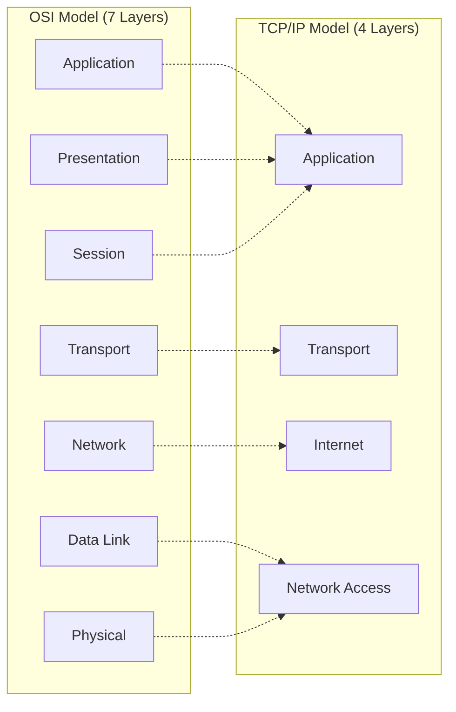
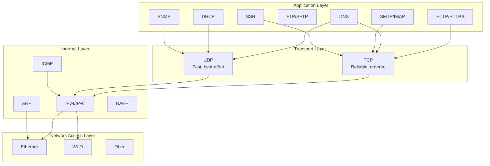
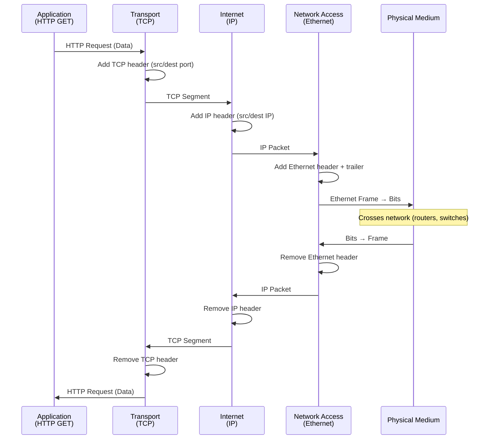

# TCP/IP Suite

> *"TCP/IP is the actual implementation that runs the Internet — the OSI model is just the theory."*

## Overview

The **TCP/IP (Transmission Control Protocol/Internet Protocol) Suite** is the practical set of protocols that powers the Internet. Unlike the theoretical OSI model with 7 layers, TCP/IP has **4 layers** (sometimes described as 5) and was developed by DARPA in the 1970s before OSI even existed.

## TCP/IP vs OSI Model

| TCP/IP Layer | OSI Equivalent | Protocols | PDU |
|-------------|---------------|-----------|-----|
| **Application** | L5+L6+L7 | HTTP, DNS, SMTP, FTP, SSH | Data |
| **Transport** | L4 | TCP, UDP | Segment/Datagram |
| **Internet** | L3 | IP, ICMP, ARP, RARP | Packet |
| **Network Access** | L1+L2 | Ethernet, Wi-Fi | Frame |

## The TCP/IP Protocol Stack

## Key Protocols Summary

### Internet Layer Protocols

| Protocol | Function | Details |
|----------|----------|---------|
| **IP** | Logical addressing, routing | Connectionless, best-effort delivery |
| **ICMP** | Error reporting, diagnostics | ping, traceroute |
| **ARP** | IP → MAC resolution | Broadcasts on local network |
| **RARP** | MAC → IP resolution | Obsolete, replaced by DHCP |
| **IGMP** | Multicast group management | Join/leave multicast groups |

### Transport Layer Protocols

| Protocol | Function | Key Features |
|----------|----------|-------------|
| **TCP** | Reliable delivery | 3-way handshake, flow/congestion control |
| **UDP** | Fast delivery | No connection, minimal overhead |
| **SCTP** | Multi-streaming | Message-oriented, multi-homing |

## How Data Flows Through TCP/IP

## Addressing at Each Layer

| Layer | Address Type | Size | Scope | Example |
|-------|-------------|------|-------|---------|
| Application | URL/Domain | Variable | Global | www.example.com |
| Transport | Port Number | 16 bits | Host | :443 (HTTPS) |
| Internet | IP Address | 32/128 bits | Global | 93.184.216.34 |
| Network Access | MAC Address | 48 bits | Local | 00:1A:2B:3C:4D:5E |

## Interview Questions

### Beginner

**Q1: What is the TCP/IP model?**
The TCP/IP model is a 4-layer networking framework: Application, Transport, Internet, and Network Access. It's the practical implementation used on the Internet, developed before the OSI model. Each layer has specific protocols and responsibilities, and data is encapsulated with headers as it moves down the stack.

**Q2: How does TCP/IP differ from OSI?**
OSI has 7 layers and is theoretical; TCP/IP has 4 layers and is practical. TCP/IP merges OSI's top three layers (Application, Presentation, Session) into one Application layer, and merges the bottom two (Data Link, Physical) into Network Access. TCP/IP was developed first (1970s); OSI came later (1984) as a standardization effort.

**Q3: Why does the Internet use TCP/IP instead of OSI?**
TCP/IP was developed first and had working implementations (ARPANET). By the time OSI was standardized, TCP/IP was already dominant. TCP/IP's simpler 4-layer model was easier to implement. The "OSI won the battle of the models, TCP/IP won the war of implementations."

### Intermediate

**Q4: Explain the encapsulation process in TCP/IP.**
As data moves down the TCP/IP stack:
1. **Application**: Creates the data (e.g., HTTP request)
2. **Transport**: Adds TCP/UDP header (source/dest ports) → Segment/Datagram
3. **Internet**: Adds IP header (source/dest IP) → Packet
4. **Network Access**: Adds frame header (MAC addresses) and trailer (CRC) → Frame
At the receiving end, each layer strips its header and passes data up.

**Q5: What happens when you type google.com in a browser?**
Complete TCP/IP flow:
1. **DNS** (Application/UDP): Resolve google.com → IP address
2. **TCP** (Transport): 3-way handshake with server (SYN, SYN-ACK, ACK)
3. **TLS** (Application): Negotiate encryption (if HTTPS)
4. **HTTP** (Application): Send GET request, receive HTML
5. **TCP/IP**: Segments → Packets → Frames → Bits across the Internet
6. **Browser**: Render HTML, fetch CSS/JS (repeat steps 2-5)

**Q6: Why is IP called "best-effort" delivery?**
IP provides no guarantees:
- **No delivery guarantee**: Packets can be dropped
- **No ordering guarantee**: Packets can arrive out of order
- **No duplicate protection**: Same packet can arrive multiple times
- **No error correction**: Only header checksum, no retransmission
Reliability is left to TCP (or the application). This design keeps IP simple and fast.

### Advanced / FAANG-Level

**Q7: Design a network architecture for a global SaaS application.**
Architecture:
1. **Edge layer**: CDN (Cloudflare/CloudFront) for static content, DDoS protection
2. **DNS**: GeoDNS with health checks for global load balancing
3. **Load balancing**: L4 (NLB) for TCP/UDP, L7 (ALB) for HTTP routing
4. **Application**: Microservices in Kubernetes, multi-region deployment
5. **Transport**: TCP for reliability, HTTP/2 for multiplexing, gRPC for inter-service
6. **Database**: Multi-region replication, read replicas per region
7. **Security**: TLS everywhere, WAF at edge, zero-trust networking
8. **Monitoring**: Distributed tracing (Jaeger), metrics (Prometheus), logging (ELK)

**Q8: How would you debug a "connection refused" error across the TCP/IP stack?**
Systematic debugging:
1. **Network Access**: Is the interface up? (`ip link`, `ifconfig`)
2. **Internet**: Can you reach the host? (`ping`, check IP/routing with `ip route`)
3. **Transport**: Is the port open? (`telnet host port`, `nmap -p port host`)
4. **Application**: Is the service running? (`systemctl status`, check logs)
5. **Firewall**: Is traffic blocked? (`iptables -L`, `ufw status`)
Common causes: service not running, wrong port, firewall rule, binding to localhost only

**Q9: Explain how the TCP/IP stack handles a packet traversing the Internet.**
At each hop:
1. **Host A** (sender): Application → TCP segment → IP packet → Ethernet frame → bits on wire
2. **Switch**: Reads MAC address, forwards frame to correct port (L2)
3. **Router**: Strips frame, reads IP destination, decrements TTL, looks up routing table, creates new frame for next hop (L3)
4. **Multiple routers**: Each router does step 3 — IP addresses stay constant, MAC addresses change per hop
5. **Switch** (near destination): Forwards to destination MAC
6. **Host B** (receiver): Bits → frame → packet → segment → data → application

Key insight: **IP addresses are end-to-end, MAC addresses are hop-by-hop**.

## Common Mistakes

1. ❌ Thinking TCP/IP is just TCP and IP — it's the entire protocol suite
2. ❌ Confusing the TCP/IP model with the OSI model — they have different numbers of layers
3. ❌ Forgetting that IP is unreliable — TCP adds reliability on top
4. ❌ Mixing up encapsulation order — data goes App → Transport → Internet → Network Access
5. ❌ Assuming the Internet uses OSI protocols — it uses TCP/IP

## Summary

- TCP/IP is the **practical protocol suite** that powers the Internet
- **4 layers**: Application, Transport, Internet, Network Access
- **Encapsulation**: Each layer adds its header as data moves down
- **IP**: Logical addressing and routing (best-effort)
- **TCP**: Reliable delivery with flow/congestion control
- **UDP**: Fast, minimal-overhead delivery
- Understanding TCP/IP is essential for **debugging**, **system design**, and **interviews**

## Cross-References

- [OSI Model](../osi/README.md) — Theoretical framework
- [IP Protocol](ip.md) — Internet Layer details
- [TCP Protocol](../tcp/README.md) — Transport Layer deep dive
- [UDP Protocol](../udp/README.md) — UDP details
- [DNS](../dns/README.md) — Application Layer resolution

## Cross References

- [OSI Model](../osi/README.md)
- [TCP Protocol](../tcp/README.md)
- [IP Addressing](ip.md)
- [Routing](../routing/README.md)
