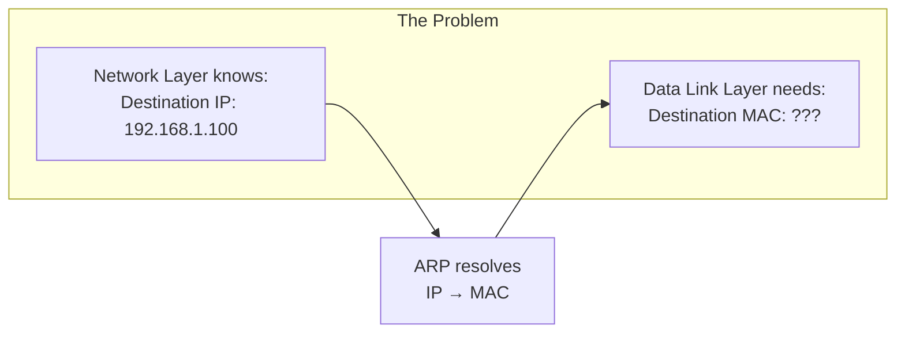
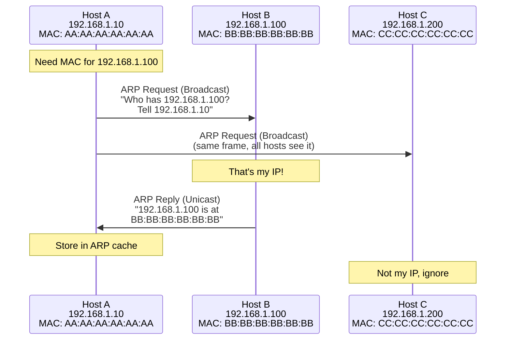
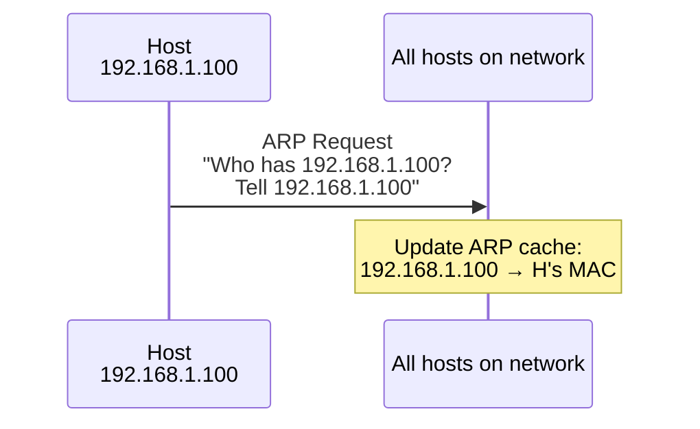
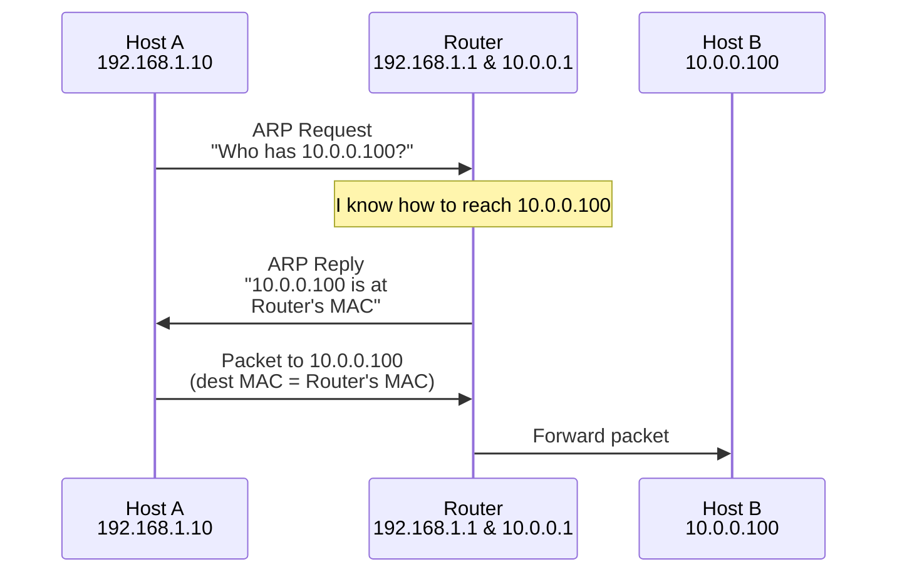
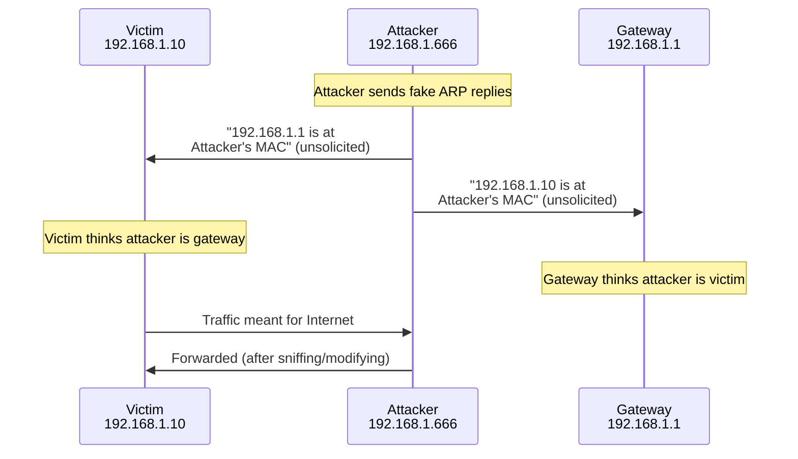

# ARP (Address Resolution Protocol)

> *"ARP bridges the gap between Layer 3 and Layer 2 — translating IP addresses to MAC addresses."*

## Overview

**ARP** (Address Resolution Protocol) maps **IP addresses** (Layer 3) to **MAC addresses** (Layer 2). When a device knows the destination IP but not the MAC address, ARP discovers it. ARP operates on the local network segment only — it cannot cross routers.

## Why ARP is Needed



- IP packets need MAC addresses for L2 frame delivery
- The sender knows the destination IP (from routing)
- But doesn't know the destination MAC (needed for Ethernet frame)
- ARP resolves this by broadcasting "Who has this IP?"

## ARP Process

### ARP Request (Broadcast)



### ARP Packet Format

```
+-+-+-+-+-+-+-+-+-+-+-+-+-+-+-+-+-+-+-+-+-+-+-+-+-+-+-+-+-+-+-+-+
|         Hardware Type (1)     |        Protocol Type (0x0800)  |
+-+-+-+-+-+-+-+-+-+-+-+-+-+-+-+-+-+-+-+-+-+-+-+-+-+-+-+-+-+-+-+-+
| HW Addr Len | Proto Addr Len |          Operation             |
|    (6)      |      (4)       |    (1=Request, 2=Reply)        |
+-+-+-+-+-+-+-+-+-+-+-+-+-+-+-+-+-+-+-+-+-+-+-+-+-+-+-+-+-+-+-+-+
|                    Sender Hardware Address                     |
|                      (AA:AA:AA:AA:AA:AA)                      |
+-+-+-+-+-+-+-+-+-+-+-+-+-+-+-+-+-+-+-+-+-+-+-+-+-+-+-+-+-+-+-+-+
|                    Sender Protocol Address                     |
|                        (192.168.1.10)                         |
+-+-+-+-+-+-+-+-+-+-+-+-+-+-+-+-+-+-+-+-+-+-+-+-+-+-+-+-+-+-+-+-+
|                    Target Hardware Address                     |
|                  (00:00:00:00:00:00 for request)               |
+-+-+-+-+-+-+-+-+-+-+-+-+-+-+-+-+-+-+-+-+-+-+-+-+-+-+-+-+-+-+-+-+
|                    Target Protocol Address                     |
|                        (192.168.1.100)                        |
+-+-+-+-+-+-+-+-+-+-+-+-+-+-+-+-+-+-+-+-+-+-+-+-+-+-+-+-+-+-+-+-+
```

| Field | Size | Description |
|-------|------|-------------|
| **Hardware Type** | 16 bits | Link layer type (1 = Ethernet) |
| **Protocol Type** | 16 bits | Protocol being resolved (0x0800 = IPv4) |
| **HW Addr Len** | 8 bits | Hardware address length (6 for MAC) |
| **Proto Addr Len** | 8 bits | Protocol address length (4 for IPv4) |
| **Operation** | 16 bits | 1 = Request, 2 = Reply |
| **Sender MAC** | 48 bits | Sender's MAC address |
| **Sender IP** | 32 bits | Sender's IP address |
| **Target MAC** | 48 bits | Unknown (all zeros in request) |
| **Target IP** | 32 bits | IP being resolved |

## ARP Cache

```bash
# View ARP cache
$ arp -a
? (192.168.1.1) at 00:11:22:33:44:55 [ether] on eth0
? (192.168.1.100) at aa:bb:cc:dd:ee:ff [ether] on eth0
```

| Field | Description |
|-------|-------------|
| **IP Address** | Resolved IP |
| **MAC Address** | Corresponding hardware address |
| **Interface** | Network interface |
| **Type** | Dynamic (learned) or Static (manual) |
| **Expires** | Entry timeout (typically 60-300 seconds) |

### ARP Cache Behavior
1. **Check cache first**: If entry exists, use it (no ARP needed)
2. **Cache miss**: Send ARP request
3. **Cache timeout**: Entries expire after 60-300 seconds
4. **Gratuitous ARP**: Can update cache proactively

## Gratuitous ARP

A host sends an ARP request for **its own IP address**:



**Uses of Gratuitous ARP:**
1. **Duplicate IP detection**: If someone replies, IP is in use
2. **Update neighbors' caches**: After MAC address change
3. **Failover**: Backup server announces its MAC for the virtual IP
4. **ARP announcement**: Proactively announce IP-MAC mapping

## Proxy ARP

A router answers ARP requests on behalf of another host:



**Use case**: Hosts on different subnets can communicate without configuring a default gateway.

## ARP Security Issues

### ARP Spoofing/Poisoning



**Impact**: Man-in-the-middle attack, traffic interception, session hijacking

**Defenses**:
| Defense | Description |
|---------|-------------|
| **Dynamic ARP Inspection (DAI)** | Switch validates ARP against DHCP bindings |
| **Static ARP entries** | Manual IP-MAC mappings (doesn't scale) |
| **802.1X** | Port-based authentication |
| **ARP spoofing detection tools** | XArp, arpwatch |
| **Encryption** | TLS/SSH protect data even if ARP is spoofed |

## RARP vs ARP vs DHCP

| Protocol | Direction | Purpose | Status |
|----------|-----------|---------|--------|
| **ARP** | IP → MAC | Resolve known IP to unknown MAC | Active |
| **RARP** | MAC → IP | Resolve known MAC to unknown IP | Obsolete |
| **DHCP** | MAC → IP + more | Dynamic IP assignment | Active |

## Interview Questions

### Beginner

**Q1: What is ARP and why is it needed?**
ARP (Address Resolution Protocol) translates IP addresses to MAC addresses. When a device needs to send data on a local network, it needs the destination's MAC address for the Ethernet frame. ARP broadcasts "Who has this IP?" and the owner responds with its MAC. Without ARP, devices couldn't deliver frames on the local network.

**Q2: What is the difference between ARP request and reply?**
- **ARP Request**: Broadcast to all devices on the network. "Who has 192.168.1.100? Tell 192.168.1.10." Destination MAC is all zeros (unknown).
- **ARP Reply**: Unicast back to the requester. "192.168.1.100 is at BB:BB:BB:BB:BB:BB." Only the requester needs this information.

**Q3: What is an ARP cache?**
The ARP cache is a table stored in each device that maps IP addresses to MAC addresses. It's populated by ARP responses and has a timeout (typically 60-300 seconds). The cache avoids sending ARP requests for every packet — once an IP-MAC mapping is known, it's reused until it expires.

### Intermediate

**Q4: Explain ARP spoofing and how to prevent it.**
ARP spoofing: An attacker sends fake ARP replies to poison victims' ARP caches. The victim's traffic is redirected through the attacker (man-in-the-middle). Prevention: (1) Dynamic ARP Inspection on switches, (2) Static ARP entries for critical hosts, (3) 802.1X port authentication, (4) VPN/encryption for sensitive traffic.

**Q5: Why does ARP only work on the local network?**
ARP broadcasts are limited to the local broadcast domain (L2 network). Routers don't forward broadcasts — they break broadcast domains. When sending to a remote host, the device ARPs for its default gateway's MAC, not the remote host's MAC. The gateway then forwards the packet and ARPs for the next hop.

**Q6: What is Gratuitous ARP and when is it used?**
Gratuitous ARP is when a host sends an ARP request for its own IP address. Uses: (1) Duplicate IP detection — if someone replies, the IP is already in use, (2) Update other hosts' ARP caches after a MAC change, (3) Failover — backup server announces its MAC for the virtual IP, (4) ARP announcement — proactively inform the network.

### Advanced / FAANG-Level

**Q7: How would you detect and mitigate ARP spoofing in a large enterprise network?**
Detection:
1. **DAI (Dynamic ARP Inspection)**: Switch validates ARP against DHCP snooping database
2. **ARP monitoring**: Tools like arpwatch detect new IP-MAC mappings
3. **IDS/IPS**: Detect ARP anomalies (too many unsolicited replies)
4. **Network taps**: Monitor ARP traffic patterns
5. **HIDS**: Host-based detection of ARP cache changes

Mitigation:
1. **DAI + DHCP snooping**: Enforce at switch level
2. **802.1X**: Authenticate devices before granting network access
3. **Private VLANs**: Isolate hosts from each other
4. **Encryption**: TLS/SSH protect data even if ARP is compromised
5. **Network segmentation**: Limit blast radius of ARP attacks

**Q8: Explain how ARP works in a virtualized environment (VMware/KVM).**
In virtualized environments:
1. **Virtual switch (vSwitch)**: VMs connect to virtual switches, which handle ARP like physical switches
2. **ARP table in hypervisor**: Hypervisor maintains ARP tables for VMs
3. **VXLAN/Geneve**: Overlay networks require ARP suppression (don't flood ARP across underlay)
4. **ARP proxy**: Hypervisor may respond to ARP on behalf of VMs (optimization)
5. **Security**: vSwitch can enforce DAI-like protections (VMware NSX, Open vSwitch)
6. **MAC addresses**: VMs have virtual MACs; hypervisor maps to physical MAC for external traffic

**Q9: Design a system to handle ARP efficiently in a data center with 10,000 servers.**
Challenges: ARP broadcasts scale poorly (broadcast storms).

Solutions:
1. **ARP suppression**: EVPN (Ethernet VPN) with VXLAN handles ARP at the VTEP (VXLAN Tunnel Endpoint)
   - VTEPs maintain ARP caches for remote hosts
   - ARP requests for known hosts are replied locally (no flooding)
2. **Layer 3 to the host**: Each server gets a /31 or /30, runs routing (no L2, no ARP across network)
3. **ARP rate limiting**: Limit ARP packets per port per second
4. **Anycast gateway**: All leaf switches share the same gateway IP/MAC (reduces ARP)
5. **Monitoring**: sFlow/NetFlow for ARP traffic analysis
6. **Scale**: Modern DC fabrics handle ARP via EVPN — no traditional broadcast flooding

## Common Mistakes

1. ❌ Confusing ARP with DNS — ARP resolves IP→MAC locally; DNS resolves names→IP globally
2. ❌ Thinking ARP works across routers — it doesn't (broadcasts are local only)
3. ❌ Forgetting ARP cache timeout — stale entries cause connectivity issues
4. ❌ Assuming ARP is secure — it has no authentication (ARP spoofing is trivial)
5. ❌ Mixing up ARP and RARP — ARP is IP→MAC (active); RARP is MAC→IP (obsolete)

## Summary

- ARP resolves **IP addresses to MAC addresses** on the local network
- **Request**: Broadcast "Who has this IP?"
- **Reply**: Unicast "This IP is at this MAC"
- **ARP cache**: Stores resolved mappings (expires after 60-300 seconds)
- **Gratuitous ARP**: Self-announcement, duplicate detection, failover
- **Security**: ARP spoofing enables MITM; defend with DAI, 802.1X, encryption
- **IPv6**: Uses NDP (Neighbor Discovery Protocol) instead of ARP

## Cross-References

- [RARP](rarp.md) — Reverse ARP (obsolete)
- [Data Link Layer](../osi/data-link.md) — Where ARP operates
- [ICMP](icmp.md) — Neighbor Discovery in IPv6
- [DHCP](dhcp.md) — Dynamic address assignment

## Cross References

- [Data Link Layer](../osi/data-link.md)
- [IPv4](ipv4.md)
- [RARP](rarp.md)
- [ICMP](icmp.md)
