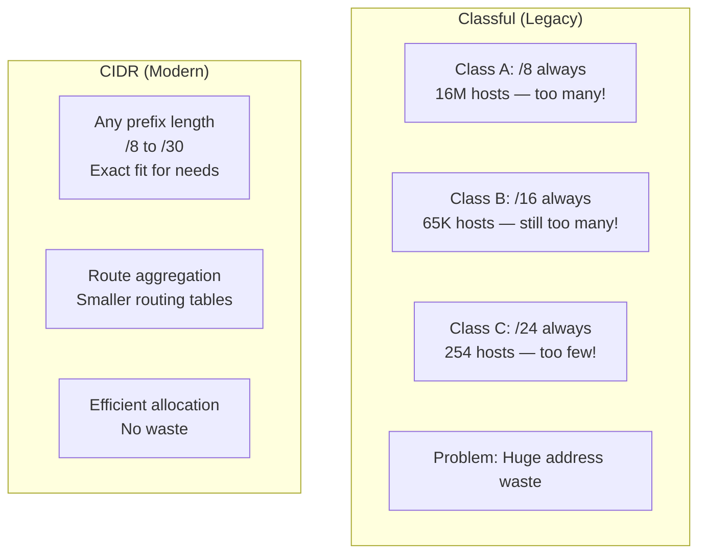
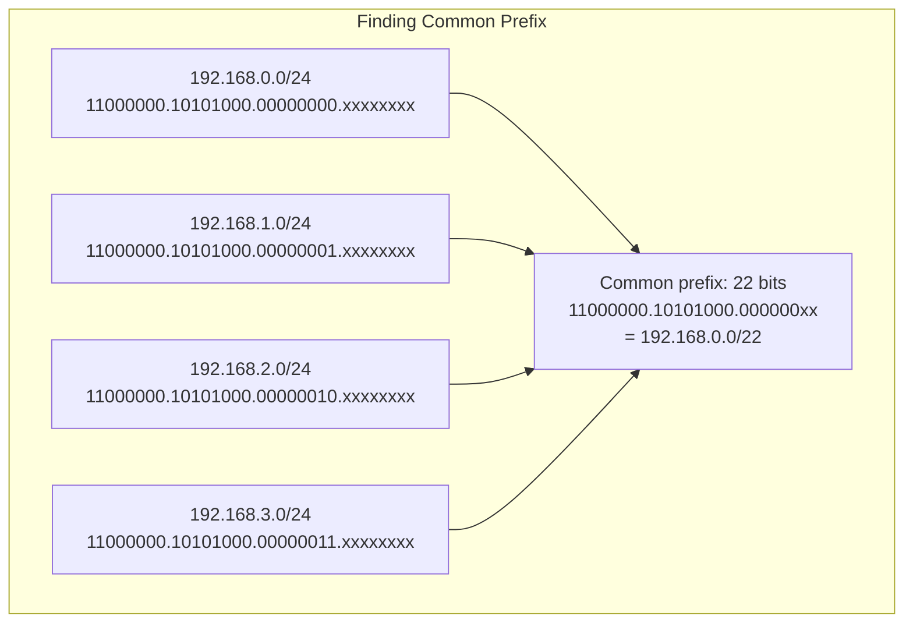
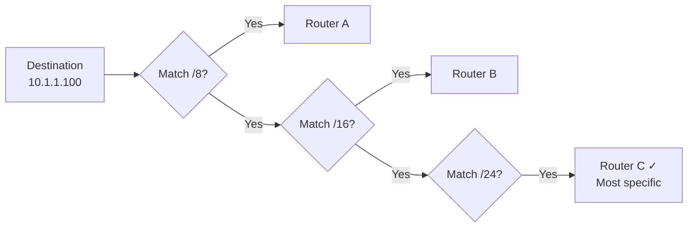
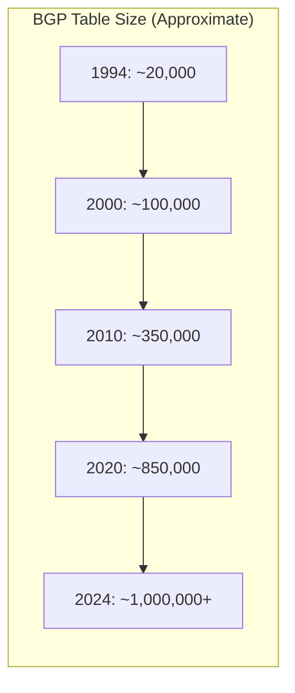

# CIDR (Classless Inter-Domain Routing)

> *"CIDR replaced the rigid class system with flexible, efficient address allocation."*

## Overview

**CIDR** (Classless Inter-Domain Routing, pronounced "cider") replaced the classful addressing system in 1993. It allows variable-length subnet masks (VLSM), enabling efficient IP address allocation and route summarization. CIDR notation uses a suffix (e.g., /24) to indicate the number of network bits.

## Classful vs CIDR



| Aspect | Classful | CIDR |
|--------|----------|------|
| Prefix length | Fixed (/8, /16, /24) | Variable (/8 to /30) |
| Address waste | High | Minimal |
| Route aggregation | Not supported | Supported |
| Routing table size | Large | Smaller |
| Introduced | 1981 | 1993 (RFC 1518/1519) |

## CIDR Notation

### Format
```
IP_address/prefix_length

Example: 192.168.1.0/24
- 192.168.1.0 = Network address
- /24 = First 24 bits are the network portion
- Subnet mask: 255.255.255.0
```

### Common CIDR Blocks

| CIDR | Subnet Mask | Total Addresses | Usable Hosts | Typical Use |
|------|------------|----------------|-------------|-------------|
| /8 | 255.0.0.0 | 16,777,216 | 16,777,214 | ISP allocation |
| /16 | 255.255.0.0 | 65,536 | 65,534 | Large enterprise |
| /22 | 255.255.252.0 | 1,024 | 1,022 | Small ISP |
| /24 | 255.255.255.0 | 256 | 254 | Small network |
| /28 | 255.255.255.240 | 16 | 14 | Small office |
| /30 | 255.255.255.252 | 4 | 2 | Point-to-point |
| /31 | 255.255.255.254 | 2 | 2 | P2P (RFC 3021) |
| /32 | 255.255.255.255 | 1 | 1 | Host route |

## Route Aggregation (Supernetting)

CIDR enables combining multiple contiguous networks into a single route.

### Example
```
Individual routes:
192.168.0.0/24
192.168.1.0/24
192.168.2.0/24
192.168.3.0/24

Aggregated (supernet):
192.168.0.0/22

4 routes → 1 route
```

### How to Aggregate



**Rules for aggregation:**
1. Networks must be **contiguous** (no gaps)
2. First address must be **aligned** on a power-of-2 boundary
3. Number of networks must be a **power of 2**
4. All share the same **common prefix**

## Longest Prefix Match

When multiple routes match a destination, routers use **longest prefix match** (most specific route wins).

```
Routing table:
10.0.0.0/8       → via Router A
10.1.0.0/16      → via Router B
10.1.1.0/24      → via Router C

Destination: 10.1.1.100

All three routes match, but /24 is most specific → Router C
```



## CIDR and the Internet

### Internet Routing Table Growth



CIDR helps control routing table growth through aggregation, but:
- **Deaggregation**: Organizations announce more-specific routes for traffic engineering
- **Multi-homing**: Connecting to multiple ISPs requires separate route announcements
- **Result**: Table keeps growing despite CIDR

### ISP Allocation Example

```
ISP receives: 203.0.112.0/20 (4096 addresses)

ISP allocates to customers:
Customer A: 203.0.112.0/24  (256 addresses)
Customer B: 203.0.113.0/24  (256 addresses)
Customer C: 203.0.114.0/23  (512 addresses)
Customer D: 203.0.116.0/22  (1024 addresses)
...

ISP announces single route: 203.0.112.0/20 to Internet
```

## Interview Questions

### Beginner

**Q1: What is CIDR?**
CIDR (Classless Inter-Domain Routing) is a method for allocating IP addresses that replaced the old classful system. It uses a suffix (e.g., /24) to specify how many bits are the network portion, allowing flexible subnet sizes. For example, /24 means the first 24 bits are the network (254 hosts), while /28 means 28 bits (14 hosts).

**Q2: How is CIDR different from classful addressing?**
Classful addressing had fixed boundaries: Class A (/8), Class B (/16), Class C (/24). If you needed 300 hosts, you had to get a Class B (65,534 addresses) — wasting 65,000+ addresses. CIDR lets you use /23 (510 hosts) — a perfect fit. CIDR also enables route summarization, reducing routing table sizes.

**Q3: What does /24 mean?**
/24 means the first 24 bits of the 32-bit IP address are the network portion, and the remaining 8 bits are for hosts. The subnet mask is 255.255.255.0. This gives 2^8 - 2 = 254 usable host addresses.

### Intermediate

**Q4: Explain route aggregation and its benefits.**
Route aggregation (supernetting) combines multiple contiguous routes into one. For example, four /24 routes (192.168.0.0/24 through 192.168.3.0/24) can be summarized as 192.168.0.0/22. Benefits: (1) Smaller routing tables → faster lookups, (2) Less memory in routers, (3) Reduced BGP update traffic, (4) Simpler management.

**Q5: How does longest prefix match work?**
When a router has multiple routes that match a destination, it selects the one with the longest prefix (most specific). For example, if routes 10.0.0.0/8, 10.1.0.0/16, and 10.1.1.0/24 all exist, and the destination is 10.1.1.5, the router chooses 10.1.1.0/24 because /24 is longer than /16 or /8. This ensures more specific routes take precedence.

**Q6: What is a /31 subnet and when is it used?**
A /31 subnet has only 2 addresses (no usable hosts in traditional sense). RFC 3021 defines /31 for point-to-point links between routers. Both addresses are usable (no network ID or broadcast needed on a link with exactly two endpoints). This saves addresses on WAN links.

### Advanced / FAANG-Level

**Q7: How would you design CIDR allocation for a new ISP with a /16 block?**
Design:
1. **Total space**: /16 = 65,536 addresses
2. **Customer allocations**:
   - Small customers: /28 (14 hosts) or /27 (30 hosts)
   - Medium customers: /24 (254 hosts)
   - Large customers: /22 (1,022 hosts) or /21 (2,046 hosts)
3. **Infrastructure**: /24 for backbone links, /30 or /31 for P2P WAN links
4. **Growth reserve**: Keep 20% unallocated for future
5. **Announce**: Single /16 to upstream ISPs (aggregation)
6. **Deaggregation**: May need to announce more-specifics for multi-homed customers
7. **Documentation**: Maintain IPAM (IP Address Management) database

**Q8: Explain the implications of BGP route deaggregation.**
When an organization announces more-specific routes (e.g., splitting /22 into four /24s):
- **Pros**: More granular traffic engineering, multi-homing flexibility
- **Cons**: Larger global routing table (currently 1M+ entries), more memory/CPU in routers, more BGP updates
- **Mitigation**: RPKI for route validation, BGP communities for policy, prefix filtering by ISPs
- **Policy**: Many ISPs filter announcements longer than /24 (IPv4) or /48 (IPv6) to prevent table bloat

**Q9: How does CIDR interact with BGP in the Internet's routing architecture?**
CIDR and BGP work together:
1. **ISPs receive** large CIDR blocks from RIRs (e.g., /14)
2. **ISPs allocate** smaller CIDR blocks to customers (e.g., /24)
3. **ISPs aggregate** customer routes and announce the summary (e.g., /14) to peers
4. **Multi-homed customers** may announce their own block to multiple ISPs
5. **BGP selects** best path based on AS path, local preference, MED, etc.
6. **Longest prefix match** ensures traffic goes to the most specific route

The combination enables the Internet to scale: millions of hosts, but only ~1M routing table entries.

## Common Mistakes

1. ❌ Forgetting alignment rules when aggregating — routes must be on power-of-2 boundaries
2. ❌ Confusing CIDR notation with subnet mask — they're equivalent but written differently
3. ❌ Assuming CIDR eliminates all waste — it reduces waste but doesn't eliminate it
4. ❌ Not understanding longest prefix match — critical for routing behavior
5. ❌ Mixing up route aggregation with subnetting — aggregation combines, subnetting divides

## Summary

- CIDR replaced classful addressing with **flexible prefix lengths** (/8 to /30)
- Enables **efficient allocation** — right-sized blocks for actual needs
- **Route aggregation** combines contiguous routes, reducing routing table size
- **Longest prefix match** ensures most specific route is chosen
- CIDR is essential for **Internet scalability** — without it, routing tables would be unmanageable
- Still the foundation of Internet routing today (with BGP)

## Cross-References

- [IPv4](ipv4.md) — IPv4 addressing basics
- [Subnetting](subnetting.md) — Dividing CIDR blocks
- [NAT](nat.md) — Using private CIDR blocks
- [IP](ip.md) — Internet Protocol overview

## Cross References

- [Subnetting](subnetting.md)
- [IPv4](ipv4.md)
- [Routing Tables](../routing/ospf.md)
