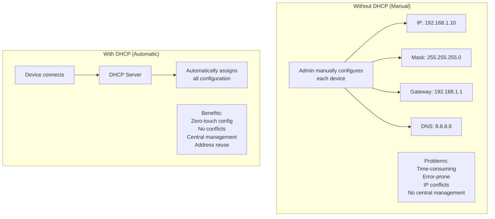
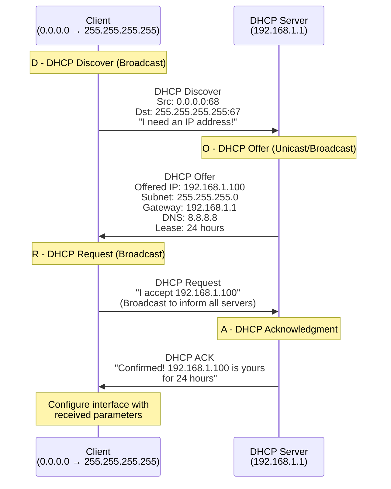
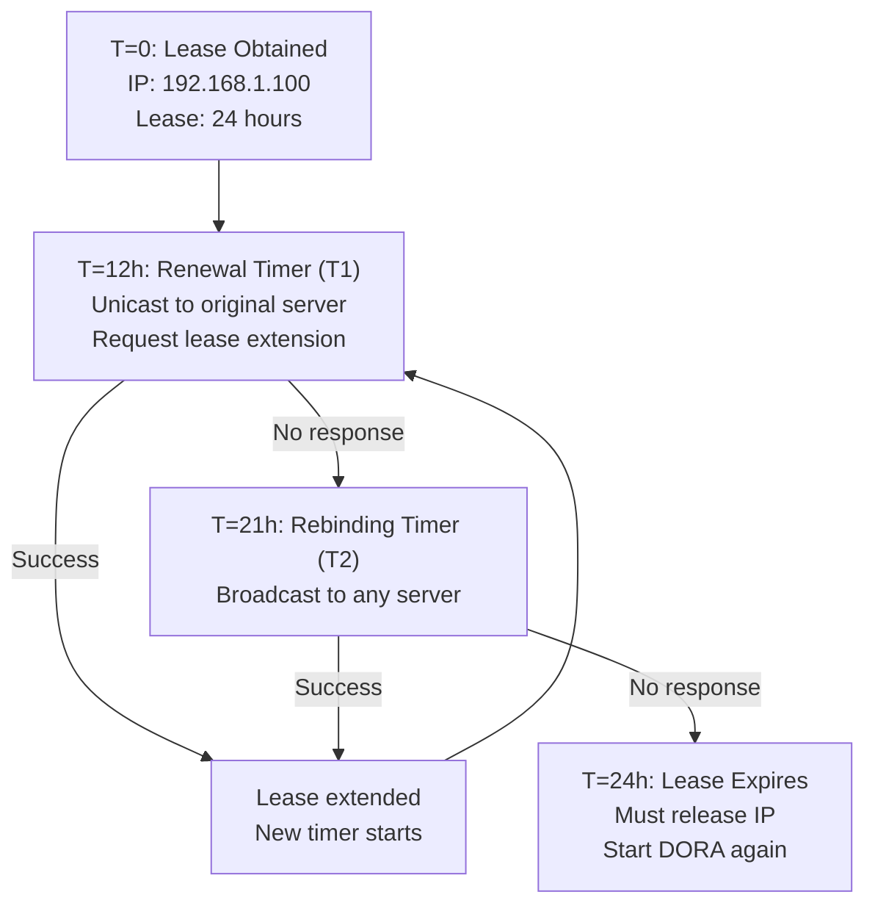
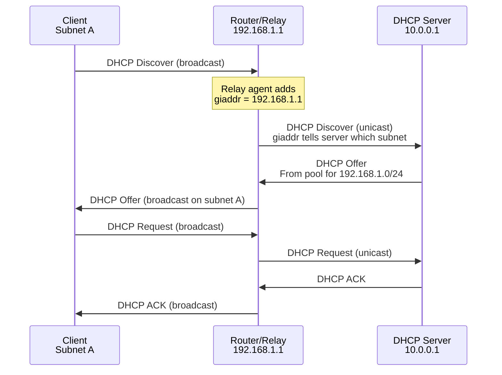
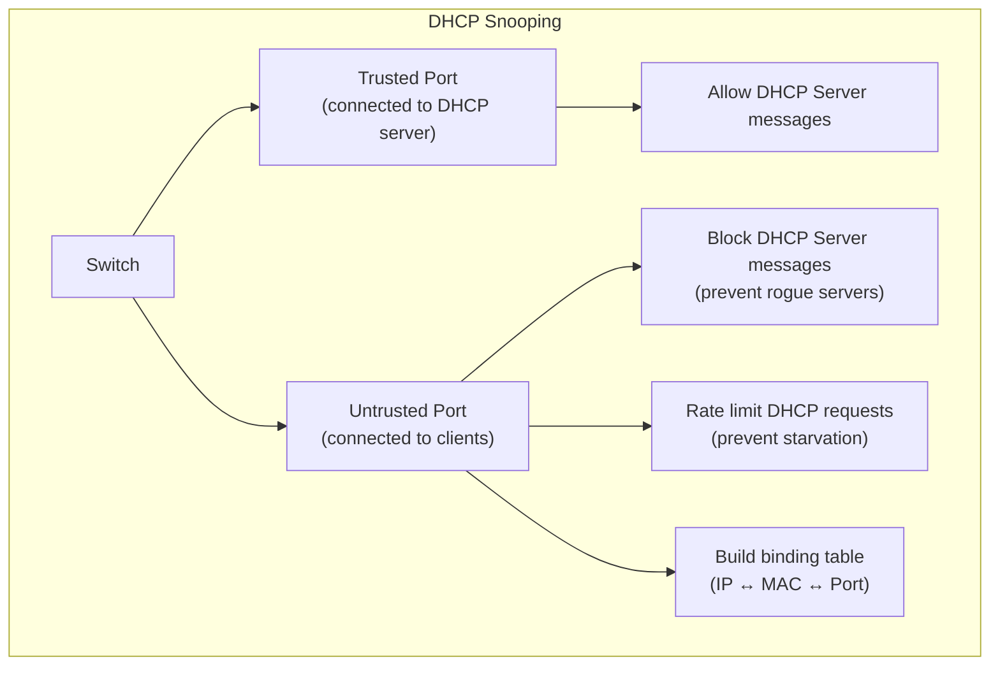

# DHCP (Dynamic Host Configuration Protocol)

> *"DHCP is the reason you don't have to manually configure IP addresses on every device."*

## Overview

**DHCP** (Dynamic Host Configuration Protocol) automatically assigns IP addresses and other network configuration to devices. When a device connects to a network, DHCP provides an IP address, subnet mask, default gateway, DNS servers, and more. It uses UDP ports 67 (server) and 68 (client).

## Why DHCP?



## DHCP Process: DORA



### DORA Steps Explained

| Step | Message | Transport | Purpose |
|------|---------|-----------|---------|
| **D** | Discover | Broadcast | Client finds DHCP servers |
| **O** | Offer | Unicast/Broadcast | Server offers an IP address |
| **R** | Request | Broadcast | Client requests offered IP |
| **A** | Acknowledgment | Unicast/Broadcast | Server confirms assignment |

## DHCP Lease Lifecycle



| Timer | Default | Action |
|-------|---------|--------|
| **T1 (Renewal)** | 50% of lease | Unicast renew to original server |
| **T2 (Rebinding)** | 87.5% of lease | Broadcast renew to any server |
| **Lease expiry** | 100% of lease | Release IP, start over |

## DHCP Message Format

```
+-+-+-+-+-+-+-+-+-+-+-+-+-+-+-+-+-+-+-+-+-+-+-+-+-+-+-+-+-+-+-+-+
|  Op (1=Req, 2=Reply) |  Htype  |  Hlen  |  Hops              |
+-+-+-+-+-+-+-+-+-+-+-+-+-+-+-+-+-+-+-+-+-+-+-+-+-+-+-+-+-+-+-+-+
|                      Transaction ID (XID)                      |
+-+-+-+-+-+-+-+-+-+-+-+-+-+-+-+-+-+-+-+-+-+-+-+-+-+-+-+-+-+-+-+-+
|        Seconds        |           Flags                        |
+-+-+-+-+-+-+-+-+-+-+-+-+-+-+-+-+-+-+-+-+-+-+-+-+-+-+-+-+-+-+-+-+
|                    Client IP Address (ciaddr)                  |
+-+-+-+-+-+-+-+-+-+-+-+-+-+-+-+-+-+-+-+-+-+-+-+-+-+-+-+-+-+-+-+-+
|                    Your IP Address (yiaddr)                    |
+-+-+-+-+-+-+-+-+-+-+-+-+-+-+-+-+-+-+-+-+-+-+-+-+-+-+-+-+-+-+-+-+
|                   Server IP Address (siaddr)                   |
+-+-+-+-+-+-+-+-+-+-+-+-+-+-+-+-+-+-+-+-+-+-+-+-+-+-+-+-+-+-+-+-+
|                  Gateway IP Address (giaddr)                   |
+-+-+-+-+-+-+-+-+-+-+-+-+-+-+-+-+-+-+-+-+-+-+-+-+-+-+-+-+-+-+-+-+
|                    Client MAC Address (16 bytes)               |
+-+-+-+-+-+-+-+-+-+-+-+-+-+-+-+-+-+-+-+-+-+-+-+-+-+-+-+-+-+-+-+-+
|                    Server Hostname (64 bytes)                  |
+-+-+-+-+-+-+-+-+-+-+-+-+-+-+-+-+-+-+-+-+-+-+-+-+-+-+-+-+-+-+-+-+
|                    Boot File Name (128 bytes)                  |
+-+-+-+-+-+-+-+-+-+-+-+-+-+-+-+-+-+-+-+-+-+-+-+-+-+-+-+-+-+-+-+-+
|                    Options (variable length)                   |
+-+-+-+-+-+-+-+-+-+-+-+-+-+-+-+-+-+-+-+-+-+-+-+-+-+-+-+-+-+-+-+-+
```

## DHCP Options (Partial List)

| Code | Name | Description | Example |
|------|------|-------------|---------|
| 1 | Subnet Mask | Network mask | 255.255.255.0 |
| 3 | Router | Default gateway | 192.168.1.1 |
| 6 | DNS Server | DNS servers | 8.8.8.8, 8.8.4.4 |
| 12 | Hostname | Client hostname | "my-laptop" |
| 15 | Domain Name | DNS domain | "example.com" |
| 51 | Lease Time | IP lease duration | 86400 (24h) |
| 53 | DHCP Message Type | DORA message type | 1=Discover, 2=Offer... |
| 54 | Server Identifier | DHCP server IP | 192.168.1.1 |
| 61 | Client Identifier | Unique client ID | MAC or custom |
| 119 | Domain Search | DNS search suffix | "corp.example.com" |

## DHCP Relay Agent

When DHCP server is on a **different subnet**, a relay agent forwards requests:



## DHCP Security

### Attacks and Defenses

| Attack | Description | Defense |
|--------|-------------|---------|
| **Rogue DHCP** | Fake server gives wrong config | DHCP snooping on switch |
| **DHCP starvation** | Request all IPs (DoS) | Rate limiting, port security |
| **DHCP spoofing** | Man-in-the-middle via fake gateway | DHCP snooping + DAI |
| **MAC flooding** | Overflow switch MAC table | Port security limits |

### DHCP Snooping



- **Trusted ports**: Connected to legitimate DHCP servers
- **Untrusted ports**: Client-facing — block server messages, rate-limit requests
- **Binding table**: Maps IP-MAC-port, used by Dynamic ARP Inspection

## Interview Questions

### Beginner

**Q1: What is DHCP and why is it used?**
DHCP automatically assigns IP addresses and network configuration to devices. Without it, every device would need manual IP configuration — time-consuming and error-prone. DHCP provides: IP address, subnet mask, default gateway, DNS servers, and other options. It also manages address reuse through lease expiration.

**Q2: What is the DORA process?**
DORA stands for Discover, Offer, Request, Acknowledgment — the four messages in DHCP:
1. **Discover**: Client broadcasts "I need an IP"
2. **Offer**: Server offers an IP address
3. **Request**: Client accepts the offer (broadcast to inform all servers)
4. **ACK**: Server confirms the assignment

**Q3: What happens when a DHCP lease expires?**
When a lease expires, the client must stop using the IP address. Before expiry: (1) At 50% of lease time, client tries to renew with the same server, (2) At 87.5%, client broadcasts to any server, (3) If no response by expiry, client releases the IP and must start DORA again.

### Intermediate

**Q4: Why does the DHCP Request use broadcast instead of unicast?**
The DHCP Request is broadcast because multiple DHCP servers may have responded with offers. By broadcasting the Request, the client tells ALL servers which offer it accepted. The chosen server sends an ACK; other servers withdraw their offers and return those IPs to the pool.

**Q5: What is a DHCP relay agent and when is it needed?**
A relay agent forwards DHCP requests across subnets. DHCP uses broadcast, which doesn't cross routers. When the DHCP server is on a different subnet, the router acts as a relay agent: it receives the broadcast, adds its own IP (giaddr) to indicate the client's subnet, and unicasts to the DHCP server. The server uses giaddr to select the correct address pool.

**Q6: Compare DHCP with static IP assignment.**
| Aspect | DHCP | Static |
|--------|------|--------|
| Configuration | Automatic | Manual |
| Management | Centralized | Per-device |
| IP conflicts | Prevented | Possible |
| Scalability | Excellent | Poor |
| Consistency | May change | Fixed |
| Use case | Clients, dynamic | Servers, printers, routers |

Best practice: Servers and infrastructure use static IPs; clients use DHCP. Use DHCP reservations for devices that need consistent IPs.

### Advanced / FAANG-Level

**Q7: Design a DHCP infrastructure for a campus with 10,000 devices.**
Architecture:
1. **Redundant DHCP servers**: Primary + secondary (failover protocol)
2. **Relay agents**: On each VLAN's gateway router
3. **Address pools**: Per VLAN/subnet
   - Staff VLAN: 10.1.0.0/22 (1022 addresses)
   - Student VLAN: 10.2.0.0/22
   - Guest VLAN: 10.3.0.0/23 (510 addresses)
4. **Lease times**: Staff (8h), Student (4h), Guest (1h)
5. **Reservations**: For printers, VoIP phones, projectors
6. **DHCP snooping**: On all access switches
7. **Monitoring**: Track pool utilization, lease statistics
8. **Integration**: DNS updates (DDNS), IPAM system
9. **Policy**: Different options per VLAN (DNS, gateway, WINS)
10. **High availability**: DHCP failover with split-scope (70/30)

**Q8: Explain DHCPv6 vs SLAAC and when to use each.**
| Feature | SLAAC | DHCPv6 | Combined |
|---------|-------|--------|----------|
| Server needed | No | Yes | Yes |
| Address config | Prefix + EUI-64/random | Server-assigned | Server-assigned |
| Other options | Limited (RA only) | Full (DNS, etc.) | Full |
| Privacy | Random addresses | Predictable | Configurable |
| Use case | Simple networks | Enterprise | Enterprise + privacy |

- **SLAAC only**: Simple networks, IoT, home networks
- **DHCPv6 only**: Need centralized control, DNS registration
- **Combined (recommended)**: SLAAC for address, DHCPv6 for DNS/options (O-flag in RA)
- **Android limitation**: Doesn't support DHCPv6 for address assignment (SLAAC only)

**Q9: How would you handle DHCP in a containerized/Kubernetes environment?**
Kubernetes networking:
1. **No traditional DHCP**: Containers get IPs from the CNI (Container Network Interface) plugin
2. **CNI plugins**: Calico, Cilium, Flannel assign IPs from configured pools
3. **IPAM (IP Address Management)**: CNI handles IP allocation/deallocation
4. **Pod lifecycle**: IP released when pod terminates, reused for new pods
5. **Service discovery**: Kubernetes DNS (CoreDNS) instead of DHCP options
6. **Node networking**: Nodes may use DHCP or static IPs; pods use CNI
7. **Challenges**: IP exhaustion, IP reuse conflicts, multi-tenancy

## Common Mistakes

1. ❌ Forgetting DHCP uses broadcast — it doesn't cross routers without relay agents
2. ❌ Confusing DHCP with DNS — DHCP assigns IPs; DNS resolves names
3. ❌ Not securing DHCP — rogue servers can hijack clients
4. ❌ Setting lease times too long — devices that leave keep IPs reserved unnecessarily
5. ❌ Not monitoring pool utilization — running out of IPs causes connectivity failures

## Summary

- DHCP **automatically assigns** IP addresses and network configuration
- **DORA process**: Discover → Offer → Request → Acknowledgment
- **Lease management**: Timers for renewal (T1=50%), rebinding (T2=87.5%), expiry (100%)
- **Relay agents** forward DHCP across subnets
- **Security**: DHCP snooping prevents rogue servers and starvation attacks
- **IPv6**: SLAAC (auto-config) and DHCPv6 (centralized) complement each other

## Cross-References

- [IPv4](ipv4.md) — Address assignment
- [ARP](arp.md) — IP to MAC resolution (complementary to DHCP)
- [DNS](../dns/README.md) — Often configured via DHCP
- [Subnetting](subnetting.md) — Address pool design
