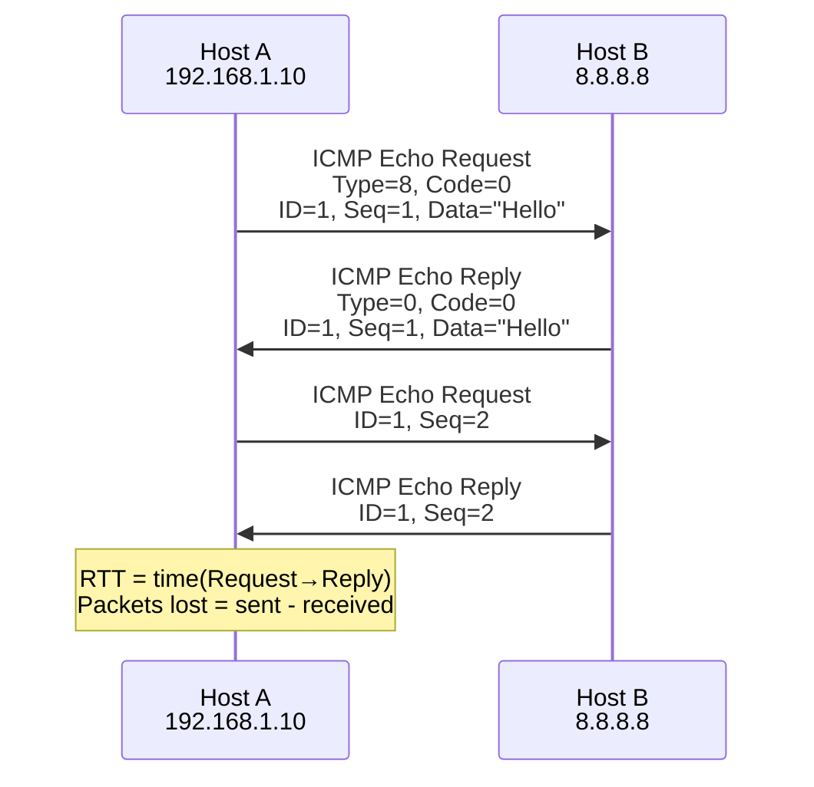
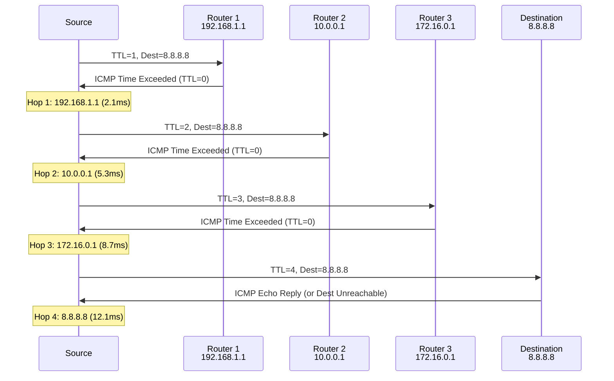
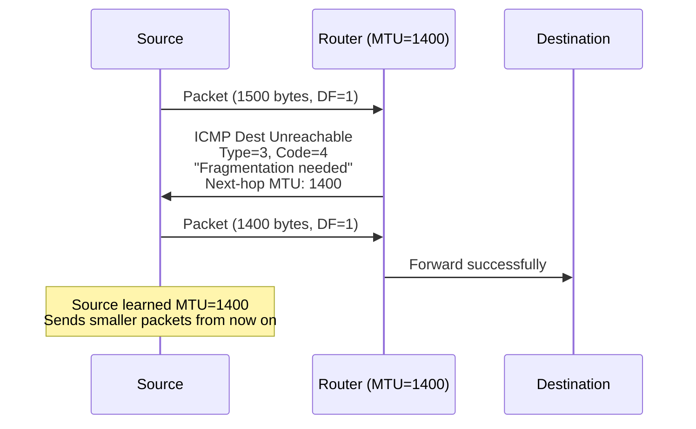

# ICMP (Internet Control Message Protocol)

> *"ICMP is the Internet's diagnostician — it tells you what's wrong when things break."*

## Overview

**ICMP** (Internet Control Message Protocol) is a supporting protocol in the Internet Layer that reports errors and provides diagnostic information. It's used by tools like `ping` and `traceroute`. ICMP messages are encapsulated within IP packets but are not considered a transport protocol — it's a control protocol.

## ICMP Header

```
+-+-+-+-+-+-+-+-+-+-+-+-+-+-+-+-+-+-+-+-+-+-+-+-+-+-+-+-+-+-+-+-+
|     Type      |     Code      |          Checksum             |
+-+-+-+-+-+-+-+-+-+-+-+-+-+-+-+-+-+-+-+-+-+-+-+-+-+-+-+-+-+-+-+-+
|                     Rest of Header (varies)                    |
+-+-+-+-+-+-+-+-+-+-+-+-+-+-+-+-+-+-+-+-+-+-+-+-+-+-+-+-+-+-+-+-+
|                    Data (original packet header + 8 bytes)     |
+-+-+-+-+-+-+-+-+-+-+-+-+-+-+-+-+-+-+-+-+-+-+-+-+-+-+-+-+-+-+-+-+
```

| Field | Size | Purpose |
|-------|------|---------|
| **Type** | 8 bits | Message type (e.g., 8 = Echo Request) |
| **Code** | 8 bits | Subtype within type |
| **Checksum** | 16 bits | Error detection |
| **Rest of Header** | 32 bits | Varies by type |
| **Data** | Variable | Original packet header + 8 bytes of data |

## Common ICMP Messages

### Error Messages

| Type | Code | Name | Description |
|------|------|------|-------------|
| 3 | 0 | Destination Unreachable - Net | Network unreachable |
| 3 | 1 | Destination Unreachable - Host | Host unreachable |
| 3 | 3 | Destination Unreachable - Port | Port unreachable |
| 3 | 4 | Destination Unreachable - Fragmentation | Fragmentation needed (DF set) |
| 3 | 13 | Destination Unreachable - Admin | Communication administratively prohibited |
| 4 | 0 | Source Quench | Congestion signal (deprecated) |
| 5 | 0-3 | Redirect | Better route available |
| 11 | 0 | Time Exceeded - TTL | TTL expired in transit |
| 11 | 1 | Time Exceeded - Fragment | Fragment reassembly timeout |
| 12 | 0-2 | Parameter Problem | Header error |

### Query Messages

| Type | Code | Name | Description |
|------|------|------|-------------|
| 8 | 0 | Echo Request | ping request |
| 0 | 0 | Echo Reply | ping response |
| 13 | 0 | Timestamp Request | Request timestamp |
| 14 | 0 | Timestamp Reply | Timestamp response |
| 9 | 0 | Router Advertisement | Router discovery |
| 10 | 0 | Router Solicitation | Router discovery |

## ICMP in Action: ping



### ping Output
```bash
$ ping google.com
PING google.com (142.250.185.78): 56 data bytes
64 bytes from 142.250.185.78: icmp_seq=0 ttl=116 time=12.345 ms
64 bytes from 142.250.185.78: icmp_seq=1 ttl=116 time=11.234 ms
64 bytes from 142.250.185.78: icmp_seq=2 ttl=116 time=10.567 ms

--- google.com ping statistics ---
3 packets transmitted, 3 packets received, 0.0% packet loss
round-trip min/avg/max/stddev = 10.567/11.382/12.345/0.735 ms
```

## ICMP in Action: traceroute



## Path MTU Discovery with ICMP



## ICMPv6 (For IPv6)

ICMPv6 is more important than ICMP for IPv4 — it handles many functions:

| Function | IPv4 | ICMPv6 |
|----------|------|--------|
| Error reporting | ICMP | ICMPv6 |
| Ping | ICMP Echo | ICMPv6 Echo |
| Traceroute | ICMP Time Exceeded | ICMPv6 Time Exceeded |
| ARP | ARP protocol | Neighbor Solicitation/Advertisement |
| Router discovery | ICMP Router Discovery | Router Solicitation/Advertisement |
| Multicast management | IGMP | MLD (Multicast Listener Discovery) |
| Path MTU Discovery | ICMP | ICMPv6 Packet Too Big |

## ICMP Security Considerations

### ICMP Attacks

| Attack | Description | Mitigation |
|--------|-------------|------------|
| **Ping flood** | Flood with Echo Requests | Rate limiting |
| **Smurf attack** | Broadcast ping with spoofed source | Disable directed broadcast |
| **Ping of death** | Oversized ping (legacy) | Patched in modern OS |
| **ICMP tunneling** | Hide data in ICMP payloads | Deep packet inspection |
| **ICMP redirect** | Manipulate routing tables | Ignore ICMP redirects |
| **Ping sweep** | Discover live hosts | Block ICMP at firewall |

### Firewall Rules

```bash
# Allow essential ICMP, block the rest
iptables -A INPUT -p icmp --icmp-type echo-request -m limit --limit 1/s -j ACCEPT
iptables -A INPUT -p icmp --icmp-type echo-reply -j ACCEPT
iptables -A INPUT -p icmp --icmp-type destination-unreachable -j ACCEPT
iptables -A INPUT -p icmp --icmp-type time-exceeded -j ACCEPT
iptables -A INPUT -p icmp -j DROP
```

**Best practice**: Allow necessary ICMP types (Dest Unreachable, Time Exceeded for Path MTU Discovery and traceroute), rate-limit Echo Requests, block others.

## Interview Questions

### Beginner

**Q1: What is ICMP and what is it used for?**
ICMP (Internet Control Message Protocol) is a network layer protocol that reports errors and provides diagnostic information. It's used by `ping` (Echo Request/Reply) to test connectivity and `traceroute` (Time Exceeded) to discover the path to a destination. ICMP doesn't carry application data — it's a control protocol.

**Q2: How does ping work?**
Ping sends ICMP Echo Request packets to a destination and waits for ICMP Echo Reply. It measures the round-trip time (RTT) and reports packet loss. Each request includes a sequence number and timestamp for matching responses. If no reply comes back within the timeout, the packet is considered lost.

**Q3: How does traceroute work?**
Traceroute sends packets with increasing TTL values (1, 2, 3, ...). Each router decrements TTL by 1. When TTL reaches 0, the router drops the packet and sends an ICMP Time Exceeded message back. By incrementing TTL, traceroute discovers each router along the path.

### Intermediate

**Q4: What is Path MTU Discovery and why is it important?**
Path MTU Discovery finds the smallest MTU on the path between source and destination. The source sends packets with the Don't Fragment (DF) bit set. If a router can't forward without fragmenting, it sends ICMP "Fragmentation Needed" with the MTU. The source then reduces packet size. This avoids fragmentation overhead, which hurts performance.

**Q5: Why might you block ICMP at a firewall?**
Reasons to block: (1) Prevent ping sweeps (host discovery), (2) Prevent ICMP flood attacks (DoS), (3) Prevent ICMP tunneling (data exfiltration), (4) Reduce attack surface. However, blocking all ICMP breaks Path MTU Discovery (ICMP Fragmentation Needed) and makes troubleshooting difficult. Best practice: rate-limit Echo Requests, allow error messages.

**Q6: What is the difference between ICMP and TCP/UDP?**
ICMP is a Layer 3 protocol (like IP), while TCP and UDP are Layer 4. ICMP doesn't use ports — it's identified by Type and Code fields. ICMP doesn't carry application data; it carries control/error messages. ICMP is encapsulated directly in IP (protocol number 1), while TCP (6) and UDP (17) are separate.

### Advanced / FAANG-Level

**Q7: Explain the Smurf attack and how to prevent it.**
Smurf attack:
1. Attacker sends ICMP Echo Request to a network's broadcast address
2. Source IP is spoofed to victim's IP
3. All hosts on the network reply to the victim (amplification)
4. Victim receives massive Echo Reply flood

Prevention:
- **Disable directed broadcasts** on routers (`no ip directed-broadcast`)
- **Filter spoofed packets** at network edge (BCP 38/84)
- **Rate limit** ICMP traffic
- **Modern OS**: Don't respond to broadcast pings by default

**Q8: How would you use ICMP for network monitoring?**
ICMP monitoring strategies:
1. **Ping monitoring**: Regular pings to detect outages (Nagios, Zabbix)
2. **Latency tracking**: RTT trends over time
3. **Traceroute analysis**: Path changes, asymmetric routing
4. **MTU monitoring**: Verify Path MTU Discovery works
5. **Timestamp**: ICMP Timestamp messages for clock sync (less common)
6. **Passive monitoring**: Capture ICMP errors to detect network issues
7. **Synthetic monitoring**: Simulate user paths with ICMP + TCP probes

**Q9: Design a network diagnostic system that uses ICMP effectively.**
Architecture:
1. **Probe agents**: Deployed at strategic locations (data centers, PoPs)
2. **Active probing**: Scheduled ping/traceroute to critical services
3. **Passive monitoring**: Capture ICMP errors at network taps
4. **Analysis engine**: 
   - Detect anomalies (latency spikes, packet loss)
   - Correlate with BGP route changes
   - Identify affected prefixes
5. **Alerting**: Severity-based (loss > 5% = warning, > 20% = critical)
6. **Visualization**: Real-time topology map with health indicators
7. **API**: Query historical data, generate reports
8. **Integration**: SNMP, streaming telemetry, NetFlow for correlation

## Common Mistakes

1. ❌ Blocking all ICMP — breaks Path MTU Discovery and makes troubleshooting impossible
2. ❌ Confusing ICMP with TCP/UDP — ICMP is Layer 3, has no ports
3. ❌ Forgetting that ICMP is unreliable — it can be dropped like any IP packet
4. ❌ Thinking ping always works — firewalls, rate limiting can block it
5. ❌ Using ICMP timestamps for security-sensitive operations — they're not authenticated

## Summary

- ICMP reports **errors** and provides **diagnostic** information at Layer 3
- **ping**: Echo Request/Reply for connectivity testing
- **traceroute**: Uses Time Exceeded to discover path
- **Path MTU Discovery**: Uses Fragmentation Needed to find smallest MTU
- **ICMPv6**: Extended role in IPv6 (replaces ARP, IGMP, etc.)
- **Security**: Rate-limit, allow essential types, block unnecessary ones

## Cross-References

- [IP](ip.md) — Internet Protocol (ICMP rides on IP)
- [IPv6](ipv6.md) — ICMPv6 and its expanded role
- [ARP](arp.md) — Another Layer 2/3 protocol
- [OSI Network Layer](../osi/network.md) — Where ICMP fits

## Cross References

- [IP Protocol](ip.md)
- [Ping / Traceroute](../tools/ping-traceroute.md)
- [ARP](arp.md)
