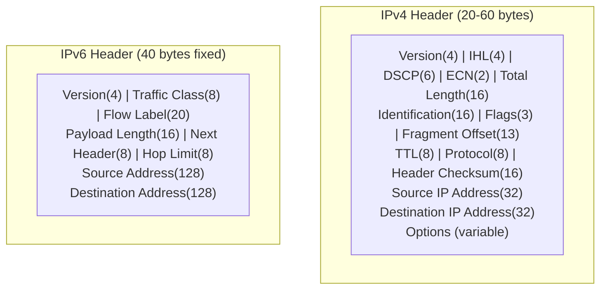
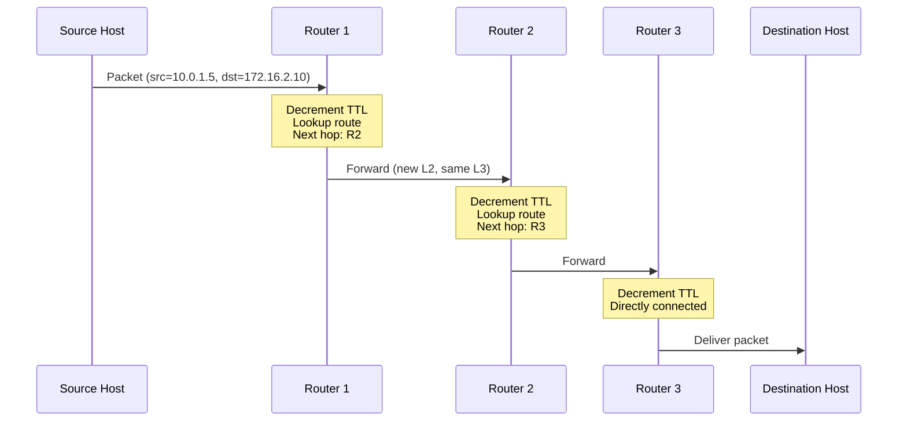
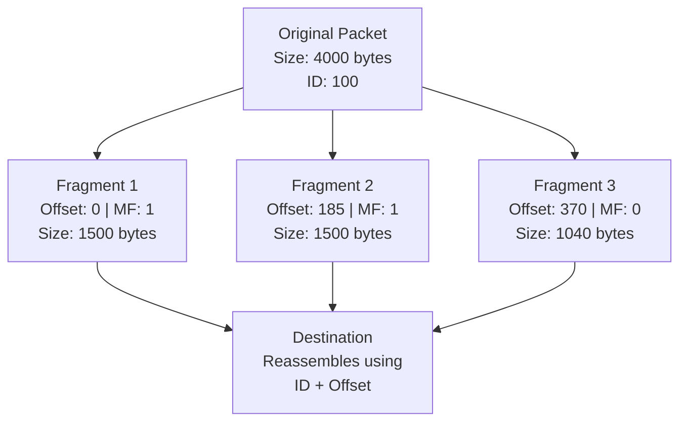
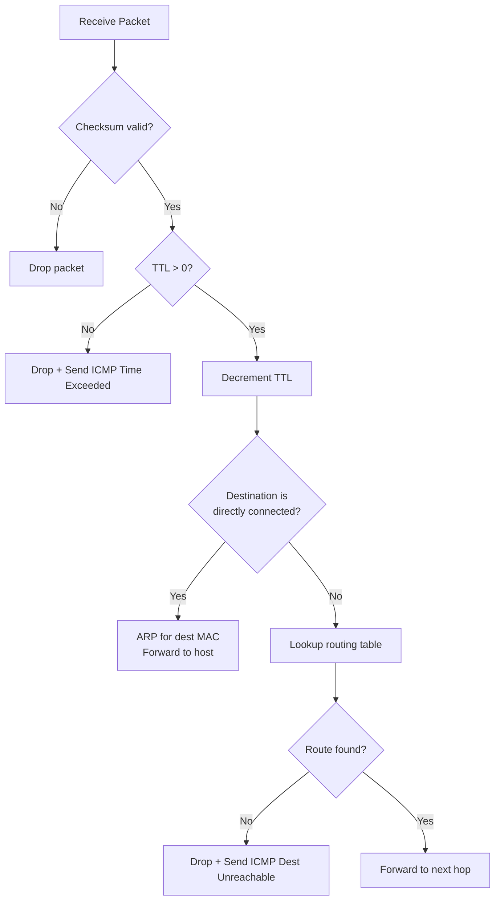
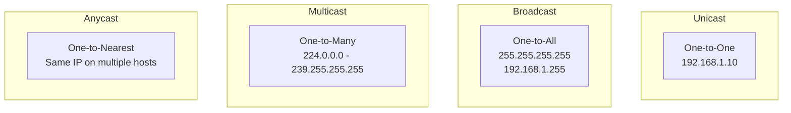

# Internet Protocol (IP)

> *"IP is the Internet's backbone — it gets packets from source to destination, one hop at a time."*

## Overview

The **Internet Protocol (IP)** is the principal protocol of the Internet Layer. It provides **logical addressing** and **routing** — determining how packets travel from source to destination across potentially many intermediate networks. IP is **connectionless** and **unreliable** (best-effort delivery).

## IPv4 vs IPv6 at a Glance

| Feature | IPv4 | IPv6 |
|---------|------|------|
| Address size | 32 bits | 128 bits |
| Address format | Dotted decimal (192.168.1.1) | Hexadecimal (2001:db8::1) |
| Address space | ~4.3 billion | ~340 undecillion |
| Header size | 20-60 bytes (variable) | 40 bytes (fixed) |
| Fragmentation | Routers and sender | Sender only |
| Checksum | Yes | No (delegated to L2/L4) |
| Broadcast | Yes | No (uses multicast) |
| NAT | Common | Not needed (abundant addresses) |
| IPSec | Optional | Mandatory (in spec) |
| Configuration | Manual/DHCP | SLAAC/DHCPv6 |

## IP Header Comparison



## IP Packet Lifecycle



Key observations:
- **Source and destination IP** remain unchanged end-to-end
- **MAC addresses** change at each hop (L2 delivery)
- **TTL** decrements at each router (prevents loops)
- **No acknowledgment** — IP doesn't know if packet arrived

## IP Fragmentation



- **MTU** (Maximum Transmission Unit): Largest frame size (1500 bytes for Ethernet)
- **Identification**: Same ID for all fragments of original packet
- **Flags**: DF (Don't Fragment), MF (More Fragments)
- **Fragment Offset**: Position in original packet (in 8-byte units)
- **Reassembly**: Only at destination (not at intermediate routers)
- **Path MTU Discovery**: Source discovers smallest MTU on path to avoid fragmentation

## Routing Process

### How a Router Processes a Packet



### Routing Table Example

```
$ ip route
default via 192.168.1.1 dev eth0 proto dhcp metric 100
10.0.0.0/8 via 192.168.1.254 dev eth0 proto static metric 10
172.16.0.0/12 via 192.168.1.253 dev eth0 proto static metric 20
192.168.1.0/24 dev eth0 proto kernel scope link src 192.168.1.100
```

| Destination | Next Hop | Interface | Source |
|-------------|----------|-----------|--------|
| 0.0.0.0/0 (default) | 192.168.1.1 | eth0 | DHCP |
| 10.0.0.0/8 | 192.168.1.254 | eth0 | Static |
| 192.168.1.0/24 | directly connected | eth0 | Kernel |

**Longest prefix match**: Router selects the most specific route (e.g., /24 before /16).

## IP Address Types



| Type | Description | Use Case |
|------|-------------|----------|
| **Unicast** | Single sender, single receiver | Most Internet traffic |
| **Broadcast** | Single sender, all on network | ARP, DHCP discovery |
| **Multicast** | Single sender, group of receivers | Video streaming, OSPF |
| **Anycast** | Single sender, nearest of many | DNS root servers, CDN |

## Interview Questions

### Beginner

**Q1: What is IP and why is it important?**
IP (Internet Protocol) provides logical addressing and routing for packets traveling across networks. It's important because it enables communication between any two devices on the Internet, regardless of the underlying network technology. IP addresses uniquely identify devices, and routers use these addresses to forward packets hop-by-hop toward the destination.

**Q2: What is the difference between IPv4 and IPv6?**
IPv4 uses 32-bit addresses (~4.3 billion), written as dotted decimal (192.168.1.1). IPv6 uses 128-bit addresses (340 undecillion), written as hexadecimal (2001:db8::1). IPv6 was created because IPv4 addresses are exhausted. IPv6 also simplifies the header, removes NAT need, and mandates IPSec support.

**Q3: Why is IP considered unreliable?**
IP doesn't guarantee: delivery (packets can be dropped), ordering (packets can arrive out of sequence), or duplicate prevention. It's "best-effort" — it tries to deliver but makes no promises. This design keeps IP simple and fast. Reliability is provided by TCP at the Transport Layer.

### Intermediate

**Q4: Explain IP fragmentation and why Path MTU Discovery is preferred.**
When a packet is larger than the MTU of a link, the router fragments it into smaller pieces. Each fragment has the same ID but different offsets. The destination reassembles them. However, fragmentation is inefficient — it increases overhead, and losing one fragment loses the whole packet. Path MTU Discovery avoids fragmentation by having the source send packets with DF=1; if a router can't forward without fragmenting, it sends back an ICMP message with the MTU, and the source reduces packet size.

**Q5: How does a router decide where to forward a packet?**
1. Receive packet, verify checksum
2. Decrement TTL (drop if 0)
3. Look up destination IP in routing table using **longest prefix match**
4. If route found: determine next hop IP and outgoing interface
5. ARP for next hop's MAC address (or use cached entry)
6. Create new L2 frame with next hop's MAC, forward
7. If no route: send ICMP Destination Unreachable to source

**Q6: What is the significance of TTL and how does traceroute use it?**
TTL (Time To Live) prevents packets from looping forever. Each router decrements TTL by 1; at 0, the packet is discarded and ICMP Time Exceeded is sent back. Traceroute exploits this by sending packets with TTL=1, then TTL=2, etc. Each router along the path responds with its identity, revealing the route.

### Advanced / FAANG-Level

**Q7: How would you design an IP addressing plan for a multinational corporation with 50,000 employees across 20 offices?**
Design:
1. **Use 10.0.0.0/8** (private addressing) with hierarchical allocation:
   - `10.{region}.{site}.{subnet}` — 3-level hierarchy
   - Region: 1=Americas, 2=EMEA, 3=APAC (1 byte)
   - Site: 1-20 per region (1 byte)
   - Subnet: 0-255 per site (1 byte)
2. **Subnet sizing**: /24 for small offices (254 hosts), /22 for large (1022 hosts)
3. **WAN links**: /30 or /31 point-to-point links from 10.100.0.0/16
4. **VPN/Remote**: 10.200.0.0/16 for VPN clients
5. **Summarization**: Each office summarizes to /16 or /12 for routing efficiency
6. **IPv6**: Deploy dual-stack with 2001:db8:xxxx::/48 per site
7. **DNS**: Split-horizon DNS for internal/external resolution
8. **NAT**: Centralized NAT at Internet breakout points

**Q8: Compare IP-in-IP tunneling, GRE, VXLAN, and Geneve.**
| Feature | IP-in-IP | GRE | VXLAN | Geneve |
|---------|----------|-----|-------|--------|
| Encapsulation | IP only | Any L3 | L2 over L3 | L2 over L3 |
| Header size | 20 bytes | 8+ bytes | 50 bytes | Variable |
| Multiplexing | No (key field) | Yes (key) | Yes (VNI 24-bit) | Yes (VNI 24-bit) |
| Encryption | No | No (add IPsec) | No | No (add DTLS) |
| Extensibility | None | Limited | Fixed | TLV options |
| Use case | Simple L3 VPN | Legacy VPN | Cloud/DC overlay | Cloud/DC overlay |

Geneve is the modern successor — designed to be extensible with TLV options.

**Q9: Explain the implications of IP address exhaustion and the transition mechanisms.**
IPv4 exhaustion (all addresses allocated by 2011) led to:
1. **NAT**: Many devices share one public IP (most common solution)
2. **CGNAT**: Carrier-grade NAT for ISPs (double NAT)
3. **IPv6 adoption**: Gradual, now ~40% of Internet traffic
4. **Transition mechanisms**:
   - **Dual-stack**: Run IPv4 and IPv6 simultaneously
   - **6to4**: Tunnel IPv6 over IPv4 (deprecated)
   - **NAT64/DNS64**: IPv6-only clients access IPv4 servers
   - **464XLAT**: IPv6-only cellular with CLAT on device
5. **Challenges**: Legacy systems, incomplete IPv6 support, training

## Common Mistakes

1. ❌ Thinking IP guarantees delivery — it's best-effort only
2. ❌ Confusing IP address with MAC address — IP is logical (L3), MAC is physical (L2)
3. ❌ Forgetting that fragmentation only happens at source in IPv6 — routers don't fragment
4. ❌ Assuming broadcast works in IPv6 — it doesn't; multicast is used instead
5. ❌ Thinking NAT is part of the IP standard — it's a workaround, not a protocol feature

## Summary

- IP provides **logical addressing** and **routing** across networks
- **IPv4** (32-bit) is being supplemented by **IPv6** (128-bit) due to address exhaustion
- **Connectionless, best-effort** — no delivery guarantees (TCP adds reliability)
- **Fragmentation** handles MTU differences; Path MTU Discovery is preferred
- **Routing**: Longest prefix match, TTL prevents loops
- **Address types**: Unicast, broadcast, multicast, anycast

## Cross-References

- [IPv4](ipv4.md) — Detailed IPv4 coverage
- [IPv6](ipv6.md) — Detailed IPv6 coverage
- [Subnetting](subnetting.md) — Dividing IP networks
- [CIDR](cidr.md) — Classless addressing
- [ICMP](icmp.md) — Error reporting protocol
- [ARP](arp.md) — IP to MAC resolution

## Cross References

- [IPv4](ipv4.md)
- [IPv6](ipv6.md)
- [Subnetting](subnetting.md)
- [NAT](nat.md)
- [Routing Algorithms](../routing/ospf.md)
