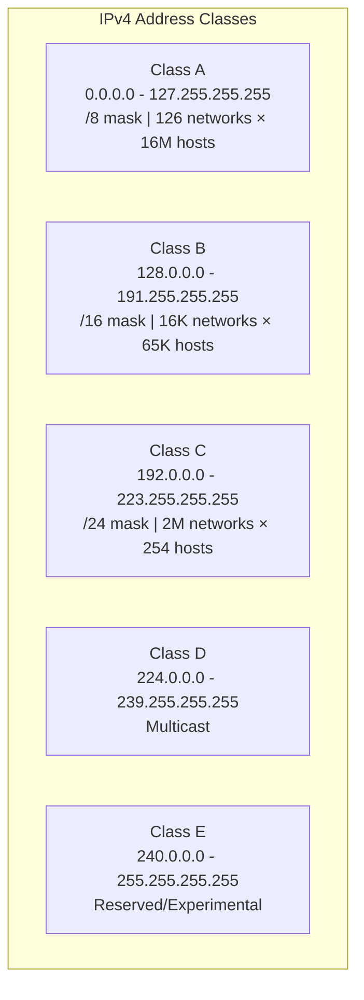
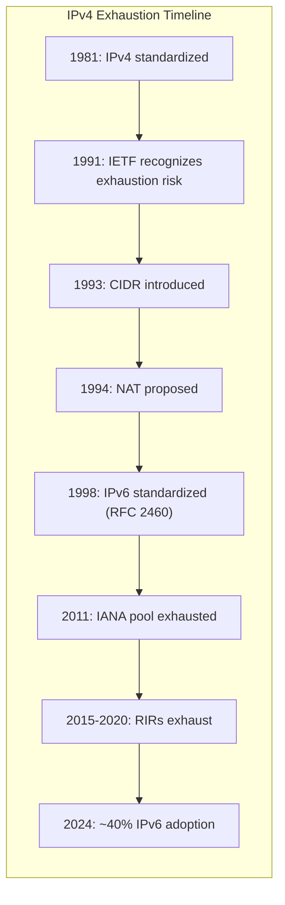

# IPv4 (Internet Protocol Version 4)

> *"IPv4's 32-bit address space was 'enough for the Internet' — until it wasn't."*

## Overview

**IPv4** is the fourth version of the Internet Protocol and the first to be widely deployed. It uses **32-bit addresses**, providing approximately **4.3 billion** unique addresses. Despite IPv6's development, IPv4 remains dominant on the Internet.

## IPv4 Address Format

### Dotted Decimal Notation
```
192.168.1.100

Binary:  11000000.10101000.00000001.01100100
Decimal: 192      .168      .1        .100

Each octet: 8 bits, range 0-255
```

### Address Structure
```
┌─────────────────┬─────────────────┐
│  Network Part   │   Host Part     │
│  (identifies    │   (identifies   │
│   the network)  │   the device)   │
└─────────────────┴─────────────────┘

The boundary is defined by the subnet mask.
```

## Address Classes (Legacy)



| Class | First Octet | Default Mask | Network Bits | Host Bits | Networks | Hosts/Net |
|-------|------------|-------------|-------------|-----------|----------|-----------|
| A | 0-127 | 255.0.0.0 (/8) | 8 | 24 | 126 | 16,777,214 |
| B | 128-191 | 255.255.0.0 (/16) | 16 | 16 | 16,384 | 65,534 |
| C | 192-223 | 255.255.255.0 (/24) | 24 | 8 | 2,097,152 | 254 |
| D | 224-239 | N/A | N/A | N/A | Multicast | N/A |
| E | 240-255 | N/A | N/A | N/A | Reserved | N/A |

**Note**: Classful addressing is obsolete. CIDR (Classless Inter-Domain Routing) replaced it.

## Special IPv4 Addresses

| Address/Range | Purpose | Description |
|--------------|---------|-------------|
| `0.0.0.0/8` | "This" network | Represents current network |
| `10.0.0.0/8` | Private | Class A private range |
| `100.64.0.0/10` | CGNAT | Carrier-grade NAT |
| `127.0.0.0/8` | Loopback | Localhost testing |
| `169.254.0.0/16` | Link-local | APIPA (auto-configured) |
| `172.16.0.0/12` | Private | Class B private range |
| `192.168.0.0/16` | Private | Class C private range |
| `224.0.0.0/4` | Multicast | Group communication |
| `255.255.255.255` | Broadcast | All hosts on local network |

### Private Address Ranges (RFC 1918)
```
10.0.0.0    - 10.255.255.255   (10.0.0.0/8)     → 16,777,216 addresses
172.16.0.0  - 172.31.255.255   (172.16.0.0/12)  → 1,048,576 addresses
192.168.0.0 - 192.168.255.255  (192.168.0.0/16) → 65,536 addresses
```
These are **not routable** on the public Internet — NAT is required.

## Subnet Masks

### How Subnet Masks Work
```
IP Address:   192.168.1.100    = 11000000.10101000.00000001.01100100
Subnet Mask:  255.255.255.0    = 11111111.11111111.11111111.00000000
                                 ├────────── network ──────────┤├ host ┤

Network ID:   192.168.1.0      (IP AND Mask)
Broadcast:    192.168.1.255    (Network OR NOT Mask)
Host Range:   192.168.1.1 - 192.168.1.254
```

### Common Subnet Masks

| CIDR | Subnet Mask | Usable Hosts | Common Use |
|------|------------|-------------|------------|
| /8 | 255.0.0.0 | 16,777,214 | Very large network |
| /16 | 255.255.0.0 | 65,534 | Medium network |
| /24 | 255.255.255.0 | 254 | Small network |
| /25 | 255.255.255.128 | 126 | Subnet of /24 |
| /26 | 255.255.255.192 | 62 | Small subnet |
| /27 | 255.255.255.224 | 30 | Department |
| /28 | 255.255.255.240 | 14 | Small office |
| /30 | 255.255.255.252 | 2 | Point-to-point link |
| /32 | 255.255.255.255 | 1 | Single host |

## IPv4 Header

```
 0                   1                   2                   3
 0 1 2 3 4 5 6 7 8 9 0 1 2 3 4 5 6 7 8 9 0 1 2 3 4 5 6 7 8 9 0 1
+-+-+-+-+-+-+-+-+-+-+-+-+-+-+-+-+-+-+-+-+-+-+-+-+-+-+-+-+-+-+-+-+
|Version|  IHL  |    DSCP   |ECN|         Total Length          |
+-+-+-+-+-+-+-+-+-+-+-+-+-+-+-+-+-+-+-+-+-+-+-+-+-+-+-+-+-+-+-+-+
|         Identification        |Flags|     Fragment Offset     |
+-+-+-+-+-+-+-+-+-+-+-+-+-+-+-+-+-+-+-+-+-+-+-+-+-+-+-+-+-+-+-+-+
|  Time to Live |    Protocol   |         Header Checksum       |
+-+-+-+-+-+-+-+-+-+-+-+-+-+-+-+-+-+-+-+-+-+-+-+-+-+-+-+-+-+-+-+-+
|                       Source Address                          |
+-+-+-+-+-+-+-+-+-+-+-+-+-+-+-+-+-+-+-+-+-+-+-+-+-+-+-+-+-+-+-+-+
|                    Destination Address                        |
+-+-+-+-+-+-+-+-+-+-+-+-+-+-+-+-+-+-+-+-+-+-+-+-+-+-+-+-+-+-+-+-+
|                    Options (if IHL > 5)                       |
+-+-+-+-+-+-+-+-+-+-+-+-+-+-+-+-+-+-+-+-+-+-+-+-+-+-+-+-+-+-+-+-+
```

### Key Header Fields

| Field | Bits | Purpose |
|-------|------|---------|
| **Version** | 4 | IP version (4 for IPv4) |
| **IHL** | 4 | Header length in 32-bit words (min 5 = 20 bytes) |
| **DSCP** | 6 | Differentiated Services Code Point (QoS) |
| **ECN** | 2 | Explicit Congestion Notification |
| **Total Length** | 16 | Entire packet size in bytes (max 65,535) |
| **Identification** | 16 | Unique ID for fragment reassembly |
| **Flags** | 3 | DF (Don't Fragment), MF (More Fragments) |
| **Fragment Offset** | 13 | Fragment position in 8-byte units |
| **TTL** | 8 | Hop limit (decremented each router) |
| **Protocol** | 8 | Upper layer protocol (6=TCP, 17=UDP, 1=ICMP) |
| **Checksum** | 16 | Header error detection |
| **Source IP** | 32 | Sender's IP address |
| **Destination IP** | 32 | Receiver's IP address |

## IPv4 Exhaustion



### Mitigation Strategies
1. **CIDR**: Efficient address allocation (replaced classful)
2. **NAT**: Many private addresses share one public IP
3. **DHCP**: Dynamic allocation, reuse addresses
4. **IPv6**: The long-term solution

## Interview Questions

### Beginner

**Q1: What is an IPv4 address?**
An IPv4 address is a 32-bit logical identifier assigned to devices on a network, written as four decimal numbers separated by dots (e.g., 192.168.1.1). It uniquely identifies a device and enables routing across networks. The address has two parts: network ID (which network) and host ID (which device on that network).

**Q2: What are private IP addresses?**
Private IP addresses (RFC 1918) are ranges reserved for internal networks: 10.0.0.0/8, 172.16.0.0/12, and 192.168.0.0/16. They're not routable on the public Internet. Organizations use NAT to translate private addresses to public addresses for Internet access. This conserves public IPv4 addresses.

**Q3: What is a subnet mask?**
A subnet mask divides an IP address into network and host portions. It's a 32-bit number where 1s represent the network part and 0s represent the host part. For example, 255.255.255.0 (/24) means the first 24 bits are the network, and the last 8 bits are for hosts.

### Intermediate

**Q4: How do you calculate the number of usable hosts in a subnet?**
Formula: **2^n - 2** where n = number of host bits. Subtract 2 because:
- One address is reserved for the **network ID** (all host bits 0)
- One address is reserved for the **broadcast** (all host bits 1)
Example: /24 has 8 host bits → 2^8 - 2 = 254 usable hosts

**Q5: What is the difference between classful and classless addressing?**
- **Classful** (legacy): Fixed boundaries at /8, /16, /24. Wasteful — a company needing 300 hosts gets a Class B (65,534 addresses).
- **Classless (CIDR)**: Variable-length subnet masks (e.g., /23). Precise allocation. A company needing 300 hosts gets a /23 (510 addresses). CIDR also enables route summarization.

**Q6: Explain the IPv4 header checksum.**
The checksum covers only the IP header (not the payload). It's calculated using one's complement sum of all 16-bit words in the header. Each router recalculates it (because TTL changes). If the checksum doesn't match, the packet is discarded. Note: IPv6 removed the header checksum, delegating error detection to link-layer (FCS) and transport-layer (TCP/UDP checksum).

### Advanced / FAANG-Level

**Q7: Design an IP addressing scheme for a cloud provider serving 10,000 tenants.**
Design:
1. **Use 10.0.0.0/8** with hierarchical allocation:
   - `10.{region_r}.{zone_z}.{tenant_t}` — 3-level hierarchy
   - Region: 1-8 (3 bits), Zone: 1-16 (4 bits), Tenant: 1-10000+ (remaining bits)
2. **VPC per tenant**: Each tenant gets a /16 or /20 VPC with subnets
3. **Overlapping addresses**: Use VXLAN/overlay networking to allow tenants to use same private ranges
4. **Public IPs**: Allocate from a separate public pool, NAT at edge
5. **IPv6**: Dual-stack, /56 per tenant
6. **Routing**: BGP for inter-region, OSPF within region, VXLAN for tenant isolation
7. **Automation**: IPAM (IP Address Management) system for allocation/tracking

**Q8: How does CGNAT (Carrier-Grade NAT) work and what are its limitations?**
CGNAT allows ISPs to share one public IPv4 among many customers:
1. Customer's router does NAT (private → ISP-assigned private, e.g., 100.64.x.x)
2. ISP's CGNAT device does second NAT (100.64.x.x → public IP)
3. Uses port ranges to disambiguation (customer 1: ports 1000-2000, customer 2: 2001-3000)

Limitations:
- **Port exhaustion**: Limited ports per public IP
- **Logging complexity**: Must log both NAT layers for legal/compliance
- **Breaks protocols**: P2P, VoIP, online gaming (can't accept inbound)
- **Double NAT**: Customer's NAT + ISP's NAT = complex troubleshooting
- **Latency**: Additional processing hop
- **Legal**: Law enforcement needs to correlate IP + port + timestamp to identify user

**Q9: Explain IPv4 reassembly attacks and how to defend against them.**
Fragment attacks:
1. **Teardrop**: Overlapping fragments cause crash on reassembly
2. **Tiny fragments**: Bypass firewall rules by splitting TCP header across fragments
3. **Fragment flood**: Exhaust reassembly buffers with many incomplete fragment sets
4. **Rose attack**: Crafted fragments that consume resources indefinitely

Defenses:
- **Firewall**: Drop fragments that don't contain TCP/UDP headers in first fragment
- **Timeouts**: Short reassembly timeout (30 seconds)
- **Limits**: Max fragments per packet, max concurrent reassembly sessions
- **IDS/IPS**: Detect anomalous fragment patterns
- **IPv6**: No router fragmentation — sender only, with minimum MTU of 1280 bytes

## Common Mistakes

1. ❌ Forgetting to subtract 2 for usable hosts (network ID + broadcast)
2. ❌ Confusing /24 with "24 hosts" — it's 254 usable hosts
3. ❌ Thinking private IPs can route on the Internet — they can't without NAT
4. ❌ Mixing up subnet mask and CIDR notation — they're the same thing in different formats
5. ❌ Assuming classful addressing is still used — CIDR replaced it decades ago

## Summary

- IPv4 uses **32-bit addresses** (~4.3 billion total, now exhausted)
- **Dotted decimal notation**: Four octets, 0-255 each
- **Private ranges**: 10.0.0.0/8, 172.16.0.0/12, 192.168.0.0/16
- **Subnet mask** divides address into network and host parts
- **CIDR** replaced classful addressing for efficient allocation
- **Exhaustion mitigations**: NAT, CIDR, DHCP, IPv6
- **Header**: 20-60 bytes, includes TTL, protocol, checksum, fragmentation fields

## Cross-References

- [IPv6](ipv6.md) — The successor to IPv4
- [Subnetting](subnetting.md) — Dividing networks
- [CIDR](cidr.md) — Classless addressing
- [NAT](nat.md) — Address translation
- [DHCP](dhcp.md) — Dynamic address assignment
