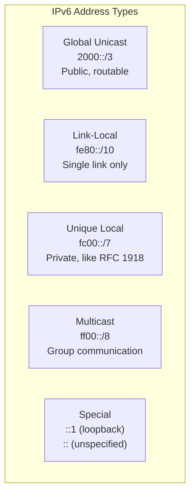
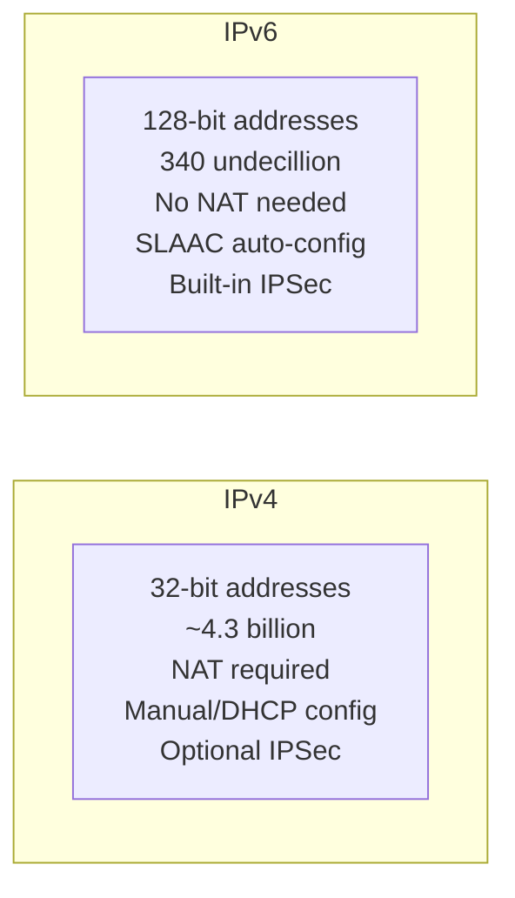
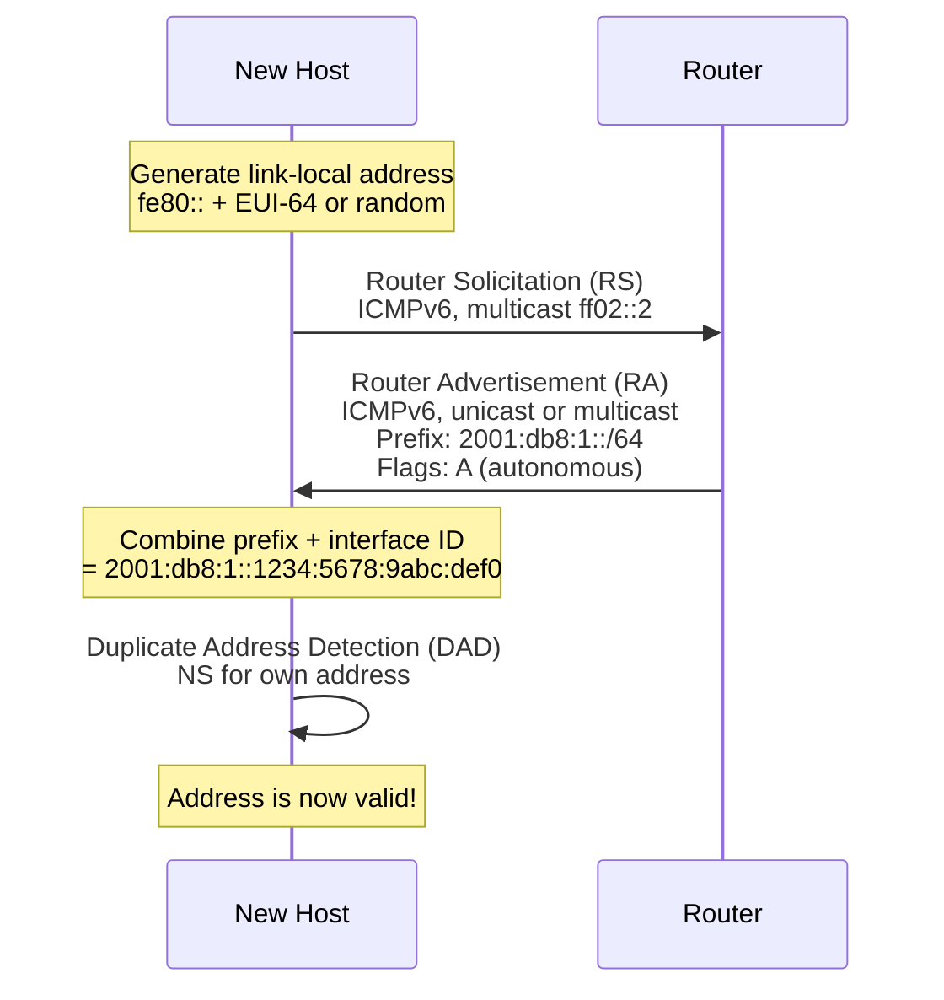
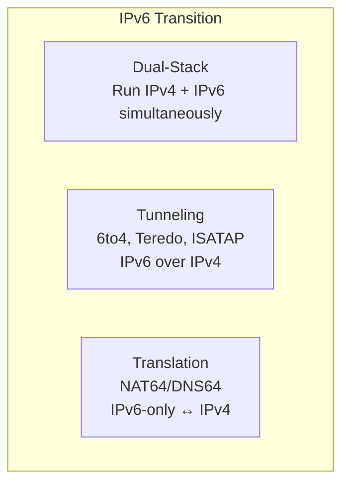

# IPv6 (Internet Protocol Version 6)

> *"IPv6 gives every atom on Earth its own IP address — and then some."*

## Overview

**IPv6** is the successor to IPv4, designed to solve address exhaustion. It uses **128-bit addresses** (340 undecillion unique addresses), simplifies the header, removes the need for NAT, and includes built-in security (IPSec) and auto-configuration (SLAAC).

## IPv6 Address Format

### Representation
```
Full:   2001:0DB8:0000:0000:0000:0000:0000:0001
Short:  2001:DB8::1

Rules:
- Leading zeros in each group can be omitted
- One sequence of all-zero groups can be replaced with ::
- Hexadecimal, 8 groups of 16 bits each
```

### Address Examples
```
Loopback:       ::1 (equivalent of 127.0.0.1)
Unspecified:    :: (equivalent of 0.0.0.0)
Link-local:     fe80::1
Global unicast: 2001:db8::1
Multicast:      ff02::1 (all nodes)
```

## IPv6 Address Types



| Type | Prefix | Purpose | IPv4 Equivalent |
|------|--------|---------|----------------|
| **Global Unicast** | 2000::/3 | Public addresses | Public IPv4 |
| **Link-Local** | fe80::/10 | Auto-configured, single link | 169.254.0.0/16 |
| **Unique Local (ULA)** | fc00::/7 | Private networks | RFC 1918 addresses |
| **Multicast** | ff00::/8 | Group communication | 224.0.0.0/4 |
| **Loopback** | ::1 | Localhost | 127.0.0.1 |
| **Unspecified** | :: | Absence of address | 0.0.0.0 |

## IPv6 Header (Fixed 40 bytes)

```
+-+-+-+-+-+-+-+-+-+-+-+-+-+-+-+-+-+-+-+-+-+-+-+-+-+-+-+-+-+-+-+-+
|Version| Traffic Class |           Flow Label                  |
+-+-+-+-+-+-+-+-+-+-+-+-+-+-+-+-+-+-+-+-+-+-+-+-+-+-+-+-+-+-+-+-+
|         Payload Length        |  Next Header  |   Hop Limit   |
+-+-+-+-+-+-+-+-+-+-+-+-+-+-+-+-+-+-+-+-+-+-+-+-+-+-+-+-+-+-+-+-+
|                                                               |
+                                                               +
|                                                               |
+                         Source Address                        +
|                                                               |
+                                                               +
|                                                               |
+-+-+-+-+-+-+-+-+-+-+-+-+-+-+-+-+-+-+-+-+-+-+-+-+-+-+-+-+-+-+-+-+
|                                                               |
+                                                               +
|                                                               |
+                      Destination Address                      +
|                                                               |
+                                                               +
|                                                               |
+-+-+-+-+-+-+-+-+-+-+-+-+-+-+-+-+-+-+-+-+-+-+-+-+-+-+-+-+-+-+-+-+
```

### Key Differences from IPv4 Header

| Feature | IPv4 | IPv6 |
|---------|------|------|
| Header size | 20-60 bytes (variable) | 40 bytes (fixed) |
| Fragmentation | Routers + sender | Sender only |
| Checksum | Yes | No (L2/L4 handle it) |
| Options | In header | Extension headers |
| Broadcast | Yes | No (use multicast) |
| Flow Label | No | Yes (20 bits) |

## IPv6 vs IPv4



| Feature | IPv4 | IPv6 |
|---------|------|------|
| Address space | 2^32 (~4.3B) | 2^128 (~340×10^36) |
| Header complexity | Variable, complex | Fixed, simplified |
| Fragmentation | By routers and sender | By sender only |
| Checksum | Header checksum | None (at IP layer) |
| Broadcast | Yes | No (multicast instead) |
| NAT | Common | Not needed |
| Auto-configuration | DHCP | SLAAC + DHCPv6 |
| IPSec | Optional | Mandatory (in spec) |
| ARP | Yes | NDP (ICMPv6) |
| DNS | A records | AAAA records |

## IPv6 Auto-Configuration (SLAAC)



**SLAAC** (Stateless Address Auto-Configuration):
1. Host generates **link-local** address (fe80:: + interface identifier)
2. Sends **Router Solicitation** to find routers
3. Router replies with **Router Advertisement** containing prefix
4. Host combines prefix + interface ID to form **global address**
5. **DAD** (Duplicate Address Detection) ensures uniqueness

## Neighbor Discovery Protocol (NDP)

NDP replaces ARP, ICMP Router Discovery, and ICMP Redirect from IPv4.

| Function | IPv4 | IPv6 (NDP) |
|----------|------|------------|
| Address resolution | ARP (broadcast) | Neighbor Solicitation (multicast) |
| Router discovery | DHCP/ICMP | Router Solicitation/Advertisement |
| Redirect | ICMP Redirect | ICMPv6 Redirect |
| DAD | Gratuitous ARP | Neighbor Solicitation |
| Prefix discovery | DHCP | Router Advertisement |

## IPv6 Extension Headers

```
IPv6 Header → Hop-by-Hop Options → Routing → Fragment → Destination → TCP/UDP
```

| Extension Header | Purpose |
|-----------------|---------|
| **Hop-by-Hop Options** | Per-hop processing (router alerts) |
| **Routing** | Source routing (like IPv4 loose source route) |
| **Fragment** | Fragmentation info (sender only) |
| **Destination Options** | Options for destination host |
| **Authentication (AH)** | IPSec authentication |
| **Encapsulating Security (ESP)** | IPSec encryption |

## Transition Mechanisms



| Mechanism | Description | Use Case |
|-----------|-------------|----------|
| **Dual-Stack** | Run IPv4 and IPv6 on same interface | Most common, recommended |
| **6to4** | Tunnel IPv6 over IPv4 (deprecated) | Legacy |
| **Teredo** | IPv6 through NAT (deprecated) | Legacy |
| **NAT64/DNS64** | Translate between IPv6 and IPv4 | IPv6-only networks accessing IPv4 |
| **464XLAT** | Client-side translation | Mobile networks (IPv6-only) |

## Interview Questions

### Beginner

**Q1: Why do we need IPv6?**
IPv4 has only ~4.3 billion addresses, which are exhausted. IPv6 provides 340 undecillion (3.4×10^38) addresses — enough for every device on Earth and beyond. IPv6 also simplifies the header, removes NAT dependency, enables auto-configuration (SLAAC), and includes built-in security.

**Q2: How is an IPv6 address written?**
IPv6 addresses are 128 bits written as 8 groups of 4 hexadecimal digits separated by colons (e.g., 2001:0DB8:0000:0000:0000:0000:0000:0001). Leading zeros in each group can be omitted, and one sequence of all-zero groups can be replaced with `::` (e.g., 2001:DB8::1).

**Q3: What is SLAAC?**
SLAAC (Stateless Address Auto-Configuration) allows IPv6 hosts to automatically configure their own IP addresses without a DHCP server. The host combines the network prefix (from Router Advertisement) with its own interface identifier (derived from MAC address or randomly generated). It then verifies uniqueness using DAD.

### Intermediate

**Q4: Why does IPv6 not need NAT?**
IPv6 has enough addresses for every device to have a globally unique address. NAT was created for IPv4 to conserve addresses by sharing one public IP among many devices. With IPv6, each device can have its own public address, eliminating the need for address translation. This simplifies networking, enables true end-to-end connectivity, and avoids NAT-related issues with protocols that embed IP addresses.

**Q5: How does NDP replace ARP?**
In IPv4, ARP broadcasts "who has this IP?" and the owner replies with its MAC. In IPv6, NDP uses ICMPv6 with multicast:
1. Host sends **Neighbor Solicitation** (NS) to solicited-node multicast address
2. Target responds with **Neighbor Advertisement** (NA) with its MAC
This is more efficient than broadcast and supports additional features like DAD and router discovery.

**Q6: What happens to the IPv6 header checksum?**
IPv6 removed the header checksum entirely. This was a deliberate design choice:
- Link-layer (Ethernet FCS) already detects bit errors
- Transport-layer (TCP/UDP) checksums verify data integrity
- Removing it speeds up router processing (no recalculation at each hop)
- IPv4's header checksum was redundant given L2 and L4 checks

### Advanced / FAANG-Level

**Q7: Design an IPv6 deployment strategy for an enterprise with 5000 employees.**
Phased approach:
1. **Phase 1 - Assessment**: Inventory all IPv4-dependent systems, identify compatibility
2. **Phase 2 - Dual-Stack Core**: Enable IPv6 on core network (routers, switches, DNS)
3. **Phase 3 - Server Infrastructure**: IPv6 on servers, load balancers, monitoring
4. **Phase 4 - Client Rollout**: Enable IPv6 on workstations, test applications
5. **Phase 5 - External**: IPv6 on public-facing services (website, email)
6. **Phase 6 - IPv6-Only**: Where possible, run IPv6-only with NAT64 for legacy IPv4

Addressing: 2001:db8:xxxx::/48 per site, /64 per subnet. Use SLAAC for clients, DHCPv6 for servers (for DNS registration). Monitor dual-stack traffic ratios.

**Q8: Explain the challenges of running IPv6-only networks.**
Challenges:
1. **Legacy applications**: Some hardcode IPv4 or don't support IPv6
2. **Broken IPv6**: Some networks advertise IPv6 but can't route it (happy eyeballs needed)
3. **DNS**: Must support AAAA records; NAT64/DNS64 for IPv4-only destinations
4. **Monitoring**: Tools must support IPv6; some still default to IPv4
5. **Security**: IPv6 firewalls, ACLs, and monitoring must be as mature as IPv4
6. **Training**: Staff unfamiliar with IPv6 troubleshooting
7. **IoT**: Many IoT devices only support IPv4
8. **DHCPv6**: Not universally supported (Android doesn't support DHCPv6 for address assignment)

**Q9: How does IPv6 handle multicast and how does it differ from IPv4?**
IPv6 multicast differences:
1. **No broadcast**: IPv6 uses multicast where IPv4 would broadcast
2. **Solicited-node multicast**: Every unicast address has a corresponding multicast address (ff02::1:ffxx:xxxx) for efficient NDP
3. **Scoped addresses**: Link-local (ff02::), site-local (ff05::), global (ff0x::)
4. **MLD**: Multicast Listener Discovery replaces IGMP
5. **Embedded RP**: Rendezvous Point address embedded in multicast group address
6. **No need for PIM-SSM**: Source-specific multicast is native

Examples:
- `ff02::1` — All nodes on link
- `ff02::2` — All routers on link
- `ff02::fb` — mDNS
- `ff02::1:ff00:1` — Solicited-node for address ending in ::1

## Common Mistakes

1. ❌ Assuming IPv6 is "just longer IPv4" — the protocols are fundamentally different
2. ❌ Forgetting link-local addresses are mandatory — every IPv6 interface has one
3. ❌ Using NAT with IPv6 — it's unnecessary and defeats IPv6's purpose
4. ❌ Ignoring IPv6 security — just because addresses are abundant doesn't mean they're secure
5. ❌ Not implementing dual-stack — most networks need both IPv4 and IPv6 during transition

## Summary

- IPv6 uses **128-bit addresses** (340 undecillion), solving IPv4 exhaustion
- **Simplified header** (40 bytes fixed), no checksum, no router fragmentation
- **Auto-configuration** via SLAAC; no NAT needed (enough addresses for all)
- **NDP** replaces ARP, ICMP Router Discovery, and more
- **Transition**: Dual-stack, tunneling, and translation mechanisms
- **Built-in IPSec** support (though implementation varies)
- Adoption growing (~40% of Internet traffic in 2024)

## Cross-References

- [IPv4](ipv4.md) — The predecessor
- [ICMP](icmp.md) — ICMPv6 is used by NDP
- [NAT](nat.md) — Why IPv6 doesn't need it
- [Subnetting](subnetting.md) — /64 is the standard IPv6 subnet

## Cross References

- [IPv4](ipv4.md)
- [NAT](nat.md)
- [ICMP](icmp.md)
