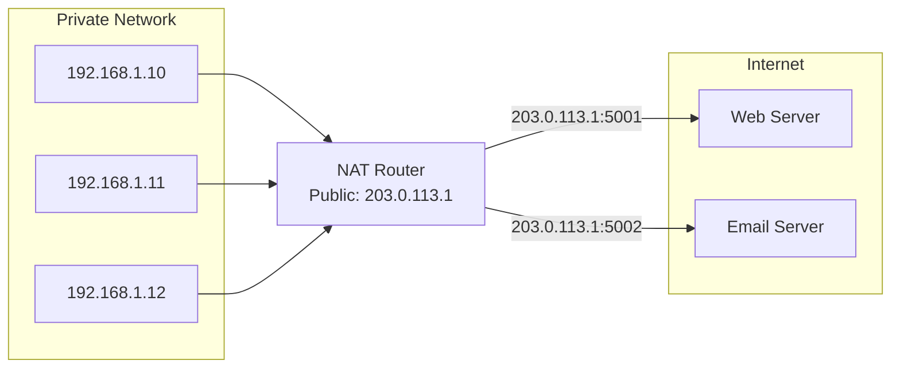
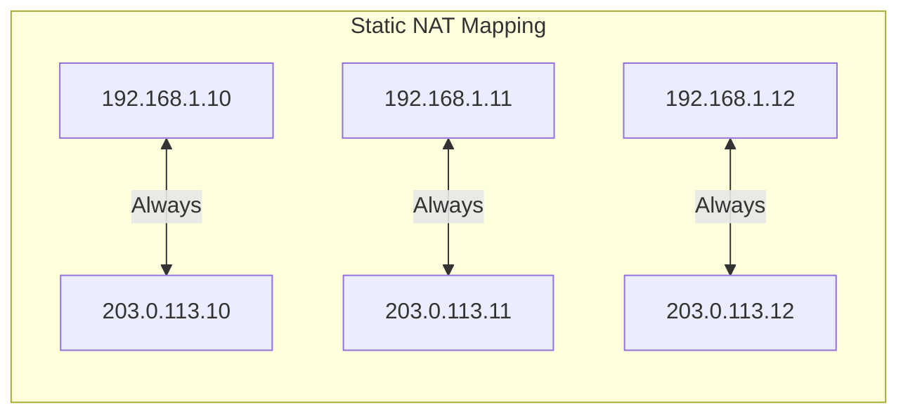
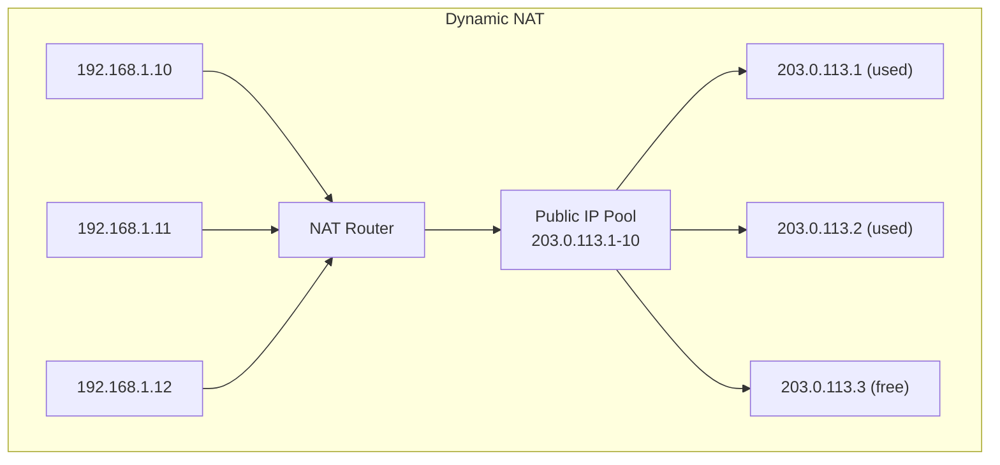
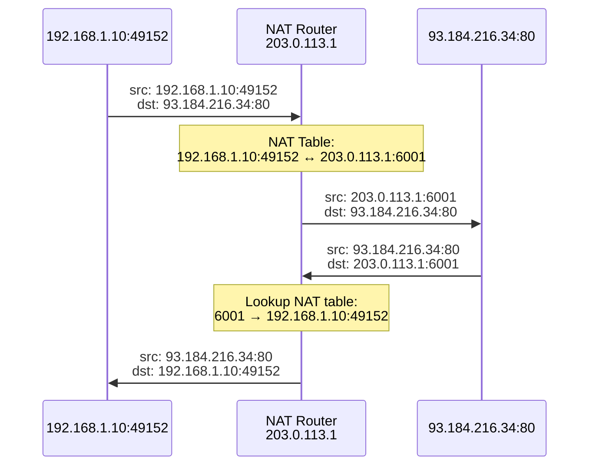
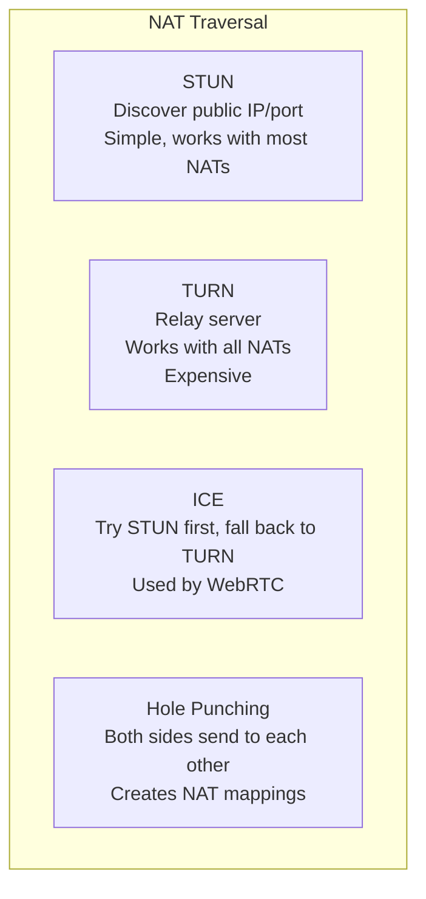
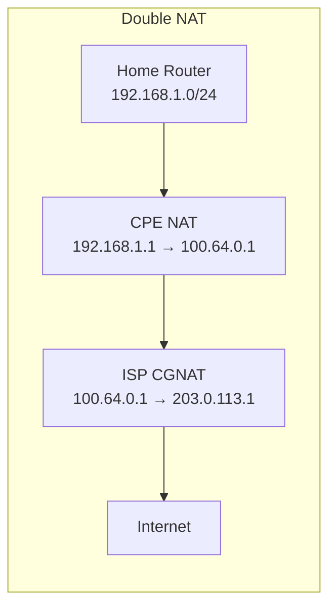

# NAT (Network Address Translation)

> *"NAT is the Internet's most creative hack — making millions of devices share one address."*

## Overview

**Network Address Translation (NAT)** translates private IP addresses to public IP addresses and vice versa. It was created to solve IPv4 address exhaustion by allowing multiple devices on a private network to share a single public IP address. NAT operates at the boundary between private and public networks (typically on a router or firewall).

## Why NAT Exists

**Without NAT**: Each device needs a public IPv4 address (only 4.3 billion exist)
**With NAT**: Thousands of devices share one public IP (using different ports)

## Types of NAT

### 1. Static NAT (One-to-One)

- **Fixed mapping**: Private IP ↔ Public IP (permanent)
- **Use case**: Servers that need consistent public addresses
- **Drawback**: Requires one public IP per device (no conservation)

### 2. Dynamic NAT (Pool)

- **Pool of public IPs**: Assigned on first-come, first-served basis
- **Dynamic mapping**: Changes each session
- **Limitation**: Can run out of pool addresses

### 3. PAT (Port Address Translation) — Most Common

- **Many-to-one**: Thousands of private hosts share one public IP
- **Port numbers** disambiguate connections
- **Also called**: NAT overload, IP masquerading
- **Most common**: Home routers, corporate networks

### NAT Translation Table Example

| Private IP:Port | Public IP:Port | Destination | Protocol |
|----------------|---------------|-------------|----------|
| 192.168.1.10:49152 | 203.0.113.1:6001 | 93.184.216.34:80 | TCP |
| 192.168.1.10:49153 | 203.0.113.1:6002 | 8.8.8.8:53 | UDP |
| 192.168.1.11:51234 | 203.0.113.1:6003 | 142.250.185.78:443 | TCP |
| 192.168.1.12:52000 | 203.0.113.1:6004 | 104.16.132.229:443 | TCP |

## NAT and Protocols

### Protocols That Struggle with NAT

| Protocol | Problem | Solution |
|----------|---------|----------|
| **FTP** | Embeds IP in payload (PORT command) | FTP ALG (Application Layer Gateway) |
| **SIP** | IP addresses in SDP body | SIP ALG, STUN/TURN |
| **IPsec** | AH authenticates headers (including IP) | NAT-T (NAT Traversal, UDP port 4500) |
| **P2P** | Can't accept inbound connections | STUN, TURN, ICE, hole punching |

### NAT Traversal Techniques

## NAT vs Proxy vs Firewall

| Feature | NAT | Proxy | Firewall |
|---------|-----|-------|----------|
| **Layer** | L3/L4 | L4/L7 | L3-L7 |
| **Purpose** | Address translation | Content filtering/caching | Security/ACL |
| **Transparency** | Mostly transparent | Visible to client | Transparent |
| **State** | Translation table | Session/HTTP state | Rule matching |
| **Example** | Home router | Squid, HAProxy | iptables, pf |

## CGNAT (Carrier-Grade NAT)

- **Why**: ISPs don't have enough public IPv4 addresses for all customers
- **How**: ISP does NAT before customer's NAT (double NAT)
- **Address range**: 100.64.0.0/10 (RFC 6598, shared address space)
- **Problems**: Breaks P2P, VoIP, gaming; complex troubleshooting; legal identification

## IPv6 and NAT

**IPv6 doesn't need NAT** — there are enough addresses for every device. However:

- **NAT66**: Exists but discouraged; defeats IPv6's end-to-end principle
- **NPTv6** (Network Prefix Translation): Translates prefixes only (not ports), used for multi-homing
- **NAT64**: Translates between IPv6 and IPv4 (transition mechanism)

## Interview Questions

### Beginner

**Q1: What is NAT and why is it used?**
NAT (Network Address Translation) translates private IP addresses to public IP addresses. It's used because: (1) IPv4 addresses are limited (~4.3 billion), (2) Private networks (192.168.x.x, 10.x.x.x) aren't routable on the Internet, (3) NAT allows thousands of devices to share one public IP using port numbers to distinguish connections.

**Q2: What is the difference between static and dynamic NAT?**
- **Static NAT**: Fixed one-to-one mapping (private IP always maps to same public IP). Used for servers.
- **Dynamic NAT**: Public IP assigned from a pool on demand. Changes per session.
- **PAT (NAT Overload)**: Many-to-one using port numbers. Most common (home routers).

**Q3: How does NAT affect incoming connections?**
NAT blocks unsolicited incoming connections because there's no mapping for them. This provides a basic firewall effect. To allow incoming connections: (1) Port forwarding: Map specific public port to internal IP:port, (2) DMZ: Forward all traffic to one internal host, (3) UPnP: Devices request port mappings automatically.

### Intermediate

**Q4: Explain how PAT works with a specific example.**
When a device at 192.168.1.10:49152 connects to 93.184.216.34:80:
1. NAT router creates mapping: 192.168.1.10:49152 ↔ 203.0.113.1:6001
2. Packet sent with source 203.0.113.1:6001
3. Server responds to 203.0.113.1:6001
4. NAT looks up table, finds 6001 → 192.168.1.10:49152
5. Forwards to internal host
The key is the port number — it's the disambiguator.

**Q5: What is NAT hairpinning and why is it a problem?**
NAT hairpinning (hairpin NAT) occurs when internal hosts try to access other internal hosts via the public IP. Example: Server at 192.168.1.100 has port 80 forwarded. Another internal host (192.168.1.10) tries to access the public IP (203.0.113.1:80). Without hairpin NAT, this fails — the router can't route the packet back out and in. With hairpin NAT, the router handles it by translating both source and destination.

**Q6: How does NAT break IPsec?**
IPsec AH (Authentication Header) authenticates the entire IP header, including source/dest IPs. NAT changes the source IP, breaking the authentication. Solutions:
- **NAT-T (NAT Traversal)**: Encapsulates IPsec in UDP (port 4500)
- **Use ESP only**: ESP authenticates after NAT modification
- **Avoid NAT**: Use IPv6 (no NAT needed)

### Advanced / FAANG-Level

**Q7: Design a NAT solution for a cloud provider serving 100,000 VMs.**
Architecture:
1. **Source NAT (SNAT)**: For outbound Internet access
   - NAT gateway pool with multiple public IPs
   - Each NAT GW handles ~50K concurrent connections
   - Use consistent hashing for session affinity
2. **Destination NAT (DNAT)**: For inbound services
   - Load balancer with health checks
   - Port forwarding rules per service
3. **NAT Gateway**: Stateless (connection tracking at scale is expensive)
   - Use connection tracking only for TCP (UDP/ICMP are stateless)
   - Scale horizontally with more NAT instances
4. **Monitoring**: Track port utilization, connection rates
5. **IPv6**: Dual-stack eliminates NAT for most traffic
6. **Failover**: Floating IPs between NAT instances

**Q8: Compare full-cone, restricted-cone, port-restricted, and symmetric NAT.**
| NAT Type | Inbound Rule | P2P Difficulty |
|----------|-------------|---------------|
| **Full Cone** | Any external host can send to mapped port | Easy |
| **Restricted Cone** | Only hosts that received packets can send back | Moderate |
| **Port-Restricted Cone** | Like restricted, but also checks source port | Hard |
| **Symmetric** | Different mapping for each destination | Very hard |

Symmetric NAT (most restrictive) creates a new port mapping for each unique destination. This makes P2P difficult because the external port is different for each peer. TURN relay servers are often needed.

**Q9: How would you design a system to support P2P connections through NATs?**
Protocol stack: ICE (Interactive Connectivity Establishment)
1. **Gather candidates**: Host candidates (local IP), server reflexive (STUN), relay (TURN)
2. **STUN**: Send binding request to STUN server → learn public IP:port
3. **Hole punching**: Both peers send to each other's public address simultaneously
4. **Connectivity check**: Try all candidate pairs (host↔host, host↔srflx, srflx↔srflx, relay)
5. **Fallback to TURN**: If direct fails, use relay server
6. **Signaling**: Exchange candidates via out-of-band channel (WebSocket, HTTP)

Used by WebRTC, many VoIP systems, and gaming platforms.

## Common Mistakes

1. ❌ Thinking NAT is a security feature — it provides obscurity, not security
2. ❌ Confusing NAT with firewall — they're different (though often co-located)
3. ❌ Forgetting that NAT breaks end-to-end connectivity
4. ❌ Assuming NAT works the same for all protocols — many ALGs needed
5. ❌ Not considering NAT64 when designing IPv6-only networks

## Summary

- NAT translates private IP addresses to public IP addresses
- **PAT** (most common): Many private hosts share one public IP using port numbers
- **Static NAT**: Fixed mapping for servers
- **Dynamic NAT**: Pool-based, assigned on demand
- NAT breaks some protocols (FTP, IPsec, P2P) — requires ALGs or traversal techniques
- **IPv6 eliminates** the need for NAT (enough addresses for all)
- **CGNAT**: ISP-level NAT for IPv4 conservation (double NAT)

## Cross-References

- [IPv4](ipv4.md) — Private address ranges
- [IPv6](ipv6.md) — Why NAT isn't needed
- [DHCP](dhcp.md) — Internal address assignment
- [Firewalls](../osi/network.md) — Security at network boundaries

## Cross References

- [IPv4](ipv4.md)
- [Firewalls](../security/firewalls.md)
- [DHCP](dhcp.md)
- [Load Balancing](../load-balancing/README.md)
