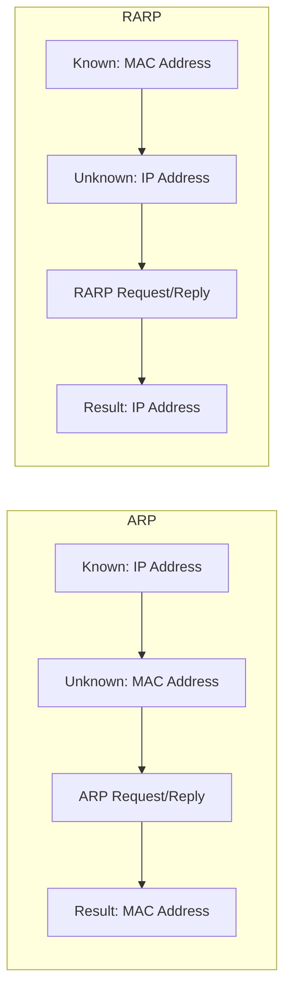
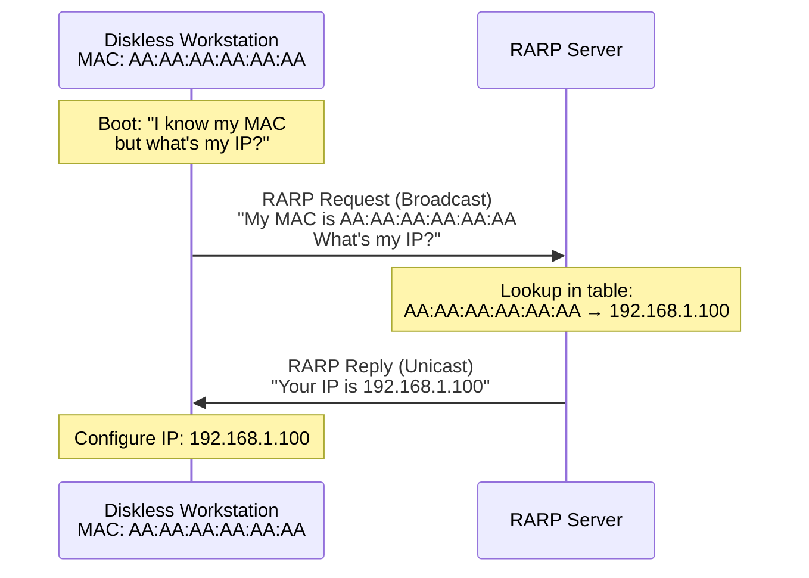
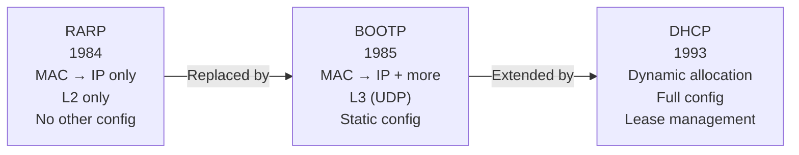

# RARP (Reverse Address Resolution Protocol)

> *"RARP answered 'What's my IP?' before DHCP made it obsolete."*

## Overview

**RARP** (Reverse Address Resolution Protocol) is the inverse of ARP — it resolves a **MAC address to an IP address**. It was used by diskless workstations that knew their MAC address (burned into NIC) but needed to discover their IP address at boot time. RARP has been largely **replaced by DHCP** and BOOTP.

## RARP vs ARP



| Feature | ARP | RARP |
|---------|-----|------|
| **Direction** | IP → MAC | MAC → IP |
| **Request** | "Who has this IP?" | "What's my IP?" |
| **Response** | MAC address | IP address |
| **Broadcast** | Yes (L2 broadcast) | Yes (L2 broadcast) |
| **Server needed** | No (target responds) | Yes (RARP server) |
| **Status** | Active | Obsolete |

## How RARP Worked



### RARP Packet Format

```
Similar to ARP:
- Hardware Type: Ethernet (1)
- Protocol Type: IPv4 (0x0800)
- Operation: 3 (RARP Request), 4 (RARP Reply)
- Sender/Target MAC and IP fields
```

## Why RARP is Obsolete

| Limitation | Explanation |
|-----------|-------------|
| **L2 only** | Works only on the local network segment |
| **No subnet mask** | Doesn't provide subnet mask or gateway |
| **No DNS server** | Doesn't tell you DNS servers |
| **No lease time** | Static mapping, no dynamic allocation |
| **Requires server** | Needs a dedicated RARP server on each network |
| **Limited info** | Only provides IP address, nothing else |

## Evolution: RARP → BOOTP → DHCP



| Feature | RARP | BOOTP | DHCP |
|---------|------|-------|------|
| **Year** | 1984 | 1985 | 1993 |
| **IP assignment** | Static lookup | Static configuration | Dynamic pool |
| **Additional config** | None | IP, gateway, TFTP server | Everything |
| **Protocol** | L2 (Ethernet) | L3 (UDP 67/68) | L3 (UDP 67/68) |
| **Lease** | None | None | Yes, with renewal |
| **Relay** | No | Yes (crosses subnets) | Yes |
| **Status** | Obsolete | Obsolete | Active |

## Interview Questions

### Beginner

**Q1: What is RARP?**
RARP (Reverse Address Resolution Protocol) translates MAC addresses to IP addresses. It was used by diskless workstations that knew their hardware address (MAC) but needed to discover their IP address during boot. A RARP server maintained a static table mapping MAC to IP addresses.

**Q2: Why is RARP obsolete?**
RARP only provided an IP address — no subnet mask, gateway, DNS server, or other configuration. It worked only at Layer 2 (local network), required a RARP server on every segment, and had no dynamic allocation or lease management. DHCP and BOOTP replaced it by providing complete configuration over Layer 3.

**Q3: What replaced RARP?**
BOOTP (Bootstrap Protocol) first replaced RARP by providing more configuration options over UDP. Then DHCP (Dynamic Host Configuration Protocol) replaced BOOTP by adding dynamic address allocation, lease management, and automatic configuration of all network parameters.

### Intermediate

**Q4: What information does DHCP provide that RARP couldn't?**
DHCP provides: IP address, subnet mask, default gateway, DNS servers, domain name, lease time, NTP servers, and many other options (100+ defined options). RARP only provided an IP address. Without subnet mask and gateway, a RARP-configured host couldn't communicate beyond its local network.

**Q5: How does BOOTP differ from DHCP?**
BOOTP used static configuration (each MAC had a pre-configured IP in a table). DHCP adds dynamic allocation (IPs assigned from a pool, with lease expiration). DHCP also supports: address reclamation, options negotiation, client/server identification, and backward compatibility with BOOTP clients.

### Advanced / FAANG-Level

**Q6: In what scenarios might you still see RARP-like functionality today?**
Modern equivalents:
1. **PXE boot**: Network boot uses DHCP + TFTP (evolved from BOOTP)
2. **IoT devices**: Some use simplified discovery protocols
3. **Cloud instances**: Instance metadata service provides IP (like RARP but via HTTP)
4. **Container networking**: CNI plugins assign IPs to containers
5. **ARP (reverse direction)**: Some implementations use ARP for IP conflict detection
6. **IPv6 SLAAC**: Auto-configuration without any server (similar spirit to RARP's simplicity)

## Common Mistakes

1. ❌ Confusing RARP with ARP — ARP is IP→MAC (active); RARP is MAC→IP (obsolete)
2. ❌ Thinking RARP is still used — it's completely obsolete; use DHCP
3. ❌ Forgetting RARP was L2 only — it couldn't cross routers
4. ❌ Mixing up RARP and BOOTP — BOOTP replaced RARP, then DHCP replaced BOOTP

## Summary

- RARP resolved **MAC → IP** for diskless workstations
- Operated at **Layer 2** with a dedicated RARP server
- **Limitations**: Only IP address, no subnet/gateway/DNS, L2 only
- **Replaced by**: BOOTP → DHCP (dynamic, full configuration)
- RARP is **historical knowledge** — important for understanding protocol evolution

## Cross-References

- [ARP](arp.md) — The active protocol (IP → MAC)
- [DHCP](dhcp.md) — The modern replacement
- [Data Link Layer](../osi/data-link.md) — Where RARP operated
