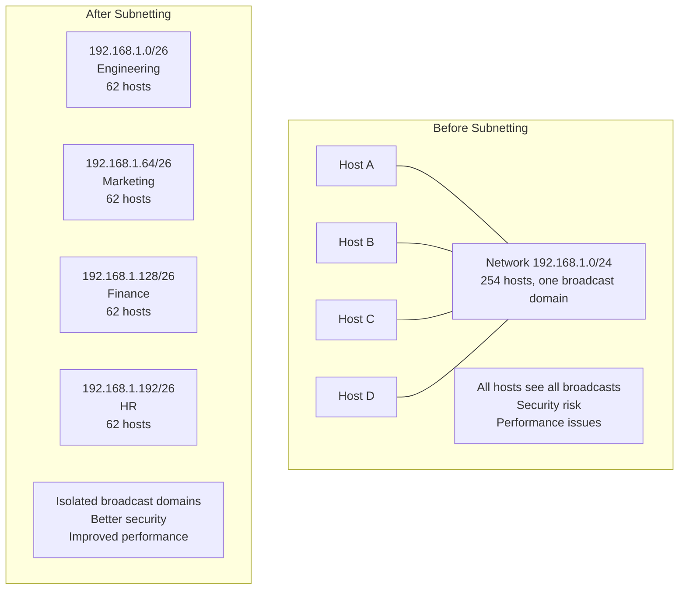
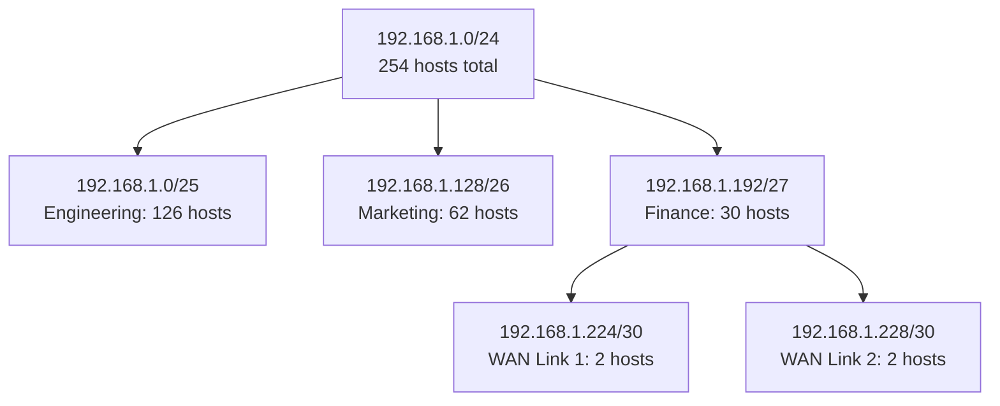

# Subnetting

> *"Subnetting is the art of dividing a network into smaller, manageable pieces."*

## Overview

**Subnetting** divides a larger IP network into smaller sub-networks (subnets). It improves network performance (smaller broadcast domains), enhances security (isolate departments), and enables efficient address allocation.

## Why Subnet?



## How Subnetting Works

### Step-by-Step Process

**Example**: Divide 192.168.1.0/24 into 4 equal subnets

1. **Determine bits needed**: 4 subnets → 2 bits (2² = 4)
2. **New prefix length**: /24 + 2 = /26
3. **New subnet mask**: 255.255.255.192
4. **Host bits**: 32 - 26 = 6 → 2^6 - 2 = 62 hosts per subnet

### Subnet Calculation

```
Original: 192.168.1.0/24
Binary:   11000000.10101000.00000001.00000000
Mask:     11111111.11111111.11111111.00000000 (/24)

New Mask: 11111111.11111111.11111111.11000000 (/26)
Subnet bits: ^^ (2 bits from host portion)
```

### Resulting Subnets

| Subnet | Network Address | First Host | Last Host | Broadcast | Usable Hosts |
|--------|----------------|-----------|----------|-----------|-------------|
| 1 | 192.168.1.0/26 | 192.168.1.1 | 192.168.1.62 | 192.168.1.63 | 62 |
| 2 | 192.168.1.64/26 | 192.168.1.65 | 192.168.1.126 | 192.168.1.127 | 62 |
| 3 | 192.168.1.128/26 | 192.168.1.129 | 192.168.1.190 | 192.168.1.191 | 62 |
| 4 | 192.168.1.192/26 | 192.168.1.193 | 192.168.1.254 | 192.168.1.255 | 62 |

## Subnetting Formulas

```
Number of subnets = 2^n (n = bits borrowed from host portion)
Hosts per subnet = 2^h - 2 (h = remaining host bits)
Subnet mask = original mask + n bits

Network address = IP AND Mask
Broadcast address = Network OR (NOT Mask)
First usable = Network + 1
Last usable = Broadcast - 1
```

## Variable Length Subnet Masking (VLSM)

VLSM allows different subnet sizes within the same network — no wasted addresses.

**Example**: 192.168.1.0/24 divided for different needs:

| Department | Hosts Needed | Subnet | Mask | Hosts Available |
|-----------|-------------|--------|------|----------------|
| Engineering | 100 | 192.168.1.0/25 | /25 | 126 |
| Marketing | 50 | 192.168.1.128/26 | /26 | 62 |
| Finance | 20 | 192.168.1.192/27 | /27 | 30 |
| WAN Link | 2 | 192.168.1.224/30 | /30 | 2 |
| WAN Link | 2 | 192.168.1.228/30 | /30 | 2 |



## Practical Subnetting Examples

### Example 1: How many subnets and hosts?
**Given**: 172.16.0.0/20

```
Subnets: The /20 means 20 bits for network (vs default /16 for Class B)
Subnet bits borrowed: 20 - 16 = 4
Number of subnets: 2^4 = 16
Host bits: 32 - 20 = 12
Hosts per subnet: 2^12 - 2 = 4,094
```

### Example 2: What subnet is this host on?
**Given**: Host 10.45.67.129/18

```
Mask: 255.255.192.0 (/18)
Binary mask: 11111111.11111111.11000000.00000000

IP:  00001010.00101101.01000011.10000001
Mask:11111111.11111111.11000000.00000000
AND: 00001010.00101101.01000000.00000000

Network: 10.45.64.0/18
Broadcast: 10.45.127.255
Host range: 10.45.64.1 - 10.45.127.254
```

### Example 3: Design a network
**Requirement**: 5 offices, each needs 50 hosts

```
50 hosts → need at least 50 + 2 = 52 addresses → /26 (62 hosts) works
Subnet mask: 255.255.255.192

Allocate from 10.0.0.0:
Office 1: 10.0.0.0/26    (hosts: .1 - .62)
Office 2: 10.0.0.64/26   (hosts: .65 - .126)
Office 3: 10.0.0.128/26  (hosts: .129 - .190)
Office 4: 10.0.0.192/26  (hosts: .193 - .254)
Office 5: 10.0.1.0/26    (hosts: .1 - .62)
```

## Quick Subnetting Tricks

### Powers of 2 Table
| Power | Value |
|-------|-------|
| 2^1 | 2 |
| 2^2 | 4 |
| 2^3 | 8 |
| 2^4 | 16 |
| 2^5 | 32 |
| 2^6 | 64 |
| 2^7 | 128 |
| 2^8 | 256 |
| 2^10 | 1024 |
| 2^16 | 65536 |

### Magic Number Method
For quick subnetting, use the "magic number" (the value of the last network bit):

```
/26 → Last network bit is at position 64 (2^6)
Subnets: 0, 64, 128, 192
Each subnet has 64 addresses (62 usable)

/27 → Magic number = 32 (2^5)
Subnets: 0, 32, 64, 96, 128, 160, 192, 224
Each subnet has 32 addresses (30 usable)
```

## Interview Questions

### Beginner

**Q1: What is subnetting and why is it needed?**
Subnetting divides a large network into smaller sub-networks. It's needed for: (1) reducing broadcast traffic (smaller broadcast domains), (2) improving security (isolate departments), (3) efficient address allocation (don't waste addresses), (4) easier network management.

**Q2: How do you calculate the number of hosts in a subnet?**
Formula: 2^n - 2, where n = number of host bits (32 - prefix length). For example, /24 has 32-24=8 host bits → 2^8 - 2 = 254 hosts. We subtract 2 because the first address (all host bits 0) is the network ID and the last (all host bits 1) is the broadcast address.

**Q3: What is the difference between subnet mask and CIDR notation?**
They represent the same thing in different formats. Subnet mask uses dotted decimal (255.255.255.0), CIDR uses the number of network bits (/24). Both mean the first 24 bits are the network portion.

### Intermediate

**Q4: Explain VLSM and its advantage over FLSM.**
- **FLSM** (Fixed-Length): All subnets use the same mask. If the largest subnet needs 100 hosts, all subnets get /25 (126 hosts), even if most only need 10. Wastes addresses.
- **VLSM** (Variable-Length): Each subnet can have a different mask based on need. A subnet needing 100 hosts gets /25, one needing 10 gets /28. No waste.

**Q5: How would you subnet 10.0.0.0/8 for a company with 200 branches, each needing 100 hosts?**
1. 100 hosts → need 2^7 - 2 = 126 → /25 per branch
2. 200 branches × 128 addresses = 25,600 addresses
3. Allocate: 10.{branch}.0.0/25, 10.{branch}.0.128/25, 10.{branch}.1.0/25, etc.
4. Or use 10.{branch}.{subnet}.{host} with /25 subnets
5. Leaves plenty of room for growth within 10.0.0.0/8

**Q6: Given 172.16.5.0/24, create subnets for departments needing 50, 30, 10, and 5 hosts.**
| Dept | Hosts | Subnet | Mask | Range |
|------|-------|--------|------|-------|
| A | 50 | 172.16.5.0/26 | .192 | .1-.62 |
| B | 30 | 172.16.5.64/27 | .224 | .65-.94 |
| C | 10 | 172.16.5.96/28 | .240 | .97-.110 |
| D | 5 | 172.16.5.112/29 | .248 | .113-.118 |

### Advanced / FAANG-Level

**Q7: Design IP addressing for a data center with 500 servers across 10 racks.**
Design:
1. **Supernet**: 10.10.0.0/16 (65,534 addresses)
2. **Per rack**: 10.10.{rack}.0/24 (254 hosts each)
3. **Management VLAN**: 10.10.200.0/24 (out-of-band management)
4. **Storage VLAN**: 10.10.201.0/24 (iSCSI/NFS)
5. **vMotion VLAN**: 10.10.202.0/24 (live migration)
6. **WAN/Internet**: Public IPs on DMZ, NAT for internal
7. **Loopbacks**: 10.10.255.0/24 (router/switch loopbacks)
8. **Summary route**: Advertise 10.10.0.0/16 to WAN

**Q8: How would you troubleshoot a host that can't reach a host on a different subnet?**
Systematic approach:
1. **Verify local config**: Check IP, mask, default gateway (`ip addr`, `ip route`)
2. **Test local connectivity**: Ping own gateway
3. **Check ARP**: Is the gateway's MAC resolved? (`arp -a`)
4. **Test remote subnet**: Ping remote host (may fail if routing issue)
5. **Trace route**: `traceroute` to see where packets stop
6. **Check routing**: Is there a route to the destination? (`ip route get dest`)
7. **Check firewall**: `iptables -L` or `nftables list ruleset`
8. **Check VLAN**: Are both hosts on correct VLANs? (switch config)
9. **Check ACLs**: Router/switch ACLs blocking traffic?

**Q9: Explain supernetting and route aggregation.**
Supernetting (route aggregation) combines multiple smaller routes into one larger route:
```
192.168.0.0/24
192.168.1.0/24
192.168.2.0/24
192.168.3.0/24
→ Aggregated: 192.168.0.0/22 (one route instead of four)
```
Benefits:
- **Smaller routing tables**: Fewer entries = faster lookups
- **Reduced BGP table size**: Internet routing table has 900k+ prefixes; aggregation helps
- **Simplified management**: One route covers many subnets

Rules for aggregation:
- Networks must be contiguous
- Must align on power-of-2 boundaries
- All networks must share the same prefix

## Common Mistakes

1. ❌ Forgetting to subtract 2 for usable hosts (network + broadcast addresses)
2. ❌ Not aligning subnets on power-of-2 boundaries
3. ❌ Using /31 for non-point-to-point links (only 0 usable hosts)
4. ❌ Confusing "number of subnets" with "number of hosts"
5. ❌ Not considering future growth when sizing subnets

## Summary

- Subnetting divides large networks into smaller, manageable subnets
- **Formula**: Subnets = 2^n, Hosts = 2^h - 2
- **VLSM** allows different subnet sizes for efficient allocation
- **Supernetting** combines routes for smaller routing tables
- Subnet mask defines the boundary between network and host portions
- Always plan for growth when designing subnets

## Cross-References

- [IPv4](ipv4.md) — IPv4 addressing fundamentals
- [CIDR](cidr.md) — Classless addressing notation
- [NAT](nat.md) — Connecting private subnets to Internet
- [DHCP](dhcp.md) — Automatic IP assignment within subnets

## Cross References

- [IPv4](ipv4.md)
- [CIDR](cidr.md)
- [IP Protocol](ip.md)
- [DHCP](dhcp.md)
