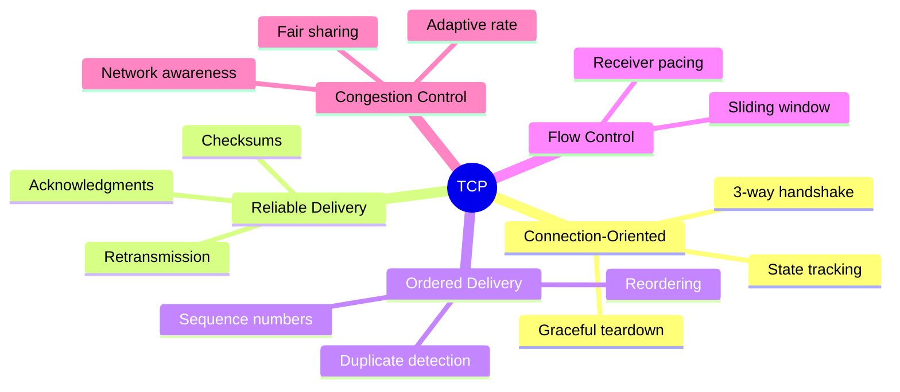
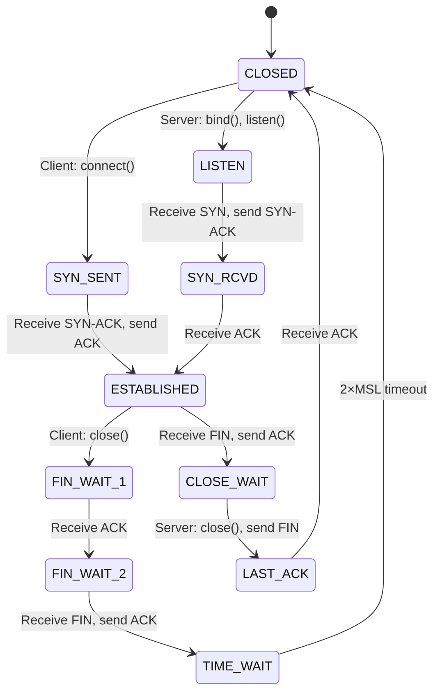

# TCP (Transmission Control Protocol)

> *"TCP is the protocol that makes the unreliable Internet reliable."*

## Overview

**TCP** (Transmission Control Protocol) is a **connection-oriented**, **reliable**, **byte-stream** protocol at the Transport Layer. It ensures data is delivered **completely**, **in order**, and **without errors**. TCP is the backbone of most Internet applications: web (HTTP), email (SMTP), file transfer (FTP), and remote access (SSH).

## Key Characteristics



## TCP vs UDP

| Feature | TCP | UDP |
|---------|-----|-----|
| Connection | Connection-oriented | Connectionless |
| Reliability | Guaranteed delivery | Best-effort |
| Ordering | Ordered | No ordering |
| Header size | 20-60 bytes | 8 bytes |
| Flow control | Yes (sliding window) | No |
| Congestion control | Yes | No |
| Speed | Slower (overhead) | Faster |
| Broadcast/Multicast | No | Yes |
| Use case | Web, email, file transfer | DNS, gaming, video |

## TCP Header (20-60 bytes)

```
 0                   1                   2                   3
 0 1 2 3 4 5 6 7 8 9 0 1 2 3 4 5 6 7 8 9 0 1 2 3 4 5 6 7 8 9 0 1
+-+-+-+-+-+-+-+-+-+-+-+-+-+-+-+-+-+-+-+-+-+-+-+-+-+-+-+-+-+-+-+-+
|          Source Port          |       Destination Port        |
+-+-+-+-+-+-+-+-+-+-+-+-+-+-+-+-+-+-+-+-+-+-+-+-+-+-+-+-+-+-+-+-+
|                        Sequence Number                        |
+-+-+-+-+-+-+-+-+-+-+-+-+-+-+-+-+-+-+-+-+-+-+-+-+-+-+-+-+-+-+-+-+
|                    Acknowledgment Number                      |
+-+-+-+-+-+-+-+-+-+-+-+-+-+-+-+-+-+-+-+-+-+-+-+-+-+-+-+-+-+-+-+-+
|  Data |       |C|E|U|A|P|R|S|F|                               |
| Offset| Rsrvd |W|C|R|C|S|S|Y|I|            Window             |
|  (4)  |  (3)  |R|E|G|K|H|T|N|N|                               |
+-+-+-+-+-+-+-+-+-+-+-+-+-+-+-+-+-+-+-+-+-+-+-+-+-+-+-+-+-+-+-+-+
|           Checksum            |         Urgent Pointer        |
+-+-+-+-+-+-+-+-+-+-+-+-+-+-+-+-+-+-+-+-+-+-+-+-+-+-+-+-+-+-+-+-+
|                    Options (variable)                         |
+-+-+-+-+-+-+-+-+-+-+-+-+-+-+-+-+-+-+-+-+-+-+-+-+-+-+-+-+-+-+-+-+
```

## Connection Lifecycle



## Section Map

| Topic | Description |
|-------|-------------|
| [Header](header.md) | TCP header fields in detail |
| [Three-Way Handshake](three-way.md) | Connection establishment |
| [Four-Way Teardown](four-way.md) | Connection termination |
| [Flow Control](flow-control.md) | Preventing receiver overflow |
| [Congestion Control](congestion-control.md) | Preventing network overload |
| [TCP States](states.md) | Connection state machine |
| [TCP Timers](timers.md) | Retransmission and other timers |
| [TCP Options](options.md) | MSS, Window Scale, SACK, Timestamps |
| [Nagle's Algorithm](nagle.md) | Small packet coalescing |
| [Keep-Alive](keepalive.md) | Connection liveness checking |

## Interview Questions

### Beginner

**Q1: What is TCP?**
TCP (Transmission Control Protocol) is a reliable, connection-oriented transport protocol. It ensures data is delivered completely, in order, and without errors. It uses a 3-way handshake to establish connections, sequence numbers for ordering, acknowledgments for reliability, and flow/congestion control for efficiency.

**Q2: Why is TCP called connection-oriented?**
TCP maintains connection state (sequence numbers, window sizes, buffers) at both endpoints throughout the communication. Before data transfer, a connection is established (3-way handshake). During transfer, both sides track the connection. After transfer, the connection is gracefully closed (4-way teardown). This is unlike UDP, which sends data without any connection setup.

**Q3: What applications use TCP?**
Most applications that need reliable data transfer: HTTP/HTTPS (web), SMTP/IMAP (email), FTP (file transfer), SSH (remote access), database connections (MySQL, PostgreSQL). TCP is chosen when data integrity matters more than latency.

### Intermediate

**Q4: Why does TCP use a 3-way handshake instead of 2-way?**
A 2-way handshake can't confirm both sides are ready and synchronized. Consider: if an old SYN arrives (delayed from a previous connection), the server would establish a connection the client doesn't expect. The 3-way handshake ensures: (1) Both sides agree to communicate, (2) Both sides agree on initial sequence numbers, (3) Both sides know the other is ready. The third ACK confirms to the server that the client received the SYN-ACK.

**Q5: Explain TCP flow control.**
TCP uses a **sliding window** mechanism for flow control. The receiver advertises a **window size** (rwnd) indicating how much data it can buffer. The sender limits unacknowledged data to rwnd. As the receiver processes data, it advertises a larger window. If the receiver's buffer fills, it advertises window=0, and the sender stops. This prevents overwhelming slow receivers.

**Q6: What is the difference between flow control and congestion control?**
- **Flow control**: Prevents overwhelming the **receiver**. Based on receiver's advertised window (rwnd).
- **Congestion control**: Prevents overwhelming the **network**. Based on sender's estimated congestion window (cwnd).
- Both limit how much unacknowledged data the sender can have in flight: `min(cwnd, rwnd)`.

### Advanced / FAANG-Level

**Q7: How would you optimize TCP for a high-latency, high-bandwidth network (satellite link)?**
Optimizations:
1. **Window scaling**: Enable large windows (RFC 7323) — BDP = bandwidth × RTT
2. **SACK**: Selective ACK for efficient loss recovery
3. **CUBIC or BBR**: Better congestion control than Reno for high-BDP
4. **Increase buffer sizes**: Socket buffers must accommodate BDP
5. **TCP timestamps**: Accurate RTT measurement
6. **ECN**: Signal congestion without dropping packets
7. **Application-level**: Parallel connections, HTTP/2 multiplexing
8. **Consider QUIC**: Avoids TCP's head-of-line blocking

**Q8: Explain how TCP handles simultaneous open.**
Both sides send SYN simultaneously:
1. Host A → SYN → Host B (A enters SYN_SENT)
2. Host B → SYN → Host A (B enters SYN_SENT)
3. Both receive SYN, send SYN-ACK (both enter SYN_RCVD)
4. Both receive SYN-ACK, send ACK (both enter ESTABLISHED)

Result: One connection, both sides initiated. Rare in practice but supported by TCP specification.

**Q9: Design a TCP-based protocol for reliable file transfer over a lossy network.**
Design:
1. **Connection**: Standard TCP with tuned parameters
2. **Chunking**: Split file into fixed-size chunks (1MB)
3. **Parallel streams**: Multiple TCP connections (like FTP)
4. **Checksum**: Application-level hash per chunk (SHA-256)
5. **Resume**: Track transferred chunks, resume on failure
6. **Compression**: gzip/zstd for compressible content
7. **Progress**: Sequence numbers for progress tracking
8. **Verification**: Final hash check after complete transfer

## Common Mistakes

1. ❌ Thinking TCP guarantees delivery time — it guarantees eventual delivery, not speed
2. ❌ Confusing flow control with congestion control — they serve different purposes
3. ❌ Forgetting TCP is byte-stream, not message-oriented — message boundaries aren't preserved
4. ❌ Assuming TCP always in-order delivery — packets can arrive out of order; TCP reorders them
5. ❌ Thinking SYN flood attacks are TCP bugs — they're abuse of the handshake mechanism

## Summary

- TCP is **connection-oriented**, **reliable**, **ordered** byte-stream protocol
- Uses **3-way handshake** (SYN, SYN-ACK, ACK) for connection establishment
- Uses **4-way teardown** (FIN, ACK, FIN, ACK) for connection termination
- **Flow control**: Sliding window prevents receiver overflow
- **Congestion control**: Multiple algorithms (Reno, CUBIC, BBR) prevent network overload
- **Header**: 20-60 bytes with sequence numbers, ACK numbers, window size, flags

## Cross-References

- [TCP Header](header.md) — Detailed header field explanations
- [Three-Way Handshake](three-way.md) — Connection establishment deep dive
- [Four-Way Teardown](four-way.md) — Connection termination
- [Flow Control](flow-control.md) — Sliding window mechanism
- [Congestion Control](congestion-control.md) — Network overload prevention
- [UDP](../udp/README.md) — The alternative transport protocol

## Cross References

- [UDP](../udp/README.md)
- [TCP Header](header.md)
- [Three-Way Handshake](three-way.md)
- [Congestion Control](congestion-control.md)
- [Sockets](../sockets/tcp.md)
