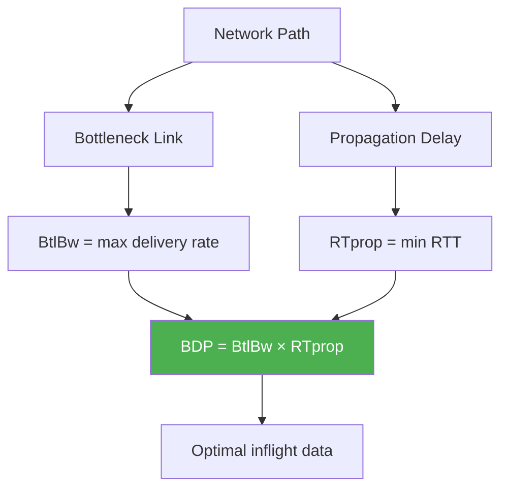
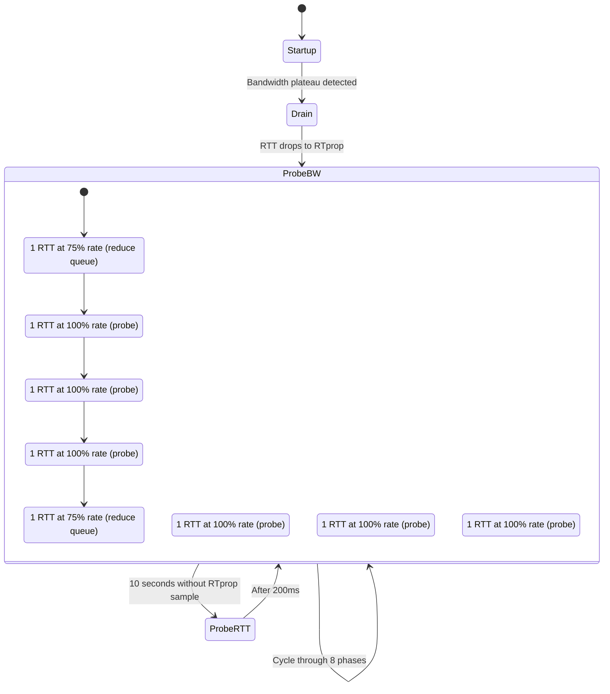
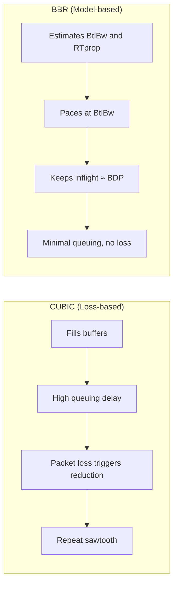

# TCP BBR (Bottleneck Bandwidth and Round-trip propagation time)

## Overview

TCP BBR is a **model-based congestion control algorithm** developed by Google in 2016. Unlike traditional loss-based algorithms (Reno, CUBIC) that treat packet loss as a congestion signal, BBR builds an **explicit model of the network path** — estimating the bottleneck bandwidth and minimum round-trip time — and adjusts its sending rate accordingly.

BBR represents a paradigm shift: instead of reacting to congestion signals (loss, ECN), BBR proactively models the network and operates near the optimal point (the "knee" of the latency/bandwidth curve, not the "cliff").

## Detailed Explanation

### The Fundamental Problem with Loss-Based CC

Traditional TCP (Reno, CUBIC) uses packet loss as the primary congestion signal:

```
Network Load vs Throughput:

Throughput
    |        .****  ← Operating point (loss-based)
    |      **    **
    |    **        **
    |  **            **
    |**                **
    |________________________
    0%    50%    100%   Load
    
    Loss-based CC operates near the "cliff" — just before throughput collapses
    This causes high queuing delay and packet loss
```

**Problems:**
- Fills buffers → high latency (bufferbloat)
- Causes unnecessary packet loss
- Reacts after the damage is done
- Doesn't distinguish between congestion loss and random loss

### BBR's Model: Two Parameters

BBR models the network path with two key parameters:

1. **BtlBw** (Bottleneck Bandwidth): Maximum delivery rate observed
2. **RTprop** (Round-trip propagation time): Minimum RTT observed

```
BBR's optimal operating point:
    Pacing Rate = BtlBw
    Inflight = BtlBw × RTprop (BDP)
    
    This keeps the pipe full without creating queues
```



### BBR's State Machine

BBR operates through a cycle of states that probe for bandwidth and RTT:



### BBR's Four States

#### 1. Startup (Exponential Growth)
- Similar to Slow Start but more aggressive
- Pacing rate increases by factor of 2/ln(2) ≈ 2.89 per RTT
- Exits when bandwidth growth plateaus (3 consecutive RTTs with <25% bandwidth increase)

#### 2. Drain (Queue Reduction)
- After Startup, the path may have excess queued data
- Pacing rate drops to 1/Startup-rate
- Drains the queue until RTT ≈ RTprop
- Then transitions to ProbeBW

#### 3. ProbeBW (Steady State)
- Cycles through 8 phases, each lasting ~1 RTT
- 6 phases at pacing_gain = 1.0 (steady state)
- 1 phase at pacing_gain = 0.75 (drain excess)
- 1 phase at pacing_gain = 1.25 (probe for more bandwidth)
- Probes for higher bandwidth every ~8 RTTs

#### 4. ProbeRTT (RTT Measurement)
- Triggered every 10 seconds if no RTprop sample
- Reduces inflight to 4 packets for ~200ms
- Measures true minimum RTT (RTprop)
- Returns to previous state

### BBR vs CUBIC: Operating Points



### BBR's Pacing Mechanism

Unlike CUBIC which sends as fast as cwnd allows, BBR **paces** packets:

```
Pacing Rate = BtlBw × pacing_gain

Packet spacing = packet_size / pacing_rate

Example:
  BtlBw = 100 Mbps
  pacing_gain = 1.0
  packet_size = 1500 bytes
  
  pacing_rate = 100 Mbps
  packet_spacing = 1500 × 8 / 100,000,000 = 0.12ms between packets
```

This smooths out bursty sending and reduces buffer pressure.

### BBR's Delivery Rate Estimation

BBR estimates bandwidth using **packet-pair probing**:

```
Sender sends two packets back-to-back:
  Packet 1 ──→ ┐
  Packet 2 ──→ └──→ Bottleneck ──→ Receiver

At the bottleneck, Packet 2 is queued behind Packet 1
Inter-arrival time at receiver = bottleneck serialization time

BtlBw = packet_size / min(inter-arrival time)
```

BBR tracks the maximum delivery rate over the last 10 round trips using a windowed max filter.

### BBR's Gain Cycling in ProbeBW

```
Phase:    P1    P2    P3    P4    P5    P6    P7    P8
Gain:     1.25  1.0   1.0   1.0   0.75  1.0   1.0   1.0
Purpose:  Probe Steady Steady Steady Drain Steady Steady Steady

Each phase lasts ~1 RTT
Cycle period ≈ 8 RTTs
```

The 1.25 gain phase deliberately overdrives the path to probe for more bandwidth. The 0.75 gain phase drains any resulting queue.

### BBR v2 Improvements

BBR v2 (in development as of 2024) addresses several BBR v1 issues:

| Issue | BBR v1 | BBR v2 |
|-------|--------|--------|
| **Fairness with CUBIC** | Can be unfair | More fair, respects loss signals |
| **Excessive retransmissions** | Higher retransmit rate | Reduced retransmissions |
| **High queuing delay** | Can build queues | Better queue management |
| **Random loss tolerance** | May not reduce on loss | Balances model and loss signals |

### BBR in Linux

```bash
# Check if BBR is available
sysctl net.ipv4.tcp_available_congestion_control
# May need: modprobe tcp_bbr

# Enable BBR
sudo sysctl -w net.ipv4.tcp_congestion_control=bbr

# Verify
sysctl net.ipv4.tcp_congestion_control
# Output: net.ipv4.tcp_congestion_control = bbr
```

### BBR's Algorithm (Pseudocode)

```python
# TCP BBR Core Algorithm

class BBR:
    def __init__(self):
        self.state = STARTUP
        self.BtlBw = 0          # Bottleneck bandwidth estimate
        self.RTprop = float('inf')  # Minimum RTT
        self.pacing_gain = 2.89  # Startup gain
        self.cwnd_gain = 2.0
        self.cycle_index = 0
    
    def on_ack(self, delivered, delivery_rate, rtt):
        # Update BtlBw (max delivery rate over 10 RTTs)
        if delivery_rate > self.BtlBw:
            self.BtlBw = delivery_rate
        
        # Update RTprop (min RTT over 10 seconds)
        if rtt < self.RTprop:
            self.RTprop = rtt
        
        # State transitions
        if self.state == STARTUP:
            if self.bandwidth_growth_plateau():
                self.state = DRAIN
                self.pacing_gain = 1 / 2.89
        
        elif self.state == DRAIN:
            if rtt <= self.RTprop:
                self.state = PROBE_BW
                self.pacing_gain = 1.0
        
        elif self.state == PROBE_BW:
            self.cycle_gain()
            if time_since_rtt_sample > 10 seconds:
                self.state = PROBE_RTT
                self.pacing_gain = 0
        
        elif self.state == PROBE_RTT:
            if duration > 200ms:
                self.state = PROBE_BW
    
    def pacing_rate(self):
        return self.BtlBw * self.pacing_gain
    
    def cwnd(self):
        return self.BtlBw * self.RTprop * self.cwnd_gain / MSS
```

## Example: BBR vs CUBIC on a 100 Mbps Link

### Scenario: 100 Mbps link, 50ms RTT, 256 KB buffer

```
BDP = 100 Mbps × 50ms = 625 KB

CUBIC behavior:
  - Fills buffer: inflight = BDP + buffer = 625 + 256 = 881 KB
  - Queuing delay = buffer / bandwidth = 256 KB / 100 Mbps = 20ms
  - Measured RTT = 50 + 20 = 70ms (40% higher than propagation)
  - Triggers loss when buffer overflows
  - Sawtooth: throughput oscillates 70-100 Mbps

BBR behavior:
  - Targets BDP: inflight ≈ 625 KB
  - Minimal queuing: inflight ≈ BDP
  - Measured RTT ≈ 50ms (propagation only)
  - No loss events
  - Steady throughput ≈ 95-100 Mbps
```

### BBR Throughput Trace

```
Time    State       BtlBw    RTprop   Pacing Rate   Actual Rate
0-2s    Startup     100Mbps  50ms     289Mbps       100Mbps
2-3s    Drain       100Mbps  50ms     34Mbps        34Mbps
3-100s  ProbeBW     100Mbps  50ms     75-125Mbps    95-100Mbps
100s    ProbeRTT    100Mbps  50ms     0Mbps         4pkts/RTT
100.2s  ProbeBW     100Mbps  50ms     75-125Mbps    95-100Mbps
```

## Interview Questions

### Q1: How does BBR differ fundamentally from CUBIC?
**A:** CUBIC is **loss-based** — it increases cwnd until packet loss occurs, then reduces. BBR is **model-based** — it estimates bottleneck bandwidth (BtlBw) and minimum RTT (RTprop), then paces at the optimal rate. CUBIC fills buffers and causes loss; BBR aims to keep the pipe full without creating queues.

### Q2: What are BtlBw and RTprop?
**A:** **BtlBw** (Bottleneck Bandwidth) is the maximum delivery rate observed over the last 10 round trips. **RTprop** (Round-trip propagation time) is the minimum RTT observed over the last 10 seconds. Together, they define the BDP (Bandwidth-Delay Product), which is the optimal amount of inflight data.

### Q3: What are BBR's four states?
**A:** (1) **Startup**: Exponential growth to find BtlBw (like aggressive slow start). (2) **Drain**: Reduce rate to drain queues created during startup. (3) **ProbeBW**: Steady state, cycles through 8 phases probing for bandwidth. (4) **ProbeRTT**: Periodically reduce inflight to measure true RTprop.

### Q4: Why does BBR pace packets instead of sending in bursts?
**A:** Pacing (spacing packets evenly) reduces burstiness, which reduces buffer pressure and queuing delay. CUBIC sends a burst of cwnd packets when the window opens, which can overwhelm buffers. BBR sends at a steady rate equal to the estimated bottleneck bandwidth.

### Q5: What is ProbeBW's gain cycling?
**A:** ProbeBW cycles through 8 phases (each ~1 RTT): 1 phase at 75% gain (drain queues), 6 phases at 100% gain (steady state), 1 phase at 125% gain (probe for more bandwidth). This probes for bandwidth every ~8 RTTs without causing persistent queues.

### Q6: What problems does BBR have?
**A:** BBR v1 can be unfair to CUBIC flows (it may dominate shared links), can have higher retransmission rates, and may not respond to congestion signals from other traffic. BBR v2 addresses these by incorporating loss signals and improving fairness.

### Q7: How does BBR estimate bottleneck bandwidth?
**A:** BBR uses **packet-pair probing**: when two packets are sent back-to-back, they spread out at the bottleneck link. The inter-arrival time at the receiver reveals the bottleneck rate. BBR tracks the maximum delivery rate using a windowed max filter over 10 RTTs.

### Q8: When should you use BBR vs CUBIC?
**A:** BBR excels on long-distance, high-bandwidth links with shallow buffers (WAN, CDN). CUBIC works well on low-latency, deep-buffer links (data centers). BBR is increasingly used by CDNs (Google, YouTube) for its lower latency and higher throughput on WAN paths.

## Common Mistakes

1. **Thinking BBR eliminates all packet loss**: BBR reduces loss but doesn't eliminate it. During Startup and ProbeBW's 125% gain phase, some queuing and potential loss can occur.

2. **Confusing BBR's pacing with flow control**: BBR's pacing controls the *rate* of sending. Flow control (rwnd) controls the *total* inflight data. Both affect sending behavior.

3. **Assuming BBR always outperforms CUBIC**: On short-distance, deep-buffer links (data centers), CUBIC may perform comparably or better. BBR's advantage is most pronounced on high-BDP paths.

4. **Not understanding that BBR still uses cwnd**: BBR has both a pacing rate and a cwnd. The cwnd limits inflight data to prevent overwhelming the receiver's buffer or causing excessive loss.

5. **Confusing BBR v1 and v2**: BBR v1 can be unfair to CUBIC. BBR v2 is designed to be more fair and is still in development. Most production deployments use BBR v1.

6. **Forgetting ProbeRTT's impact**: ProbeRTT reduces inflight to 4 packets for 200ms every 10 seconds. This can cause brief throughput dips, though the impact is usually minimal.

7. **Not realizing BBR requires kernel support**: BBR needs Linux kernel 4.9+. It's not available on older systems and may need explicit module loading.

## Summary

| Aspect | TCP BBR |
|--------|---------|
| **Type** | Model-based congestion control |
| **Model** | BtlBw (bottleneck BW) + RTprop (min RTT) |
| **States** | Startup → Drain → ProbeBW → ProbeRTT (cycling) |
| **Pacing** | Yes (smooth sending, not bursty) |
| **Key benefit** | Low latency, high throughput, minimal loss |
| **Best for** | High-BDP links, WAN, CDN |
| **Default in** | Not default in Linux (CUBIC is), but widely used by Google |
| **Version** | BBR v1 (production), BBR v2 (development) |

BBR represents the future direction of congestion control — moving from reactive, loss-based mechanisms to proactive, model-based approaches that optimize for both throughput and latency.

## Cross-References

- [TCP CUBIC](cubic.md) — Loss-based alternative that BBR improves upon
- [TCP Reno](reno.md) — Original loss-based congestion control
- [TCP Fast Recovery](fast-recovery.md) — Loss recovery that BBR aims to minimize
- [TCP States](states.md) — TCP state machine that BBR operates within
- [TCP Timers](timers.md) — RTO and other timers relevant to BBR's operation

## Cross References

- [TCP Cubic](cubic.md)
- [Congestion Control](congestion-control.md)
- [Flow Control](flow-control.md)
