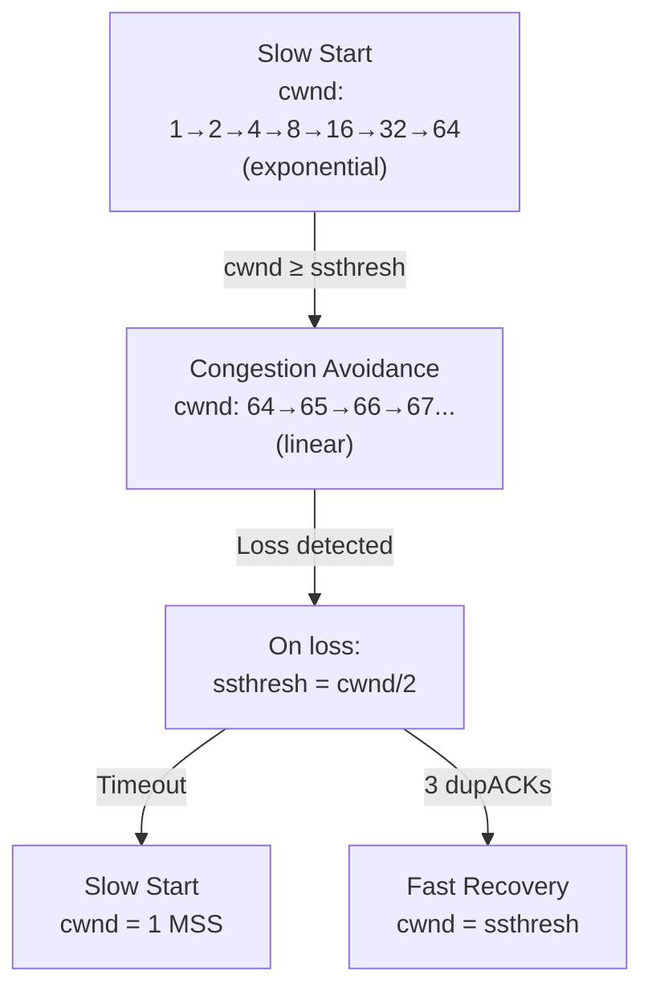
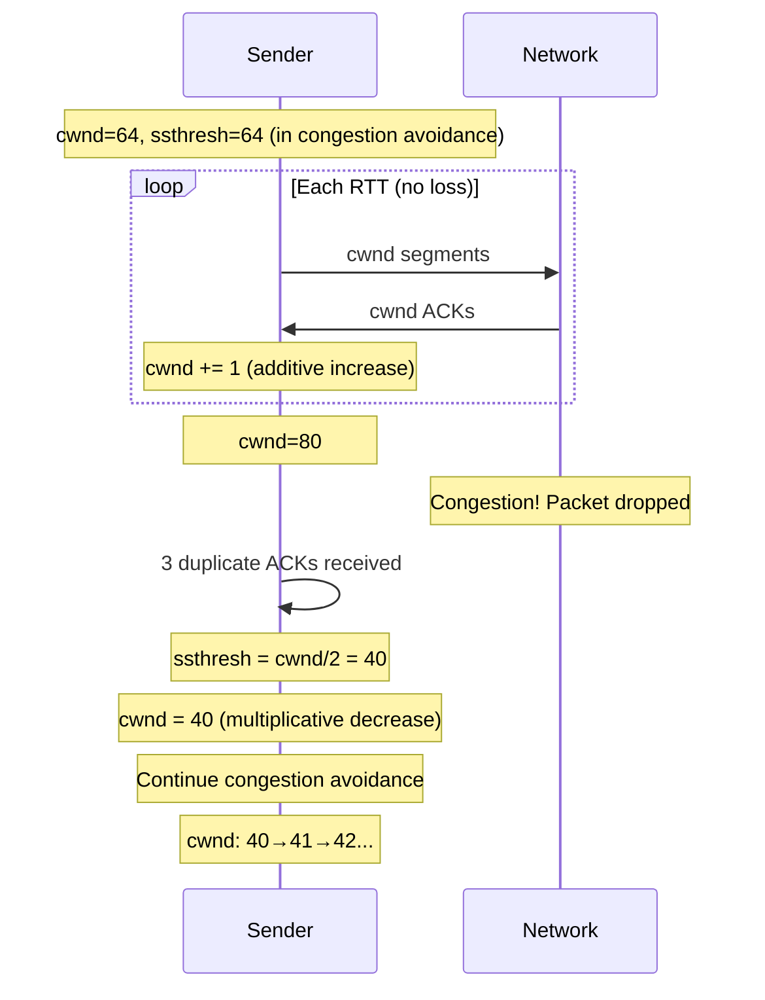
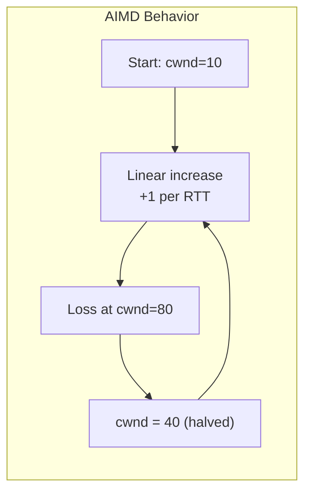

# TCP Congestion Avoidance

> *"Congestion avoidance is TCP's careful exploration — growing linearly to find the network's capacity."*

## Overview

**Congestion Avoidance** is the phase where cwnd grows **linearly** (+1 MSS per RTT) after slow start. It's more conservative than slow start, carefully probing for additional bandwidth without causing congestion.

## Algorithm

```
For each ACK received:
    cwnd += MSS × (MSS / cwnd)

Effectively: cwnd increases by 1 MSS per RTT (linear growth)
```

### Example

```
RTT 0: cwnd=64, send 64 segments → 64 ACKs → cwnd=65
RTT 1: cwnd=65, send 65 segments → 65 ACKs → cwnd=66
RTT 2: cwnd=66, send 66 segments → 66 ACKs → cwnd=67
...
```

## Slow Start to Congestion Avoidance Transition



## AIMD in Congestion Avoidance



## Visualizing AIMD



The cwnd trajectory looks like a sawtooth pattern:

```
cwnd
80 |    /\        /\        /\
   |   /  \      /  \      /  \
40 |  /    \    /    \    /    \
   | /      \  /      \  /
10 |/        \/        \/
   +---------------------------→ Time
```

## When Congestion Avoidance Ends

| Event | Action |
|-------|--------|
| **3 duplicate ACKs** | Fast retransmit, fast recovery (cwnd = ssthresh) |
| **Timeout** | Return to slow start (cwnd = 1 MSS) |

## Congestion Avoidance vs Slow Start

| Aspect | Slow Start | Congestion Avoidance |
|--------|-----------|---------------------|
| Growth | Exponential (×2/RTT) | Linear (+1/RTT) |
| When | cwnd < ssthresh | cwnd ≥ ssthresh |
| Aggressiveness | High | Low |
| Purpose | Quick ramp-up | Careful probing |
| On loss | cwnd = 1 (timeout) | cwnd = cwnd/2 (fast retransmit) |

## Interview Questions

### Beginner

**Q1: What is congestion avoidance?**
Congestion avoidance is the TCP phase where the sender grows its congestion window linearly (+1 MSS per RTT) instead of exponentially. It starts when cwnd reaches ssthresh (after slow start). The linear growth is conservative — it probes for more bandwidth without overwhelming the network.

**Q2: Why switch from exponential to linear growth?**
Exponential growth (slow start) is safe when cwnd is small but dangerous when cwnd approaches network capacity. If slow start continued, it would overshoot, causing packet loss. Linear growth (congestion avoidance) is a careful approach — it adds bandwidth gradually, detecting congestion before it becomes severe.

**Q3: What is AIMD?**
AIMD (Additive Increase, Multiplicative Decrease) is the congestion avoidance strategy: increase cwnd by 1 MSS per RTT (additive) and decrease cwnd by half on loss (multiplicative). This creates the characteristic sawtooth pattern and ensures fairness among competing flows.

### Intermediate

**Q4: Why is the sawtooth pattern normal?**
The sawtooth pattern (linear growth → halving → linear growth) is TCP's normal behavior. It represents the sender probing for bandwidth, hitting congestion, backing off, and probing again. The pattern averages to about 75% of the available bandwidth (between ssthresh and 2×ssthresh).

**Q5: How does congestion avoidance interact with flow control?**
The effective window is `min(cwnd, rwnd)`. During congestion avoidance, if rwnd is smaller than cwnd, flow control limits the sender, not congestion. The sender grows cwnd but can't send more than rwnd allows. Both mechanisms work independently.

**Q6: What happens if the network has very low loss?**
With very low loss, congestion avoidance keeps growing cwnd linearly. Eventually, cwnd may exceed the BDP, filling router buffers. This causes increased latency (bufferbloat) even without packet loss. BBR addresses this by measuring delivery rate instead of relying on loss.

### Advanced / FAANG-Level

**Q7: How does CUBIC differ from Reno in congestion avoidance?**
Reno: Linear growth (+1 MSS/RTT) — independent of time since last loss.
CUBIC: Cubic function of time since last loss — grows faster when far from previous loss point, slower when near. This makes CUBIC more aggressive on high-BDP networks and more stable around the optimal operating point.

**Q8: Explain the fairness property of AIMD.**
AIMD converges to fairness because: (1) Additive increase grows all flows equally (+1 MSS/RTT regardless of current cwnd), (2) Multiplicative decrease is proportional — a flow with larger cwnd loses more absolute bandwidth when halved, (3) Over multiple cycles, the system converges to equal sharing. In the bandwidth allocation graph (flow A vs flow B), AIMD trajectories converge to the line x=y.

**Q9: Design a congestion avoidance algorithm that doesn't rely on packet loss.**
Like BBR:
1. **Measure delivery rate**: Throughput = bytes delivered / time
2. **Measure RTT**: Minimum RTT = base RTT (no queuing)
3. **Calculate BDP**: BDP = delivery_rate × min_RTT
4. **Target cwnd**: Set cwnd = BDP (fill the pipe, no queuing)
5. **Probe for bandwidth**: Periodically increase cwnd to discover more capacity
6. **Probe for RTT**: Periodically reduce cwnd to measure base RTT
7. **No loss-based signal**: Avoid congestion by keeping queues small

## Common Mistakes

1. ❌ Thinking congestion avoidance is the only phase — it's one of several
2. ❌ Forgetting that timeout is more expensive than fast retransmit
3. ❌ Confusing the sawtooth pattern with instability — it's normal behavior
4. ❌ Assuming linear growth is always slow — at high cwnd, it's significant throughput
5. ❌ Not considering BDP — congestion avoidance should keep cwnd near BDP

## Summary

- Congestion avoidance grows cwnd **linearly** (+1 MSS per RTT)
- Starts when cwnd reaches **ssthresh** (after slow start)
- Creates **sawtooth pattern**: linear growth → halving → linear growth
- **AIMD**: Additive increase, multiplicative decrease — fair and stable
- On loss: fast retransmit (cwnd/2) or timeout (cwnd=1)
- Modern algorithms (CUBIC, BBR) modify the growth function

## Cross-References

- [Slow Start](slow-start.md) — Exponential growth phase
- [Fast Retransmit](fast-retransmit.md) — Loss detection via dupACKs
- [Fast Recovery](fast-recovery.md) — Avoiding slow start after loss
- [TCP Reno](reno.md) — Classic algorithm
- [TCP CUBIC](cubic.md) — Cubic growth function

## Cross References

- [Congestion Control](congestion-control.md)
- [Slow Start](slow-start.md)
- [TCP Cubic](cubic.md)
