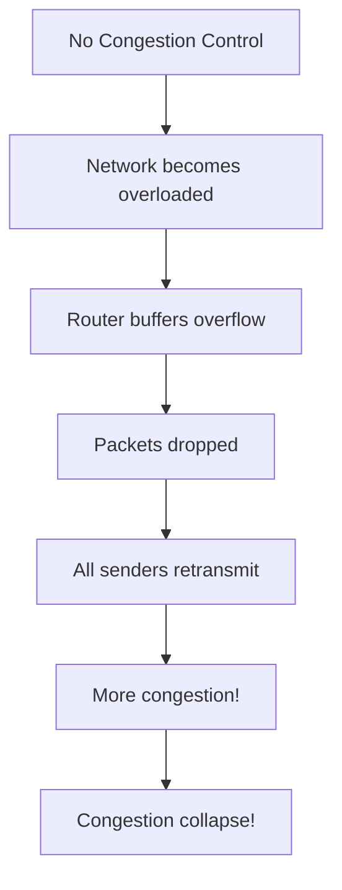
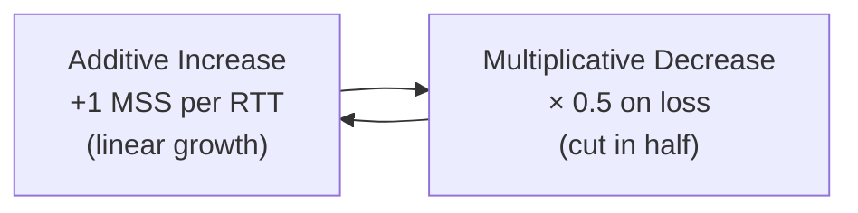
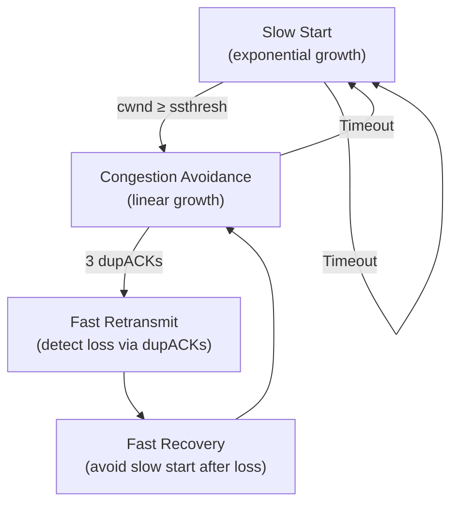
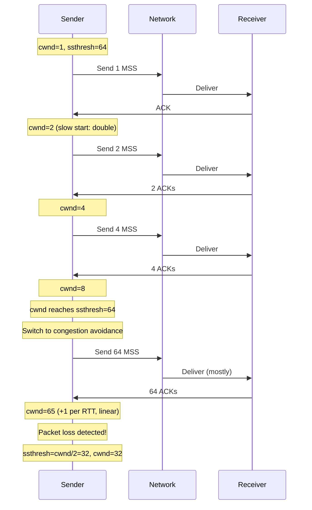

# TCP Congestion Control

> *"Congestion control is TCP's way of being a good citizen — slowing down when the network is overloaded."*

## Overview

**Congestion control** prevents TCP from overwhelming the network with too much data. Unlike flow control (receiver-based), congestion control is **network-based** — it adapts the sending rate based on perceived network congestion (packet loss, delay).

## Why Congestion Control?



In the late 1980s, the Internet experienced **congestion collapse** — congestion control was added to TCP to prevent this.

## Key Concepts

### Congestion Window (cwnd)

- **cwnd**: Sender's estimate of how much data the network can handle
- **ssthresh**: Slow start threshold — switch point between slow start and congestion avoidance
- **Effective window**: `min(cwnd, rwnd)`

### AIMD (Additive Increase, Multiplicative Decrease)



- **Increase**: Add 1 MSS per RTT when no loss (probe for bandwidth)
- **Decrease**: Halve cwnd when loss detected (back off aggressively)
- **Property**: AIMD is **fair** — multiple flows converge to equal share

## Congestion Control Phases



### Phase 1: Slow Start

```
cwnd starts at 1 MSS (or 10 MSS in modern implementations)
Double cwnd every RTT (exponential growth)
Stop when cwnd ≥ ssthresh or loss detected
```

### Phase 2: Congestion Avoidance

```
Add 1 MSS per RTT (linear growth)
Probe for more bandwidth carefully
Stop when loss detected
```

### Phase 3: Loss Detection

| Signal | Action | New ssthresh |
|--------|--------|-------------|
| 3 duplicate ACKs | Fast retransmit + fast recovery | cwnd / 2 |
| Timeout | Slow start from beginning | cwnd / 2 |

## Detailed Congestion Control Timeline



## Comparison of Phases

| Phase | Growth | Trigger Entry | Trigger Exit |
|-------|--------|--------------|-------------|
| **Slow Start** | Exponential (×2 per RTT) | Connection start or timeout | cwnd ≥ ssthresh |
| **Congestion Avoidance** | Linear (+1 per RTT) | cwnd ≥ ssthresh | Loss detected |
| **Fast Recovery** | Linear (after reduction) | 3 dupACKs | New ACK received |

## Modern Initial Window

**RFC 6928** (2013): Initial cwnd = **10 MSS** (was 1-2 MSS historically)

```
IW = min(10 × MSS, max(2 × MSS, 14600 bytes))
```

This speeds up short transfers (most web traffic).

## Interview Questions

### Beginner

**Q1: What is congestion control?**
Congestion control prevents TCP from overwhelming the network. It adapts the sending rate based on network conditions — slowing down when congestion is detected (packet loss) and speeding up when the network is clear. Without it, all senders would blast data, causing congestion collapse.

**Q2: What is the difference between flow control and congestion control?**
- **Flow control**: Prevents overwhelming the **receiver** (based on rwnd)
- **Congestion control**: Prevents overwhelming the **network** (based on cwnd)
- Both limit the sender: effective window = min(cwnd, rwnd)

**Q3: What is AIMD?**
AIMD (Additive Increase, Multiplicative Decrease) is the classic congestion control strategy: increase cwnd by 1 MSS per RTT (slow, linear growth) and decrease cwnd by half on loss (fast, multiplicative decrease). This is fair — multiple flows converge to equal bandwidth sharing.

### Intermediate

**Q4: Explain the difference between slow start and congestion avoidance.**
- **Slow start**: cwnd doubles every RTT (exponential growth). Used at connection start or after timeout. Aggressive but safe when cwnd is small.
- **Congestion avoidance**: cwnd increases by 1 MSS per RTT (linear growth). Used when cwnd reaches ssthresh. Conservative probing for more bandwidth.

**Q5: How does TCP detect congestion?**
TCP infers congestion from: (1) **Packet loss**: Detected by duplicate ACKs (3 dupACKs = fast retransmit) or retransmission timeout. (2) **Increased delay**: Some algorithms (BBR, Vegas) use RTT increases as congestion signal. (3) **ECN**: Explicit Congestion Notification — routers mark packets instead of dropping.

**Q6: What happens when a timeout occurs?**
On timeout: (1) ssthresh = cwnd / 2, (2) cwnd resets to 1 MSS (or initial window), (3) Enter slow start, (4) Retransmit lost segment. This is aggressive — it takes many RTTs to recover. Fast retransmit/fast recovery is preferred over timeouts.

### Advanced / FAANG-Level

**Q7: Why is AIMD considered "fair"?**
AIMD converges to fairness because: (1) Additive increase grows all flows at the same rate (+1 MSS/RTT), (2) Multiplicative decrease cuts proportionally — a flow with more bandwidth loses more, (3) Over time, competing flows converge to equal share. Mathematically: if two flows share a link, they converge to the line x=y in the bandwidth allocation graph.

**Q8: How does ECN (Explicit Congestion Notification) improve congestion control?**
ECN signals congestion before packet loss:
1. Sender sets ECN-capable bits in IP header
2. Router experiencing congestion marks packets (sets CE bit)
3. Receiver echoes congestion back to sender (ECE flag in TCP ACK)
4. Sender reduces cwnd and sets CWR flag
Benefits: No packet loss, no retransmission, lower latency, better for real-time applications.

**Q9: Design a congestion control algorithm for data center networks.**
Data center requirements: ultra-low latency, high throughput, bursty traffic, incast (many-to-one).

Design (like DCTCP):
1. **ECN marking at low threshold**: Mark at 20% buffer occupancy (not 100%)
2. **Fine-grained cwnd adjustment**: Reduce cwnd proportionally to marked packets (not 50%)
3. **Maintain large window**: Only reduce by small amount
4. **Fast convergence**: React to congestion in 1 RTT
5. **No slow start after loss**: Maintain high cwnd
6. **Pacing**: Smooth sending rate to avoid micro-bursts

## Common Mistakes

1. ❌ Confusing cwnd with rwnd — cwnd is network-based, rwnd is receiver-based
2. ❌ Thinking slow start is "slow" — it's exponential growth, faster than congestion avoidance
3. ❌ Forgetting that timeout is more expensive than 3 dupACKs — timeout resets to slow start
4. ❌ Assuming all TCP flows get equal bandwidth — depends on RTT and algorithm
5. ❌ Not considering congestion control in application design — it affects throughput

## Summary

- Congestion control prevents **network overload** using cwnd (congestion window)
- **AIMD**: Additive increase, multiplicative decrease — fair and stable
- **Slow start**: Exponential growth (cwnd doubles per RTT)
- **Congestion avoidance**: Linear growth (cwnd + 1 per RTT)
- **Loss detection**: 3 dupACKs (fast retransmit) or timeout (slow start)
- **Modern algorithms**: Reno, CUBIC, BBR — evolved from the basic framework

## Cross-References

- [Slow Start](slow-start.md) — Exponential growth phase
- [Congestion Avoidance](congestion-avoidance.md) — Linear growth phase
- [Fast Retransmit](fast-retransmit.md) — Loss detection via dupACKs
- [Fast Recovery](fast-recovery.md) — Avoiding slow start after loss
- [TCP Reno](reno.md) — Classic congestion control
- [TCP CUBIC](cubic.md) — Linux default
- [TCP BBR](bbr.md) — Google's bandwidth-based algorithm
