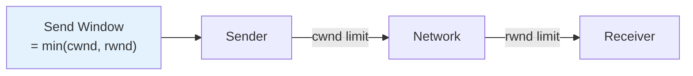
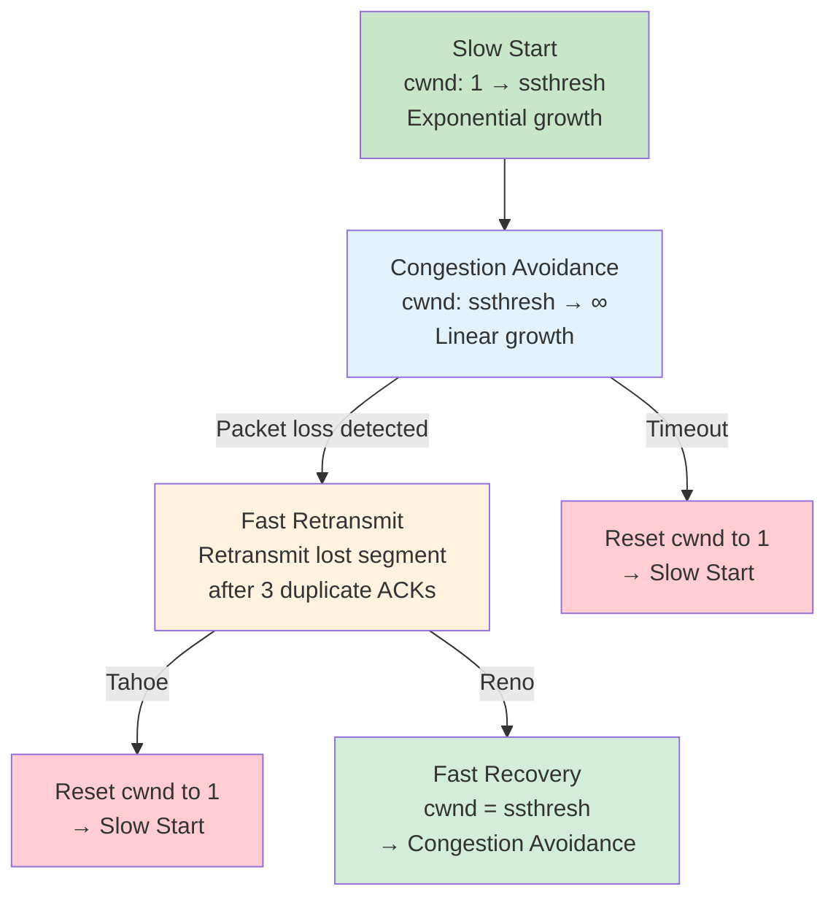
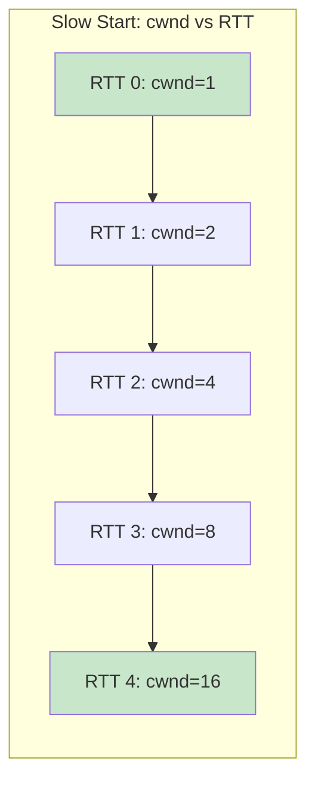
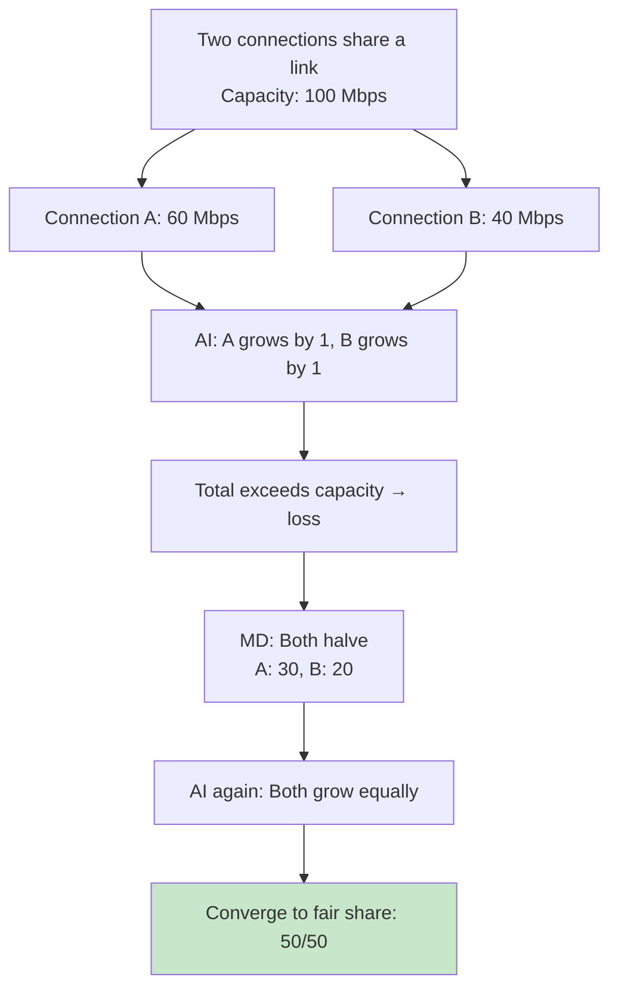

# TCP Congestion Control — Overview

## Overview

Congestion control is TCP's mechanism for preventing network congestion collapse — where increasing the offered load leads to *decreasing* goodput. Unlike **flow control** (receiver-driven, prevents overwhelming the receiver), congestion control is **network-driven**, preventing routers from being overwhelmed by too many packets.

Congestion control is one of the most important topics in networking interviews. Understanding the evolution from Tahoe to CUBIC to BBR demonstrates deep knowledge of how the internet actually works.

## Why Congestion Control?

### The Congestion Collapse Problem

```
Without congestion control:
  1. Senders inject packets at full speed
  2. Router buffers fill up
  3. Router drops packets (tail drop)
  4. Senders retransmit (adding MORE traffic)
  5. Buffers stay full, goodput → 0
  6. Network is "congested" but carrying almost no useful data

This actually happened on the early internet (1986 — the "congestion collapse")
  Link: LBL to UC Berkeley, 32 Kbps → 40 bps (!)
```

### Congestion Control vs Flow Control

| Aspect | Flow Control | Congestion Control |
|--------|-------------|-------------------|
| **Goal** | Prevent overwhelming receiver | Prevent overwhelming network |
| **Driven by** | Receiver's buffer space | Network congestion signals |
| **Mechanism** | Receive window (rwnd) | Congestion window (cwnd) |
| **Signals** | TCP header window field | Packet loss, delay, ECN |
| **Scope** | End-to-end (single connection) | Global (all connections share network) |

### The Sending Window

TCP's effective sending rate is limited by both:

```
Effective Window = min(cwnd, rwnd)

Where:
  cwnd = congestion window (sender's estimate of network capacity)
  rwnd = receive window (receiver's advertised buffer space)

Sender can have at most `effective window` bytes in flight
(unacknowledged data)
```



## The Four Phases of Congestion Control

Classic TCP congestion control (Tahoe/Reno) operates in four phases:



### Phase 1: Slow Start

Despite its name, slow start is actually **exponential** growth. It's "slow" compared to sending the entire window at once.

```
Mechanism:
  - Start with cwnd = 1 MSS (Maximum Segment Size)
  - For each ACK received: cwnd += 1 MSS
  - Effectively doubles cwnd every RTT

Example (MSS = 1460 bytes):
  RTT 0: cwnd = 1    → send 1 segment
  RTT 1: cwnd = 2    → send 2 segments
  RTT 2: cwnd = 4    → send 4 segments
  RTT 3: cwnd = 8    → send 8 segments
  RTT 4: cwnd = 16   → send 16 segments
  ...
  RTT 10: cwnd = 1024 → send 1024 segments (~1.5 MB)
```

**Growth pattern:** cwnd doubles every RTT → exponential growth



**Exit condition:** cwnd reaches **ssthresh** (slow start threshold) → switch to congestion avoidance

### Phase 2: Congestion Avoidance

Once cwnd reaches ssthresh, growth switches from exponential to **linear** (additive increase).

```
Mechanism:
  - For each ACK: cwnd += MSS * (MSS / cwnd)
  - Effectively: cwnd increases by 1 MSS per RTT
  - Linear growth is much more conservative

Example (ssthresh = 16):
  RTT 0: cwnd = 16
  RTT 1: cwnd = 17
  RTT 2: cwnd = 18
  RTT 3: cwnd = 19
  ...
  (grows by ~1 MSS per RTT)
```

**Exit condition:** Packet loss detected → enter fast retransmit or timeout

### Phase 3: Fast Retransmit

When a sender receives **3 duplicate ACKs** (same ACK number repeated), it infers a packet was lost and retransmits immediately — without waiting for the retransmission timeout (RTO).

```
Why 3 duplicate ACKs?
  - 1 duplicate ACK: could be reordering
  - 2 duplicate ACKs: could be reordering
  - 3 duplicate ACKs: very likely a loss (not reordering)

Timeline:
  Sender → Receiver: Seq 1 (received ✓, ACK 2)
  Sender → Receiver: Seq 2 (LOST!)
  Sender → Receiver: Seq 3 (received, but out of order)
  Receiver → Sender: ACK 2 (duplicate #1 — "I expected Seq 2")
  Sender → Receiver: Seq 4 (received, still out of order)
  Receiver → Sender: ACK 2 (duplicate #2)
  Sender → Receiver: Seq 5
  Receiver → Sender: ACK 2 (duplicate #3)
  → Sender retransmits Seq 2 immediately
```

### Phase 4: Fast Recovery (Reno only)

After fast retransmit, Reno enters fast recovery instead of slow start:

```
Tahoe after loss:
  cwnd = 1 MSS → slow start again (aggressive)

Reno after loss (fast recovery):
  ssthresh = cwnd / 2
  cwnd = ssthresh + 3 (inflated for the 3 dup ACKs)
  → congestion avoidance (less aggressive)
```

## AIMD: Additive Increase, Multiplicative Decrease

AIMD is the fundamental algorithm that makes congestion control work across the internet. It's the reason TCP connections share bandwidth fairly.

```
Additive Increase (AI):
  When no loss: cwnd += 1 MSS per RTT
  → Slowly probe for more bandwidth

Multiplicative Decrease (MD):
  When loss detected: cwnd = cwnd / 2
  → Quickly back off when congestion occurs
```

### Why AIMD Works (Intuition)



### AIMD Sawtooth Pattern

```
cwnd
 ^
 |      /\      /\      /\
 |     /  \    /  \    /  \
 |    /    \  /    \  /    \
 |   /      \/      \/      \
 |  / AI     MD  AI  MD  AI
 +----------------------------> Time

AI: Linear increase (additive)
MD: Halve on loss (multiplicative)
```

### Formal Fairness Argument

Consider N connections sharing a bottleneck link with capacity C:

```
At equilibrium:
  - All connections have cwnd ≈ C/N
  - When congestion occurs, all halve: cwnd = C/(2N)
  - All increase equally: converge back to C/N

Key insight: AIMD converges to fairness because:
  - Increase is equal for all (additive)
  - Decrease is proportional (multiplicative)
  - The "decrease" step is the same fraction for everyone
```

## TCP Congestion Control Variants

### TCP Tahoe (1988)

The original congestion control algorithm by Van Jacobson.

```
Slow Start → Congestion Avoidance
On loss (timeout or 3 dup ACKs):
  ssthresh = cwnd / 2
  cwnd = 1 MSS
  → Always goes back to slow start
```

### TCP Reno (1990)

Added fast recovery — avoids slow start after a single loss.

```
On 3 dup ACKs (fast retransmit):
  ssthresh = cwnd / 2
  cwnd = ssthresh + 3
  → Congestion avoidance (not slow start)

On timeout:
  ssthresh = cwnd / 2
  cwnd = 1 MSS
  → Slow start (same as Tahoe)
```

### TCP NewReno (1999)

Improved Reno's handling of multiple losses in a window.

```
Reno problem: After fast retransmit, if multiple packets lost,
Reno only retransmits one and leaves recovery.

NewReno: Tracks "recovery point" (highest sent seq)
  - Continues fast recovery until ALL packets up to recovery point are ACKed
  - Handles multiple losses without going to slow start
```

### TCP CUBIC (2008)

Default in Linux. Uses a cubic function for window growth.

```
Key idea: cwnd growth is a cubic function of time since last loss
  W(t) = C(t - K)³ + W_max

Where:
  W_max = cwnd before last loss
  K = time to reach W_max
  C = scaling constant

Properties:
  - Concave growth near W_max (cautious probing)
  - Convex growth far from W_max (aggressive probing)
  - RTT-fair: growth depends on time, not RTT
```

### TCP BBR (2016)

Google's model-based congestion control. Estimates bottleneck bandwidth and RTT.

```
Traditional (loss-based): React to packet loss
BBR (model-based): Estimate bandwidth and RTT, then pace

BBR maintains:
  BtlBw = max(delivery rate) over recent window
  RTprop = min(RTT) over recent window
  BDP = BtlBw × RTprop (bandwidth-delay product)

Sending rate ≈ BtlBw (not limited by cwnd)
Pacing rate ≈ BtlBw × gain

Advantages:
  - No buffer bloat (doesn't fill router buffers)
  - Better throughput on lossy links
  - RTT-fair
```

## Signals for Congestion Detection

### Loss-Based (Tahoe, Reno, CUBIC)

```
Detect congestion via packet loss:
  - Timeout (RTO expires)
  - 3 duplicate ACKs

Problem: By the time loss is detected, congestion is severe
  - Router buffer is already full
  - Packets are being dropped
  - Latency has already increased (bufferbloat)
```

### Delay-Based (Vegas, BBR)

```
Detect congestion via increased RTT:
  - If RTT > RTprop: queue is building → reduce rate
  - If RTT ≈ RTprop: no queue → can increase rate

Advantage: Detect congestion BEFORE loss occurs
Problem: Hard to distinguish congestion delay from route changes
```

### ECN (Explicit Congestion Notification)

```
Router sets ECN bits in IP header when queue is building:
  - CE (Congestion Experienced) flag in IP header
  - Receiver echoes ECN in TCP header (ECE flag)
  - Sender reduces cwnd (like loss, but without actual loss)

Advantage: No packet loss needed
Problem: Requires router support (not universal)
```

## Performance Impact

### Throughput Formula

TCP throughput is approximately:

```
Throughput ≈ MSS / (RTT × √(2/3p))

Where:
  MSS = Maximum Segment Size
  RTT = Round-trip time
  p = packet loss rate

Example:
  MSS = 1460 bytes
  RTT = 100 ms
  p = 1% (0.01)
  
  Throughput ≈ 1460 / (0.1 × √(66.7))
             ≈ 1460 / (0.1 × 8.16)
             ≈ 1460 / 0.816
             ≈ 1789 KB/s ≈ 14.3 Mbps

  With p = 0.1%:
  Throughput ≈ 1460 / (0.1 × √(666.7))
             ≈ 1460 / (0.1 × 25.8)
             ≈ 56.6 KB/s ≈ 0.45 Mbps (!!)
```

**Key insight:** TCP throughput is inversely proportional to √(loss rate). Even small increases in loss dramatically reduce throughput.

### Bufferbloat

```
Problem: Large router buffers + loss-based congestion control
  → Buffers fill up before loss is detected
  → RTT increases dramatically (100ms → 1000ms+)
  → Throughput is maintained, but latency is terrible

Example:
  Router buffer: 1000 packets
  Link: 100 Mbps, RTT = 50ms
  
  Buffer adds: 1000 × 1500 bytes × 8 / 100 Mbps = 120ms
  Total RTT: 50ms + 120ms = 170ms (3x increase!)
  
  With smaller buffer (100 packets):
  Buffer adds: 12ms
  Total RTT: 62ms (much better)

Solution: AQM (Active Queue Management)
  - RED (Random Early Detection): Drop before buffer full
  - CoDel: Control delay, not queue size
  - BBR: Don't fill buffers at all (model-based)
```

## Interview Questions

### Q1: Explain the difference between slow start and congestion avoidance.
**A:** Slow start grows cwnd exponentially (doubles per RTT) — it starts with cwnd=1 MSS and adds 1 MSS per ACK received. Congestion avoidance grows cwnd linearly (adds 1 MSS per RTT) — it uses additive increase. Slow start is used until cwnd reaches ssthresh, then congestion avoidance takes over. Despite its name, slow start is actually fast exponential growth — it's "slow" compared to immediately sending the full advertised window.

### Q2: What is AIMD and why does it work?
**A:** AIMD (Additive Increase, Multiplicative Decrease) is the fundamental principle of TCP congestion control. Additive increase: cwnd grows by 1 MSS per RTT (linear probing). Multiplicative decrease: cwnd halves on loss (quick backoff). AIMD works because: (1) It converges to fairness — all connections sharing a bottleneck converge to equal share. (2) It's stable — the decrease is proportional, preventing oscillation. (3) It's distributed — no central coordination needed. The sawtooth pattern is the signature of AIMD.

### Q3: What is the difference between TCP Tahoe and TCP Reno?
**A:** Tahoe always resets cwnd to 1 MSS on any loss (timeout or 3 dup ACKs) and goes back to slow start. Reno distinguishes between timeout (slow start) and 3 duplicate ACKs (fast recovery). On 3 dup ACKs, Reno sets cwnd = ssthresh + 3 and continues with congestion avoidance, avoiding the expensive slow start. This makes Reno much more efficient for single-packet losses.

### Q4: Why is CUBIC the default in Linux instead of Reno?
**A:** CUBIC has three advantages: (1) RTT fairness — CUBIC's window growth depends on time, not RTT, so connections with different RTTs get fairer shares. Reno is RTT-unfair — connections with shorter RTTs grow faster. (2) Better high-bandwidth utilization — Reno's linear increase is too slow for high BDP networks. CUBIC's cubic function probes aggressively far from W_max. (3) More stable — CUBIC's concave growth near W_max reduces unnecessary oscillation.

### Q5: How does BBR differ from loss-based congestion control?
**A:** Loss-based algorithms (Tahoe, Reno, CUBIC) increase cwnd until packets are dropped, then back off. This fills router buffers, causing latency spikes (bufferbloat). BBR estimates the bottleneck bandwidth (BtlBw) and minimum RTT (RTprop), then sends at exactly the bottleneck rate. It never intentionally fills buffers. BBR achieves higher throughput on lossy links (no false loss signals) and lower latency (no bufferbloat).

### Q6: What is fast retransmit and why 3 duplicate ACKs?
**A:** Fast retransmit retransmits a lost segment immediately upon receiving 3 duplicate ACKs, without waiting for the RTO. Three duplicate ACKs indicate that 3 subsequent packets arrived out of order — strong evidence of a single loss, not just reordering. One or two dup ACKs could be caused by packet reordering (common in networks with multiple paths). Three is the empirical threshold that balances false positives (unnecessary retransmits) against detection speed.

### Q7: How would you design congestion control for a data center network?
**A:** Data centers have unique characteristics: very low RTT (microseconds), high bandwidth, incast patterns (many-to-one). Design considerations: (1) DCTCP (Data Center TCP): Uses ECN bits to detect congestion early, before loss. Maintains high throughput with shallow buffers. (2) Very small initial cwnd for incast — don't overwhelm the receiver. (3) Pacing — spread packets evenly, don't burst. (4) Timeout handling — data center RTTs are small, so RTO must be tuned carefully (min RTO). (5) Consider RDMA/RoCE for ultra-low-latency applications.

## Common Mistakes

1. **Confusing flow control with congestion control** — Flow control (rwnd) prevents overwhelming the receiver. Congestion control (cwnd) prevents overwhelming the network. Both limit the sending window.

2. **Thinking slow start is slow** — It's exponential growth! It's "slow" compared to sending the entire advertised window immediately.

3. **Not understanding AIMD fairness** — AIMD converges to fairness because all connections increase equally (AI) and decrease proportionally (MD). This is why TCP connections share bandwidth.

4. **Confusing fast retransmit with fast recovery** — Fast retransmit: retransmit after 3 dup ACKs. Fast recovery: Reno's strategy of not going back to slow start after fast retransmit. Tahoe has fast retransmit but no fast recovery.

5. **Ignoring bufferbloat** — Loss-based congestion control fills buffers before detecting loss. This maintains throughput but destroys latency. AQM (CoDel, fq_codel) and BBR address this.

## Summary

| Algorithm | Growth | Loss Response | Key Feature |
|-----------|--------|---------------|-------------|
| **Tahoe** | Exponential → Linear | Always slow start | Original algorithm |
| **Reno** | Exponential → Linear | Fast recovery on dup ACKs | Avoids slow start |
| **NewReno** | Exponential → Linear | Handles multiple losses | Better recovery |
| **CUBIC** | Cubic function | Concave near W_max | RTT-fair, Linux default |
| **BBR** | Model-based | Doesn't rely on loss | No bufferbloat |

| Phase | cwnd Growth | Trigger |
|-------|------------|---------|
| Slow Start | Exponential (2x/RTT) | New connection or after timeout |
| Congestion Avoidance | Linear (1/RTT) | cwnd ≥ ssthresh |
| Fast Retransmit | — | 3 duplicate ACKs |
| Fast Recovery | — | After fast retransmit (Reno+) |

## Cross-References

- [Slow Start](../slow-start.md) — Detailed slow start algorithm
- [Congestion Avoidance](../congestion-avoidance.md) — Additive increase details
- [Fast Retransmit](../fast-retransmit.md) — Loss detection mechanism
- [Fast Recovery](../fast-recovery.md) — Reno's recovery strategy
- [CUBIC](../cubic.md) — Linux default congestion control
- [BBR](../bbr.md) — Google's model-based approach
- [Flow Control](../flow-control.md) — Receiver-driven flow control
- [TCP Header](../header.md) — Window field and ECN bits
