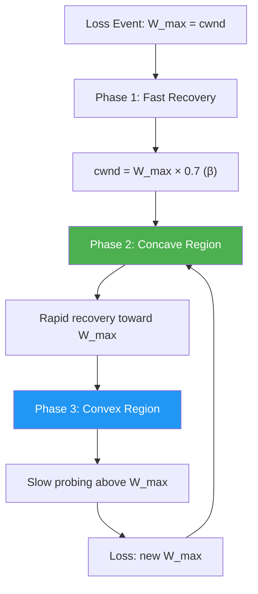
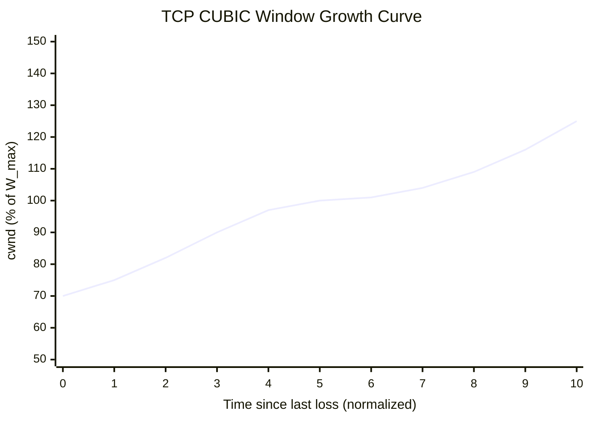
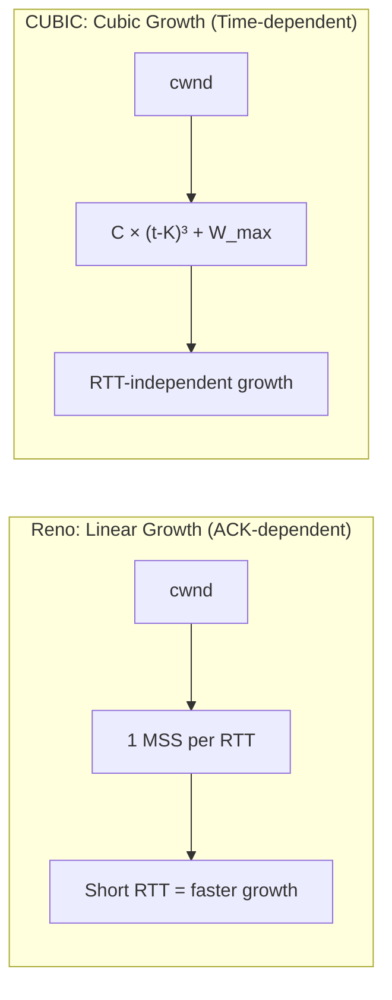

# TCP CUBIC

## Overview

TCP CUBIC is the **default TCP congestion control algorithm in Linux** (since kernel 2.6.19) and is also used in Windows 10+ and macOS. It was designed to address Reno's poor performance on high-bandwidth, high-latency (high-BDP) networks. Instead of Reno's linear increase, CUBIC uses a **cubic function** to determine the congestion window growth, making it much more efficient at utilizing available bandwidth.

CUBIC's key innovation is that its window growth depends on the **time elapsed since the last congestion event**, not on ACK arrivals. This makes it more RTT-fair and better suited for modern networks.

## Detailed Explanation

### The Three Functions of CUBIC

CUBIC's window growth is defined by a cubic polynomial:

```
W(t) = C × (t - K)³ + W_max
```

Where:
- `C` = scaling constant (0.4, chosen experimentally)
- `t` = time since last congestion event
- `K` = time at which the window would reach W_max (computed as ∛(W_max × β / C))
- `W_max` = window size at the last congestion event
- `β` = multiplicative decrease factor (0.7 in Linux, so 30% reduction)

CUBIC has **three distinct phases** based on this cubic function:



### Phase 1: Multiplicative Decrease (Loss Recovery)

When packet loss is detected:
- `W_max = cwnd` (save current window)
- `cwnd = cwnd × β = cwnd × 0.7` (reduce by 30%)
- `ssthresh = cwnd`

Unlike Reno which halves cwnd (50% reduction), CUBIC only reduces by 30%. This is less aggressive and allows higher average throughput.

### Phase 2: Concave Region (Rapid Recovery)

After loss, CUBIC enters the concave (fast-growing) region:
- Window grows **quickly** toward W_max
- The cubic function's concave shape means rapid initial recovery
- This is CUBIC's "fast recovery" — it regains lost bandwidth quickly

```
Time after loss:  0    1    2    3    4    5
Window growth:    70%  85%  93%  97%  99%  100% of W_max
                  ↑
            Rapid initial growth (concave)
```

### Phase 3: Convex Region (Probing for Bandwidth)

After reaching W_max, CUBIC enters the convex (slow-growing) region:
- Window grows **slowly** above W_max
- Probes for additional bandwidth cautiously
- Growth accelerates as time passes (convex shape)
- Eventually detects new loss → back to Phase 1

```
Time after reaching W_max:  0    1    2    3    4    5
Window growth:              100% 101% 104% 109% 116% 125% of W_max
                            ↑
                      Slow initial growth (convex)
```

### The Cubic Function Visualization



The inflection point at W_max is where the curve transitions from concave to convex.

### CUBIC's RTT Fairness

A major advantage of CUBIC over Reno: **RTT-fairness**.

**Reno's problem**: Window growth depends on ACKs. Flows with shorter RTTs get more ACKs per second, so they grow cwnd faster → short-RTT flows dominate.

**CUBIC's solution**: Window growth depends on **time**, not ACKs. Two flows with different RTTs but the same W_max will reach the same window at the same time.

```
Reno:  Flow A (RTT=50ms) grows cwnd 2x faster than Flow B (RTT=100ms)
CUBIC: Flow A and Flow B grow cwnd at the same rate (time-based)
```

### CUBIC vs Reno Growth Comparison



### CUBIC's Friendliness to Reno

CUBIC is designed to be **TCP-friendly** — when competing with Reno flows, it doesn't starve them:

- In **low-BDP networks**: CUBIC behaves similarly to Reno (concave region ≈ linear)
- In **high-BDP networks**: CUBIC is much more efficient (convex region probes faster)
- CUBIC's average window is always ≥ Reno's would be

### CUBIC Algorithm (Pseudocode)

```python
# TCP CUBIC Constants
BETA = 0.7        # Multiplicative decrease factor
C = 0.4           # Scaling constant
W_max = 0         # Window at last loss event
t_last_loss = 0   # Time of last loss event

def cubic_window(t):
    """CUBIC window function"""
    K = (W_max * (1 - BETA) / C) ** (1/3)
    return C * (t - K) ** 3 + W_max

def on_loss_detected():
    global W_max, t_last_loss
    W_max = cwnd
    cwnd = cwnd * BETA  # Reduce by 30%
    ssthresh = cwnd
    t_last_loss = current_time()

def on_ack_received():
    t = current_time() - t_last_loss
    W_cubic = cubic_window(t)
    
    # TCP-friendly check: compare with Reno's expected window
    W_reno = W_max * BETA + (3 * (1 - BETA) / (1 + BETA)) * (t / RTT)
    
    cwnd = max(W_cubic, W_reno)  # Use the larger one
```

### CUBIC in Linux

```bash
# Check current congestion control
sysctl net.ipv4.tcp_congestion_control
# Output: net.ipv4.tcp_congestion_control = cubic

# List available algorithms
sysctl net.ipv4.tcp_available_congestion_control
# Output: cubic reno bbr

# Change congestion control
sudo sysctl -w net.ipv4.tcp_congestion_control=bbr
```

### Key Parameters in Linux

| Parameter | Default | Description |
|-----------|---------|-------------|
| `β` | 0.7 | Multiplicative decrease factor |
| `C` | 0.4 | Cubic scaling constant |
| `fast_convergence` | 1 | Enable fast convergence for fairness |
| `hystart` | 1 | Hybrid slow start (avoids large cwnd overshoot) |

### Fast Convergence Mechanism

CUBIC includes a **fast convergence** mechanism to improve fairness among CUBIC flows:

```
If the new W_max < old W_max:
    Further reduce W_max by an additional factor
    This allows the flow to converge faster with other flows
```

Without fast convergence, CUBIC flows with different W_max values might never equalize their share of bandwidth.

### HyStart (Hybrid Slow Start)

CUBIC uses HyStart to improve the slow start phase:
- **Traditional slow start**: Exponential growth until loss (overshoots)
- **HyStart**: Detects approaching capacity via:
  1. **Delay increase**: If RTT increases significantly, reduce growth
  2. **ACK train**: If inter-ACK spacing increases, reduce growth
- Transitions to congestion avoidance more smoothly, reducing loss

## Example: CUBIC vs Reno on a 1 Gbps Link

### Scenario: 1 Gbps link, 100ms RTT, BDP = 12.5 MB

```
After loss event, W_max = 1000 MSS:

Reno recovery time to reach 1000 MSS:
  Needs 300 MSS increase × 1 RTT/MSS = 300 RTTs = 30 seconds

CUBIC recovery time to reach 1000 MSS:
  Concave region: ~5-10 RTTs to reach ~97% of W_max
  Total recovery: ~10-15 RTTs = 1-1.5 seconds

Speedup: ~20x faster recovery
```

### CUBIC Window Trace

```
Time (RTTs) | cwnd (MSS) | Phase
0           | 700        | After loss (0.7 × 1000)
1           | 850        | Concave recovery
2           | 930        | Concave recovery
3           | 970        | Concave recovery
4           | 990        | Concave recovery
5           | 1000       | Reached W_max
6           | 1004       | Convex probing
7           | 1016       | Convex probing
8           | 1043       | Convex probing
9           | 1089       | Convex probing
10          | 1160       | Convex probing
11          | 1260       | Loss → new W_max = 1260
```

## Interview Questions

### Q1: What are the three phases of TCP CUBIC?
**A:** (1) **Multiplicative Decrease**: On loss, save W_max = cwnd, reduce cwnd by 30% (β=0.7). (2) **Concave Region**: Rapid recovery toward W_max — the cubic function grows quickly initially. (3) **Convex Region**: Slow probing above W_max — growth accelerates as time passes, probing for more bandwidth.

### Q2: How does CUBIC achieve better RTT-fairness than Reno?
**A:** CUBIC's window growth is a function of **time since last loss** (not ACKs). Reno's growth depends on ACKs, so shorter-RTT flows get more ACKs/second and grow faster. CUBIC flows with different RTTs but similar W_max values grow at the same rate, achieving fairness.

### Q3: Why does CUBIC use a cubic function instead of linear?
**A:** The cubic function provides two key properties: (1) Concave region for fast recovery to previous operating point, (2) Convex region for cautious bandwidth probing above previous operating point. This allows efficient recovery AND aggressive bandwidth discovery, which linear growth (Reno) can't achieve simultaneously.

### Q4: What is CUBIC's β parameter and why 0.7?
**A:** β = 0.7 is the multiplicative decrease factor. On loss, cwnd becomes cwnd × 0.7 (30% reduction). This is less aggressive than Reno's 50% reduction, allowing higher average throughput. The value 0.7 was chosen experimentally to balance between responsiveness and stability.

### Q5: What is HyStart in CUBIC?
**A:** HyStart (Hybrid Slow Start) improves CUBIC's slow start phase. Instead of exponential growth until loss (which overshoots), HyStart detects approaching capacity via delay increase or ACK train spacing. It transitions to congestion avoidance more smoothly, reducing packet loss during startup.

### Q6: How is CUBIC TCP-friendly?
**A:** CUBIC includes a TCP-friendly window calculation: W_reno = W_max × β + Reno-like-linear-growth. CUBIC uses max(W_cubic, W_reno), ensuring it never sends less than Reno would. In low-BDP networks, CUBIC behaves like Reno; in high-BDP networks, it's much more efficient.

### Q7: What is fast convergence in CUBIC?
**A:** Fast convergence improves fairness among CUBIC flows. If a flow's new W_max is smaller than its old W_max (meaning it's competing with other flows), it further reduces W_max. This helps flows converge to equal bandwidth shares faster.

### Q8: Why is CUBIC the default in Linux?
**A:** CUBIC provides excellent performance across a wide range of network conditions — from low-BDP data center links to high-BDP long-haul connections. It's RTT-fair, TCP-friendly, and has been extensively tested since becoming the Linux default in 2006. Its cubic growth function efficiently recovers from loss while probing for bandwidth.

## Common Mistakes

1. **Confusing CUBIC's cubic function with Reno's linear function**: Reno grows linearly (1 MSS per RTT). CUBIC grows as a cubic function of time, with concave and convex regions.

2. **Thinking CUBIC always outperforms Reno**: In very low-BDP networks (data centers), CUBIC's advantage is minimal. The TCP-friendly check means CUBIC behaves like Reno when Reno would be competitive.

3. **Forgetting that CUBIC reduces by 30%, not 50%**: Reno halves cwnd on loss (50% reduction). CUBIC only reduces by 30% (β=0.7). This means CUBIC maintains higher throughput through loss events.

4. **Not understanding the concave vs convex regions**: Concave = fast recovery (below W_max), Convex = bandwidth probing (above W_max). The inflection point is at W_max.

5. **Assuming CUBIC is always the best choice**: For data center environments with very low latency, BBR or DCTCP may be better. For very lossy wireless links, different approaches may be needed.

6. **Confusing CUBIC with BBR**: CUBIC is loss-based (reacts to packet loss). BBR is model-based (estimates bandwidth and RTT). They have fundamentally different philosophies.

7. **Not knowing CUBIC is the Linux default**: Many engineers don't realize their Linux servers use CUBIC by default. Understanding CUBIC is essential for network performance tuning.

## Summary

| Aspect | TCP CUBIC |
|--------|-----------|
| **Default in** | Linux (since 2.6.19), Windows 10+, macOS |
| **Growth function** | W(t) = C × (t - K)³ + W_max |
| **Decrease factor** | β = 0.7 (30% reduction on loss) |
| **Phases** | Multiplicative decrease → Concave recovery → Convex probing |
| **RTT fairness** | Yes (time-based growth, not ACK-based) |
| **TCP-friendly** | Yes (uses max of CUBIC and Reno windows) |
| **Key innovations** | Cubic growth, fast convergence, HyStart |
| **Best for** | High-BDP networks, general-purpose |

TCP CUBIC represented a major leap in congestion control, enabling efficient use of high-bandwidth long-distance links while maintaining fairness and compatibility with older TCP variants.

## Cross-References

- [TCP Reno](reno.md) — Predecessor that CUBIC improves upon
- [TCP BBR](bbr.md) — Model-based alternative to CUBIC's loss-based approach
- [TCP Fast Recovery](fast-recovery.md) — Loss recovery mechanism CUBIC builds upon
- [TCP States](states.md) — How congestion control integrates with TCP state machine
- [TCP Options](options.md) — SACK and timestamps that enhance CUBIC's performance

## Cross References

- [TCP Reno](reno.md)
- [BBR](bbr.md)
- [Congestion Avoidance](congestion-avoidance.md)
