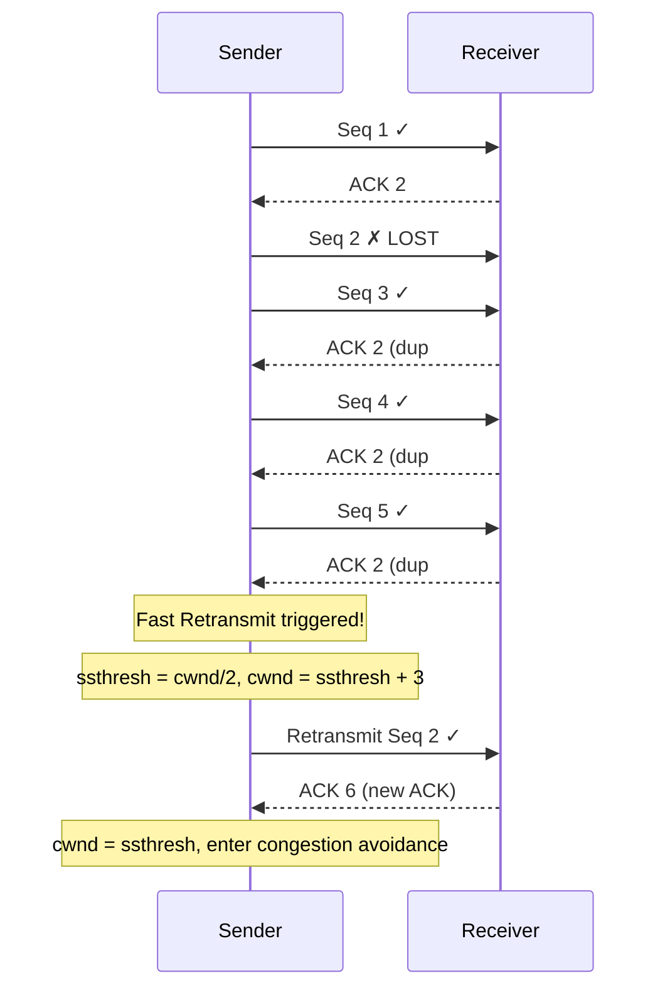

# TCP Fast Recovery

## Overview

TCP Fast Recovery is a congestion control mechanism that allows a sender to recover from packet loss without dropping its congestion window (cwnd) all the way back to 1 MSS. It works in conjunction with **Fast Retransmit** to avoid the costly timeout-based recovery path. Together, they form the backbone of modern TCP loss recovery.

Without fast recovery, every packet loss would force TCP to wait for a retransmission timeout (RTO) and restart from slow start — a devastating performance penalty.

## Detailed Explanation

### The Problem: Timeout-Based Recovery

In original TCP (Tahoe), when a sender detects packet loss:
1. It waits for the RTO timer to expire (often 200ms+)
2. Sets `cwnd = 1 MSS` (back to slow start)
3. Retransmits the lost segment

This is extremely wasteful — the RTO is typically much longer than the actual round-trip time, and resetting cwnd destroys the learned bandwidth capacity.

### Fast Retransmit (Prerequisite)

Fast Retransmit was the first improvement. Instead of waiting for RTO, the sender reacts to **duplicate ACKs**:

```
Sender                          Receiver
  |--- Seq 1 (100 bytes) ------->|  ✓ received
  |<----------- ACK 2 ------------|
  |--- Seq 2 (100 bytes) ------->|  ✗ LOST
  |--- Seq 3 (100 bytes) ------->|  ✓ received (out of order)
  |<----------- ACK 2 ------------|  (duplicate ACK #1)
  |--- Seq 4 (100 bytes) ------->|  ✓ received (out of order)
  |<----------- ACK 2 ------------|  (duplicate ACK #2)
  |--- Seq 5 (100 bytes) ------->|  ✓ received (out of order)
  |<----------- ACK 2 ------------|  (duplicate ACK #3)
  |
  |  3 duplicate ACKs → Fast Retransmit Seq 2
  |--- Seq 2 (retransmit) ------>|
  |<----------- ACK 6 ------------|  (cumulative ACK for all)
```

**Trigger**: 3 duplicate ACKs (some implementations use threshold = 3 by default).

### Fast Recovery Algorithm (Reno)

After Fast Retransmit, instead of going to slow start, Fast Recovery:

1. **Halve the congestion window**: `ssthresh = cwnd / 2`, `cwnd = ssthresh + 3 MSS`
   - The +3 accounts for the 3 duplicate ACKs that left the network
2. **Retransmit** the lost segment
3. **For each additional duplicate ACK**: increment `cwnd` by 1 MSS (inflating the window)
4. **When new ACK arrives**: set `cwnd = ssthresh` and enter congestion avoidance

### Why Window Inflation Works

Each duplicate ACK means one segment has left the network. By incrementing cwnd, the sender allows new segments to be sent, keeping the pipeline full while waiting for the retransmit to be acknowledged.

### AIMD During Fast Recovery

Fast Recovery implements a form of **Additive Increase, Multiplicative Decrease (AIMD)**:
- **Decrease**: Halve cwnd on loss detection (3 dupACKs)
- **Increase**: Inflate cwnd by 1 per dupACK during recovery



### Fast Recovery vs Timeout Recovery

| Aspect | Fast Recovery | Timeout Recovery |
|--------|--------------|------------------|
| **Trigger** | 3 duplicate ACKs | RTO timer expires |
| **cwnd** | Halved (ssthresh) | Reset to 1 MSS |
| **ssthresh** | cwnd / 2 | cwnd / 2 |
| **Recovery time** | ~1 RTT | RTO (often 200ms+) |
| **Pipeline** | Maintained (inflated window) | Drained completely |
| **Efficiency** | High | Very low |

### Multiple Losses in One Window

A limitation of basic Fast Recovery: if **multiple packets** are lost in a single window, the sender may not receive enough duplicate ACKs to trigger fast retransmit for each loss. This can force fallback to timeout recovery.

Solutions:
- **TCP SACK** (Selective ACK): Receiver reports exactly which segments are missing
- **TCP NewReno**: Tracks partial ACKs to detect multiple losses
- **TCP FACK** (Forward ACK): Uses SACK information to estimate losses more accurately

### TCP NewReno Improvement

NewReno modifies fast recovery to handle multiple losses:

1. When a **partial ACK** arrives (doesn't cover all outstanding data), the sender:
   - Retransmits the next segment suspected lost
   - Does NOT exit fast recovery
   - Deflates cwnd appropriately

2. Only exits fast recovery when **all** outstanding data is acknowledged

```
Partial ACK example:
- Outstanding: Seq 2, 3, 4, 5 (Seq 2 and 4 lost)
- After retransmitting Seq 2 and receiving ACK 3 → partial ACK
- NewReno: stay in fast recovery, retransmit Seq 4
- Old Reno: would exit fast recovery, miss Seq 4 loss
```

## Example: Fast Recovery in Action

### Scenario: cwnd = 16 MSS, packet loss occurs

```
Initial state:
  cwnd = 16 MSS
  ssthresh = 32 MSS

Step 1: 3 duplicate ACKs received
  ssthresh = 16 / 2 = 8 MSS
  cwnd = 8 + 3 = 11 MSS  (inflated for 3 dupACKs in flight)
  Retransmit lost segment

Step 2: Each additional dupACK
  cwnd += 1 MSS  (window inflation)
  
Step 3: New ACK received (retransmit acknowledged)
  cwnd = ssthresh = 8 MSS
  Enter congestion avoidance (linear increase)
```

### Calculating Effective Window During Recovery

```
Flight size = segments in flight
Effective window = min(cwnd, rwnd)

During fast recovery:
  cwnd = ssthresh + number_of_dupACKs
  This keeps the pipe full while retransmitting
```

## Interview Questions

### Q1: What is the difference between Fast Retransmit and Fast Recovery?
**A:** Fast Retransmit is the mechanism that detects loss via 3 duplicate ACKs and retransmits the lost segment immediately. Fast Recovery is the congestion control response that follows — it halves cwnd instead of resetting to 1, and uses window inflation to keep the pipeline full. Fast Retransmit is about detection; Fast Recovery is about the response.

### Q2: Why does Fast Recovery add 3 MSS to ssthresh when it starts?
**A:** The 3 duplicate ACKs that triggered fast retransmit each indicate one segment has left the network. Adding 3 to cwnd accounts for these 3 segments that are no longer consuming network capacity, allowing the sender to keep the pipeline approximately full.

### Q3: What happens if a packet is lost but we don't receive 3 duplicate ACKs?
**A:** If the window is too small to generate 3 duplicate ACKs, or if the loss is near the end of the transfer, fast retransmit won't trigger. The sender must fall back to timeout-based recovery, which is much slower (waits for RTO, resets cwnd to 1).

### Q4: How does TCP NewReno improve upon Reno's fast recovery?
**A:** NewReno handles multiple packet losses within a single window. When a partial ACK arrives (doesn't cover all outstanding data), NewReno stays in fast recovery and retransmits the next suspected loss, rather than exiting recovery prematurely as Reno would.

### Q5: What is the relationship between Fast Recovery and AIMD?
**A:** Fast Recovery implements the multiplicative decrease (MD) half of AIMD — it halves cwnd on loss. The additive increase (AI) happens during congestion avoidance after recovery completes. Without fast recovery, TCP would do an extreme multiplicative decrease (cwnd → 1) on every loss.

### Q6: Can Fast Recovery work without Fast Retransmit?
**A:** No. Fast Recovery depends on Fast Retransmit to detect loss without waiting for RTO. If you only had fast recovery without fast retransmit, you'd still need to wait for timeout, defeating the purpose.

### Q7: What is "window inflation" during fast recovery?
**A:** Window inflation is the practice of incrementing cwnd by 1 MSS for each duplicate ACK received during recovery. Since each dupACK means a segment left the network, inflating cwnd keeps the number of segments in flight approximately constant, maintaining network utilization.

## Common Mistakes

1. **Confusing Fast Retransmit with Fast Recovery**: Fast Retransmit is the trigger (3 dupACKs → retransmit); Fast Recovery is the congestion response (halve cwnd, inflate window). They're complementary, not the same.

2. **Assuming Fast Recovery eliminates all timeouts**: If there aren't enough receivers to generate 3 duplicate ACKs (small window, or loss near end of transfer), timeout recovery is still needed.

3. **Forgetting that Fast Recovery halves cwnd, not resets it**: The key insight is that 3 dupACKs indicate mild congestion (packets are still getting through), so a full reset would be too aggressive.

4. **Not understanding window deflation**: When a new (non-duplicate) ACK arrives, cwnd is deflated back to ssthresh. This is critical — without deflation, the inflated cwnd would cause congestion.

5. **Confusing duplicate ACKs with acknowledgments**: Duplicate ACKs carry no new data acknowledgment — they're the receiver saying "I got something out of order, please send the missing piece."

6. **Thinking Fast Recovery works with cumulative ACKs alone**: For multiple losses, SACK (Selective Acknowledgments) is needed. Cumulative ACKs can only indicate the next expected byte, not which specific segments arrived.

7. **Ignoring the interaction with Nagle's algorithm**: Nagle's algorithm can reduce the number of small packets, which affects when duplicate ACKs are generated and thus when fast retransmit triggers.

## Summary

| Concept | Key Point |
|---------|-----------|
| **Fast Retransmit** | 3 duplicate ACKs → retransmit immediately (don't wait for RTO) |
| **Fast Recovery** | Halve cwnd, inflate window, avoid slow start restart |
| **Window Inflation** | +1 MSS per dupACK during recovery (keeps pipeline full) |
| **Window Deflation** | On new ACK, cwnd = ssthresh, enter congestion avoidance |
| **NewReno** | Handles multiple losses via partial ACK detection |
| **SACK** | Explicitly reports missing segments for better multi-loss recovery |
| **Fallback** | Without 3 dupACKs, must use timeout recovery |

Fast Recovery was a major improvement in TCP's ability to handle congestion without catastrophic performance drops, and its principles carry forward into all modern TCP variants.

## Cross-References

- [TCP Reno](reno.md) — Reno congestion control that uses Fast Recovery
- [TCP CUBIC](cubic.md) — Modern Linux default that builds on these concepts
- [TCP BBR](bbr.md) — Google's model-based approach that moves away from loss-based recovery
- [TCP Timers](timers.md) — RTO timer that Fast Recovery helps avoid
- [TCP Options](options.md) — SACK option that enhances multi-loss recovery
- [TCP States](states.md) — How recovery interacts with TCP state transitions
