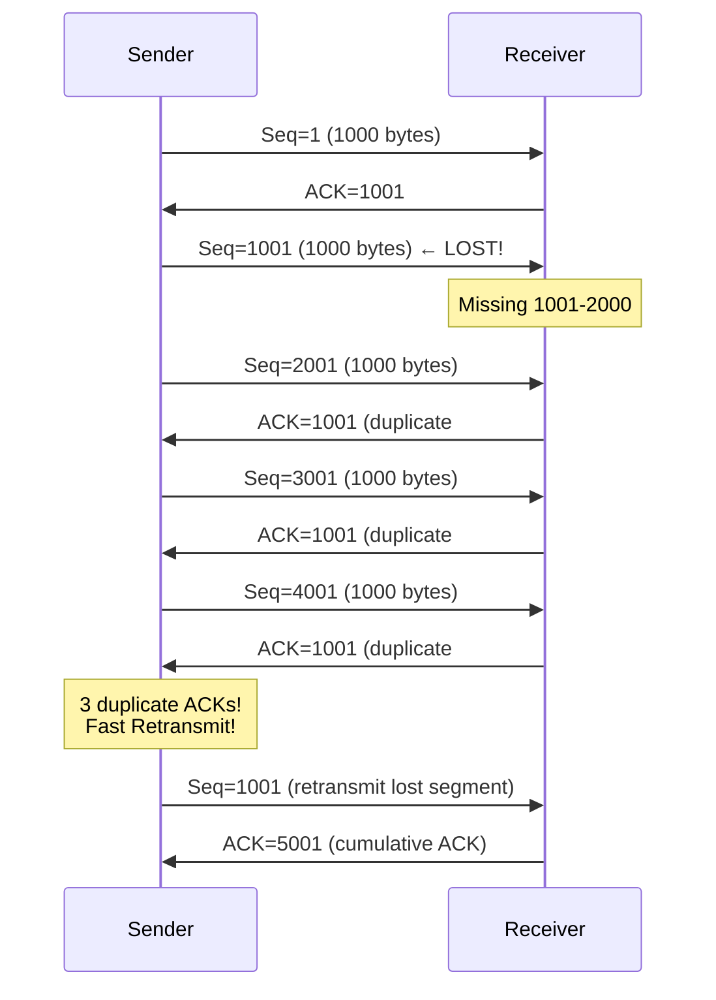
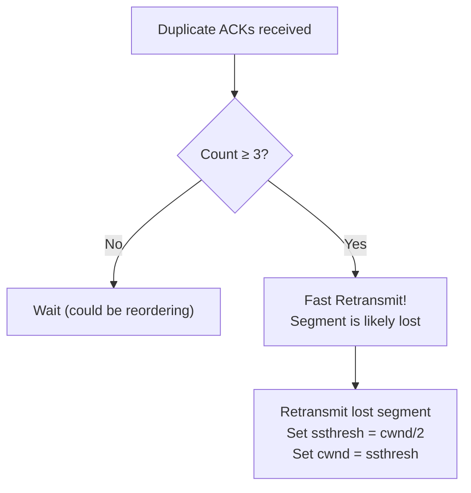
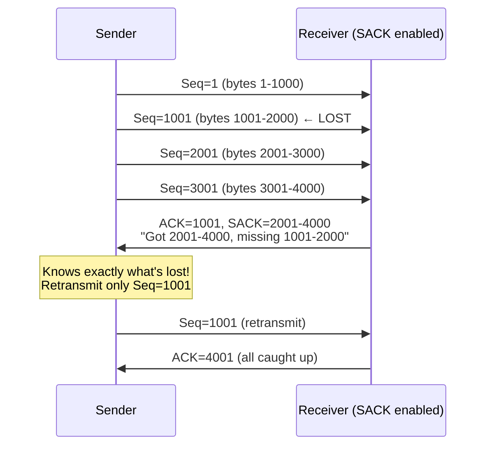

# TCP Fast Retransmit

> *"Fast retransmit detects packet loss without waiting for a timeout."*

## Overview

**Fast Retransmit** detects packet loss by counting **duplicate ACKs**. When the sender receives 3 duplicate ACKs (4 ACKs with the same sequence number), it infers the next segment was lost and retransmits immediately — without waiting for the retransmission timeout (RTO).

## How Fast Retransmit Works



## Duplicate ACK Counting

```
Normal ACK:  ACK advances (ack number increases)
Duplicate:   ACK repeats same ack number

Why receiver sends dupACKs:
1. Out-of-order segment arrives
2. Receiver buffers it, sends ACK for last in-order byte
3. Each subsequent out-of-order segment triggers another dupACK
```

## Why 3 Duplicate ACKs?



**Why 3?**
- 1 dupACK: Could be just reordering
- 2 dupACKs: Still might be reordering
- 3 dupACKs: Very likely loss (network rarely reorders > 2 positions)
- Threshold chosen empirically — balances responsiveness vs false positives

## Fast Retransmit vs Timeout

| Aspect | Fast Retransmit | Timeout |
|--------|----------------|---------|
| **Detection** | 3 dupACKs | RTO timer expires |
| **Speed** | ~1 RTT | RTO (typically 200ms+) |
| **cwnd impact** | cwnd = ssthresh (halved) | cwnd = 1 MSS |
| **Recovery** | Fast recovery | Slow start |
| **Efficiency** | High | Low (resets progress) |

## With SACK (Selective Acknowledgments)

SACK makes fast retransmit more efficient:



Without SACK, sender doesn't know which segments the receiver has — must infer from dupACKs.

## Interview Questions

### Beginner

**Q1: What is fast retransmit?**
Fast retransmit is a mechanism that detects packet loss without waiting for a timeout. When the sender receives 3 duplicate ACKs (same ACK number repeated 3 times), it assumes the next segment is lost and retransmits it immediately. This is much faster than waiting for the retransmission timeout.

**Q2: Why 3 duplicate ACKs and not 1?**
A single duplicate ACK could be caused by packet reordering (segments arriving out of order but not lost). Two might also be reordering. Three duplicate ACKs strongly indicates loss — the network rarely reorders packets by more than 2 positions. The threshold of 3 balances quick detection against false positives.

**Q3: What is the difference between fast retransmit and a timeout?**
Fast retransmit triggers after 3 dupACKs (~1 RTT later), reduces cwnd to ssthresh, and enters fast recovery. A timeout triggers after the RTO timer expires (hundreds of ms), resets cwnd to 1 MSS, and enters slow start. Fast retransmit is much faster and less disruptive.

### Intermediate

**Q4: How does SACK improve fast retransmit?**
Without SACK, the sender only knows the highest contiguous byte received (from cumulative ACK). With SACK, the receiver reports non-contiguous blocks of received data. The sender knows exactly which segments are missing and can retransmit only those, avoiding unnecessary retransmissions.

**Q5: What happens after fast retransmit?**
After fast retransmit, TCP enters **fast recovery** (in Reno/NewReno). The sender: (1) Sets ssthresh = cwnd/2, (2) Sets cwnd = ssthresh + 3 MSS (for the 3 dupACKs that triggered it), (3) Continues sending new data if window allows, (4) Exits fast recovery when new ACK arrives.

**Q6: Can fast retransmit trigger falsely?**
Yes — if there's significant packet reordering, the sender might receive 3 dupACKs even though no packet is lost. This triggers an unnecessary retransmit and cwnd reduction. SACK and DSACK (Duplicate SACK) help detect false retransmits.

### Advanced / FAANG-Level

**Q7: How does DSACK help detect false fast retransmits?**
DSACK (Duplicate SACK, RFC 2883) allows the receiver to report segments received more than once. If the sender retransmits a segment that wasn't actually lost, the receiver reports it via DSACK. The sender can then: (1) Detect the false retransmit, (2) Undo the cwnd reduction, (3) Adjust the dupACK threshold.

**Q8: Design a loss detection mechanism better than 3 dupACKs.**
Modern approaches:
1. **RACK (Recent ACKnowledgment)**: Uses time-based detection instead of counting dupACKs
2. **TLP (Tail Loss Probe)**: Send a probe after 2 RTTs without ACK (detects tail losses)
3. **Combined**: RACK + TLP handles most loss scenarios without waiting for timeout
4. **ECN**: Router marks packets before dropping (no loss needed for detection)

**Q9: How does QUIC's loss detection compare to TCP's fast retransmit?**
QUIC improvements:
1. **Per-packet number**: Each packet has a unique number (no byte-based ambiguity)
2. **Time-based detection**: Like RACK, uses time since sent, not dupACK count
3. **No retransmission ambiguity**: Retransmitted data gets new packet number
4. **ACK delay**: Receiver can delay ACKs to batch them (configurable)
5. **Result**: Faster, more accurate loss detection than TCP's 3-dupACK approach

## Common Mistakes

1. ❌ Confusing fast retransmit with fast recovery — retransmit detects loss, recovery handles the aftermath
2. ❌ Forgetting that fast retransmit reduces cwnd (unlike timeout which resets it)
3. ❌ Not enabling SACK — it significantly improves fast retransmit efficiency
4. ❌ Assuming 3 dupACKs always means loss — reordering can trigger false positives
5. ❌ Ignoring DSACK — it helps detect and correct false retransmits

## Summary

- Fast retransmit detects loss via **3 duplicate ACKs** (no timeout needed)
- **Much faster** than timeout: ~1 RTT vs hundreds of ms
- **cwnd impact**: Halved (vs reset to 1 on timeout)
- **SACK**: Provides exact information about received segments
- **Modern improvements**: RACK (time-based), TLP (tail loss probe), QUIC

## Cross-References

- [Fast Recovery](fast-recovery.md) — What happens after fast retransmit
- [TCP Reno](reno.md) — Classic algorithm using fast retransmit
- [TCP Options](options.md) — SACK option
- [Congestion Control](congestion-control.md) — Where fast retransmit fits
