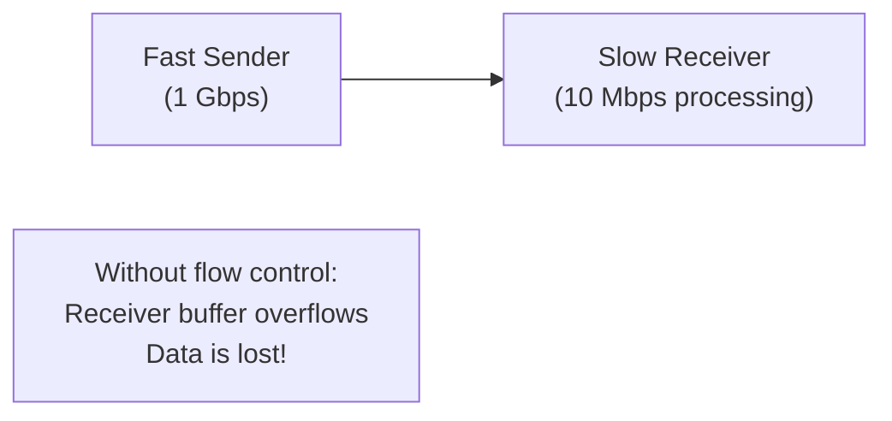
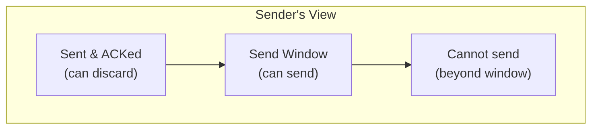
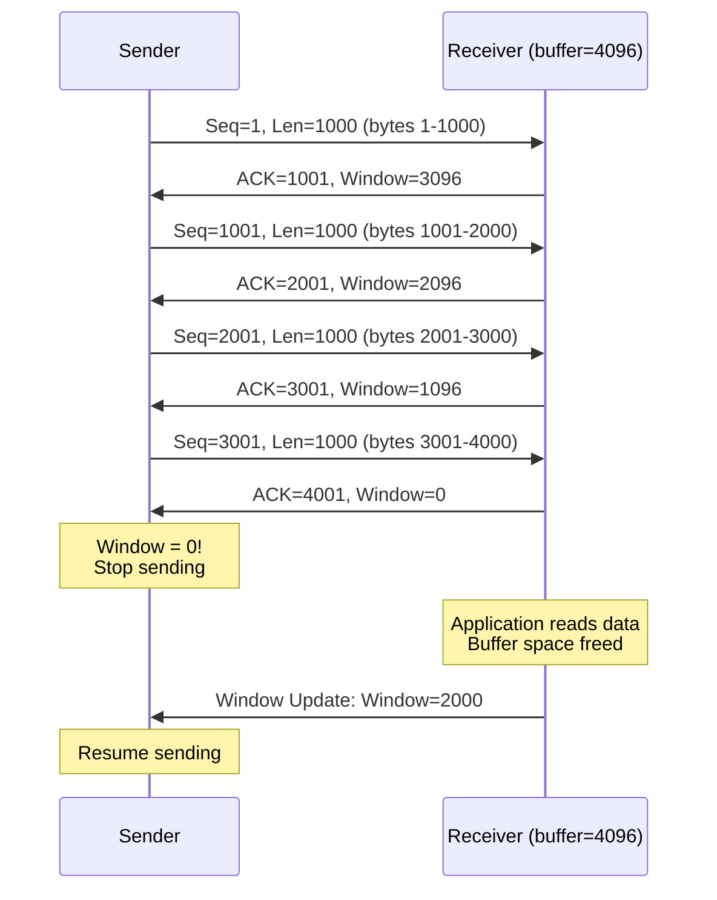
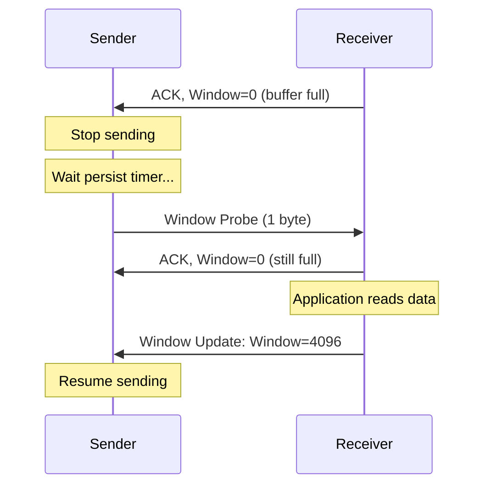
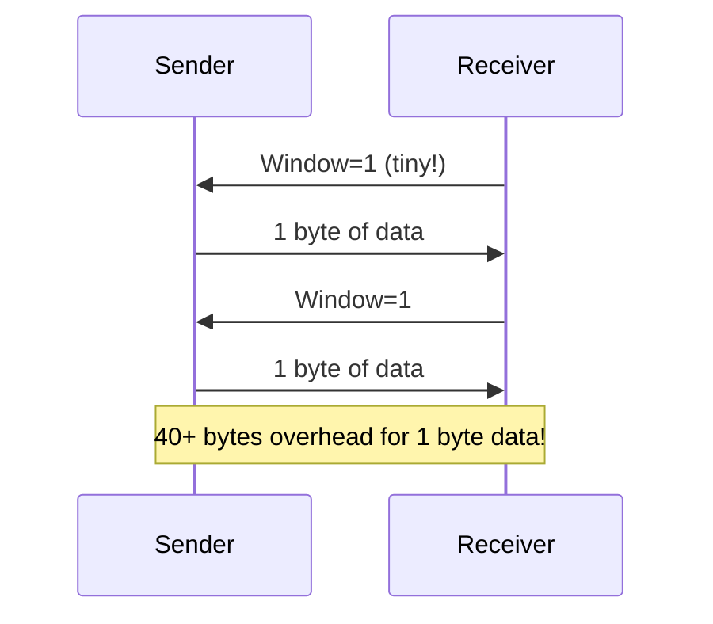

# TCP Flow Control

> *"Flow control ensures a fast sender doesn't overwhelm a slow receiver."*

## Overview

**Flow control** prevents the sender from transmitting data faster than the receiver can process it. TCP uses a **sliding window** mechanism where the receiver advertises how much buffer space it has available (receive window, rwnd).

## The Problem



## Sliding Window Mechanism



### Window Size

The sender maintains:
- **SND.UNA**: Oldest unacknowledged sequence number
- **SND.NXT**: Next sequence number to send
- **SND.WND**: Send window size (from receiver's rwnd)

```
Can send up to: SND.UNA + SND.WND - (SND.NXT - SND.UNA)
             = SND.UNA + SND.WND - bytes_in_flight
```

## Flow Control in Action



## Zero Window and Window Probes

When the receiver's window reaches 0:



**Window probes**: Sender periodically sends 1 byte to check if window has opened (prevents deadlock).

## Window Scaling

The 16-bit window field limits to 65,535 bytes. For high-BDP networks, this is insufficient.

**Window Scale Option** (RFC 7323):
```
Window Scale = 7 (negotiated during handshake)
Actual window = Window field × 2^7 = 65535 × 128 = 8,388,480 bytes (~8 MB)
```

### BDP (Bandwidth-Delay Product)

```
BDP = Bandwidth × RTT

Example:
  Bandwidth = 1 Gbps = 125 MB/s
  RTT = 100 ms = 0.1 s
  BDP = 125 × 0.1 = 12.5 MB

Window must be ≥ BDP to fully utilize the link
```

## Silly Window Syndrome (SWS)

**Problem**: Receiver advertises tiny windows, sender sends tiny segments — inefficient.



**Prevention**:
- **Receiver side (Clark's solution)**: Don't advertise tiny windows; wait until at least MSS or half-buffer is free
- **Sender side (Nagle's algorithm)**: Don't send tiny segments if unacknowledged data exists

## Interview Questions

### Beginner

**Q1: What is TCP flow control?**
Flow control prevents a fast sender from overwhelming a slow receiver. The receiver advertises a window size (rwnd) indicating how much data it can buffer. The sender limits unacknowledged data to rwnd. When the buffer fills, the receiver advertises window=0, and the sender stops until space is available.

**Q2: What happens when the receive window becomes zero?**
The sender stops sending data and starts a **persist timer**. When the timer fires, the sender sends a **window probe** (1 byte) to check if the window has opened. The receiver responds with its current window size. This prevents deadlock — without probes, the window update could be lost.

**Q3: What is the sliding window?**
The sliding window is a range of sequence numbers the sender can transmit without waiting for acknowledgment. The window "slides" forward as ACKs arrive. The window size = min(cwnd, rwnd) — the minimum of congestion window and receive window.

### Intermediate

**Q4: Explain the Bandwidth-Delay Product (BDP).**
BDP = Bandwidth × RTT. It represents the amount of data that can be "in flight" in the network. If the window is smaller than BDP, the sender can't keep the pipe full — it stops and waits for ACKs. For high-BDP networks (satellite, long-haul), window scaling is essential.

**Q5: What is Silly Window Syndrome?**
SWS occurs when the receiver advertises small windows and the sender sends small segments. This wastes bandwidth on headers (40 bytes TCP+IP for 1 byte data). Prevention: (1) Receiver: Don't advertise windows smaller than MSS, (2) Sender (Nagle): Don't send small segments if data is outstanding.

**Q6: How does flow control interact with congestion control?**
Both limit the sender's window: `effective_window = min(rwnd, cwnd)`. Flow control (rwnd) prevents receiver overflow; congestion control (cwnd) prevents network overflow. The smaller of the two determines how much data the sender can have in flight.

### Advanced / FAANG-Level

**Q7: Design a system to maximize TCP throughput on a 10 Gbps link with 50ms RTT.**
BDP = 10 Gbps × 50ms = 62.5 MB. Requirements:
1. **Window scaling**: Enable, scale factor ≥ 14 (2^14 = 16384)
2. **Socket buffers**: Set SO_RCVBUF and SO_SNDBUF to ≥ 125 MB (2× BDP)
3. **Congestion control**: BBR (optimized for high-BDP) or CUBIC
4. **SACK**: Enable for efficient loss recovery
5. **MTU**: Jumbo frames (9000 bytes) reduce header overhead
6. **NIC offload**: TSO, GRO, LRO offload to hardware
7. **CPU affinity**: Pin interrupts to specific cores
8. **Application**: Large write() calls, avoid small writes

**Q8: How does TCP handle the case where the window update is lost?**
If the receiver's window update (advertising larger window) is lost:
1. Sender is stuck with window=0 (stopped sending)
2. Persist timer fires, sender sends window probe
3. Receiver responds with current window size
4. If probe response is also lost, timer fires again (exponential backoff)
5. Eventually, the update gets through
This prevents deadlock but adds latency.

**Q9: Explain how auto-tuning works for TCP receive buffers in Linux.**
Linux auto-tuning (`net.ipv4.tcp_moderate_rcvbuf`):
1. Starts with a small buffer
2. Dynamically grows based on observed throughput and RTT
3. Target: buffer ≥ BDP (bandwidth × RTT)
4. Maximum: `net.core.rmem_max` (typically 212992 bytes, can be increased)
5. Application can hint with SO_RCVBUF (disables auto-tuning) or leave unset (auto-tuning active)
6. Best practice: Let auto-tuning work; set `rmem_max` high enough

## Common Mistakes

1. ❌ Forgetting to enable window scaling — limits throughput on high-BDP networks
2. ❌ Setting SO_RCVBUF too small — bottlenecks throughput
3. ❌ Confusing flow control with congestion control — different mechanisms, different purposes
4. ❌ Not handling zero window — can cause deadlock without persist timer
5. ❌ Disabling auto-tuning without good reason — usually makes things worse

## Summary

- Flow control prevents **receiver overflow** using the **sliding window** mechanism
- Receiver advertises **rwnd** (receive window) in each ACK
- **Zero window**: Sender stops, sends **window probes** periodically
- **Window scaling**: Allows windows > 65,535 bytes (essential for high-BDP)
- **BDP**: Bandwidth × RTT — window must be ≥ BDP for full utilization
- **Silly Window Syndrome**: Tiny windows/segments; prevented by Clark's solution and Nagle's algorithm

## Cross-References

- [Congestion Control](congestion-control.md) — Preventing network overload
- [TCP Header](header.md) — Window field
- [Nagle's Algorithm](nagle.md) — Sender-side SWS prevention
- [TCP Options](options.md) — Window Scale option

## Cross References

- [Congestion Control](congestion-control.md)
- [TCP Header](header.md)
- [Sliding Window](../../arch/pipelining/classic.md)
