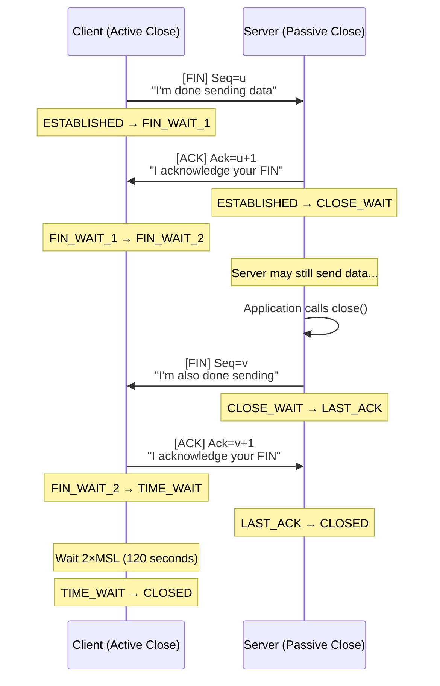
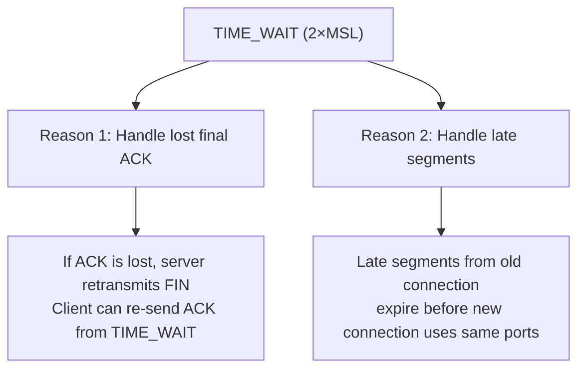
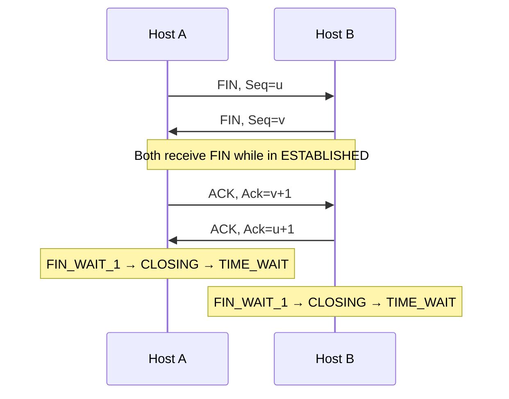
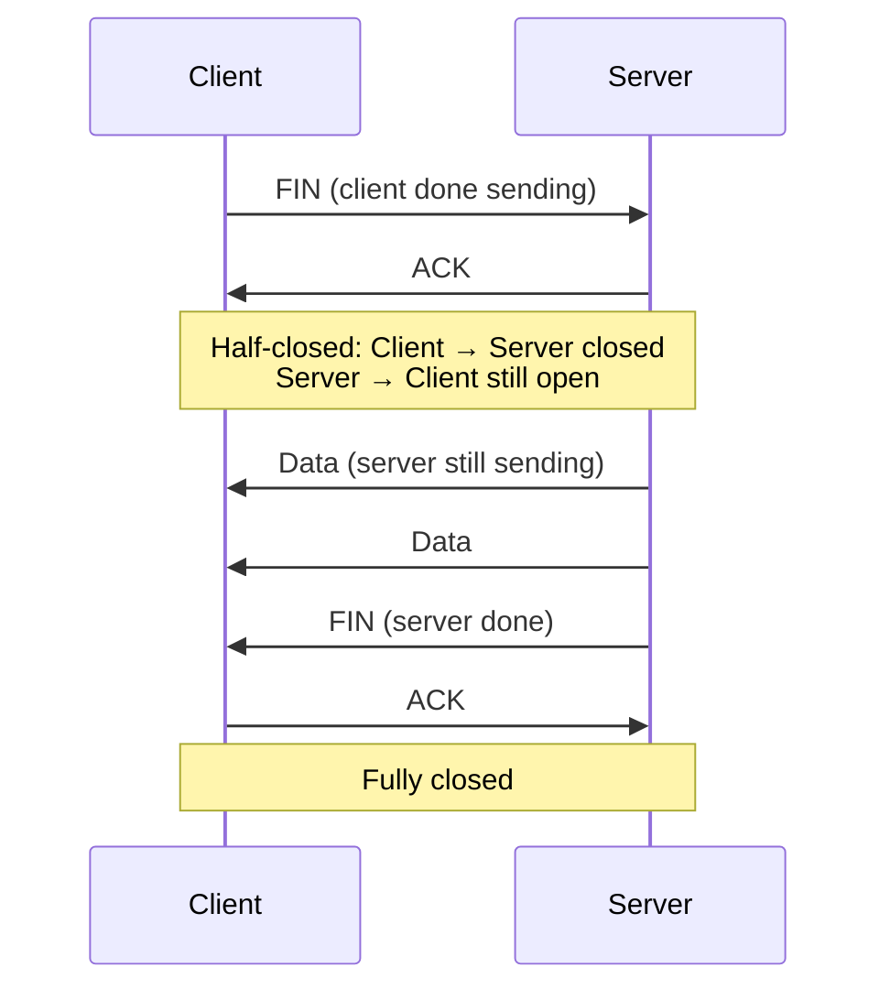
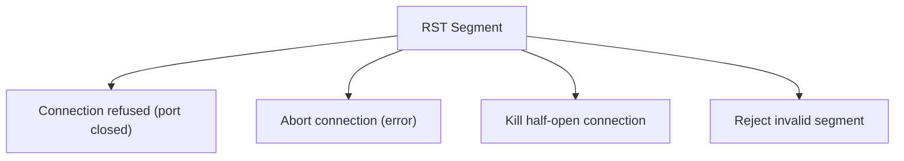

# TCP Four-Way Teardown

> *"Closing a TCP connection is a polite conversation — each side says goodbye separately."*

## Overview

The **Four-Way Teardown** gracefully terminates a TCP connection. Since TCP is full-duplex, each direction must be closed independently. Each side sends a FIN (Finish) segment and waits for an ACK.

## The Teardown Process



## Step-by-Step Breakdown

### Step 1: FIN (Client → Server)

```
Client → Server:
  Flags:     FIN + ACK
  Seq:       u (last byte sent + 1)
  State:     Client: ESTABLISHED → FIN_WAIT_1
```

- Client indicates it has no more data to send
- FIN consumes one sequence number
- Client can still receive data from server

### Step 2: ACK (Server → Client)

```
Server → Client:
  Flags:     ACK
  Ack:       u + 1
  State:     Server: ESTABLISHED → CLOSE_WAIT
  State:     Client: FIN_WAIT_1 → FIN_WAIT_2
```

- Server acknowledges client's FIN
- Server may continue sending data (CLOSE_WAIT allows this)
- Client waits for server's FIN (FIN_WAIT_2)

### Step 3: FIN (Server → Client)

```
Server → Client:
  Flags:     FIN + ACK
  Seq:       v
  State:     Server: CLOSE_WAIT → LAST_ACK
```

- Server is done sending data
- May happen immediately or after sending more data

### Step 4: ACK (Client → Server)

```
Client → Server:
  Flags:     ACK
  Ack:       v + 1
  State:     Client: FIN_WAIT_2 → TIME_WAIT
  State:     Server: LAST_ACK → CLOSED
```

- Client acknowledges server's FIN
- Client enters TIME_WAIT (2×MSL)
- Server transitions to CLOSED immediately

## TIME_WAIT State

### Why TIME_WAIT Exists



**MSL** (Maximum Segment Lifetime): Maximum time a segment can exist in the network (typically 30-60 seconds). TIME_WAIT = 2×MSL = 60-120 seconds.

### TIME_WAIT Problems and Solutions

| Problem | Solution |
|---------|----------|
| Port exhaustion | SO_REUSEADDR, SO_REUSEPORT |
| Server restart fails | SO_REUSEADDR (bind to TIME_WAIT address) |
| High connection rate | Connection pooling, load balancing |
| Memory usage | TIME_WAIT is minimal (~300 bytes per connection) |

### SO_REUSEADDR

```python
# Allow binding to address in TIME_WAIT
sock.setsockopt(socket.SOL_SOCKET, socket.SO_REUSEADDR, 1)
```

## Simultaneous Close

When both sides call close() at the same time:



## Half-Close

TCP allows closing one direction while keeping the other open:



## RST (Reset) — Abrupt Close



RST is sent when:
- Data arrives for a non-existent connection
- Application calls `close()` with data in receive buffer (SO_LINGER)
- Host receives unexpected segment (e.g., ACK for non-existent connection)

## Interview Questions

### Beginner

**Q1: Why does TCP use a 4-way teardown instead of 3-way?**
TCP is full-duplex — data flows in both directions independently. Each side must close its send direction separately. The 4-way teardown allows: (1) Client to say "I'm done sending" (FIN), (2) Server to acknowledge, (3) Server to finish sending its data, (4) Server to say "I'm also done" (FIN), (5) Client to acknowledge. The server might have more data to send after the client's FIN.

**Q2: What is TIME_WAIT and why does it exist?**
TIME_WAIT is a state the client enters after sending the final ACK. It lasts 2×MSL (typically 60-120 seconds). Reasons: (1) If the final ACK is lost, the server retransmits FIN — the client must be around to re-ACK. (2) Late segments from the old connection must expire before a new connection reuses the same ports.

**Q3: What is the difference between FIN and RST?**
- **FIN**: Graceful close — "I'm done sending, but I can still receive." Used in normal shutdown.
- **RST**: Abrupt close — "Something is wrong, terminate immediately." Used for errors, connection refused, or forced abort.

### Intermediate

**Q4: What happens if the final ACK is lost?**
If the client's final ACK (Step 4) is lost:
- Server retransmits FIN (it's in LAST_ACK, waiting for ACK)
- Client (in TIME_WAIT) receives retransmitted FIN, re-sends ACK
- This is why TIME_WAIT exists — to handle this exact scenario
- Without TIME_WAIT, the client would be gone, and the server would be stuck in LAST_ACK

**Q5: Explain simultaneous close.**
When both sides send FIN simultaneously: both transition from ESTABLISHED to FIN_WAIT_1, receive each other's FIN, send ACK, and move to CLOSING, then TIME_WAIT. It's rare in practice but supported by TCP.

**Q6: How do you handle TIME_WAIT in high-connection-rate servers?**
Strategies: (1) SO_REUSEADDR: Allow binding to TIME_WAIT addresses, (2) SO_REUSEPORT: Multiple sockets on same port, (3) Connection pooling: Reuse connections, (4) Load balancing: Distribute across multiple IPs/ports, (5) Reduce MSL: sysctl tuning (use with caution), (6) HTTP keep-alive: Reuse TCP connections for multiple requests.

### Advanced / FAANG-Level

**Q7: Design a server handling 100,000 concurrent connections. How do you manage TIME_WAIT?**
Architecture:
1. **Connection pooling**: Reuse connections via HTTP keep-alive
2. **SO_REUSEADDR + SO_REUSEPORT**: Enable on all sockets
3. **Multiple IPs**: Bind to multiple IPs, multiply port range
4. **Short-lived connections**: Proxy connections (close backend quickly)
5. **Linux tuning**: `net.ipv4.tcp_tw_reuse=1`, reduce `tcp_fin_timeout`
6. **Avoid client-side TIME_WAIT**: Use keep-alive, connection pooling
7. **Monitoring**: Track TIME_WAIT count, port exhaustion

**Q8: What is tcp_tw_reuse and is it safe?**
`tcp_tw_reuse` allows reusing TIME_WAIT sockets for new **outbound** connections (Linux only). It uses timestamps (PAWS) to ensure late segments from old connections are rejected. Safe when: (1) Timestamps are enabled, (2) Only used for outbound connections (not inbound). Not safe: If timestamps are off, or if you need to accept connections on the same port.

**Q9: Explain the FIN_WAIT_2 state and how to handle stuck connections.**
FIN_WAIT_2: Client sent FIN, received ACK, waiting for server's FIN. If the server crashes or doesn't close, client stays in FIN_WAIT_2 indefinitely.

Solutions:
- `tcp_fin_timeout` (Linux): Timeout for FIN_WAIT_2 (default 60s)
- SO_LINGER: Application-level timeout for close()
- Keep-alive: Detect dead peers
- Application design: Don't hold connections open unnecessarily

## Common Mistakes

1. ❌ Forgetting that FIN consumes one sequence number
2. ❌ Confusing CLOSE_WAIT with TIME_WAIT — CLOSE_WAIT means the application hasn't called close()
3. ❌ Thinking TIME_WAIT is a bug — it's a feature for reliability
4. ❌ Using SO_REUSEADDR blindly — understand the security implications
5. ❌ Not handling RST properly — RST is normal for error conditions

## Summary

- 4-way teardown: **FIN → ACK → FIN → ACK** — each direction closed independently
- **TIME_WAIT** (2×MSL): Ensures reliable teardown, handles lost ACKs and late segments
- **Half-close**: One direction can close while other remains open
- **RST**: Abrupt connection termination for errors
- **Simultaneous close**: Both sides send FIN at the same time (rare but supported)

## Cross-References

- [Three-Way Handshake](three-way.md) — How connections start
- [TCP States](states.md) — Full state machine
- [TCP Timers](timers.md) — MSL, TIME_WAIT timers
- [TCP Header](header.md) — FIN and RST flags

## Cross References

- [Three-Way Handshake](three-way.md)
- [TCP States](states.md)
- [TCP Keepalive](keepalive.md)
