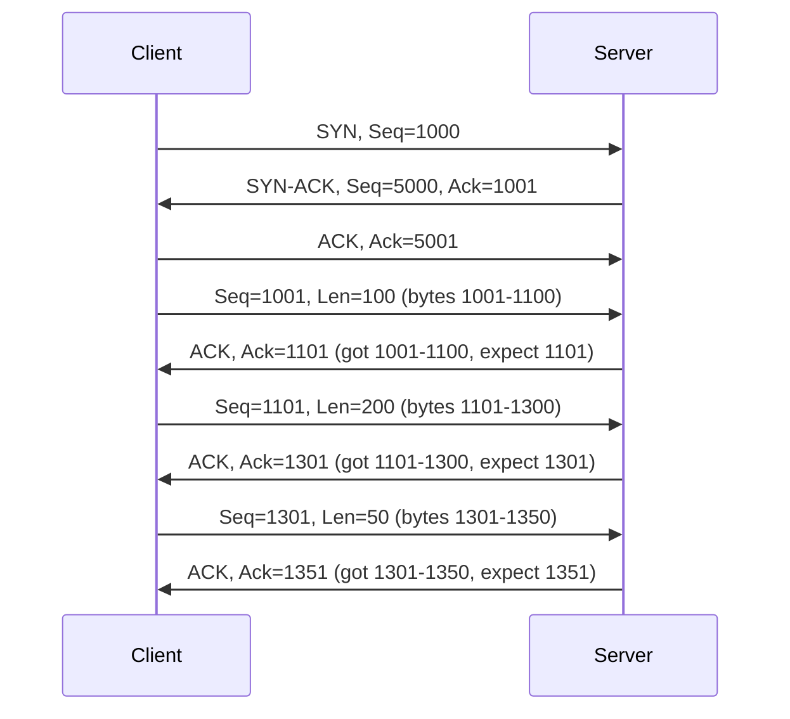

# TCP Header

> *"Every TCP segment carries a 20-60 byte header — it's the control information that makes reliability possible."*

## TCP Header Structure

```
 0                   1                   2                   3
 0 1 2 3 4 5 6 7 8 9 0 1 2 3 4 5 6 7 8 9 0 1 2 3 4 5 6 7 8 9 0 1
+-+-+-+-+-+-+-+-+-+-+-+-+-+-+-+-+-+-+-+-+-+-+-+-+-+-+-+-+-+-+-+-+
|          Source Port (16)     |       Destination Port (16)   |
+-+-+-+-+-+-+-+-+-+-+-+-+-+-+-+-+-+-+-+-+-+-+-+-+-+-+-+-+-+-+-+-+
|                        Sequence Number (32)                   |
+-+-+-+-+-+-+-+-+-+-+-+-+-+-+-+-+-+-+-+-+-+-+-+-+-+-+-+-+-+-+-+-+
|                    Acknowledgment Number (32)                 |
+-+-+-+-+-+-+-+-+-+-+-+-+-+-+-+-+-+-+-+-+-+-+-+-+-+-+-+-+-+-+-+-+
|  Data |           |U|A|P|R|S|F|                               |
| Offset| Reserved  |R|C|S|S|Y|I|            Window (16)        |
|  (4)  |    (3)    |G|K|H|T|N|N|                               |
+-+-+-+-+-+-+-+-+-+-+-+-+-+-+-+-+-+-+-+-+-+-+-+-+-+-+-+-+-+-+-+-+
|           Checksum (16)       |         Urgent Pointer (16)   |
+-+-+-+-+-+-+-+-+-+-+-+-+-+-+-+-+-+-+-+-+-+-+-+-+-+-+-+-+-+-+-+-+
|                    Options (variable, 0-40 bytes)             |
+-+-+-+-+-+-+-+-+-+-+-+-+-+-+-+-+-+-+-+-+-+-+-+-+-+-+-+-+-+-+-+-+
```

## Header Fields Explained

### Core Fields

| Field | Bits | Description |
|-------|------|-------------|
| **Source Port** | 16 | Sender's port number (ephemeral: 49152-65535) |
| **Destination Port** | 16 | Receiver's port number (well-known: 80, 443, etc.) |
| **Sequence Number** | 32 | Byte offset of first byte in this segment |
| **Acknowledgment Number** | 32 | Next byte expected from the other side |
| **Data Offset** | 4 | Header length in 32-bit words (5 = 20 bytes, max 15 = 60 bytes) |
| **Reserved** | 3 | Must be zero |
| **Flags** | 9 | Control bits (see below) |
| **Window** | 16 | Receiver window size (flow control) |
| **Checksum** | 16 | Error detection (covers header + data + pseudo-header) |
| **Urgent Pointer** | 16 | Offset to urgent data (if URG flag set) |
| **Options** | Variable | MSS, Window Scale, SACK, Timestamps, etc. |

### TCP Flags

```
|N|C|E|U|A|P|R|S|F|
|S|W|C|R|C|S|S|Y|I|
| |R|E|G|K|H|T|N|N|
```

| Flag | Bit | Name | Purpose |
|------|-----|------|---------|
| **NS** | 8 | ECN Nonce | ECN Nonce sum (RFC 3540) |
| **CWR** | 7 | Congestion Window Reduced | ECN: Sender reduced cwnd |
| **ECE** | 6 | ECN Echo | ECN: Congestion experienced |
| **URG** | 5 | Urgent | Urgent pointer field is valid |
| **ACK** | 4 | Acknowledgment | Acknowledgment number is valid |
| **PSH** | 3 | Push | Deliver data to application immediately |
| **RST** | 2 | Reset | Abort connection |
| **SYN** | 1 | Synchronize | Connection establishment |
| **FIN** | 0 | Finish | Connection termination |

### Common Flag Combinations

| Flags | Segment Type | Purpose |
|-------|-------------|---------|
| SYN | SYN | Connection request |
| SYN+ACK | SYN-ACK | Connection acceptance |
| ACK | ACK | Acknowledgment |
| FIN+ACK | FIN | Graceful close |
| RST | RST | Abrupt connection reset |
| PSH+ACK | Data | Push data to application |
| FIN+ACK+PSH | FIN with data | Close with final data |

## Sequence and Acknowledgment Numbers

### Byte-Based Counting

TCP counts **bytes**, not segments:



**Key rules**:
- **Sequence number**: First byte's offset in the byte stream
- **ACK number**: Next expected byte (= received bytes + 1)
- **SYN**: Consumes one sequence number
- **FIN**: Consumes one sequence number

## Checksum Calculation

TCP checksum covers:
1. **TCP header** (including options)
2. **TCP payload** (data)
3. **Pseudo-header** (IP src, IP dst, protocol, TCP length)

```
Pseudo-header:
+-+-+-+-+-+-+-+-+-+-+-+-+-+-+-+-+-+-+-+-+-+-+-+-+-+-+-+-+-+-+-+-+
|                       Source IP Address                       |
+-+-+-+-+-+-+-+-+-+-+-+-+-+-+-+-+-+-+-+-+-+-+-+-+-+-+-+-+-+-+-+-+
|                    Destination IP Address                     |
+-+-+-+-+-+-+-+-+-+-+-+-+-+-+-+-+-+-+-+-+-+-+-+-+-+-+-+-+-+-+-+-+
|     Zero      |   Protocol    |         TCP Length            |
+-+-+-+-+-+-+-+-+-+-+-+-+-+-+-+-+-+-+-+-+-+-+-+-+-+-+-+-+-+-+-+-+
```

## Window Size

The 16-bit window field limits to 65,535 bytes — too small for modern networks.

**Window Scale Option** (RFC 7323):
- Shifts window field left by 0-14 bits
- Maximum window: 65,535 × 2^14 = ~1 GB
- Negotiated during 3-way handshake
- Essential for high-BDP networks

## Interview Questions

### Beginner

**Q1: What is the minimum TCP header size?**
20 bytes (5 × 32-bit words). This is the header with no options. The maximum is 60 bytes (15 × 32-bit words) when all options are present. The Data Offset field indicates the header length.

**Q2: What are the SYN and ACK flags used for?**
- **SYN** (Synchronize): Used during connection establishment to synchronize sequence numbers. Sent in the first two segments of the 3-way handshake.
- **ACK** (Acknowledgment): Indicates the acknowledgment number field is valid. Set in all segments after the initial SYN.

**Q3: What is the sequence number for?**
The sequence number identifies the position of the first byte of data in this segment within the overall byte stream. It allows TCP to: (1) reorder out-of-order segments, (2) detect duplicate segments, (3) acknowledge received data correctly.

### Intermediate

**Q4: Why does TCP count bytes instead of segments?**
Byte counting provides finer granularity. If a 1000-byte segment is lost, the receiver can precisely indicate which bytes are missing. Segment counting would only say "segment X is missing" without specifying how much data. Byte counting also handles variable-size segments naturally.

**Q5: Explain the TCP pseudo-header and why it's needed.**
The pseudo-header includes IP-layer information (source/dest IP, protocol, TCP length) in the checksum calculation. This provides an additional integrity check — if IP addresses are corrupted, TCP will detect it. The pseudo-header is not actually transmitted; it's computed locally at both ends.

**Q6: What is the purpose of the PSH flag?**
PSH (Push) tells the receiver to deliver the data to the application immediately rather than buffering it. Without PSH, TCP might wait for more data or the buffer to fill before passing data up. PSH is commonly set on the last segment of a request or response.

### Advanced / FAANG-Level

**Q7: How does TCP handle sequence number wraparound?**
TCP sequence numbers are 32 bits (max ~4.3 billion). At high speeds (10 Gbps), this wraps around in ~3.4 seconds. Solutions:
- **PAWS (Protection Against Wrapped Sequences)**: Uses TCP timestamps to distinguish old from new segments
- **Timestamps**: 32-bit timestamp values provide additional temporal ordering
- Without PAWS/timestamps, old segments could be mistaken for new ones after wraparound

**Q8: Explain the URG pointer and why it's rarely used.**
The URG flag + Urgent Pointer indicate urgent data within the segment. The pointer marks the last byte of urgent data. Applications can process urgent data out-of-band. In practice: (1) Urgent mode is poorly implemented across OSes, (2) Different interpretations exist (BSD vs RFC), (3) SSH uses TCP urgent for channel breaks, (4) Most applications ignore it. Better alternative: separate control channel.

**Q9: Design a TCP header parser that handles all options.**
```python
def parse_tcp_header(data):
    src_port = struct.unpack('!H', data[0:2])[0]
    dst_port = struct.unpack('!H', data[2:4])[0]
    seq_num = struct.unpack('!I', data[4:8])[0]
    ack_num = struct.unpack('!I', data[8:12])[0]
    offset = (data[12] >> 4) * 4  # Data offset in bytes
    flags = data[13] | ((data[12] & 0x01) << 8)  # 9-bit flags
    window = struct.unpack('!H', data[14:16])[0]
    checksum = struct.unpack('!H', data[16:18])[0]
    urgent = struct.unpack('!H', data[18:20])[0]
    
    # Parse options if header > 20 bytes
    options = {}
    if offset > 20:
        options = parse_tcp_options(data[20:offset])
    
    payload = data[offset:]
    return { ... }
```

## Common Mistakes

1. ❌ Confusing sequence number with segment number — TCP counts bytes, not segments
2. ❌ Forgetting SYN and FIN consume one sequence number each
3. ❌ Thinking the window field is always the flow control window — it's scaled by Window Scale option
4. ❌ Ignoring the pseudo-header in checksum calculation
5. ❌ Assuming RST gracefully closes connections — it's an abrupt abort

## Summary

- TCP header is **20-60 bytes** with core fields: ports, seq/ack numbers, flags, window, checksum
- **Flags**: SYN, ACK, FIN, RST, PSH, URG, ECE, CWR
- **Sequence numbers**: Byte-based, not segment-based
- **Acknowledgment number**: Next expected byte
- **Window**: Flow control, scaled by Window Scale option
- **Checksum**: Covers header + data + pseudo-header

## Cross-References

- [Three-Way Handshake](three-way.md) — SYN flags in action
- [Four-Way Teardown](four-way.md) — FIN flags in action
- [Flow Control](flow-control.md) — Window field usage
- [TCP Options](options.md) — MSS, Window Scale, SACK, Timestamps

## Cross References

- [TCP Options](options.md)
- [Three-Way Handshake](three-way.md)
- [Flow Control](flow-control.md)
- [UDP Header](../udp/header.md)
