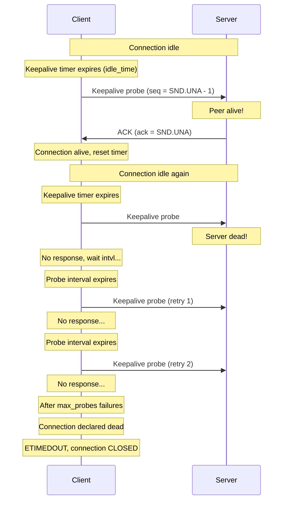
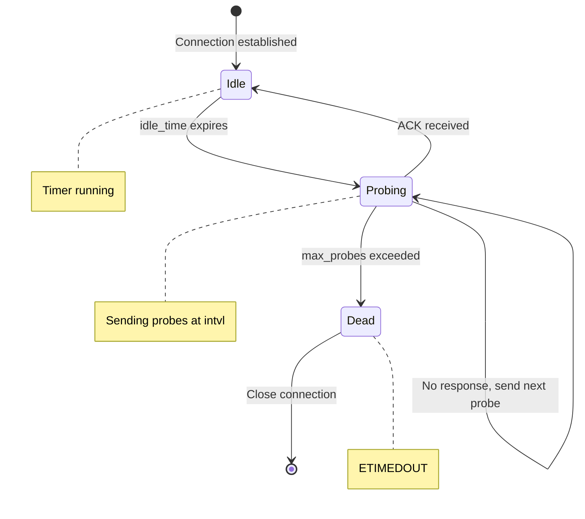
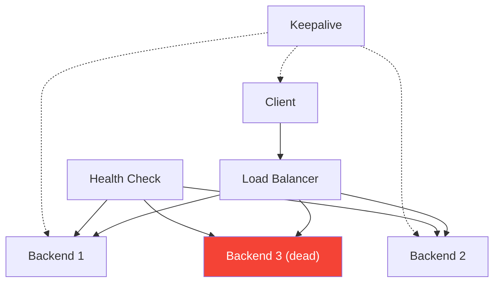

# TCP Keepalive

## Overview

TCP Keepalive is a mechanism to detect whether an idle TCP connection is still alive. Without keepalive, a TCP connection can remain in the ESTABLISHED state indefinitely — even if the remote host has crashed, the network has failed, or the peer application has exited without closing the socket properly.

Keepalive works by sending periodic probe segments when a connection has been idle for a configurable period. If the peer responds, the connection is confirmed alive. If no response comes after several retries, the connection is declared dead and closed.

## Detailed Explanation

### Why Keepalive is Needed

**The Problem: Half-Open Connections**

```mermaid
sequenceDiagram
    participant C as Client
    participant S as Server
    
    C->>S: Data exchange...
    Note over C,S: Connection ESTABLISHED
    
    Note over S: Server crashes (power failure, kernel panic)
    Note over C: Client doesn't know!
    
    Note over C: Client sends data
    C->>S: Data segment
    Note over C: No ACK (server is dead)
    C->>S: Retransmit 1
    C->>S: Retransmit 2
    ...
    C->>S: Retransmit 15
    Note over C: ETIMEDOUT after ~13-30 minutes!
    
    Note over C: Client resources wasted for minutes
```

**Scenarios where keepalive helps:**
1. Server crashes without closing connections
2. Network partition (firewall drops connection silently)
3. NAT timeout (middlebox drops mapping)
4. Client application crash (OS doesn't close socket)
5. Load balancer removes backend without notifying clients

### Keepalive Probe Mechanism



### Keepalive Segment Format

Keepalive probes are special segments:
```
Sequence number = SND.UNA - 1 (one byte below expected ACK)
Payload = empty (0 bytes)
ACK flag = set

The seq = SND.UNA - 1 is "old" data
Receiver must ACK it (proving it's alive)
But won't deliver it to application (it's below expected)
```

### Linux Keepalive Configuration

**Three Parameters:**

| Parameter | sysctl | Default | Description |
|-----------|--------|---------|-------------|
| **tcp_keepalive_time** | net.ipv4.tcp_keepalive_time | 7200s (2h) | Idle time before first probe |
| **tcp_keepalive_intvl** | net.ipv4.tcp_keepalive_intvl | 75s | Interval between probes |
| **tcp_keepalive_probes** | net.ipv4.tcp_keepalive_probes | 9 | Max probes before giving up |

**Total Detection Time:**
```
Total = tcp_keepalive_time + (tcp_keepalive_intvl × tcp_keepalive_probes)
Total = 7200 + (75 × 9)
Total = 7200 + 675
Total = 7875 seconds ≈ 2 hours 11 minutes
```

**Tuning for Faster Detection:**
```bash
# Start probing after 60 seconds idle
sysctl -w net.ipv4.tcp_keepalive_time=60

# Probe every 10 seconds
sysctl -w net.ipv4.tcp_keepalive_intvl=10

# Give up after 5 probes
sysctl -w net.ipv4.tcp_keepalive_probes=5

# Total detection time: 60 + (10 × 5) = 110 seconds
```

### Per-Socket Configuration

```c
#include <netinet/tcp.h>
#include <sys/socket.h>

int fd = socket(AF_INET, SOCK_STREAM, 0);

// Enable keepalive
int yes = 1;
setsockopt(fd, SOL_SOCKET, SO_KEEPALIVE, &yes, sizeof(yes));

// Linux-specific: override global defaults
int idle = 60;   // Start after 60s idle
int intvl = 10;  // Probe every 10s
int cnt = 5;     // Give up after 5 probes

setsockopt(fd, IPPROTO_TCP, TCP_KEEPIDLE, &idle, sizeof(idle));
setsockopt(fd, IPPROTO_TCP, TCP_KEEPINTVL, &intvl, sizeof(intvl));
setsockopt(fd, IPPROTO_TCP, TCP_KEEPCNT, &cnt, sizeof(cnt));
```

### Keepalive State Tracking



### Keepalive in Different TCP States

| State | Keepalive Active? | Notes |
|-------|-------------------|-------|
| **CLOSED** | No | No connection |
| **LISTEN** | No | Server socket, not connected |
| **SYN_SENT** | No | Still establishing |
| **SYN_RECEIVED** | No | Still establishing |
| **ESTABLISHED** | Yes | Active connection |
| **FIN_WAIT_1** | No | Closing |
| **FIN_WAIT_2** | No | Closing |
| **CLOSE_WAIT** | No | Peer closed |
| **CLOSING** | No | Both closing |
| **LAST_ACK** | No | Closing |
| **TIME_WAIT** | No | Cleanup phase |

Keepalive only operates in ESTABLISHED state.

### Keepalive vs Application Heartbeat

**TCP Keepalive:**
```
Pros:
- Transparent to application (OS handles it)
- Works with any TCP application
- No application code changes needed
- Standard mechanism (RFC 1122)

Cons:
- Coarse granularity (default 2 hours)
- Can't carry application data
- May be filtered by middleboxes
- Only detects connectivity, not application health
```

**Application Heartbeat:**
```
Pros:
- Fine granularity (any interval)
- Can carry health/status data
- Application-level health checking
- Works through any middleware

Cons:
- Requires application code
- More complex implementation
- Uses application bandwidth
- Non-standard
```

**Recommendation:** Use application heartbeats for:
- Sub-minute detection
- Application health checking
- Business logic integration

Use TCP Keepalive for:
- Basic dead-peer detection
- Legacy applications
- When you can't modify application code

### Keepalive and NAT/Firewalls

**Problem: NAT Timeout**
```
NAT devices maintain connection mappings with timeouts
Typical NAT timeout: 300-600 seconds (5-10 minutes)
TCP keepalive default: 7200 seconds (2 hours)

If idle > NAT timeout:
  NAT drops mapping
  Keepalive probe reaches NAT, not peer
  Connection appears dead (even if peer is alive)
```

**Solution: Keepalive interval < NAT timeout**
```bash
# If NAT timeout is 300 seconds:
sysctl -w net.ipv4.tcp_keepalive_time=240  # Start before NAT timeout
sysctl -w net.ipv4.tcp_keepalive_intvl=30  # Probe every 30s
sysctl -w net.ipv4.tcp_keepalive_probes=3  # 3 retries

# Total: 240 + 30 × 3 = 330 seconds
# Keeps NAT mapping alive
```

### Keepalive in Load Balancers



Load balancers use their own health checks (HTTP, TCP, custom) rather than relying on TCP keepalive. Keepalive is for end-to-end connection liveness, not infrastructure health checking.

### Keepalive Implementation (Pseudocode)

```python
class TCPKeepalive:
    def __init__(self, idle_time=7200, interval=75, max_probes=9):
        self.idle_time = idle_time
        self.interval = interval
        self.max_probes = max_probes
        self.idle_timer = None
        self.probe_count = 0
        self.last_activity = time.now()
    
    def on_data_sent_or_received(self):
        """Reset idle timer on any activity"""
        self.last_activity = time.now()
        self.probe_count = 0
        self.idle_timer = restart_timer(self.idle_time)
    
    def on_idle_timer_expired(self):
        """Connection has been idle for idle_time"""
        self.send_keepalive_probe()
        self.probe_count = 1
        self.probe_timer = start_timer(self.interval)
    
    def on_probe_timer_expired(self):
        """Time to send another probe"""
        if self.probe_count < self.max_probes:
            self.send_keepalive_probe()
            self.probe_count += 1
            self.probe_timer = restart_timer(self.interval)
        else:
            # Max probes exceeded, connection dead
            self.report_error(ETIMEDOUT)
            self.close_connection()
    
    def on_ack_received(self):
        """Peer responded to keepalive"""
        self.probe_count = 0
        self.probe_timer = cancel_timer()
        self.idle_timer = restart_timer(self.idle_time)
    
    def send_keepalive_probe(self):
        """Send probe with seq = SND.UNA - 1"""
        segment = TCP_segment(
            seq=self.SND_UNA - 1,
            ack=self.RCV_NXT,
            flags=ACK
        )
        send(segment)
```

## Example: Debugging Keepalive Issues

### Connection Seems Dead But ESTABLISHED

```bash
# Check connection state
$ ss -tnp | grep 10.0.0.1
ESTAB  0  0  192.168.1.10:22  10.0.0.1:54321

# Check if keepalive is enabled
$ ss -tnpi | grep 10.0.0.1
tcp_keepalive_time:7200 tcp_keepalive_intvl:75 tcp_keepalive_probes:9

# Problem: 2+ hours to detect dead peer!
# Solution: Reduce keepalive time
```

### Keepalive Being Filtered

```bash
# Check if keepalive probes are being sent
$ tcpdump -i eth0 'tcp[tcpflags] == tcp-ack and src host 192.168.1.10 and len == 0'

# If probes are sent but no ACKs received:
# - Firewall blocking keepalive probes
# - NAT timeout issue
# - Peer actually dead

# Check iptables
$ sudo iptables -L -n -v | grep -i keep
# (No specific keepalive rules, but check for DROP rules)
```

### Keepalive with Connection Pool

```python
# Python connection pool with keepalive
import socket

def create_connection(host, port):
    sock = socket.socket(socket.AF_INET, socket.SOCK_STREAM)
    
    # Enable keepalive
    sock.setsockopt(socket.SOL_SOCKET, socket.SO_KEEPALIVE, 1)
    
    # Linux-specific tuning
    sock.setsockopt(socket.IPPROTO_TCP, socket.TCP_KEEPIDLE, 60)
    sock.setsockopt(socket.IPPROTO_TCP, socket.TCP_KEEPINTVL, 10)
    sock.setsockopt(socket.IPPROTO_TCP, socket.TCP_KEEPCNT, 5)
    
    sock.connect((host, port))
    return sock
```

## Interview Questions

### Q1: What is TCP Keepalive and why is it needed?
**A:** TCP Keepalive detects dead connections by sending periodic probes on idle connections. It's needed because TCP can't distinguish between "idle but alive" and "peer crashed" — without data flowing, there's no way to know if the peer is still there. Without keepalive, dead connections can persist for hours or until the application tries to send data.

### Q2: How does TCP Keepalive work?
**A:** After a configurable idle period (default 2 hours), TCP sends a probe segment with sequence number = SND.UNA - 1 (one below expected). If the peer responds with ACK, the connection is alive and the timer resets. If no response after `tcp_keepalive_probes` (default 9) attempts spaced `tcp_keepalive_intvl` (default 75s) apart, the connection is closed with ETIMEDOUT.

### Q3: Why is the default keepalive time 2 hours?
**A:** RFC 1122 recommends a minimum of 2 hours to avoid unnecessary traffic on idle connections and to be conservative about declaring connections dead. The 2-hour default was chosen when bandwidth was expensive and connections were expected to be long-lived.

### Q4: How do you tune keepalive for faster dead-peer detection?
**A:** Reduce all three parameters: `tcp_keepalive_time` (idle before first probe), `tcp_keepalive_intvl` (probe interval), `tcp_keepalive_probes` (max probes). For 110-second detection: time=60, intvl=10, probes=5. Can also set per-socket with TCP_KEEPIDLE/TCP_KEEPINTVL/TCP_KEEPCNT.

### Q5: What is the keepalive probe segment format?
**A:** The probe has sequence number = SND.UNA - 1 (one below the next expected ACK). This is "old" data that the peer must ACK but won't deliver to the application. The probe carries no payload and has the ACK flag set.

### Q6: How does keepalive interact with NAT?
**A:** NAT devices have idle timeouts (typically 5-10 minutes). If TCP keepalive interval > NAT timeout, the NAT drops the mapping and keepalive probes can't reach the peer. Solution: set keepalive interval shorter than NAT timeout (e.g., keepalive_time=240s for 300s NAT timeout).

### Q7: When should you use application heartbeats instead of TCP Keepalive?
**A:** Use application heartbeats when you need: (1) sub-minute detection; (2) application-level health checks (not just connectivity); (3) health data in the heartbeat; (4) cross-platform consistency. Use TCP Keepalive for basic dead-peer detection on legacy applications you can't modify.

### Q8: Is TCP Keepalive enabled by default?
**A:** No. TCP Keepalive must be explicitly enabled via `setsockopt(SO_KEEPALIVE)`. The global sysctl parameters (time, intvl, probes) define defaults but have no effect until keepalive is enabled on a specific socket. Many frameworks enable it automatically.

## Common Mistakes

1. **Not enabling keepalive**: It's off by default! If you need idle connection detection, you must call `setsockopt(SO_KEEPALIVE)`. Many developers assume it's automatic.

2. **Using default 2-hour timeout**: For most modern applications, 2 hours is far too long. Set `tcp_keepalive_time` to 60-300 seconds for reasonable detection time.

3. **Not considering NAT timeouts**: If your connection passes through NAT, keepalive interval must be shorter than NAT timeout. Otherwise, the NAT drops the mapping and keepalive probes fail.

4. **Relying on keepalive for application health**: Keepalive only detects network-level connectivity. A peer application could be alive (TCP-wise) but hung or unresponsive. Use application heartbeats for health checking.

5. **Not setting per-socket keepalive parameters**: Global sysctl changes affect ALL connections. Use per-socket options (TCP_KEEPIDLE, etc.) when different connections need different keepalive settings.

6. **Confusing keepalive with connection timeout**: Keepalive is for IDLE connections. Connection timeout (RTO) is for ACTIVE data transfer. They solve different problems.

7. **Thinking keepalive prevents connection timeout**: Even with keepalive, if you send data and don't get an ACK, you'll still wait for RTO timeout. Keepalive only helps when no data is flowing.

## Summary

| Parameter | Default | Purpose | Tuning |
|-----------|---------|---------|--------|
| **tcp_keepalive_time** | 7200s (2h) | Idle time before first probe | 60-300s for fast detection |
| **tcp_keepalive_intvl** | 75s | Interval between probes | 10-30s |
| **tcp_keepalive_probes** | 9 | Max probes before giving up | 3-5 |
| **Total detection** | ~2h 11m | Time to detect dead peer | 110s with above tuning |

| Aspect | TCP Keepalive | Application Heartbeat |
|--------|--------------|----------------------|
| **Layer** | Transport (TCP) | Application |
| **Default** | Off | App implements |
| **Granularity** | Coarse (hours) | Fine (seconds) |
| **Content** | Empty probe | Health data |
| **Use case** | Dead peer detection | App health + connectivity |

TCP Keepalive is a simple but essential mechanism for maintaining connection health in long-lived TCP connections. Proper configuration is critical for timely dead-peer detection.

## Cross-References

- [TCP Timers](timers.md) — Keepalive is one of four TCP timers
- [TCP States](states.md) — Keepalive only active in ESTABLISHED state
- [TCP Options](options.md) — TCP options affect segment format
- [UDP Overview](../udp/README.md) — UDP has no connection state or keepalive
- [HTTP/2](../http/http2.md) — HTTP/2 uses its own PING frames for keepalive
- [WebSocket](../http/websocket.md) — WebSocket has Ping/Pong frames for keepalive

## Cross References

- [TCP Timers](timers.md)
- [Four-Way Teardown](four-way.md)
- [TCP Options](options.md)
