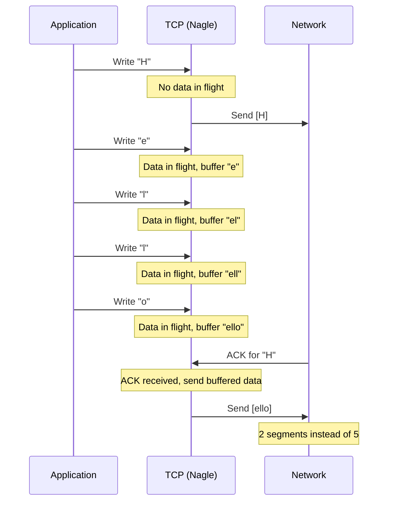
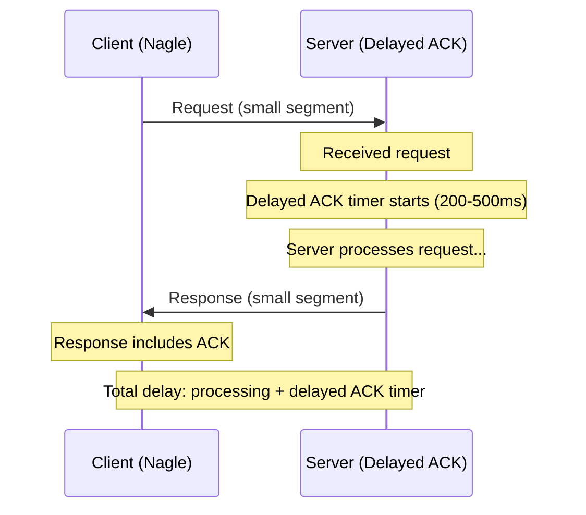
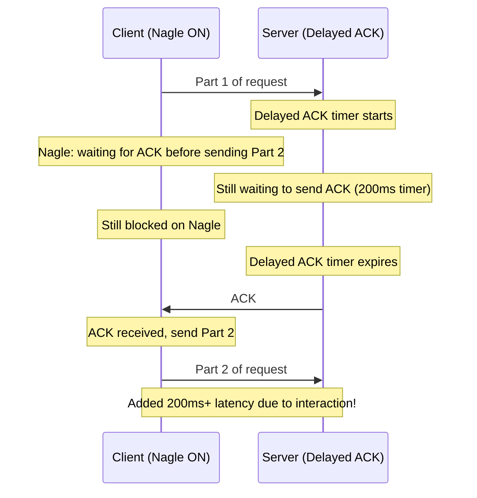

# Nagle's Algorithm

## Overview

Nagle's algorithm is a TCP optimization that reduces the number of small packets sent over the network. It was designed in 1984 by John Nagle to solve the problem of "small packet syndrome" — applications sending many tiny segments that waste bandwidth with IP and TCP headers (40 bytes of overhead for 1 byte of data).

While Nagle's algorithm significantly improves efficiency for bulk data transfers, it can cause problems for interactive applications that need low latency. Understanding when to enable or disable it (via `TCP_NODELAY`) is essential for network programming.

## Detailed Explanation

### The Small Packet Problem

Without Nagle's algorithm, an application sending data one byte at a time creates terrible inefficiency:

```
Application sends: 'H', 'e', 'l', 'l', 'o'

Without Nagle (one segment per byte):
  Segment 1: [IP 20B][TCP 20B][H]       = 41 bytes, 1/41 = 2.4% efficiency
  Segment 2: [IP 20B][TCP 20B][e]       = 41 bytes, 2.4% efficiency
  Segment 3: [IP 20B][TCP 20B][l]       = 41 bytes, 2.4% efficiency
  Segment 4: [IP 20B][TCP 20B][l]       = 41 bytes, 2.4% efficiency
  Segment 5: [IP 20B][TCP 20B][o]       = 41 bytes, 2.4% efficiency
  Total: 205 bytes for 5 bytes of data (2.4% efficiency)

With Nagle (coalescing):
  Segment 1: [IP 20B][TCP 20B][Hello]   = 45 bytes
  Total: 45 bytes for 5 bytes of data (11.1% efficiency)
  4.5× fewer bytes on the wire
```

### Nagle's Algorithm Rules

Nagle's algorithm has two simple rules:

```
IF there is unacknowledged data in flight:
    Buffer new data until ACK arrives
    Then send all buffered data in one segment
ELSE (no unacknowledged data):
    IF data >= MSS:
        Send immediately (full segment)
    ELSE:
        Start a timer
        Buffer data until:
          a) ACK arrives (then send buffered data), OR
          b) Enough data accumulates for a full MSS, OR
          c) Timer expires (typically ~200ms)
```

**Simplified:** If you have data in flight and it's smaller than MSS, wait for ACK before sending more small segments.

### Nagle's Algorithm in Action



### Nagle's Algorithm vs Delayed ACK

**The Problem Interaction:**



**The "Nagle + Delayed ACK" Problem:**



**This is the worst case:** Nagle waits for ACK, Delayed ACK waits for data or timer. Both wait for each other, adding hundreds of milliseconds of latency.

### TCP_NODELAY (Disabling Nagle)

```c
// Disable Nagle's algorithm
int flag = 1;
setsockopt(fd, IPPROTO_TCP, TCP_NODELAY, &flag, sizeof(flag));

// Check current state
int flag;
socklen_t len = sizeof(flag);
getsockopt(fd, IPPROTO_TCP, TCP_NODELAY, &flag, &len);
```

**When to use TCP_NODELAY:**
- Interactive applications (SSH, telnet, gaming)
- Request-response protocols (HTTP, RPC)
- Applications that send small messages with latency requirements
- When using application-level buffering

**When NOT to use TCP_NODELAY:**
- Bulk data transfers (file copy, streaming)
- Applications that already buffer data
- When throughput matters more than latency

### TCP_CORK (Linux Alternative)

```c
// Cork: Prevent sending until uncorked or buffer full
int flag = 1;
setsockopt(fd, IPPROTO_TCP, TCP_CORK, &flag, sizeof(flag));

// Build up data...
write(fd, header, header_len);
write(fd, body, body_len);

// Uncork: Send everything now
flag = 0;
setsockopt(fd, IPPROTO_TCP, TCP_CORK, &flag, sizeof(flag));
```

**Cork vs Nagle:**

| Aspect | Nagle (TCP_NODELAY=0) | Cork (TCP_CORK=1) |
|--------|----------------------|-------------------|
| **Default** | Enabled | Disabled |
| **Behavior** | Send if no unACKed data or MSS full | Never send until uncorked |
| **Timer** | ~200ms delayed ACK interaction | No timer (manual control) |
| **Use case** | General optimization | Explicit segment building |
| **API** | setsockopt | setsockopt |

### When Nagle Hurts: Real-World Examples

**1. SSH Keystrokes:**
```
User types 'a'
  Client sends: 'a' (1 byte + 40 byte header = 41 bytes)
  Server: Delayed ACK (200ms)
  Server sends: echo 'a' (1 byte + 40 byte header)
  Client: ACK
  
  User types 'b'
  Client: Nagle blocks (waiting for ACK of 'a')
  Server: Delayed ACK (200ms)
  
  Result: 400ms delay for 'b' to appear!
  
  Solution: SSH uses TCP_NODELAY
```

**2. HTTP Request/Response:**
```
Client sends: GET / HTTP/1.1\r\n (small)
Server: Delayed ACK
Server sends: HTTP/1.1 200 OK\r\n... (response)
Client: ACK

With Nagle + Delayed ACK: Extra 200ms on every request
Solution: HTTP servers typically set TCP_NODELAY
```

**3. Database Queries:**
```
Client sends: SELECT * FROM users (query)
Server: Delayed ACK
Server processes query...
Server sends: result set

With Nagle: Query delayed until ACK
Solution: Database clients use TCP_NODELAY
```

### When Nagle Helps: Real-World Examples

**1. Telnet Session (Bulk Keystrokes):**
```
User types quickly: "hello world"
Without Nagle: 11 segments (one per character)
With Nagle: 1-2 segments (coalesced)

Nagle reduces overhead significantly
```

**2. File Transfer:**
```
Application writes 100 bytes, then 100 bytes, then 100 bytes
Without Nagle: 3 small segments
With Nagle: Waits for ACK, then sends 300 bytes in one segment

Better utilization of available bandwidth
```

**3. Logging System:**
```
Log messages: "INFO: request received" (26 bytes)
              "INFO: processing..." (19 bytes)
              "INFO: response sent" (18 bytes)

Without Nagle: 3 segments, 120 bytes overhead
With Nagle: 1 segment after first ACK, 40 bytes overhead
```

### Nagle's Algorithm Implementation

```python
class Nagle:
    def __init__(self):
        self.buffer = b""
        self.unacked_data = False
        self.timer = None
    
    def send(self, data):
        self.buffer += data
        
        if not self.unacked_data:
            # No unacknowledged data
            if len(self.buffer) >= MSS:
                # Full segment: send immediately
                self._send_segment(self.buffer[:MSS])
                self.buffer = self.buffer[MSS:]
                self.unacked_data = True
            else:
                # Small segment: send and start timer
                self._send_segment(self.buffer)
                self.buffer = b""
                self.unacked_data = True
        else:
            # Unacknowledged data in flight
            if len(self.buffer) >= MSS:
                # Full segment: send immediately
                self._send_segment(self.buffer[:MSS])
                self.buffer = self.buffer[MSS:]
            # else: buffer until ACK arrives
    
    def on_ack_received(self):
        self.unacked_data = False
        if self.buffer:
            # Send buffered data
            self._send_segment(self.buffer)
            self.buffer = b""
            self.unacked_data = True
```

### Nagle's Algorithm Statistics

```
Impact on tiny messages (1-byte payloads, 40-byte TCP/IP header → 41-byte packets):

Without Nagle:
  - 1000 messages/sec × 41 bytes = 41 KB/sec
  - 1000 packets/sec
  - Header overhead: 40 KB/sec (97.6%)

With Nagle (assuming 5 messages per ACK):
  - 200 segments/sec × 45 bytes (40 header + 5 payload) = 9 KB/sec
  - 200 packets/sec
  - Header overhead: 8 KB/sec (88.9%)
  - 5× fewer packets
```

## Example: Configuring Nagle in Applications

### Go (net/http)

```go
// Disable Nagle for HTTP server
listener, _ := net.Listen("tcp", ":8080")
conn, _ := listener.Accept()
tcpConn := conn.(*net.TCPConn)
tcpConn.SetNoDelay(true)  // TCP_NODELAY

// Go's net/http disables Nagle by default for HTTP/2
```

### Python

```python
import socket

sock = socket.socket(socket.AF_INET, socket.SOCK_STREAM)
sock.setsockopt(socket.IPPROTO_TCP, socket.TCP_NODELAY, 1)

# Or with socket options
sock.setsockopt(socket.IPPROTO_TCP, socket.TCP_NODELAY, True)
```

### Java

```java
Socket socket = new Socket();
socket.setTcpNoDelay(true);  // TCP_NODELAY

// Or with NIO
SocketChannel channel = SocketChannel.open();
channel.setOption(StandardSocketOptions.TCP_NODELAY, true);
```

### C

```c
#include <netinet/tcp.h>

int fd = socket(AF_INET, SOCK_STREAM, 0);
int flag = 1;
setsockopt(fd, IPPROTO_TCP, TCP_NODELAY, &flag, sizeof(flag));
```

### Node.js

```javascript
const net = require('net');
const socket = new net.Socket();
socket.setNoDelay(true);  // TCP_NODELAY
```

## Interview Questions

### Q1: What is Nagle's algorithm and what problem does it solve?
**A:** Nagle's algorithm reduces small packet overhead by buffering data until either (1) there's no unacknowledged data in flight, or (2) enough data accumulates for a full MSS. It solves the "small packet syndrome" where applications send many tiny segments with high header overhead (40 bytes header for 1 byte data).

### Q2: What is the Nagle + Delayed ACK problem?
**A:** Nagle waits for ACK before sending small segments. Delayed ACK waits for data or a timer before sending ACK. When both are active, they can deadlock: Nagle waits for ACK, Delayed ACK waits for data/timer. This adds 200-500ms latency to request-response interactions.

### Q3: When should you disable Nagle's algorithm (TCP_NODELAY)?
**A:** Disable Nagle when: (1) Latency matters more than bandwidth (interactive apps, SSH, gaming); (2) You're doing request-response with small messages (HTTP, RPC); (3) You use application-level buffering; (4) You have Delayed ACK interaction issues.

### Q4: What is TCP_CORK and how does it differ from Nagle?
**A:** TCP_CORK (Linux) prevents sending until explicitly uncorked or the buffer is full. Unlike Nagle (which sends on ACK receipt), Cork gives the application explicit control. Use Cork when building segments from multiple writes (e.g., HTTP headers + body), then uncork to send.

### Q5: Does Nagle's algorithm improve throughput?
**A:** Yes, for applications sending many small writes. It coalesces data into fewer, larger segments, reducing per-packet overhead (IP/TCP headers). For bulk transfers that already send MSS-sized segments, Nagle has no effect.

### Q6: Is Nagle's algorithm enabled by default?
**A:** Yes, Nagle's algorithm is enabled by default (TCP_NODELAY = 0). Most frameworks and libraries (Go's net/http, nginx, etc.) disable it for HTTP connections to avoid the Delayed ACK interaction.

### Q7: How does Nagle interact with TCP_CORK?
**A:** They're independent but can conflict. If TCP_CORK is set, data is buffered regardless of Nagle. If TCP_NODELAY is set, Nagle is disabled but Cork still works. Best practice: use Cork for explicit control, don't mix with Nagle.

### Q8: What modern alternatives exist to Nagle's algorithm?
**A:** (1) Application-level buffering — buffer data before write(). (2) TCP_CORK — explicit segment control. (3) writev()/sendmsg() — scatter-gather I/O sends multiple buffers in one call. (4) MSG_MORE flag (Linux) — per-message cork hint.

## Common Mistakes

1. **Not disabling Nagle for interactive applications**: SSH, telnet, gaming, and real-time apps must disable Nagle. The latency penalty (200ms+) is unacceptable for interactive use.

2. **Leaving Nagle on with Delayed ACK**: This is the classic performance killer. Request-response protocols suffer 200ms+ added latency. Always disable Nagle if the server uses Delayed ACK.

3. **Disabling Nagle for bulk transfers**: If you're copying files or streaming data, keep Nagle enabled. The algorithm has no effect on MSS-sized segments but helps with small intermediate writes.

4. **Confusing TCP_NODELAY with TCP_CORK**: TCP_NODELAY disables Nagle (send immediately). TCP_CORK buffers until uncorked. They serve different purposes and can coexist.

5. **Not buffering in the application**: If you disable Nagle but send many tiny writes, you've just moved the problem. Better to buffer in the application and write larger chunks, or use writev().

6. **Thinking Nagle is always bad**: Nagle is a good default for general-purpose networking. Only disable it when you have specific latency requirements and understand the tradeoffs.

7. **Forgetting about Nagle in library/framework code**: Many frameworks disable Nagle automatically (Go, nginx). Others don't. Always check if your framework sets TCP_NODELAY.

## Summary

| Aspect | Nagle's Algorithm |
|--------|-------------------|
| **Default** | Enabled (TCP_NODELAY=0) |
| **Purpose** | Reduce small packet overhead |
| **Rule** | Buffer small writes if unACKed data in flight |
| **Benefit** | Fewer packets, better bandwidth utilization |
| **Problem** | Latency with Delayed ACK interaction |
| **Disable with** | TCP_NODELAY socket option |
| **Alternative** | TCP_CORK for explicit control |
| **Best for** | Bulk transfers, logging, non-interactive |

Nagle's algorithm is a classic example of a simple optimization that has significant real-world impact. Understanding when to enable or disable it is essential for writing efficient network applications.

## Cross-References

- [TCP Options](options.md) — TCP header options that Nagle interacts with
- [TCP States](states.md) — Nagle operates within ESTABLISHED state
- [TCP Timers](timers.md) — Delayed ACK timer interaction
- [TCP Fast Recovery](fast-recovery.md) — Congestion control after Nagle's buffering
- [UDP Overview](../udp/README.md) — UDP has no Nagle (each send = one datagram)
- [HTTP/1.1](../http/http1.md) — HTTP benefits from disabling Nagle
