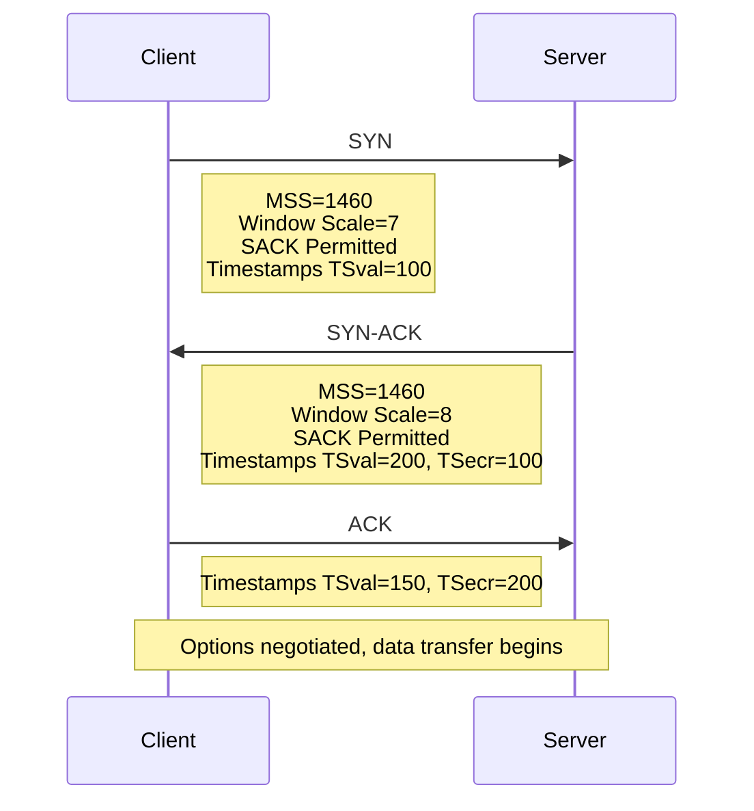

# TCP Options

## Overview

TCP Options are extensions to the basic TCP header that provide additional functionality. They are negotiated during the three-way handshake (SYN segments) and used during data transfer. TCP options are critical for modern network performance — without them, TCP would be limited to 64 KB windows, no selective acknowledgments, and poor RTT estimation.

TCP options appear between the standard 20-byte header and the payload, in multiples of 4 bytes (padded with NOP if needed).

## Detailed Explanation

### TCP Options Format

```
 0                   1                   2                   3
 0 1 2 3 4 5 6 7 8 9 0 1 2 3 4 5 6 7 8 9 0 1 2 3 4 5 6 7 8 9 0 1
+-+-+-+-+-+-+-+-+-+-+-+-+-+-+-+-+-+-+-+-+-+-+-+-+-+-+-+-+-+-+-+-+
|     Kind      |    Length      |         Options Data          |
+-+-+-+-+-+-+-+-+-+-+-+-+-+-+-+-+-+-+-+-+-+-+-+-+-+-+-+-+-+-+-+-+

Kind:   1 byte  - Option type
Length: 1 byte  - Total option length (including kind and length)
Data:   Variable - Option-specific data

Some options (NOP, EOL) have no length field (1 byte only)
```

### Option Kind Values

| Kind | Name | Length | Purpose |
|------|------|--------|---------|
| 0 | EOL | 1 | End of options list |
| 1 | NOP | 1 | Padding (no-op) |
| 2 | MSS | 4 | Maximum Segment Size |
| 3 | Window Scale | 3 | Window scaling factor |
| 4 | SACK Permitted | 2 | SACK support (SYN only) |
| 5 | SACK | Variable | Selective acknowledgment |
| 8 | Timestamps | 10 | RTT measurement + PAWS |

### 1. Maximum Segment Size (MSS)

**Purpose:** Largest segment payload the sender can receive.

**Negotiation:**
```
Client SYN:  MSS = 1460 (typical Ethernet)
Server SYN:  MSS = 1460

Effective MSS = min(client_MSS, server_MSS) = 1460
```

**Why 1460?**
```
Ethernet MTU:     1500 bytes
IP Header:        20 bytes
TCP Header:       20 bytes
MSS = 1500 - 20 - 20 = 1460 bytes

With TCP options (12 bytes typical):
MSS = 1500 - 20 - 32 = 1448 bytes
```

**Common MSS Values:**
| Link Type | MTU | MSS |
|-----------|-----|-----|
| Ethernet | 1500 | 1460 |
| PPPoE | 1492 | 1452 |
| IPv6 minimum | 1280 | 1220 |
| Jumbo frame | 9000 | 8960 |

**MSS Clamping:**
```bash
# Linux: Set MSS for outgoing SYN
iptables -t mangle -A FORWARD -p tcp --tcp-flags SYN,RST SYN \
    -j TCPMSS --set-mss 1452
```

### 2. Window Scale (RFC 7323)

**Purpose:** Allow windows larger than 65,535 bytes (16-bit field limit).

**How it works:**
```
Window field: 16 bits → max 65,535 bytes
Window scale: 0-14 (shift count)
Actual window = window_field × 2^scale

Example:
  Scale = 7
  Window field = 65,535
  Actual window = 65,535 × 2^7 = 8,388,480 bytes ≈ 8 MB
```

**Negotiation (in SYN):**
```
Client SYN:  Window Scale = 7 (requests 2^7 = 128× multiplier)
Server SYN:  Window Scale = 8 (requests 2^8 = 256× multiplier)

Each side uses the OTHER's scale for received windows
Client sends windows scaled by 8 (server's scale)
Server sends windows scaled by 7 (client's scale)
```

**Why it matters:**
```
Without scaling: Max window = 64 KB
  Max throughput = 64 KB / RTT
  At 100ms RTT: 64 KB / 0.1s = 640 Kbps (terrible!)

With scaling (scale=7): Max window = 8 MB
  Max throughput = 8 MB / RTT
  At 100ms RTT: 8 MB / 0.1s = 640 Mbps (much better!)
```

### 3. Selective Acknowledgments (SACK) — RFC 2018

**Purpose:** Report exactly which segments arrived, enabling selective retransmission.

**Without SACK (cumulative ACK only):**
```
Sender sends:  1  2  3  4  5  6  7  8
Received:      1  2  ✗  4  5  ✗  7  8

Cumulative ACK: 3 (says "send 3 and everything after")

Sender must retransmit: 3, 4, 5, 6, 7, 8 (6 segments!)
But 4, 5, 7, 8 already arrived — wasted retransmissions
```

**With SACK:**
```
SACK Block 1: bytes 4-5 (segments 4, 5 received)
SACK Block 2: bytes 7-8 (segments 7, 8 received)

Sender knows: 3 and 6 are missing
Retransmit only: 3, 6 (2 segments)
```

**SACK Option Format:**
```
Kind=5, Length, [Block 1 Left Edge, Block 1 Right Edge, ...]

Each SACK block: 8 bytes (4-byte left edge + 4-byte right edge)
Max blocks per option: 4 (due to 40-byte option limit)
```

**SACK Permitted (Kind=4):**
- Sent in SYN segments only
- Indicates SACK support
- Both sides must send SACK Permitted for SACK to be used

**D-SACK (Duplicate SACK, RFC 2883):**
- SACK block indicates a segment that was already received
- Helps detect duplicate segments and spurious retransmissions
- Can improve RTT estimation (detect spurious RTO)

### 4. Timestamps (RFC 7323)

**Purpose:** (1) Accurate RTT measurement, (2) Protection Against Wrapped Sequences (PAWS).

**Format:**
```
Kind=8, Length=10, TSval (4 bytes), TSecr (4 bytes)

TSval: Timestamp value (sender's clock)
TSecr: Timestamp echo reply (echoes peer's TSval)
```

**RTT Measurement:**
```
Sender: send segment with TSval = 1000
Receiver: ACK with TSecr = 1000 (echoes TSval)
Sender: current time = 1050
RTT = 1050 - 1000 = 50ms

Benefits:
- Measures RTT per segment (not per window)
- Works with retransmissions (no Karn's algorithm needed)
- No ambiguity about which ACK corresponds to which segment
```

**PAWS (Protection Against Wrapped Sequences):**
```
Problem: On high-speed links, sequence numbers can wrap around
  32-bit sequence space = 4 GB
  At 10 Gbps: wraps in ~3.4 seconds!

Solution: Timestamps monotonically increase
  If received TSval < last_TSval → reject as old duplicate
  Even if sequence number has wrapped
```

### 5. NOP (No-Operation)

**Purpose:** Padding to align options to 4-byte boundaries.

```
NOP = Kind 1 (1 byte, no length field)

Usage:
- Align subsequent options to 4-byte boundary
- Separate options for clarity
- Fill to meet 4-byte header length requirement

Example alignment:
  [MSS option: 4 bytes] [NOP] [NOP] [Window Scale: 3 bytes + NOP]
```

### 6. End of Option List (EOL)

**Purpose:** Mark the end of TCP options.

```
EOL = Kind 0 (1 byte)

Used when options don't fill to exact 4-byte boundary
Remaining bytes are padded with EOL
```

### Option Negotiation Timeline



### Option Compatibility

```
If a segment arrives with an unknown option:
  - If SYN: option is ignored (not negotiated)
  - If not SYN: option is ignored (backward compatible)

This allows new options to be deployed incrementally
```

### Common Option Combinations

**Minimal (20 bytes, no options):**
```
Header: 20 bytes
No options → MSS, window scale, SACK all use defaults
```

**Typical Modern (32 bytes):**
```
MSS (4) + NOP (1) + NOP (1) + Window Scale (3) + SACK Permitted (2) + Timestamps (10) + NOP (1) + NOP (1) = 24 bytes padded to 32
```

**SYN with all common options:**
```
Option 1: MSS = 1460 (4 bytes)
Option 2: NOP, NOP (2 bytes padding)
Option 3: Window Scale = 7 (3 bytes)
Option 4: NOP (1 byte padding)
Option 5: SACK Permitted (2 bytes)
Option 6: Timestamps (10 bytes)
Total: 22 bytes, padded to 24 bytes (6 × 4-byte words)
```

## Example: Reading TCP Options from a Capture

### tcpdump Output

```bash
$ tcpdump -i eth0 -nn 'tcp[tcpflags] & tcp-syn != 0' -v

# Output (simplified):
Flags [S], seq 0, win 65535, options [mss 1460,sackOK,TS val 1234 ecr 0,nop,wscale 7]
Flags [S.], seq 0, ack 1, win 65535, options [mss 1460,sackOK,TS val 5678 ecr 1234,nop,wscale 8]
```

### Wireshark Analysis

```
TCP Option - Maximum Segment Size: 1460 bytes
  Kind: MSS (2)
  Length: 4
  MSS Value: 1460

TCP Option - Window Scale: 7 (multiply by 128)
  Kind: Window Scale (3)
  Length: 3
  Shift count: 7

TCP Option - SACK Permitted
  Kind: SACK Permitted (4)
  Length: 2

TCP Option - Timestamps
  Kind: Timestamp (8)
  Length: 10
  Timestamp value: 1234
  Timestamp echo reply: 0
```

### Checking Options in Linux

```bash
# Check current MSS
ss -ti | grep mss
# Output: mss:1460 pmtu:1500 rcvmss:1460 advmss:1460

# Check window scale
ss -ti | grep wscale
# Output: wscale:7,7

# Check SACK
ss -ti | grep sack
# Output: sack:1

# Check timestamps
ss -ti | grep timestamp
# Output: ts:1
```

## Interview Questions

### Q1: Why is MSS important and how is it negotiated?
**A:** MSS (Maximum Segment Size) defines the largest TCP payload in a segment. It's advertised in SYN segments and negotiated to the minimum of both sides' values. MSS = MTU - IP header - TCP header (typically 1460 for Ethernet). It prevents fragmentation, which causes performance issues and packet loss.

### Q2: How does Window Scaling work?
**A:** Window Scaling allows TCP windows larger than 64 KB. The scale factor (0-14) is sent in SYN segments. The actual window = window_field × 2^scale. For example, scale=7 means multiply by 128, allowing windows up to ~8 MB. Each side uses the OTHER's scale for received windows.

### Q3: What problem does SACK solve?
**A:** Without SACK, TCP uses cumulative ACKs — the sender only knows the next expected byte. With multiple losses, the sender must retransmit everything after the first loss (go-back-N). SACK tells the sender exactly which segments arrived, enabling selective retransmission of only the missing segments.

### Q4: How do TCP Timestamps help with RTT measurement?
**A:** Timestamps allow RTT measurement on every segment, not just once per window. The sender includes TSval; the receiver echoes it as TSecr. RTT = current_time - TSecr. This works even with retransmissions (no ambiguity), unlike the basic RTT measurement which requires Karn's algorithm.

### Q5: What is PAWS and why is it needed?
**A:** PAWS (Protection Against Wrapped Sequences) prevents old duplicate segments from being accepted after sequence numbers wrap around. On high-speed links (10 Gbps+), 32-bit sequence numbers wrap in ~3.4 seconds. PAWS uses monotonically increasing timestamps to reject old segments.

### Q6: Why must TCP options be multiples of 4 bytes?
**A:** The TCP header length field (Data Offset) specifies the header size in 32-bit words. Options must align to 4-byte boundaries so the receiver can correctly determine where the header ends and payload begins. NOP and EOL are used for padding.

### Q7: What happens if a TCP endpoint doesn't understand an option?
**A:** TCP is backward compatible with unknown options. If an unknown option appears in a SYN segment, it's ignored (not negotiated). If it appears in a data segment, it's also ignored. This allows new options to be deployed incrementally without breaking existing implementations.

### Q8: How many SACK blocks can fit in one segment?
**A:** Maximum 4 blocks. Each block is 8 bytes (left + right edge). With the 2-byte SACK header and 2-byte kind/length, that's 2 + 8×4 = 34 bytes. Combined with timestamps (10 bytes) and other options, 4 blocks is the practical limit within the 40-byte option space.

## Common Mistakes

1. **Not understanding that MSS is per-direction**: Each side advertises its own MSS. The effective MSS is the minimum. A server might advertise MSS=8960 (jumbo frames) but the client only supports 1460 — the effective MSS is 1460.

2. **Confusing window scale with window size**: The 16-bit window field is the *scaled* value. Actual window = window_field × 2^scale. Don't forget the scale factor when calculating throughput.

3. **Not knowing SACK is optional**: SACK must be negotiated in SYN segments (SACK Permitted option). If either side doesn't support it, cumulative ACKs are used. Most modern systems support SACK.

4. **Forgetting timestamps affect option space**: Timestamps use 10 bytes. Combined with MSS, Window Scale, and SACK, the 40-byte option space is tight. NOP padding is essential for alignment.

5. **Not understanding that options are in SYN too**: MSS, Window Scale, and SACK Permitted are only negotiated in SYN segments. If the SYN is lost or filtered, these options won't be available.

6. **Thinking MSS prevents all fragmentation**: MSS prevents TCP-level fragmentation. IP fragmentation can still occur if intermediate routers have lower MTU (and ICMP "fragmentation needed" is blocked).

7. **Confusing SACK with cumulative ACK**: SACK *supplements* cumulative ACK, it doesn't replace it. Every segment has a cumulative ACK field. SACK blocks provide additional information about non-contiguous received data.

## Summary

| Option | Kind | Length | Purpose | When Used |
|--------|------|--------|---------|-----------|
| **EOL** | 0 | 1 | End of options | Always |
| **NOP** | 1 | 1 | Padding | Always |
| **MSS** | 2 | 4 | Max segment size | SYN only |
| **Window Scale** | 3 | 3 | Large windows (>64KB) | SYN only |
| **SACK Permitted** | 4 | 2 | Enable SACK | SYN only |
| **SACK** | 5 | Var | Selective ACK blocks | Data segments |
| **Timestamps** | 8 | 10 | RTT + PAWS | Every segment |

TCP options are essential for modern network performance. Without MSS, Window Scale, SACK, and Timestamps, TCP would be severely limited in throughput, efficiency, and reliability.

## Cross-References

- [TCP States](states.md) — Options negotiated during handshake states
- [TCP Timers](timers.md) — Timestamps improve RTO calculation
- [TCP Fast Recovery](fast-recovery.md) — SACK enhances multi-loss recovery
- [TCP Reno](reno.md) — Congestion control that benefits from SACK
- [TCP CUBIC](cubic.md) — Modern CC that relies on accurate RTT from timestamps
- [UDP Header](../udp/header.md) — UDP has no options (8-byte fixed header)

## Cross References

- [TCP Header](header.md)
- [Nagle's Algorithm](nagle.md)
- [TCP Keepalive](keepalive.md)
